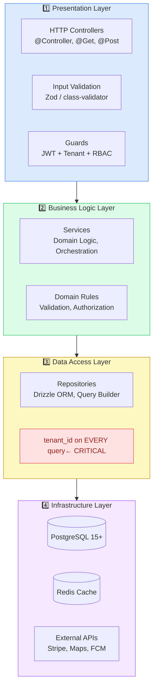

# Architecture Overview

## System Layers

A production multi-tenant SaaS application consists of **four distinct architectural layers**. Clean separation ensures security, testability, and maintainability.



**The golden rule:** Dependencies only flow downward. Controllers never import `db`. Services never write SQL. Repositories never contain business logic.

### Layer Responsibilities

#### 1. Presentation Layer (HTTP Controllers)

**Responsibility:** Handle HTTP concerns only. No business logic.

```typescript
// BookingController.ts
@Controller('tenant/:tenantSlug/bookings')
export class BookingController {
  constructor(private bookingService: BookingService) {}

  @Get()
  @UseGuards(JwtAuthGuard, TenantGuard) // ← Tenant validation happens here
  async list(@Param('tenantSlug') slug: string): Promise<BookingDto[]> {
    // ✅ Controller responsibility: HTTP concerns only
    // - Extract parameters
    // - Validate input format
    // - Call service
    // - Return DTO

    return this.bookingService.listBookings(/* tenant context */);
  }

  @Post()
  @UseGuards(JwtAuthGuard, TenantGuard)
  async create(@Body() dto: CreateBookingDto): Promise<BookingDto> {
    // Input validation is OK here (format/structure)
    // Business logic validation happens in service
    return this.bookingService.createBooking(dto);
  }
}
```

**Key principle:** Controllers are thin. If a controller is > 20 lines, business logic leaked.

---

#### 2. Business Logic Layer (Services)

**Responsibility:** All domain logic, orchestration, validation.

```typescript
// BookingService.ts
@Injectable()
export class BookingService {
  constructor(
    private bookingRepository: BookingRepository,
    private customerService: CustomerService,
    private notificationService: NotificationService
  ) {}

  async createBooking(dto: CreateBookingDto, tenantId: UUID): Promise<Booking> {
    // ✅ Service responsibilities:

    // 1. Business validation
    if (dto.startTime >= dto.endTime) {
      throw new BadRequestException('Invalid time range');
    }

    // 2. Check business rules
    const customer = await this.customerService.getCustomer(dto.customerId);
    if (!customer || customer.blocked) {
      throw new BadRequestException('Customer not available');
    }

    // 3. Orchestrate persistence
    const booking = await this.bookingRepository.create(
      {
        tenantId, // ← Tenant context flows through service
        customerId: dto.customerId,
        startTime: dto.startTime,
        endTime: dto.endTime,
      },
      tenantId // ← Verify tenant on persist
    );

    // 4. Trigger side effects
    await this.notificationService.sendBookingConfirmation(booking);

    return booking;
  }
}
```

**Key principle:** Services contain no query logic. Services call repositories.

---

#### 3. Data Access Layer (Repository)

**Responsibility:** ALL database queries. Query builder. ORM usage.

```typescript
// BookingRepository.ts
@Injectable()
export class BookingRepository {
  constructor(private db: Database) {}

  async create(data: CreateBookingInput, tenantId: UUID): Promise<Booking> {
    // ✅ Repository responsibilities:

    // 1. Every query includes tenant filter
    const booking = await this.db
      .insert(bookings)
      .values({
        id: generateId(),
        tenantId, // ← Required field
        customerId: data.customerId,
        startTime: data.startTime,
        endTime: data.endTime,
      })
      .returning()
      .get();

    return booking;
  }

  async getByIdAndTenant(id: UUID, tenantId: UUID): Promise<Booking | null> {
    // ✅ Composite filter: tenant + id
    return this.db
      .select()
      .from(bookings)
      .where(
        and(
          eq(bookings.id, id),
          eq(bookings.tenantId, tenantId) // ← Always included
        )
      )
      .get();
  }

  async listByTenant(tenantId: UUID, limit: number): Promise<Booking[]> {
    // ✅ List query automatically scoped to tenant
    return this.db
      .select()
      .from(bookings)
      .where(eq(bookings.tenantId, tenantId))
      .limit(limit)
      .all();
  }
}
```

**Key principle:** No database access outside repository. Services never import `db` directly.

---

#### 4. Infrastructure Layer

**Responsibility:** Raw database, cache, external services.

```typescript
// PostgreSQL configuration
const database = new Database({
  host: process.env.DB_HOST,
  port: process.env.DB_PORT,
  database: process.env.DB_NAME,
  user: process.env.DB_USER,
  password: process.env.DB_PASSWORD,
});

// Redis configuration
const cache = new Redis({
  host: process.env.REDIS_HOST,
  port: process.env.REDIS_PORT,
});
```

**Key principle:** Infrastructure is dependency-injected. Easy to swap implementations.

---

## Request Flow: From HTTP to Database

### Complete Journey for a Booking Request

```
User clicks "Create booking" → POST /tenant/salon-a/bookings
                                 ↓
     ┌────────────────────────────────────────┐
     │  1. HTTP Request Received              │
     │  POST /tenant/salon-a/bookings         │
     │  Authorization: Bearer <JWT>           │
     │  Body: { customerId, startTime, ... }  │
     └────────────────────────────────────────┘
                       ↓
     ┌────────────────────────────────────────┐
     │  2. Middleware & Guards                │
     │  - Parse JWT token                     │
     │  - Extract user: { id, activeTenant }  │
     │  - Extract slug: "salon-a"             │
     │  - Verify activeTenant matches slug    │
     │  - Inject tenantId into request        │
     └────────────────────────────────────────┘
                       ↓
     ┌────────────────────────────────────────┐
     │  3. Controller (BookingController)     │
     │  @Post()                               │
     │  async create(                         │
     │    @Body() dto,                        │
     │    @Param('tenantSlug') slug,         │
     │    @Request() req                      │
     │  ) {                                   │
     │    return service.createBooking(       │
     │      dto,                              │
     │      req.user.tenantId  // ← Tenant   │
     │    );                                  │
     │  }                                     │
     └────────────────────────────────────────┘
                       ↓
     ┌────────────────────────────────────────┐
     │  4. Service (BookingService)           │
     │  - Validate business rules             │
     │  - Check customer eligibility          │
     │  - Verify time slot availability       │
     │  - Call repository to persist          │
     │  - Trigger notifications               │
     │                                        │
     │  💡 Service NEVER knows about SQL     │
     │  💡 Service only knows about domain   │
     └────────────────────────────────────────┘
                       ↓
     ┌────────────────────────────────────────┐
     │  5. Repository (BookingRepository)     │
     │  const booking = await db              │
     │    .insert(bookings)                   │
     │    .values({                           │
     │      tenantId: userId, ← CRITICAL    │
     │      customerId: ...,                  │
     │      startTime: ...,                   │
     │    })                                  │
     │    .returning()                        │
     │    .get();                             │
     │                                        │
     │  💡 Query ALWAYS includes tenant_id   │
     │  💡 Impossible to create tenant escape│
     └────────────────────────────────────────┘
                       ↓
     ┌────────────────────────────────────────┐
     │  6. Database (PostgreSQL)              │
     │  INSERT INTO bookings (                │
     │    id, tenant_id, customer_id, ...    │
     │  ) VALUES (                            │
     │    'uuid-123', 'tenant-456', ...      │
     │  );                                    │
     │                                        │
     │  Constraint check:                     │
     │  - tenant_id NOT NULL ✓                │
     │  - Foreign key valid? ✓                │
     │  - Insert OK                           │
     └────────────────────────────────────────┘
                       ↓
     ┌────────────────────────────────────────┐
     │  7. Return to Service                  │
     │  booking = {                           │
     │    id, tenantId, customerId, ...      │
     │  }                                     │
     │                                        │
     │  Side effects:                         │
     │  - Send confirmation email             │
     │  - Invalidate cache                    │
     │  - Log audit event                     │
     └────────────────────────────────────────┘
                       ↓
     ┌────────────────────────────────────────┐
     │  8. Return to Controller               │
     │  Convert Booking → BookingDto          │
     │  {                                     │
     │    id, customerId, startTime, ...     │
     │    (tenantId hidden from client)      │
     │  }                                     │
     └────────────────────────────────────────┘
                       ↓
     ┌────────────────────────────────────────┐
     │  9. HTTP Response (200 OK)             │
     │  {                                     │
     │    "id": "uuid-123",                   │
     │    "customerId": "cust-456",           │
     │    "startTime": "2026-05-10T14:00:00", │
     │    "status": "confirmed"               │
     │  }                                     │
     └────────────────────────────────────────┘
```

### Key Safeguards in This Flow

1. **Guard validates tenant match** (line 2)

   - User's activeTenant must match route tenant
   - If not, error before reaching controller

2. **Tenant context injected by guard** (line 3)

   - Never trusts client input
   - Extracted from signed JWT

3. **Service receives tenant context** (line 4)

   - Uses it to orchestrate domain logic
   - Never constructs queries itself

4. **Repository enforces tenant filter** (line 5)

   - Every insert/select includes tenant_id
   - Database constraint prevents NULL tenant_id

5. **No way to escape** (throughout)
   - Client can't override tenant via query params
   - Queries can't accidentally omit tenant_id
   - Database constraints prevent bad data

---

## Caching Strategy

Multi-tenant systems benefit from strategic caching while maintaining strict isolation.

### Cache Key Structure

```typescript
// ✅ Always include tenant in cache key
const cacheKey = `tenant:${tenantId}:bookings:${bookingId}`;

// ❌ Never share cache between tenants
const cacheKey = `bookings:${bookingId}`; // 🚨 DANGEROUS
```

### Invalidation Pattern

```typescript
async createBooking(dto, tenantId) {
  // 1. Persist to database
  const booking = await this.repo.create(dto, tenantId);

  // 2. Invalidate tenant-specific cache entries
  await cache.del(`tenant:${tenantId}:bookings:*`);
  await cache.del(`tenant:${tenantId}:schedule:${booking.staffId}`);

  // ✅ Only this tenant's cache is cleared
  // ✅ Other tenants' caches remain valid

  return booking;
}
```

---

## Error Handling Pattern

```typescript
// ✅ Correct: Tenant-aware error context
try {
  const booking = await this.bookingService.createBooking(dto, tenantId);
} catch (error) {
  logger.error('Booking creation failed', {
    tenantId, // ← Include tenant in logs
    userId,
    error: error.message,
  });

  // Return generic error (never leak internal details)
  throw new BadRequestException('Booking creation failed');
}
```

---

## Summary

| Layer              | Responsibility   | Tenant Isolation                               |
| ------------------ | ---------------- | ---------------------------------------------- |
| **Controller**     | HTTP concerns    | Validates tenant access                        |
| **Service**        | Business logic   | Flows tenant context through orchestration     |
| **Repository**     | Database queries | **CRITICAL:** Every query filters by tenant_id |
| **Infrastructure** | Raw data store   | Enforces NOT NULL constraint on tenant_id      |

**The most important layer:** Repository. If tenant_id is present in every query, the system is secure.

---

## Next Steps

- **Next document:** [KEY_PRINCIPLES.md](./KEY_PRINCIPLES.md) - Deep dive into isolation, scalability, performance
