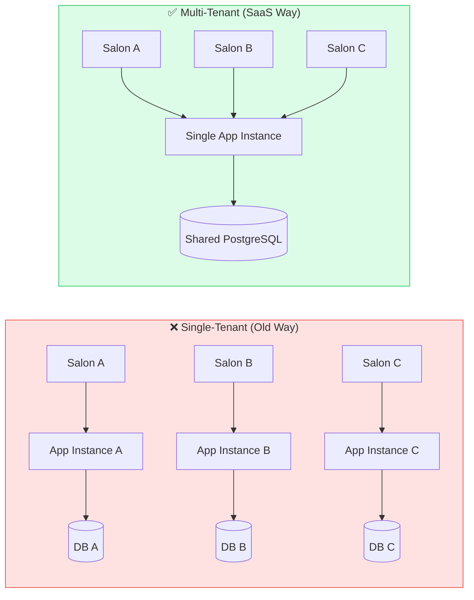
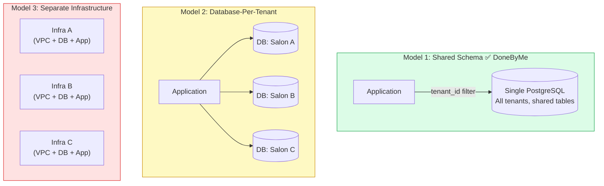
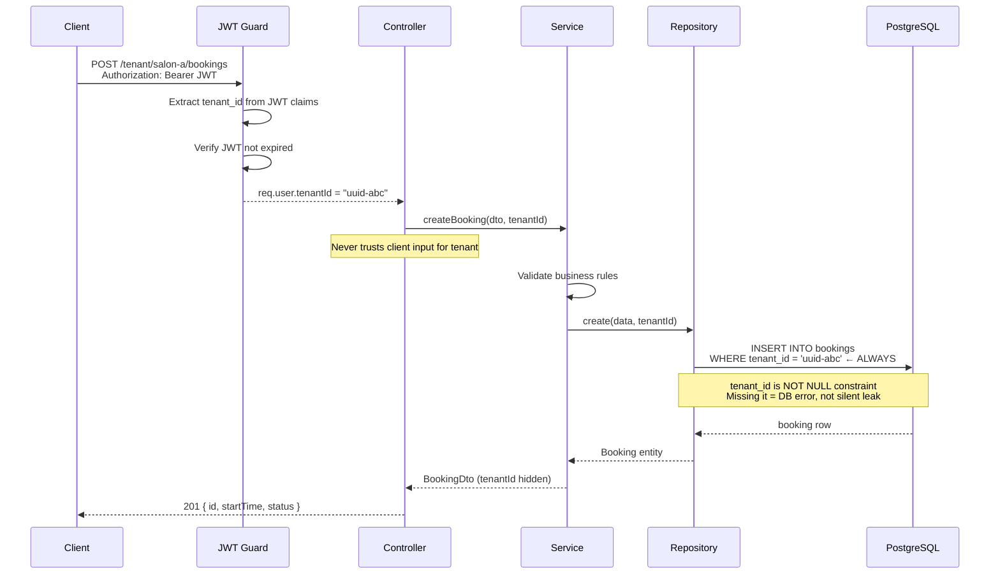

# Multi-Tenant Fundamentals

## What is Multi-Tenancy?

Multi-tenancy is a cloud architecture pattern where a **single application instance serves multiple independent customers (tenants)** simultaneously. Each tenant's data is logically isolated and secured while sharing the same underlying infrastructure, database, and codebase.



**The key insight:** Multi-tenancy multiplies your customer capacity without multiplying your operational complexity.

### Key Characteristics

| Aspect                       | Single-Tenant            | Multi-Tenant                   |
| ---------------------------- | ------------------------ | ------------------------------ |
| **Customers per deployment** | 1                        | Many (100s-1000s)              |
| **Cost model**               | Higher per-customer      | Lower per-customer (amortized) |
| **Maintenance burden**       | Replicated n times       | Single managed deployment      |
| **Update frequency**         | Per-customer             | Once for all tenants           |
| **Data isolation**           | Natural (separate DBs)   | Enforced via code              |
| **Scalability**              | Limited by customer size | Scales to enterprise customers |
| **Customization**            | Easy (per deployment)    | Harder (shared codebase)       |

### Why Multi-Tenancy Matters for SaaS

1. **Economics:** Reduce operational costs by sharing infrastructure across customers
2. **Scalability:** A single deployment can serve thousands of customers
3. **Speed to market:** Deploy once, support many customers
4. **Efficiency:** Automated updates and patches apply to all tenants instantly
5. **Modern standard:** Industry expectation for cloud platforms (Stripe, Slack, Notion, Figma)

---

## Isolation Models: Trade-offs & Patterns

Every multi-tenant SaaS must choose an isolation strategy. This decision affects security, performance, scalability, and maintenance burden.



| | Shared Schema | Separate DB | Separate Infra |
|---|---|---|---|
| **Cost per tenant** | 🟢 $1-5 | 🟡 $50-500 | 🔴 $1000+ |
| **Onboarding speed** | 🟢 Instant | 🟡 Minutes | 🔴 Hours |
| **Isolation strength** | 🟡 App-enforced | 🟢 DB-level | 🟢 Physical |
| **Ops complexity** | 🟢 Low | 🟡 Medium | 🔴 Very High |

### Model 1: Shared Schema (Row-Level Isolation)

**Architecture:** Single database, single schema, shared tables with `tenant_id` column on every row.

```sql
-- Single shared table with tenant isolation
CREATE TABLE bookings (
  id UUID PRIMARY KEY,
  tenant_id UUID NOT NULL,      -- 🔑 Tenant identifier
  customer_name TEXT NOT NULL,
  status VARCHAR(50) NOT NULL,
  created_at TIMESTAMP NOT NULL,

  -- Composite index for performance
  UNIQUE INDEX idx_tenant_booking (tenant_id, id)
);

-- Every query MUST filter by tenant_id
SELECT * FROM bookings WHERE tenant_id = $1 AND status = 'confirmed';
```

**Pros:**

- ✅ **Lowest operational overhead:** One database, one schema to manage
- ✅ **Best performance for typical use cases:** Minimal resource overhead
- ✅ **Easy onboarding:** New tenant registration is instant (no schema provisioning)
- ✅ **Simple maintenance:** Security patches, migrations apply uniformly
- ✅ **Cost-effective:** Minimal database resources per tenant

**Cons:**

- ❌ **Requires discipline:** Every query must include tenant filter (risk of data leakage)
- ❌ **Limited customization:** All tenants use identical schema
- ❌ **Single performance bottleneck:** Runaway query from one tenant can affect all
- ❌ **Regulatory complexity:** GDPR right-to-be-forgotten harder to implement (data scattered across all tables)

**Use case:** Best for startups, small-to-medium SaaS, when all tenants have similar data models.

---

### Model 2: Separate Database Per Tenant

**Architecture:** Each tenant gets their own PostgreSQL database, same schema replicated.

```
PostgreSQL Cluster
├── tenant_1_db
│   ├── bookings
│   ├── customers
│   └── staff
├── tenant_2_db
│   ├── bookings
│   ├── customers
│   └── staff
└── tenant_3_db
    ├── bookings
    ├── customers
    └── staff
```

**Pros:**

- ✅ **Strong isolation:** Hardware/software failure in one DB doesn't affect others
- ✅ **Compliance friendly:** GDPR deletion = drop entire database
- ✅ **Performance tunability:** Each tenant's database can be optimized independently
- ✅ **Customizable schema:** Tall tenants can add custom tables/columns without affecting others
- ✅ **Security assurance:** Impossible to accidentally query another tenant's data

**Cons:**

- ❌ **Operational complexity:** Managing 100s/1000s of databases is non-trivial
- ❌ **Higher costs:** More database instances = more infrastructure
- ❌ **Slower onboarding:** New tenant = provision new DB = automation required
- ❌ **Cross-tenant reporting impossible:** Analytics must aggregate data from many databases
- ❌ **Migration coordination:** Schema updates require running migrations in parallel across all databases

**Use case:** Enterprise SaaS, high-security requirements, large individual customers.

---

### Model 3: Separate Infrastructure Per Tenant

**Architecture:** Each tenant gets completely isolated infrastructure (VPC, database, application servers).

```
Tenant A Infrastructure    Tenant B Infrastructure    Tenant C Infrastructure
├── VPC                    ├── VPC                    ├── VPC
├── App Servers            ├── App Servers            ├── App Servers
├── PostgreSQL             ├── PostgreSQL             ├── PostgreSQL
├── Redis                  ├── Redis                  ├── Redis
└── Load Balancer          └── Load Balancer          └── Load Balancer
```

**Pros:**

- ✅ **Maximum isolation:** Complete infrastructure separation
- ✅ **Total customization:** Deploy custom code versions per tenant if needed
- ✅ **Regulatory compliance:** Guaranteed data residency, HIPAA, FedRAMP compliance
- ✅ **Performance predictability:** No cross-tenant interference possible

**Cons:**

- ❌ **Highest operational cost:** Multiple deployments, multiple databases, multiple networks
- ❌ **Complex deployment:** Provisioning pipelines required for every tenant change
- ❌ **Maintenance nightmare:** Patch 1000 deployments for a single security fix
- ❌ **Scaling complexity:** Auto-scaling must be managed per tenant
- ❌ **Waste:** Many small tenants = significant underutilized infrastructure

**Use case:** Government, large regulated enterprises, only for highest-paying customers with unique requirements.

---

## Why Shared Schema is Industry Standard

### The Winner: Shared Schema with Row-Level Filtering

Modern SaaS platforms standardize on **Shared Schema** because it optimizes the core tension: **security + efficiency**.

| Feature                       | Shared       | Separate DB  | Separate Infra |
| ----------------------------- | ------------ | ------------ | -------------- |
| **Implementation complexity** | 🟢 Low       | 🟡 Medium    | 🔴 High        |
| **Operational overhead**      | 🟢 Low       | 🟡 Medium    | 🔴 High        |
| **Security isolation**        | 🟡 Good\*    | 🟢 Excellent | 🟢 Excellent   |
| **Cost per tenant**           | 🟢 $1-5      | 🟡 $50-500   | 🔴 $1000+      |
| **Onboarding speed**          | 🟢 Instant   | 🟡 Minutes   | 🔴 Hours       |
| **Performance**               | 🟢 Optimized | 🟡 Variable  | 🟢 Predictable |

**\* Good security = Enforced by architecture, not by luck**

### Real-World Examples

Companies using **Shared Schema**:

- Stripe (millions of tenants across industries)
- Figma (thousands of active design teams)
- Notion (millions of workspaces)
- Linear (thousands of active teams)
- Vercel (thousands of deployments/projects)

### The Critical Security Requirement

Shared Schema is secure **IF AND ONLY IF** three conditions are met:



1. **Every database query filters by tenant_id**

   ```typescript
   // ✅ Correct
   const bookings = await db.query(
     'SELECT * FROM bookings WHERE tenant_id = $1 AND status = $2',
     [activeTenant.id, 'confirmed']
   );

   // ❌ Never acceptable
   const bookings = await db.query(
     'SELECT * FROM bookings WHERE status = $1', // Missing tenant_id!
     ['confirmed']
   );
   ```

2. **Tenant context is extracted from trusted server state (JWT, session)**

   ```typescript
   // ✅ Correct - Extract from authenticated JWT
   const tenantId = request.user.activeTenant.id; // From JWT claims

   // ❌ Never acceptable - Trust client input
   const tenantId = request.query.tenant_id; // Client could lie
   ```

3. **No raw SQL without parameterized queries**

   ```typescript
   // ✅ Correct - Parameterized (immune to injection)
   db.query('SELECT * FROM bookings WHERE tenant_id = $1', [tenantId]);

   // ❌ Never acceptable - SQL injection risk
   db.query(`SELECT * FROM bookings WHERE tenant_id = '${tenantId}'`);
   ```

---

## Implementation Checklist: Shared Schema

When building a shared schema multi-tenant system, ensure:

- [ ] **Data model:** Add `tenant_id` to every business-logic table
- [ ] **Indexing:** Create composite indexes `(tenant_id, ...)` on all queries
- [ ] **Repository layer:** Build query builder that auto-appends `WHERE tenant_id = ?`
- [ ] **Guards:** JWT guard validates and injects tenant context into every request
- [ ] **Testing:** Write tests that verify cross-tenant data is inaccessible
- [ ] **Code review:** Establish pattern that queries MUST include tenant filter (lint rule if possible)
- [ ] **Documentation:** Document the "tenant filter everywhere" requirement for all engineers

---

## Glossary

| Term                    | Definition                                                                            |
| ----------------------- | ------------------------------------------------------------------------------------- |
| **Tenant**              | An independent customer/organization using the SaaS platform                          |
| **Tenant ID**           | Unique identifier for a tenant (UUID)                                                 |
| **Tenant context**      | The active tenant information embedded in request (JWT claims, session)               |
| **Row-level isolation** | Security via WHERE clause filtering, not database structure                           |
| **Tenant escape**       | Security vulnerability where query returns data from other tenants                    |
| **Active tenant**       | The tenant currently being accessed by a user (for users with multiple tenant access) |

---

## Next Steps

- **Next document:** [ARCHITECTURE_OVERVIEW.md](./ARCHITECTURE_OVERVIEW.md) - System design and request flow
- **Next document:** [KEY_PRINCIPLES.md](./KEY_PRINCIPLES.md) - Isolation, scalability, and compliance patterns
