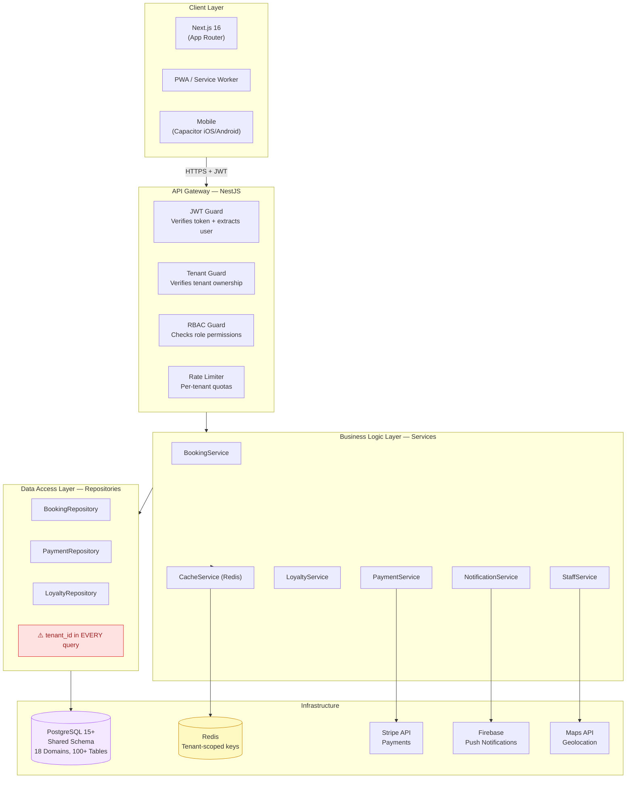
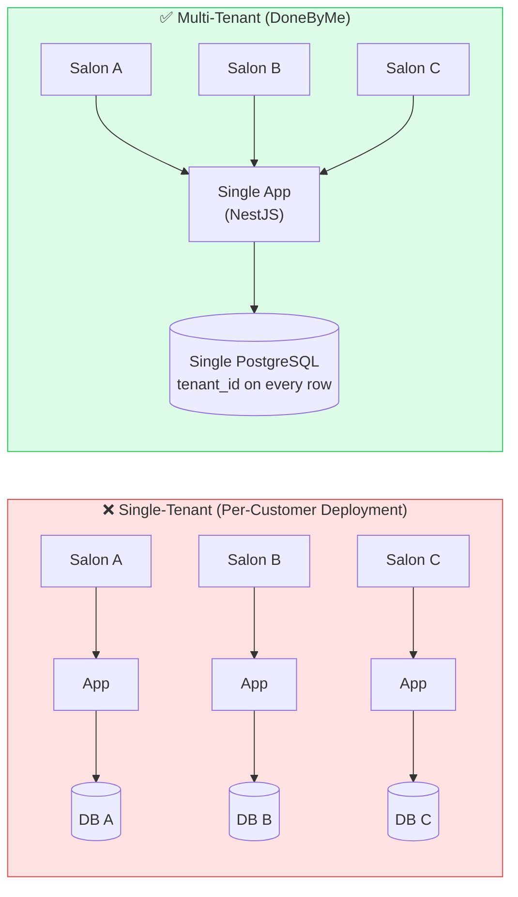
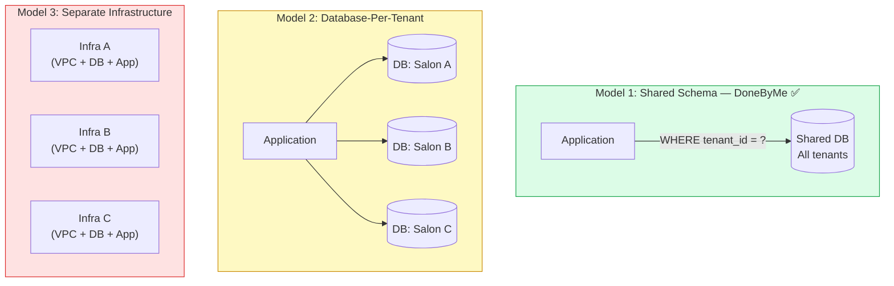
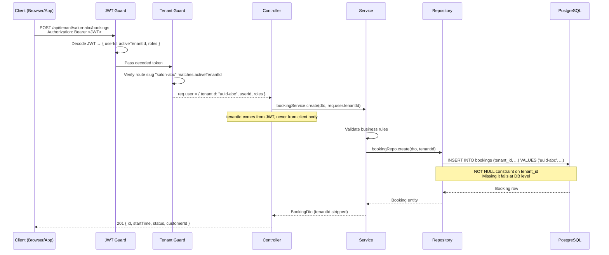
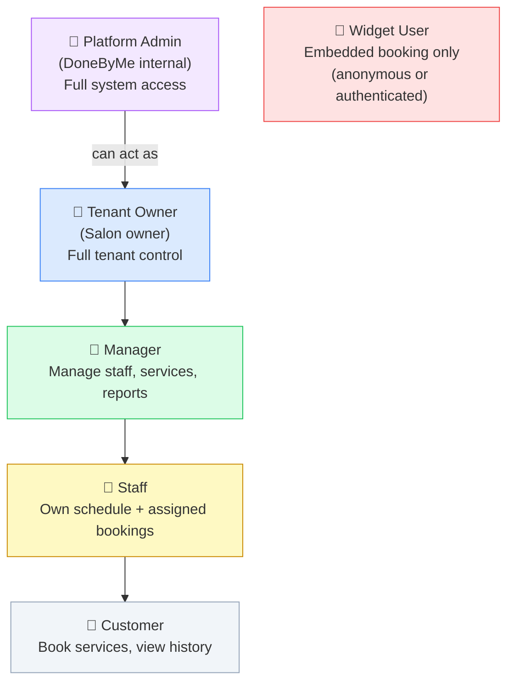
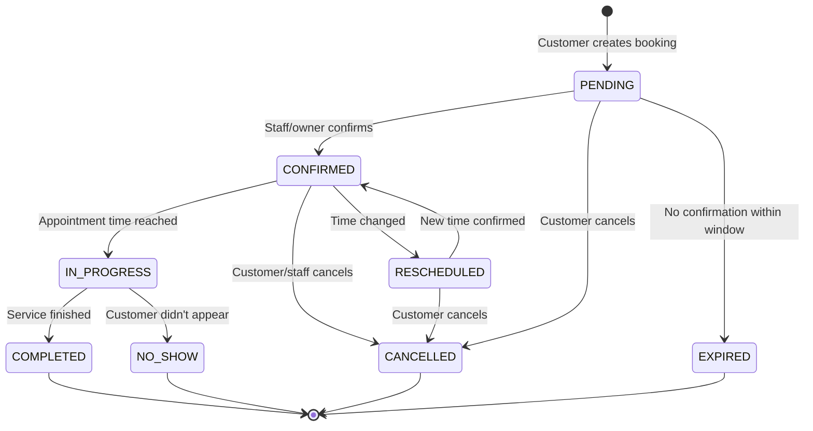
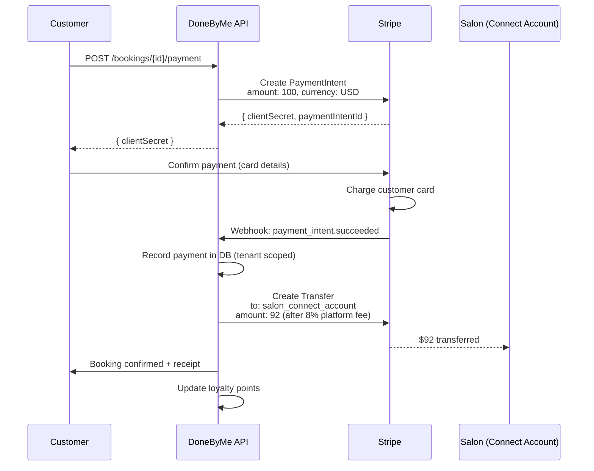
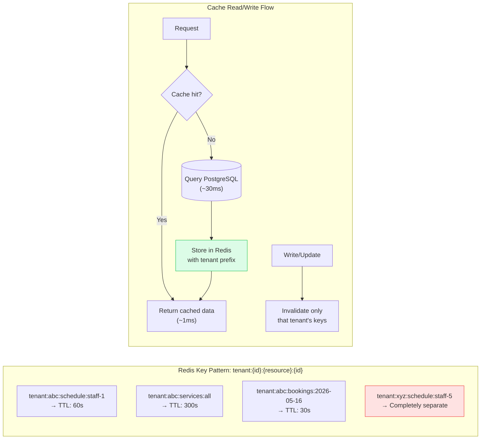
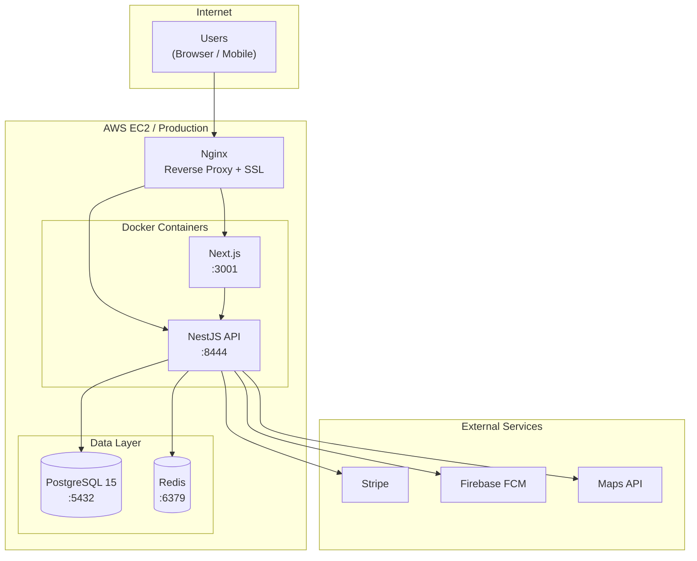

# System Diagrams — DoneByMe Architecture

> All key system diagrams in one place. Every diagram is also embedded in its relevant document section.

---

## 1. Full System Architecture

---

## 2. Multi-Tenancy: Single-Tenant vs Multi-Tenant

---

## 3. Tenant Isolation: The 3 Models

**→ Full trade-off analysis:** [ADR-001](../10-decision-records/ADR-001-SHARED_SCHEMA_ISOLATION.md)

---

## 4. Tenant Context Flow (Request Lifecycle)

---

## 5. RBAC Role Hierarchy

**→ Full RBAC design:** [RBAC_ARCHITECTURE.md](../03-authorization-security/RBAC_ARCHITECTURE.md)

---

## 6. Booking State Machine

**→ Full booking architecture:** [01-BOOKING_SYSTEM_ARCHITECTURE.md](../07-real-world-patterns/BOOKING/01-BOOKING_SYSTEM_ARCHITECTURE.md)

---

## 7. Payment Flow (Stripe Connect)

**→ Full payment architecture:** [01-PAYMENT_ARCHITECTURE.md](../07-real-world-patterns/PAYMENTS/01-PAYMENT_ARCHITECTURE.md)

---

## 8. Caching Strategy (Redis Tenant-Scoped Keys)

**→ Full caching design:** [CACHING_STRATEGY.md](../06-caching-performance/CACHING_STRATEGY.md)

---

## 9. Deployment Architecture

**→ Full deployment guide:** [DEPLOYMENT_PROCEDURES.md](../08-deployment-operations/DEPLOYMENT_PROCEDURES.md)

---

## Navigation

| Diagram | Deep Dive Document |
|---------|-------------------|
| Full System Architecture | [ARCHITECTURE_OVERVIEW.md](./ARCHITECTURE_OVERVIEW.md) |
| Multi-Tenancy Concepts | [MULTI_TENANT_FUNDAMENTALS.md](./MULTI_TENANT_FUNDAMENTALS.md) |
| Isolation Model Decision | [ADR-001](../10-decision-records/ADR-001-SHARED_SCHEMA_ISOLATION.md) |
| RBAC Role Hierarchy | [RBAC_ARCHITECTURE.md](../03-authorization-security/RBAC_ARCHITECTURE.md) |
| Booking State Machine | [01-BOOKING_SYSTEM_ARCHITECTURE.md](../07-real-world-patterns/BOOKING/01-BOOKING_SYSTEM_ARCHITECTURE.md) |
| Payment Flow | [01-PAYMENT_ARCHITECTURE.md](../07-real-world-patterns/PAYMENTS/01-PAYMENT_ARCHITECTURE.md) |
| Caching Strategy | [CACHING_STRATEGY.md](../06-caching-performance/CACHING_STRATEGY.md) |
| Deployment | [DEPLOYMENT_PROCEDURES.md](../08-deployment-operations/DEPLOYMENT_PROCEDURES.md) |
