# Portfolio Note

> Extracted from production system, sanitized for portfolio use.

---

# 🎯 **Complete Guide: Freelancers vs organizations/businesses & Embedded Booking System**

## **📋 Part 1: Understanding Freelancers vs organizations/businesses**

### **🤔 What is a Freelancer in Our Context?**

A **freelancer** in Denmark (and our platform) is:

- **Individual service provider** working from home or traveling to customers
- **Examples**: Mobile hairdresser, home nail technician, freelance massage therapist
- **NOT an employee** - they are their own business
- **Same platform, different setup** - they create their own "tenant" account

### **🏢 Freelancer vs organization/business Comparison**

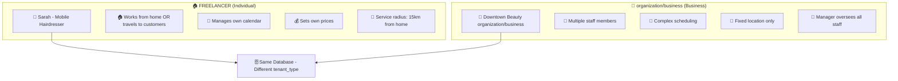

### **🔄 How Both Types Use Our Platform**

| Feature                | 🏠 Freelancer              | 🏢 organization/business                     |
| ---------------------- | -------------------------- | ---------------------------- |
| **Account Creation**   | Creates own tenant account | Creates organization/business tenant account |
| **Staff Management**   | Only themselves            | Multiple staff members       |
| **Location**           | Home + Mobile service      | Fixed organization/business location         |
| **Pricing**            | Simple, personal pricing   | Complex, multi-staff pricing |
| **Booking Management** | Personal calendar          | Multi-staff coordination     |
| **Customer Base**      | Personal clients           | organization/business customers              |

---

## **📋 Part 2: Embedded Booking System Explained**

### **🤔 What is "Embedded Booking"?**

**YES, exactly like YouTube iframe!** 🎯

When John (service provider/operator) wants customers to book directly on **his website** without leaving to go to **our website**.

### **📺 YouTube Iframe Example**

```html
<!-- John embeds YouTube video on his website -->
<iframe src="https://youtube.com/embed/VIDEO_ID" width="560" height="315">
</iframe>
```

### **📅 Our Booking Widget Example**

```html
<!-- John embeds our booking form on his website -->
<iframe
  src="https://the platform.dk/widget/john-organization/business/booking"
  width="400"
  height="600"
>
</iframe>
```

### **🔄 Customer Journey Comparison**

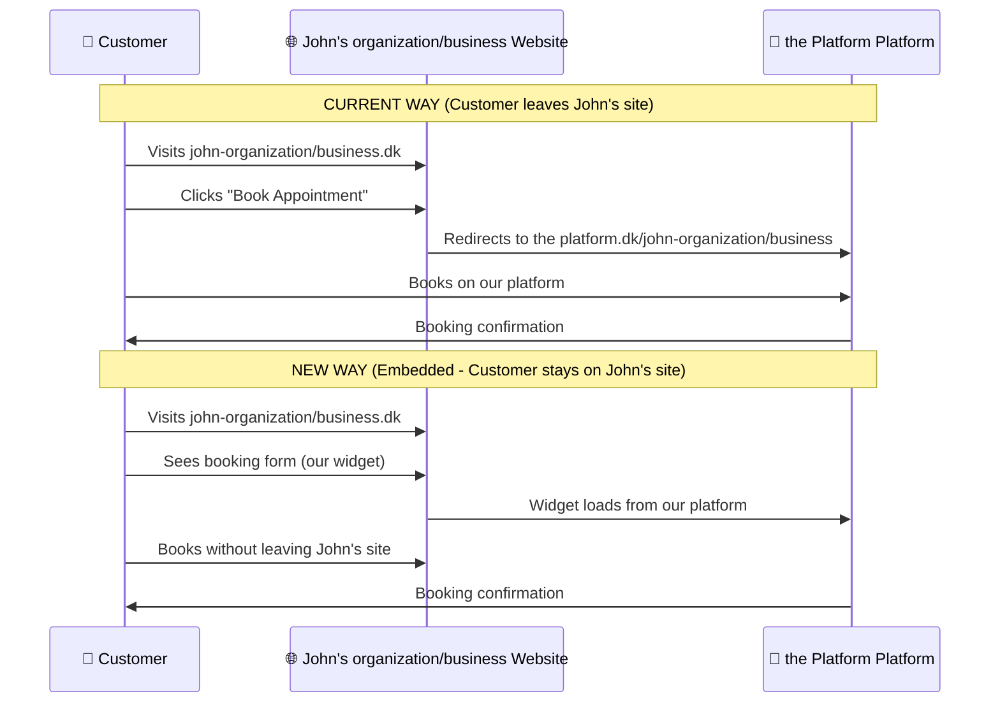

### **💰 Business Model**

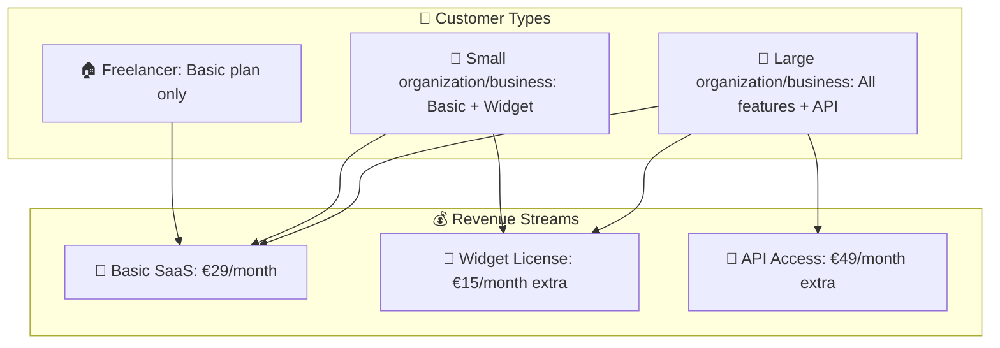

---

## **📋 Part 3: Technical Implementation**

### **🔧 How Embedded Widgets Work**

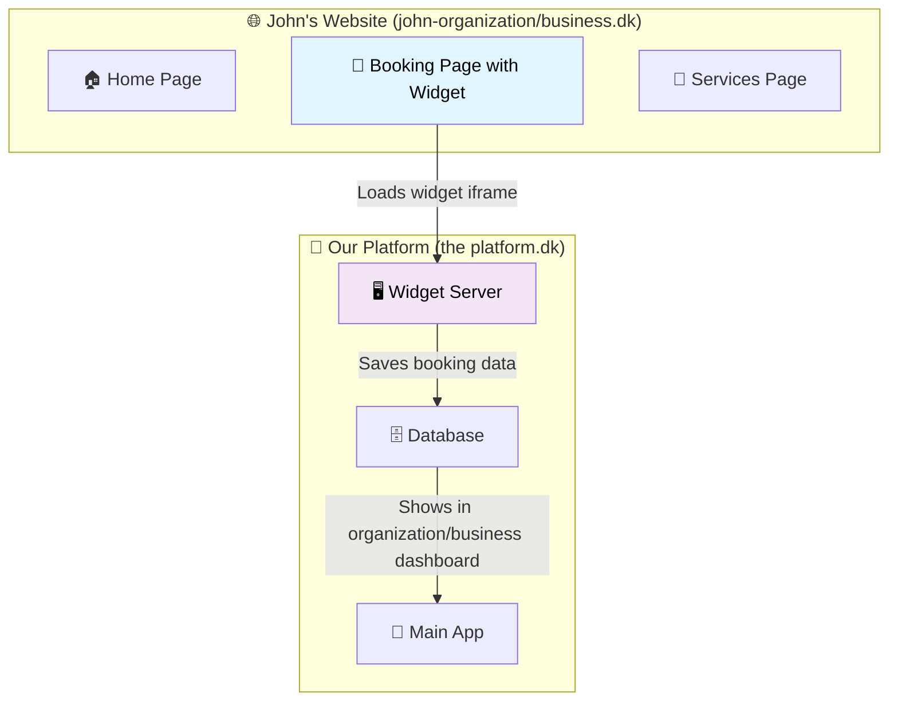

### **🛠️ Widget Creation Process**

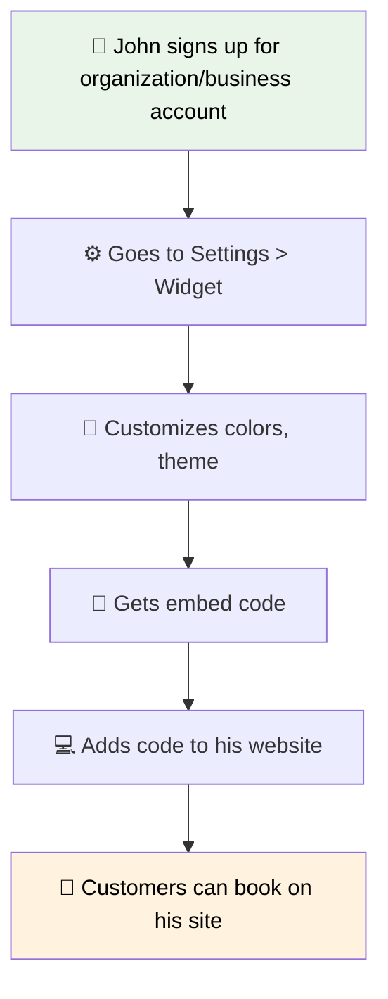

### **📋 Database Schema Logic**

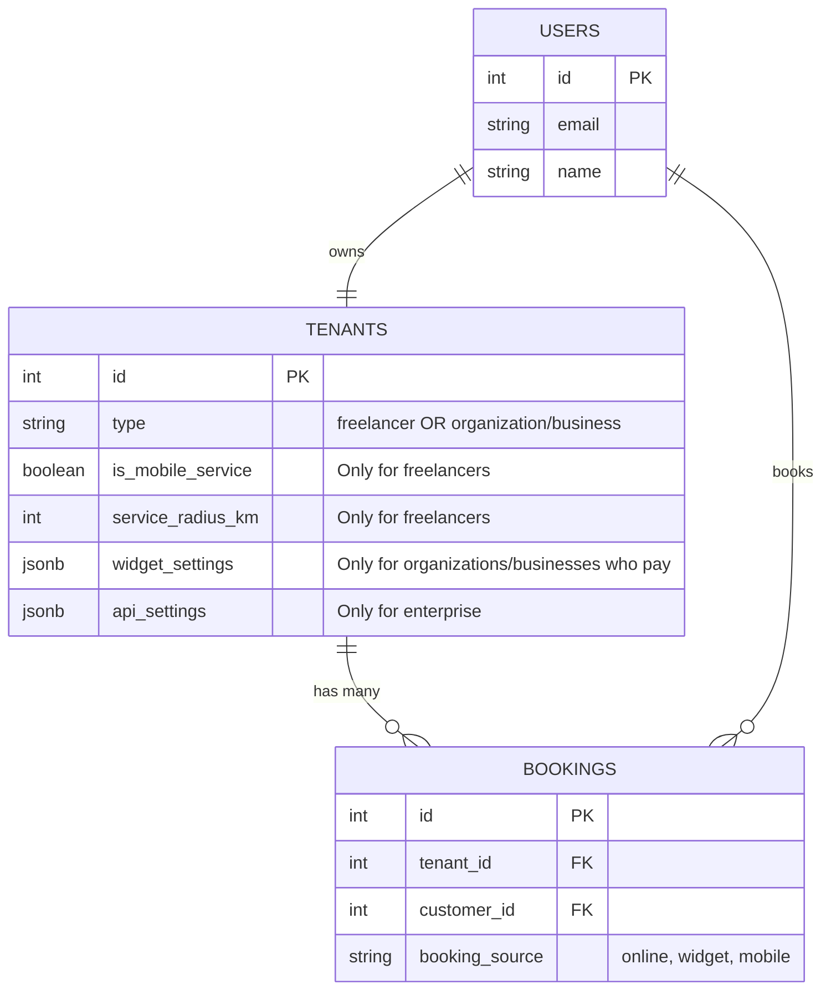

---

## **📋 Part 4: User Flows**

### **🏠 Freelancer Registration Flow**

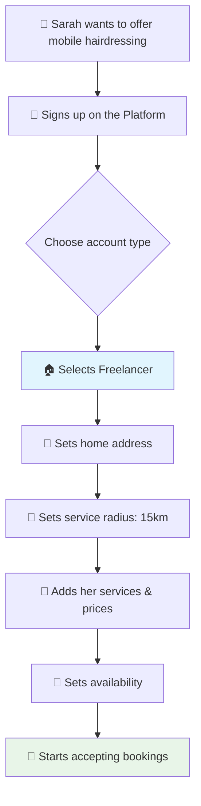

### **🏢 organization/business with Widget Flow**

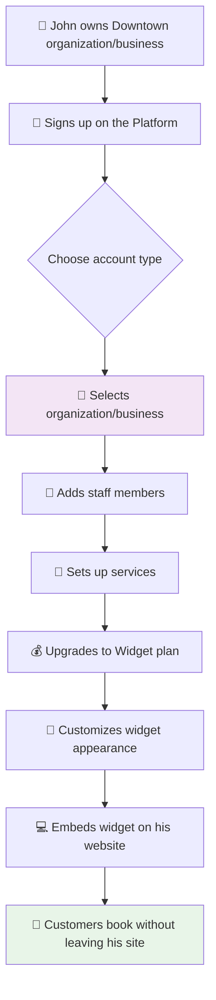

### **👤 Customer Booking Flow**

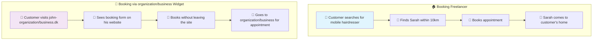

---

## **📋 Part 5: Revenue & Pricing Strategy**

### **💰 Subscription Tiers**

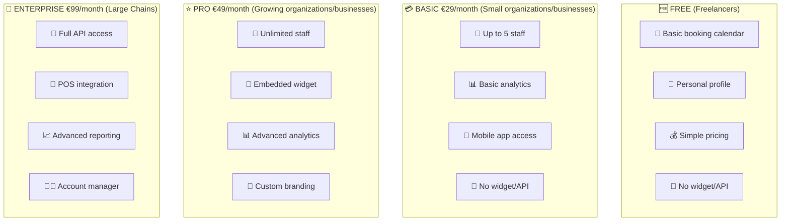

---

## **📋 Part 6: Technical Questions Answered**

### **❓ "How does the widget actually work?"**

1. **John's website** loads our widget via iframe
2. **Our servers** serve the booking form
3. **Customer** books through the widget
4. **Data** saves to our database
5. **John** sees booking in his dashboard

### **❓ "Is freelancer setup the same as organization/business?"**

**YES, same process, different configuration:**

```typescript
// Same registration form, different defaults
const freelancerDefaults = {
  tenant_type: 'freelancer',
  is_mobile_service: true, // Can travel to customers
  service_radius_km: 10, // How far they travel
  widget_settings: { enabled: false }, // No widget for free plan
};

const salonDefaults = {
  tenant_type: 'organization/business',
  is_mobile_service: false, // Fixed location
  service_radius_km: 0, // Not applicable
  widget_settings: { enabled: true }, // Can have widget if paid
};
```

### **❓ "How do customers find freelancers?"**

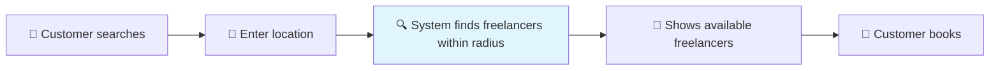

---

## **📋 Part 7: Implementation Priority**

### **🚀 Phase 1: MVP (Must Have Now)**

- ✅ Support both freelancer and organization/business tenant types
- ✅ Basic mobile service configuration
- ⏳ Simple booking flow for both types
- ⏳ Location-based freelancer search

### **📈 Phase 2: Widget System (Next Month)**

- ⏳ Embeddable booking widget
- ⏳ Widget customization (colors, themes)
- ⏳ Domain restrictions for security
- ⏳ Widget analytics

### **🏢 Phase 3: Enterprise Features (Later)**

- ⏳ Full API access
- ⏳ Webhook notifications
- ⏳ POS system integrations
- ⏳ Advanced analytics

---

## **🎯 Summary: Key Differences**

| Aspect               | 🏠 Freelancer               | 🏢 organization/business                     |
| -------------------- | --------------------------- | ---------------------------- |
| **Business Model**   | Individual service provider | Business with employees      |
| **Location**         | Home-based + Mobile         | Fixed organization/business location         |
| **Platform Usage**   | Creates own tenant account  | Creates organization/business tenant account |
| **Staff**            | Just themselves             | Multiple staff members       |
| **Pricing**          | Free/Basic plan             | Basic to Enterprise plans    |
| **Widget**           | Not available (free plan)   | Available (paid plans)       |
| **Target Customers** | Personal client base        | Walk-ins + appointments      |

**Bottom Line**: Same platform, different configurations! Freelancers and organizations/businesses both create "tenant" accounts but with different settings and features. 🎯

**Widget**: Exactly like YouTube embed - customers book on organization/business's website without leaving! 📺➡️📅
