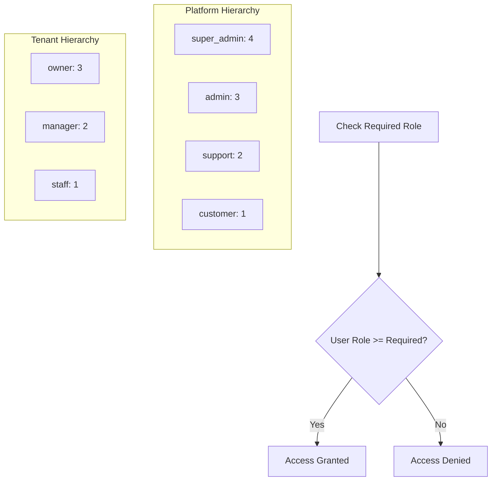
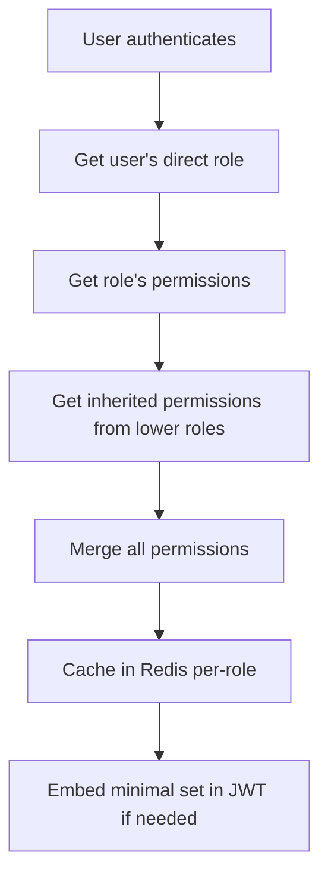
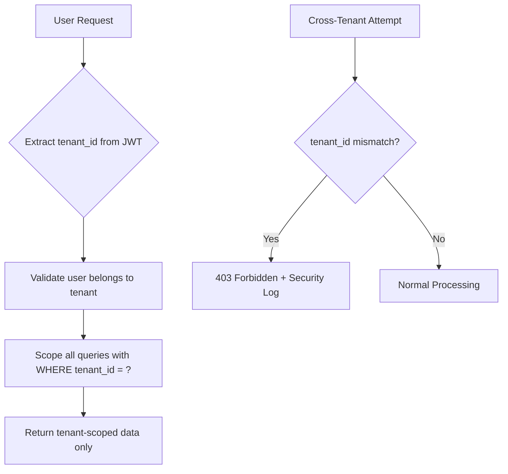
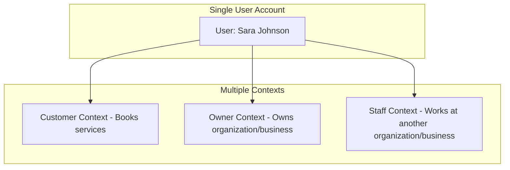
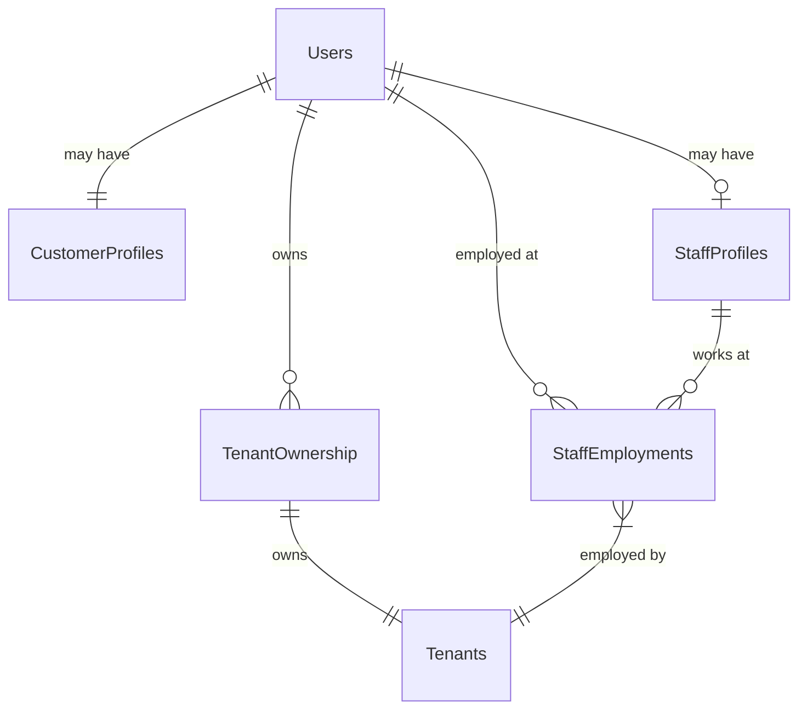
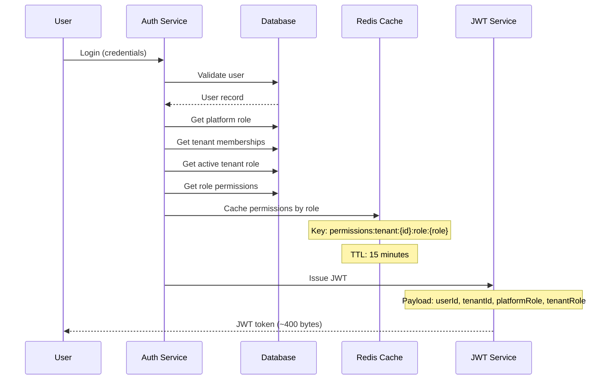
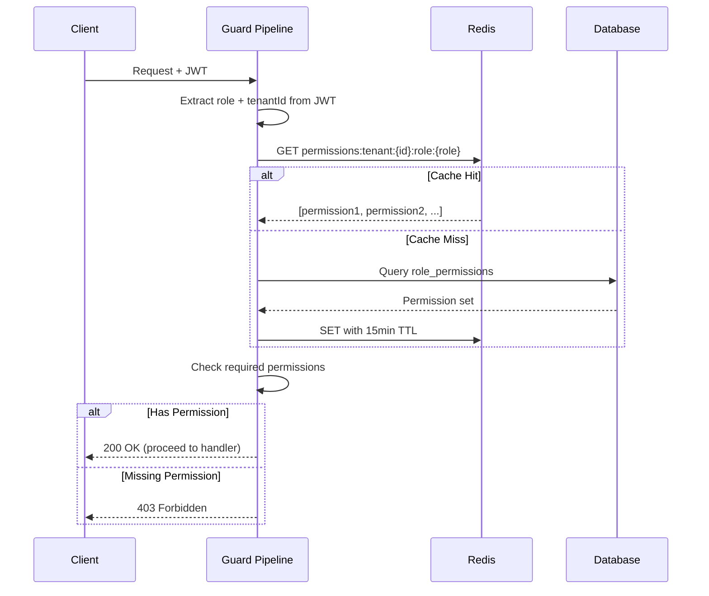
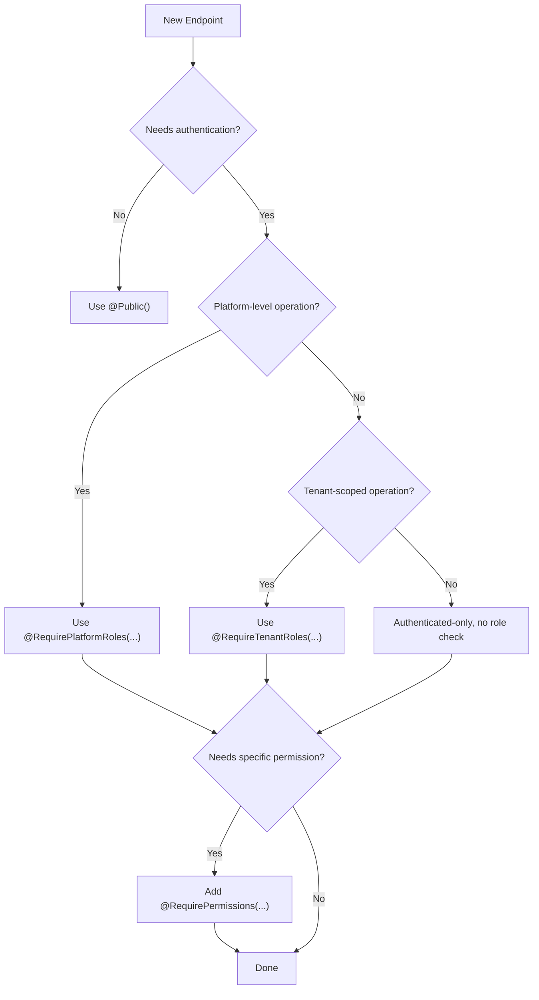

# Portfolio Note

> Extracted from production system, sanitized for portfolio use.

---

# RBAC Architecture

The complete architecture reference for the the Platform Role-Based Access Control system. This document covers design decisions, role hierarchies, guard pipelines, permission models, caching strategy, multi-tenant isolation, and security considerations.

---

## Table of Contents

- [System Overview](#system-overview)
- [Design Decisions](#design-decisions)
- [Role Hierarchies](#role-hierarchies)
- [Permission Model](#permission-model)
- [Guard Pipeline](#guard-pipeline)
- [Passive Enforcement Model](#passive-enforcement-model)
- [Multi-Tenant Isolation](#multi-tenant-isolation)
- [Multi-Role User Architecture](#multi-role-user-architecture)
- [Data Flow](#data-flow)
- [Caching Strategy](#caching-strategy)
- [Authorization Layers](#authorization-layers)
- [Ownership and Resource Access](#ownership-and-resource-access)
- [Policy-Based Access Control](#policy-based-access-control)
- [Security Model](#security-model)
- [Decision Flowcharts](#decision-flowcharts)
- [Future Roadmap](#future-roadmap)

---

## System Overview

the Platform implements a 3-layer security architecture spanning middleware, frontend, and backend:

```
                    Request Flow
                    ============

Client Request
      │
      ▼
┌─────────────────────────────────────┐
│  Layer 1: Next.js Middleware        │
│  Route-level role checks            │
│  (Platform + Tenant roles)          │
└──────────────┬──────────────────────┘
               │
               ▼
┌─────────────────────────────────────┐
│  Layer 2: React Component Guards    │
│  UI-level permission gating         │
│  (Buttons, sections, actions)       │
└──────────────┬──────────────────────┘
               │
               ▼
┌─────────────────────────────────────┐
│  Layer 3: NestJS Backend Guards     │
│  API-level enforcement              │
│  (Final authority - never bypassed) │
└─────────────────────────────────────┘
```

### Component Map

```
┌─────────────────────────────────────────────────┐
│  Backend (NestJS)                               │
│  ┌───────────────────────────────────────────┐  │
│  │ Guards (Global + Decorator-activated)     │  │
│  │  ├── JwtAuthGuard          [ACTIVE]       │  │
│  │  ├── PlatformRoleGuard     [PASSIVE]      │  │
│  │  ├── TenantRoleGuard       [PASSIVE]      │  │
│  │  ├── PermissionGuard       [PASSIVE]      │  │
│  │  └── OwnershipGuard        [PASSIVE]      │  │
│  ├───────────────────────────────────────────┤  │
│  │ Hierarchy Services                        │  │
│  │  ├── PlatformRoleHierarchyService         │  │
│  │  └── TenantRoleHierarchyService           │  │
│  ├───────────────────────────────────────────┤  │
│  │ Decorators                                │  │
│  │  ├── @Public()                            │  │
│  │  ├── @RequirePlatformRoles(...)           │  │
│  │  ├── @RequireTenantRoles(...)             │  │
│  │  ├── @RequirePermissions(...)             │  │
│  │  └── @RequireAnyPermission(...)           │  │
│  └───────────────────────────────────────────┘  │
│                                                 │
│  Frontend (Next.js)                             │
│  ┌───────────────────────────────────────────┐  │
│  │ Middleware: withRoleBasedRouting           │  │
│  │ Guards:                                   │  │
│  │  ├── <TenantRoleGuard>                    │  │
│  │  ├── <PlatformRoleGuard>                  │  │
│  │  ├── <PermissionGuard>                    │  │
│  │  └── <RolePermissionGuard>                │  │
│  │ Hooks: usePermissions()                   │  │
│  └───────────────────────────────────────────┘  │
└─────────────────────────────────────────────────┘
```

---

## Design Decisions

| Decision | Choice | Rationale |
|----------|--------|-----------|
| Permission storage | Database + Redis cache | Dynamic management without code deploys |
| JWT payload | Minimal (userId, tenantId, role) | Keep tokens small (~400 bytes) |
| Permission keys | Static constants | Type-safe, auditable, refactor-friendly |
| Caching | Per-role (not per-user) | Reduces cache entries from thousands to dozens |
| Guard activation | Passive enforcement | No decorator = no check. Explicit security. |
| Role model | Dual hierarchy (platform + tenant) | Separates system-level and business-level access |
| Ownership checks | Service-layer (not guard-based) | Full business context available for complex rules |

### Why Not All Permissions in JWT?

```
JWT with 100 permissions:
  Average permission name: 25 characters
  100 permissions x 25 chars = 2.5KB just for permissions
  Plus user data, tenant data, metadata
  Exceeds 4KB cookie limit

Multi-tenant makes it worse:
  User at 3 organizations/businesses = 120+ permissions in JWT

Solution: Minimal JWT + cached lookups
  JWT: ~400 bytes (userId, tenantId, role)
  Permissions: Redis cache with 15min TTL
```

### Static vs Dynamic Permission Keys

| Aspect | Static Keys | Dynamic Keys |
|--------|------------|--------------|
| Type safety | Full TypeScript support | Requires runtime validation |
| Refactoring | IDE finds all usages | String search only |
| Auditing | Grep-able, deterministic | Requires runtime inspection |
| Flexibility | Fixed set, add via code | Admin-configurable |
| Performance | Compile-time validation | Runtime validation needed |

**Decision**: Static keys for v1. Dynamic keys deferred to Phase 3 (custom roles per tenant).

---

## Role Hierarchies

### Platform Roles

Platform roles control access to system-wide administrative functions.

```
super_admin (level 4)
    │
    ├── Full system access
    ├── Cross-tenant operations
    ├── System configuration
    │
    ▼
admin (level 3)
    │
    ├── User management
    ├── Tenant management
    ├── Platform monitoring
    │
    ▼
support (level 2)
    │
    ├── Read-only tenant access
    ├── User assistance
    ├── Basic diagnostics
    │
    ▼
customer (level 1)
    │
    └── Basic platform access
        Create/manage own tenant
```

| Role | Description | Typical Users |
|------|-------------|---------------|
| `super_admin` | Ultimate system administrator | System owners, technical leads |
| `admin` | Platform administrator | Customer success, operations team |
| `support` | Customer support representative | Support team members |
| `customer` | Standard platform user | organization/business owners, business managers |

Platform role hierarchy check:

```typescript
// super_admin can access any endpoint requiring admin, support, or customer
// admin can access any endpoint requiring support or customer
// Each higher role inherits all lower role permissions
```

### Tenant Roles

Tenant roles control access within a specific business/organization/business context.

```
owner (level 3)
    │
    ├── Full tenant control
    ├── Financial reporting
    ├── Staff management
    │
    ▼
manager (level 2)
    │
    ├── Day-to-day operations
    ├── Staff scheduling
    ├── Customer management
    │
    ▼
staff (level 1)
    │
    └── Own schedule management
        Assigned booking access
        Basic customer interaction
```

| Role | Description | Typical Users |
|------|-------------|---------------|
| `owner` | Business owner with full control | organization/business owners, franchise managers |
| `manager` | Senior staff with management privileges | organization/business managers, senior stylists |
| `staff` | Service providers | Stylists, therapists, barbers |

Inheritance: owners automatically have all manager permissions; managers automatically have all staff permissions.

### Hierarchy Resolution



---

## Permission Model

### Naming Convention

Permissions follow the pattern: `{scope}.{resource}.{action}`

| Scope | Description | Example |
|-------|-------------|---------|
| `platform` | System-wide operations | `platform.tenants.create` |
| `tenant` | Within a specific organization/business | `tenant.staff.manage` |
| `user` | User's own resources | `user.profile.update` |

### Scope Definitions

**Platform scope** - System-level operations:
- `platform.tenants.create` - Create new tenants
- `platform.tenants.manage` - Manage existing tenants
- `platform.users.manage` - Manage platform users
- `platform.analytics.view` - View platform analytics
- `platform.settings.manage` - Manage platform settings

**Tenant scope** - Operations within a organization/business:
- `tenant.staff.manage` - Manage staff members
- `tenant.staff.create` - Create staff
- `tenant.bookings.manage` - Manage bookings
- `tenant.bookings.view` - View bookings
- `tenant.services.manage` - Manage services
- `tenant.services.create` - Create services
- `tenant.services.pricing` - Modify pricing
- `tenant.analytics.view` - View tenant analytics
- `tenant.reports.view` - View reports
- `tenant.reports.export` - Export reports
- `tenant.reports.financial` - Access financial data
- `tenant.settings.manage` - Manage tenant settings
- `tenant.customers.view` - View customers
- `tenant.customers.manage` - Manage customers

**User scope** - Self-service operations:
- `user.profile.view` - View own profile
- `user.profile.update` - Update own profile
- `user.bookings.create` - Create own bookings
- `user.bookings.view` - View own bookings
- `user.bookings.cancel` - Cancel own bookings
- `user.reviews.create` - Create reviews
- `user.reviews.edit` - Edit own reviews

### Role-Permission Default Mappings

**Staff role:**
- `user.profile.view`, `user.profile.update`
- `user.bookings.view`
- `tenant.bookings.view` (own assignments)
- `tenant.services.view`

**Manager role** (inherits staff):
- `tenant.staff.manage`
- `tenant.bookings.manage`
- `tenant.services.manage`
- `tenant.customers.view`
- `tenant.reports.view`

**Owner role** (inherits manager):
- `tenant.staff.create`
- `tenant.services.create`
- `tenant.services.pricing`
- `tenant.analytics.view`
- `tenant.reports.financial`
- `tenant.settings.manage`
- `tenant.customers.manage`

### Effective Permissions Calculation



When checking permissions at runtime:

1. Extract role from JWT
2. Look up cached permissions for `tenant:{tenantId}:role:{role}`
3. If cache miss, query DB and populate cache
4. Check if required permission exists in the set

---

## Guard Pipeline

### Registration Order

Guards are registered globally in `AppModule`:

```typescript
providers: [
  { provide: APP_GUARD, useClass: JwtAuthGuard },        // 1st: Authentication
  { provide: APP_GUARD, useClass: PlatformRoleGuard },    // 2nd: Platform roles
  { provide: APP_GUARD, useClass: TenantRoleGuard },      // 3rd: Tenant roles
  { provide: APP_GUARD, useClass: PermissionGuard },      // 4th: Permissions
]
```

### Execution Flow

```mermaid
flowchart TD
    A[Incoming Request] --> B{JwtAuthGuard}
    B -->|No @Public| C{Valid JWT?}
    B -->|@Public| G[Skip Auth]
    C -->|No| D[401 Unauthorized]
    C -->|Yes| E[Attach user to request]
    E --> F{PlatformRoleGuard}
    G --> F
    F -->|No @RequirePlatformRoles| H[Pass Through]
    F -->|Has decorator| I{Role >= Required?}
    I -->|No| J[403 Forbidden]
    I -->|Yes| H
    H --> K{TenantRoleGuard}
    K -->|No @RequireTenantRoles| L[Pass Through]
    K -->|Has decorator, no tenant| M[400 Bad Request]
    K -->|Has decorator| N{Tenant Role >= Required?}
    N -->|No| O[403 Forbidden]
    N -->|Yes| L
    L --> P{PermissionGuard}
    P -->|No decorator| Q[Pass Through]
    P -->|@RequirePermissions| R{Has ALL permissions?}
    P -->|@RequireAnyPermission| S{Has ANY permission?}
    R -->|No| T[403 Forbidden]
    R -->|Yes| U[Execute Handler]
    S -->|No| T
    S -->|Yes| U
    Q --> U
```

### Guard Summary Table

| Guard | Enforcement | Decorator Required | Bypass Method | JWT Required |
|-------|------------|-------------------|---------------|-------------|
| `JwtAuthGuard` | **ACTIVE** | No | `@Public()` | Yes |
| `PlatformRoleGuard` | **PASSIVE** | Yes | (none needed) | Yes |
| `TenantRoleGuard` | **PASSIVE** | Yes | (none needed) | Yes |
| `PermissionGuard` | **PASSIVE** | Yes | (none needed) | Yes |

---

## Passive Enforcement Model

All guards except `JwtAuthGuard` use passive enforcement: they only check when their corresponding decorator is present on the handler or controller.

### How It Works

**Scenario 1: Public endpoint (no auth)**

```
@Public()
@Get('health')
healthCheck() { ... }

JwtAuthGuard  → sees @Public() → SKIP
PlatformRole  → no decorator   → PASS
TenantRole    → no decorator   → PASS
Permission    → no decorator   → PASS
Result: Accessible without authentication
```

**Scenario 2: Authenticated endpoint (no role/permission)**

```
@Get('profile')
getProfile() { ... }

JwtAuthGuard  → validates JWT     → user attached
PlatformRole  → no decorator      → PASS
TenantRole    → no decorator      → PASS
Permission    → no decorator      → PASS
Result: Any authenticated user can access
```

**Scenario 3: Role + permission protected**

```
@RequireTenantRoles(TENANT_ROLES.MANAGER)
@RequirePermissions('tenant.staff.create')
@Post('staff')
createStaff() { ... }

JwtAuthGuard  → validates JWT                    → user attached
PlatformRole  → no decorator                     → PASS
TenantRole    → checks user.tenantRole >= manager → PASS/BLOCK
Permission    → checks tenant.staff.create        → PASS/BLOCK
Result: Only managers+ with staff.create permission
```

### Key Insight

The passive model means:
- **No decorator = no restriction** (beyond authentication)
- Guards are safe to register globally because they do nothing without their activating decorator
- Security is opt-in per endpoint, making it explicit what each route requires
- Combined decorators use **AND logic**: all must pass for access to be granted

---

## Multi-Tenant Isolation

### Isolation Architecture



### Isolation Rules

Every data operation must:
- Include `tenant_id` in WHERE clauses
- Use composite indexes `(tenant_id, ...)`
- Validate tenant from trusted context (JWT/session)
- Never accept `tenant_id` from client payload

Isolation applies to:
- Database queries
- Cache keys (prefix with `tenant:{id}:`)
- Background jobs
- WebSocket events
- Test fixtures and seed data

### Cross-Tenant Prevention

```typescript
// Every repository query includes tenant isolation
async findBookings(tenantId: number) {
  return this.db.query.bookings.findMany({
    where: eq(bookings.tenant_id, tenantId),
  });
}

// Cache keys are tenant-scoped
const cacheKey = `permissions:tenant:${tenantId}:role:${role}`;
```

---

## Multi-Role User Architecture

Users can simultaneously hold multiple contexts:

- **Customer**: Books services at various organizations/businesses
- **Owner**: Owns one or more organizations/businesses
- **Staff**: Works at one or more organizations/businesses (possibly part-time)

### Context Architecture



### Database Design



### Context Switching

At login, the system determines all available contexts and allows switching between them. The active context dictates:
- Which tenant's data is accessible
- Which role permissions apply
- Which navigation/UI elements display

When switching context:
- JWT is refreshed with the new `tenantId` and `role`
- Permissions cache is loaded for the new context
- UI updates to reflect the active role

---

## Data Flow

### Login and Token Generation



### Runtime Permission Check



---

## Caching Strategy

### Per-Role Caching (Not Per-User)

Most users with the same role in the same tenant have the same permissions. Caching per-role dramatically reduces cache entries.

| Strategy | Cache Entries (1000 users, 3 roles, 10 tenants) | Memory |
|----------|-----------------------------------------------|--------|
| Per-user | 1,000 entries | ~2.5MB |
| Per-role | 30 entries (3 roles x 10 tenants) | ~75KB |

### Cache Key Structure

```
permissions:tenant:{tenantId}:role:{role}
  Value: ["tenant.staff.manage", "tenant.bookings.view", ...]
  TTL: 15 minutes

user:roles:{userId}
  Value: { tenant_1: "owner", tenant_2: "staff" }
  TTL: 15 minutes
```

### Cache Invalidation Events

| Event | Keys to Invalidate |
|-------|-------------------|
| Role definition changes | `permissions:tenant:*:role:{changedRole}` |
| User role assignment changes | `user:roles:{userId}` |
| Tenant permission settings change | `permissions:tenant:{tenantId}:*` |
| User logs out | All user-specific caches |

### Performance Metrics

| Metric | Target | Actual |
|--------|--------|--------|
| Cold cache permission lookup | < 50ms | ~45ms |
| Warm cache permission lookup | < 5ms | ~2ms |
| JWT validation | < 10ms | ~5ms |
| Full guard pipeline | < 20ms | ~15ms |

---

## Authorization Layers

The complete authorization stack, from authentication to complex business rules:

```
                    ┌─────────────────┐
                    │   POLICY-BASED  │  Layer 6: Complex business rules
                    │   (Future)      │  "If X and Y and Z..."
                    └────────┬────────┘
                             │
                    ┌────────▼────────┐
                    │  FEATURE FLAG   │  Layer 5: Subscription tier
                    │  (Planned)      │  "Does plan include this?"
                    └────────┬────────┘
                             │
                    ┌────────▼────────┐
                    │   OWNERSHIP     │  Layer 4: Resource ownership
                    │  (Service-layer)│  "Is this YOUR booking?"
                    └────────┬────────┘
                             │
               ┌─────────────▼─────────────┐
               │     ROLE-BASED (RBAC)     │  Layer 3: Role permissions
               │     Implemented           │  "Can managers do this?"
               └─────────────┬─────────────┘
                             │
          ┌──────────────────▼──────────────────┐
          │        TENANT ISOLATION             │  Layer 2: Multi-tenant
          │        Implemented                  │  "Is user in this tenant?"
          └──────────────────┬──────────────────┘
                             │
     ┌───────────────────────▼───────────────────────┐
     │              AUTHENTICATION                   │  Layer 1: Identity
     │              Implemented                      │  "Who is this user?"
     └───────────────────────────────────────────────┘
```

| Layer | Purpose | Implementation | Status |
|-------|---------|----------------|--------|
| 1. Authentication | Verify identity | JwtAuthGuard (global) | Implemented |
| 2. Tenant isolation | Scope to tenant | Implicit (tenant_id in queries) | Implemented |
| 3. RBAC | Role-based access | PlatformRoleGuard, TenantRoleGuard, PermissionGuard | Implemented |
| 4. Ownership | Resource-level access | Service-layer checks | Implemented |
| 5. Feature flags | Subscription tier control | FeatureGuard | Planned |
| 6. Policy engine | Complex business rules | CASL or custom | Future |

---

## Ownership and Resource Access

### Service-Layer Ownership (Recommended Pattern)

Ownership checks live in the service layer where full business context is available:

```typescript
// Each resource has different access rules
// Booking: customer OR assigned staff OR tenant manager
// Time-off: team member OR tenant manager
// Review: customer (with time limits!)

private canAccessBooking(booking: Booking, user: AuthenticatedUser): boolean {
  // Platform admin bypass
  if (['super_admin', 'admin'].includes(user.platformRole)) return true;

  // Customer who booked
  if (booking.customer_id === user.customerId) return true;

  // Same tenant
  if (booking.tenant_id === user.tenantId) {
    // Manager/owner can see all
    if (['owner', 'manager'].includes(user.tenantRole)) return true;
    // Assigned staff can see their bookings
    if (booking.primary_staff_employment_id === user.staffEmploymentId) return true;
  }

  return false;
}
```

### Why Service-Layer Over Guard-Based Ownership

| Aspect | Guard-based `@CheckOwnership` | Service-layer checks |
|--------|------------------------------|---------------------|
| Context available | Request params only | Full entity + business logic |
| Complexity | Config explosion for varied rules | Natural code flow |
| Testability | Harder to unit test | Easy to unit test |
| Flexibility | Static config options | Any business rule expressible |
| Cross-service calls | Not feasible | Call PaymentService, etc. |

### When to Use Each

| Route | Check Location | Why |
|-------|---------------|-----|
| `GET /users/:id` | `SelfOrAdminGuard` | Simple ID match, no DB needed |
| `GET /bookings/:id` | `BookingService` | Complex: customer OR staff OR manager |
| `PATCH /time-off/:id` | `TimeOffService` | Complex: owner + pending status check |
| `POST /reviews/:id/respond` | `ReviewService` | Complex: manager + no existing response |
| `GET /tenants/:id/services` | `@TenantRoles('staff')` | Role-based, no ownership needed |

---

## Policy-Based Access Control

### When RBAC Is Not Enough

RBAC handles "Can this role do this action?" but not conditional rules like:
- "Staff can edit booking IF assigned AND status is not completed"
- "Customer can cancel booking IF more than 24 hours away"
- "Manager can approve time-off IF employee is in their department"

### Approaches (Phased)

**Phase 1 (Current)**: Simple guards + service-layer ownership checks. Handles 80% of cases.

**Phase 2 (When needed)**: Per-module policy services for complex business rules:

```typescript
@Injectable()
export class BookingPolicyService {
  canUpdate(user: AuthUser, booking: Booking): boolean {
    if (booking.status === 'completed') return false;
    if (user.role === 'admin') return true;
    if (user.role === 'staff') return booking.staffId === user.staffId;
    return false;
  }
}
```

**Phase 3 (If rules explode)**: Consider CASL or a full policy engine for declarative, auditable, attribute-based rules.

### Decision Matrix

| Scenario | Simple RBAC | Policy Service | CASL/Policy Engine |
|----------|------------|---------------|-------------------|
| Admin can delete any booking | Yes | | |
| Staff can view own bookings | Yes | | |
| Staff can edit assigned bookings only | | Yes | |
| Cannot modify completed bookings | | Yes | |
| Customer can cancel if > 24h before | | Yes | |
| Field-level access control | | | Yes |
| Dynamic permissions based on state | | | Yes |

---

## Security Model

### Threat Model

| Threat | Mitigation | Layer |
|--------|-----------|-------|
| Unauthenticated access | JwtAuthGuard (global, active) | 1 |
| Cross-tenant data access | tenant_id in all queries, JWT validation | 2 |
| Privilege escalation | Role hierarchy with strict level checks | 3 |
| Unauthorized resource access | Service-layer ownership checks | 4 |
| Token theft | Short TTL (15min), refresh tokens, permission caching | 1-3 |
| Stale permissions | Cache TTL + instant invalidation on changes | 3 |

### Defense in Depth

Every sensitive operation should have at least two layers of protection:

```
Frontend (UX improvement, not security)
  └── Middleware: Hide routes user cannot access
  └── Component Guards: Hide buttons user cannot use

Backend (actual security enforcement)
  └── Guard Pipeline: Role + Permission checks
  └── Service Layer: Business rules + Ownership
  └── Repository: tenant_id isolation
```

Never rely on frontend for security enforcement. The backend is the final authority.

### Security Principles

**Always:**
- Validate JWT on every request
- Include tenant_id in every query
- Use role hierarchy checks (not exact match)
- Log access denials for audit
- Cache per-role, not per-user

**Never:**
- Accept tenant_id from client payload
- Trust frontend-only permission checks
- Skip tenant isolation in any query
- Store full permissions in JWT
- Allow cross-tenant data in responses

### Combined Decorators Edge Cases

When using both `@RequirePlatformRoles` and `@RequireTenantRoles`:

| User | Platform Role | Active Tenant | Platform Check | Tenant Check | Result |
|------|-------------|---------------|---------------|-------------|--------|
| Platform Admin | `admin` | `null` | PASS | BLOCK | **BLOCK** |
| service provider/operator | `customer` | `owner` | BLOCK | PASS | **BLOCK** |
| Hybrid User | `admin` | `owner` | PASS | PASS | **ALLOW** |
| Admin as Staff | `admin` | `staff` | PASS | BLOCK (if owner required) | **BLOCK** |

Rule: ALL decorators must pass (AND logic).

---

## Decision Flowcharts

### Which Guard to Use?



### Security Layer Decision

| Question | If Yes | If No |
|----------|--------|-------|
| Should anyone access this? | `@Public()` | Continue |
| Is this a platform admin action? | `@RequirePlatformRoles(ADMIN)` | Continue |
| Is this scoped to a tenant? | `@RequireTenantRoles(...)` | Continue |
| Does it need a specific permission? | `@RequirePermissions(...)` | Continue |
| Does it need resource ownership? | Service-layer check | Done |

---

## Future Roadmap

### Phase 0 (Complete)
- Global guard registration
- JwtAuthGuard (active enforcement)
- PlatformRoleGuard (passive)
- TenantRoleGuard (passive)
- PermissionGuard (passive)
- Role hierarchy services
- Backend tests (35/35 passing)

### Phase 1 (Current)
- Frontend middleware route guards
- React component guards
- usePermissions hook
- Sidebar permission integration
- Permission-based UI gating

### Phase 2 (Next)
- Custom roles per tenant (owner-configurable)
- Subscription-tier feature flags
- Feature guard implementation
- Permission analytics

### Phase 3 (Future)
- Dynamic permission keys
- Resource-level permissions
- Temporary permissions with expiry
- Audit logging for all permission changes
- CASL integration for complex rules
- Permission groups/bundles

---

## Testing

### Test Coverage

Current backend test status: **35/35 tests passing**

Test areas:
- PlatformRoleGuard: hierarchy checks, passive enforcement, combined decorators
- TenantRoleGuard: hierarchy checks, tenant context validation, edge cases
- PermissionGuard: AND logic, OR logic, scope combinations, passive enforcement
- Combined guards: 13 edge case tests covering all scenarios
- Integration: cross-tenant prevention, staff management flows

### Error Codes

| Code | Meaning | Resolution |
|------|---------|------------|
| 401 | Missing or invalid JWT | Re-authenticate |
| 403 (platform role) | Insufficient platform role | Contact admin for role upgrade |
| 403 (tenant role) | Insufficient tenant role | Contact tenant owner |
| 403 (permission) | Missing required permission | Check role-permission mapping |
| 400 (tenant context) | Tenant role required but no active tenant | Select a tenant |

---

## Key Files

### Backend

- `src/auth/guards/jwt-auth.guard.ts` - Authentication guard
- `src/roles/guards/platform-role.guard.ts` - Platform role guard
- `src/roles/guards/tenant-role.guard.ts` - Tenant role guard
- `src/roles/guards/permission.guard.ts` - Permission guard
- `src/roles/services/platform-role-hierarchy.service.ts` - Platform hierarchy
- `src/roles/services/tenant-role-hierarchy.service.ts` - Tenant hierarchy
- `src/roles/decorators/` - All role and permission decorators

### Frontend

- `src/middleware.ts` - Route-level role checks
- `src/components/guards/` - React permission guard components
- `src/hooks/usePermissions.ts` - Permission hook
- `src/providers/AuthProvider.tsx` - Auth context with permission utilities

### Database

- `packages/db/src/schema/permissions.ts` - Permission table
- `packages/db/src/schema/roles.ts` - Role tables
- `packages/db/src/schema/user-roles.ts` - User-role associations
