# Portfolio Note

> Extracted from production system, sanitized for portfolio use.

---

# Booking System Architecture

**Status:** Production-ready
**Last Updated:** February 2026

This document is the authoritative reference for the the Platform booking system architecture, covering the complete booking journey, authentication flows, availability engine, approval system, and system design.

---

## Table of Contents

1. [System Overview](#1-system-overview)
2. [Complete Booking Journey](#2-complete-booking-journey)
3. [Authentication and Booking Flows](#3-authentication-and-booking-flows)
4. [Booking Approval System](#4-booking-approval-system)
5. [Availability Engine](#5-availability-engine)
6. [Staff Assignment](#6-staff-assignment)
7. [System Architecture](#7-system-architecture)
8. [Performance and Scalability](#8-performance-and-scalability)
9. [Security and Multi-Tenancy](#9-security-and-multi-tenancy)
10. [Success Metrics](#10-success-metrics)

---

## 1. System Overview

The the Platform Availability System is the core engine that powers intelligent booking experiences across multi-tenant organization/business operations. Built on calendar-based scheduling with mathematical precision, it eliminates the complexity of traditional slot-based systems while providing enterprise-grade reliability.

### Key Architecture Principles

- **Mathematical Precision:** 5-minute granularity for all time calculations, 15-minute customer-facing intervals
- **Real-Time Intelligence:** Instant staff assignment with conflict prevention, smart scoring algorithms
- **Enterprise Scalability:** Multi-tenant architecture with complete data isolation
- **Customer-Centric Design:** 80/20 staff preference strategy, flexible booking options

### Database Design (Uber Model)

```sql
-- Core Authentication (Security-focused)
users: {
  id: serial PRIMARY KEY,
  email: varchar NOT NULL,
  name: varchar NOT NULL,
}

-- Customer Experience (UX-focused)
customer_profiles: {
  id: serial PRIMARY KEY,
  user_id: integer REFERENCES users(id),
  phone: varchar,
  timezone: varchar DEFAULT 'UTC',
  preferred_language: varchar DEFAULT 'en',
  total_bookings: integer DEFAULT 0,
  loyalty_points: integer DEFAULT 0,
}

-- Business Ownership (Optional)
tenants: {
  id: serial PRIMARY KEY,
  owner_id: integer REFERENCES users(id),
  business_type: 'organization/business' | 'freelancer',
}
```

- **users** = Authentication identity (like Uber login)
- **customer_profiles** = Customer experience (like Uber rider profile)
- **tenants** = Business ownership (like Uber driver profile)

---

## 2. Complete Booking Journey

### 2.1 Service Discovery and Selection

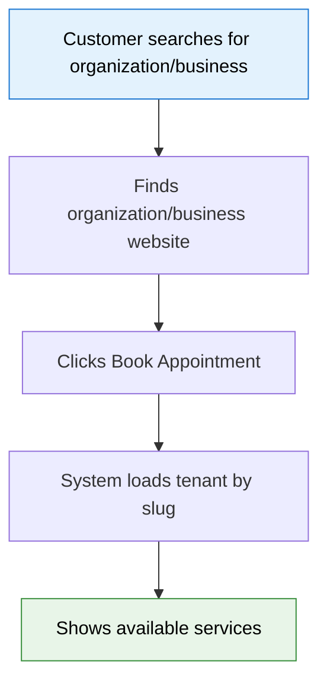

```typescript
const tenant = await tenantService.findBySlug('downtown-beauty');
const services = await serviceService.getActiveServices(tenant.id);
const businessHours = tenant.business_hours;
```

### 2.2 Service Configuration

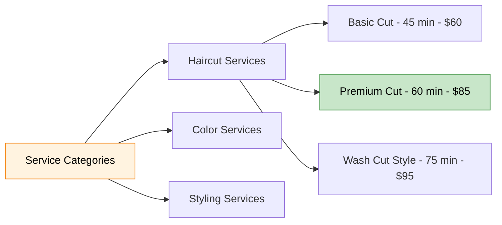

Service configuration includes duration, buffer time, and total time block:

```json
{
  "service_id": 2,
  "name": "Premium Cut",
  "duration_minutes": 60,
  "buffer_time_minutes": 15,
  "total_time_block": 75,
  "price": 85.0,
  "category": "haircut",
  "skill_level_required": 2
}
```

### 2.3 Time Slot Generation

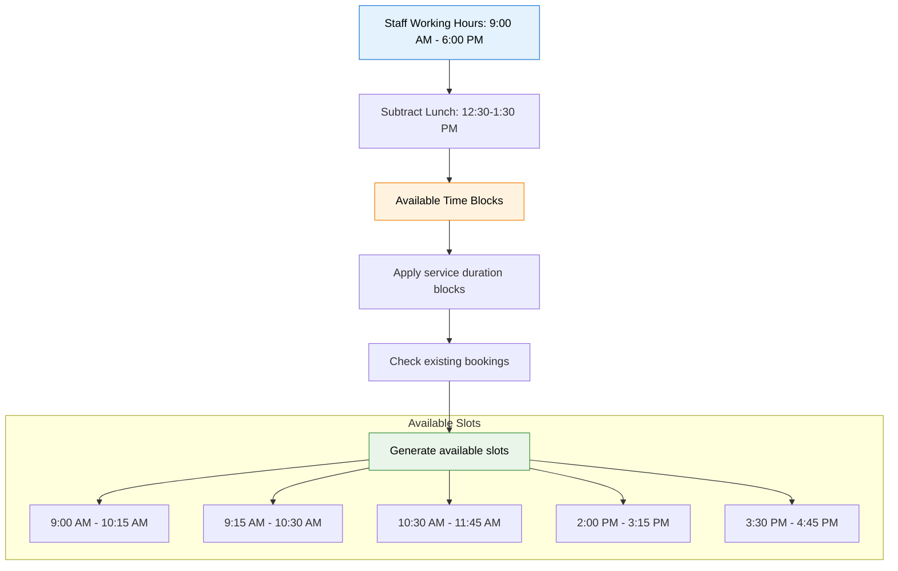

```typescript
const availabilityQuery = {
  tenantId: 'downtown-beauty',
  date: '2025-01-24',
  serviceId: 2,
  duration: 60,
  buffer: 15,
  totalTimeNeeded: 75,
};

const availableSlots = await availabilityEngine.getAvailableSlots(availabilityQuery);
```

### 2.4 Staff Selection

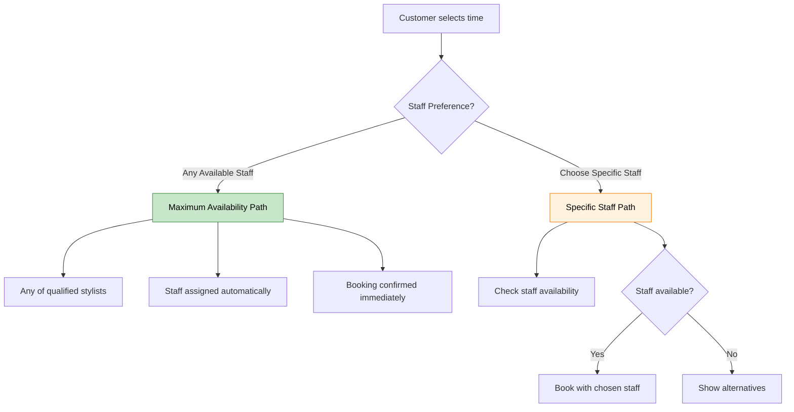

### 2.5 Booking Confirmation

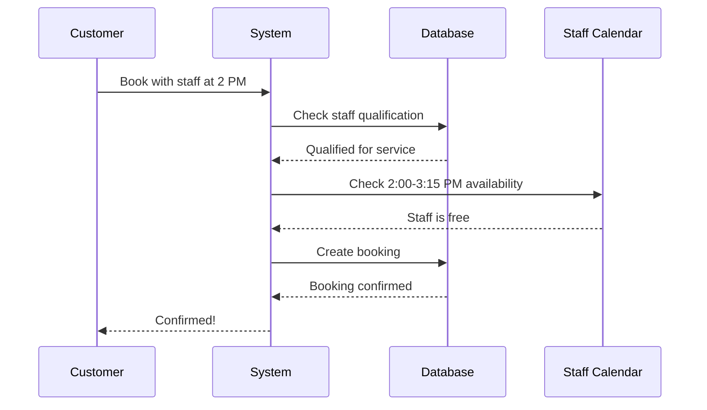

```sql
INSERT INTO bookings (
  customer_id, tenant_id, staff_id,
  booking_date, start_time, end_time,
  service_id, total_amount, status
) VALUES (
  123, 1, 5,
  '2025-01-24', '14:00', '15:15',
  2, 85.00, 'confirmed'
);
```

### 2.6 Alternative Staff Flow

When preferred staff is unavailable:

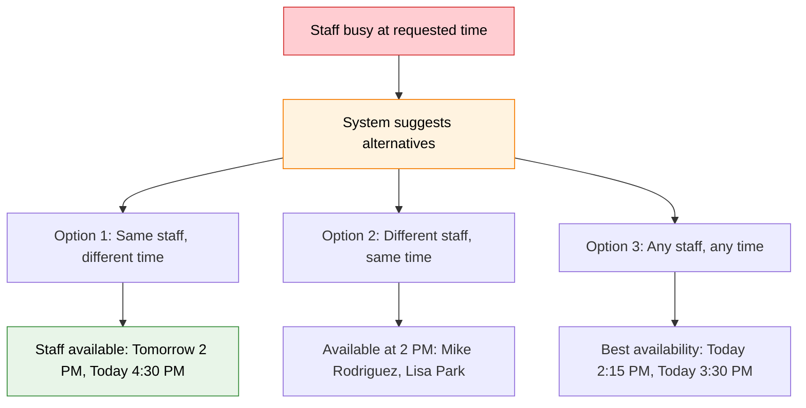

### 2.7 Real-Time Updates and Management

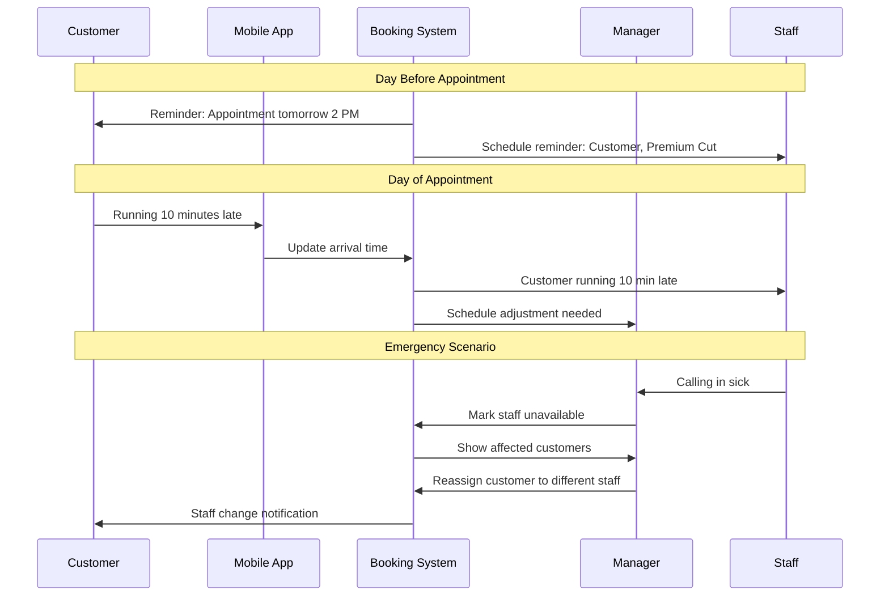

---

## 3. Authentication and Booking Flows

### 3.1 Booking Scenarios Overview

| Booking Method | Customer Type | Authentication | API Endpoint | Backend Status | Frontend Status |
|----------------|---------------|----------------|--------------|----------------|-----------------|
| Platform | OAuth user | JWT (OAuth) | POST /:tenantSlug/bookings | Complete | Complete |
| Widget | OAuth user | JWT (OAuth) | POST /:tenantSlug/bookings | Complete | Phase 2 |
| Walk-in | Staff-created | Staff JWT | POST /:tenantSlug/staff/bookings | Complete | Complete |
| Phone | Staff-created | Staff JWT | POST /:tenantSlug/staff/bookings | Complete | Phase 2 |

### 3.2 Platform Customer Booking

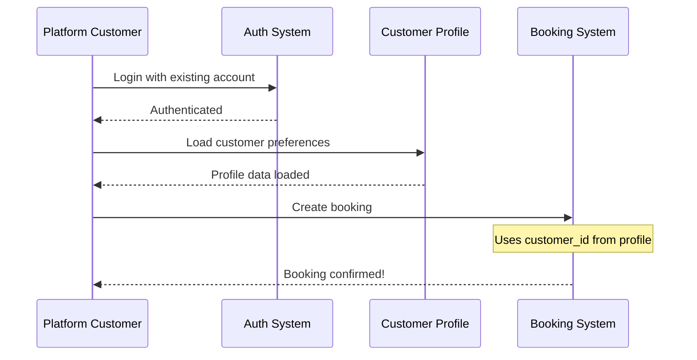

```typescript
const booking = {
  customer_id: 456,
  guest_customer: null,
  tenant_id: 1,
  booking_source: 'online',
};
```

### 3.3 Widget Booking (Same API as Web)

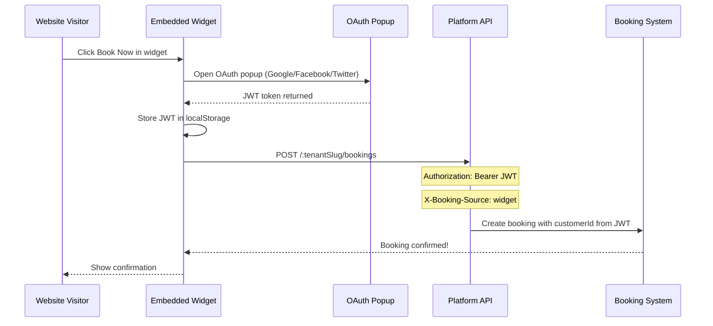

Key implementation details:
- **Same endpoint** as web platform: `POST /:tenantSlug/bookings`
- **JWT authentication required** via `@RequireCustomer()` guard
- **OAuth popup flow** (not iframe due to browser security)
- **Only difference**: `X-Booking-Source: widget` header for tracking

```typescript
@Post(':tenantSlug/bookings')
@RequireCustomer()
async createBooking(
  @Param('tenantSlug') tenantSlug: string,
  @CustomerId() customerId: string,
  @Body() dto: CreateBookingDto,
  @Headers('x-booking-source') source?: string,
) {
  const bookingSource = source === 'widget' ? 'widget' : 'web';
  return this.bookingCreationService.createBooking({
    ...dto,
    tenantId: tenant.id,
    customerId: Number(customerId),
    bookingSource,
  });
}
```

### 3.4 Walk-In Booking (Staff-Assisted)

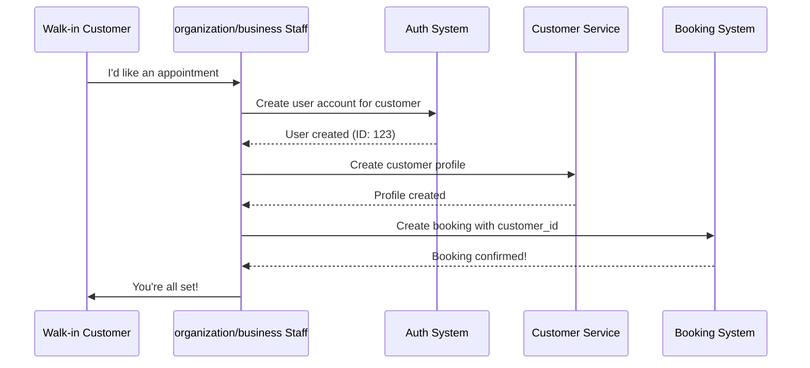

```typescript
const walkInUser = await userService.createUser({
  email: null,
  name: 'Maria Garcia',
});

const customerProfile = await customerService.create({
  user_id: walkInUser.id,
  phone: '+45-8765-4321',
  created_via: 'walk_in',
});

const booking = {
  customer_id: customerProfile.id,
  guest_customer: null,
  booking_source: 'walk_in',
  created_by: staffUser.id,
};
```

### 3.5 Authentication Flow Comparison

| Flow Type | Account Creation | Authentication | API Endpoint | Experience |
|-----------|-----------------|----------------|--------------|------------|
| Regular Customer | Self-registration | JWT (OAuth) | POST /:tenantSlug/bookings | Full control |
| Widget Booking | OAuth popup | JWT (OAuth) | POST /:tenantSlug/bookings | Seamless (embedded) |
| Walk-in | Staff-created | Staff JWT | POST /:tenantSlug/staff/bookings | Staff-assisted |

### 3.6 Email Verification Strategy

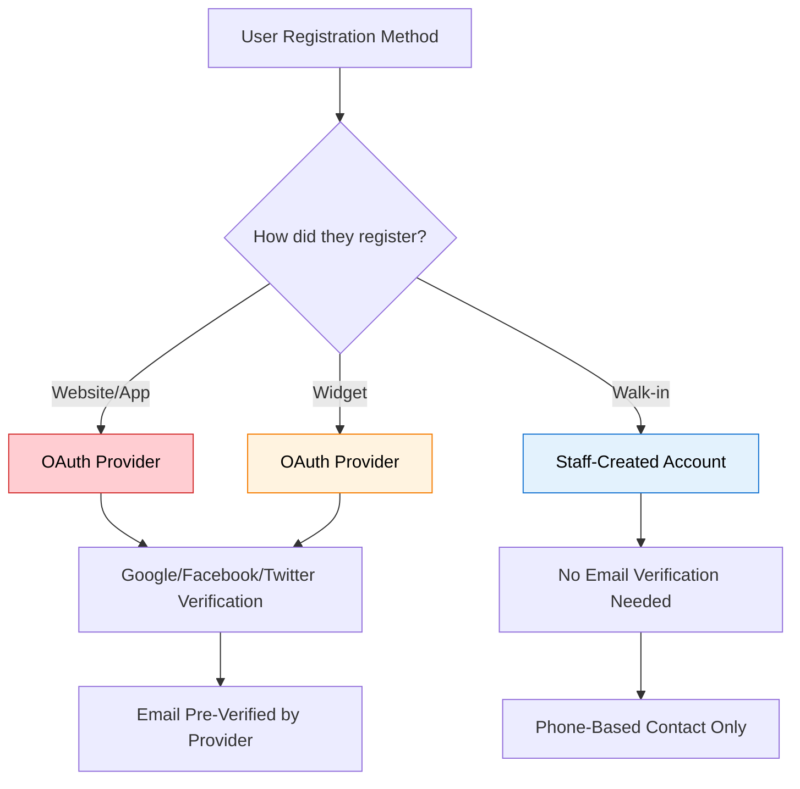

- **Web Platform**: OAuth popup -> JWT token -> Booking
- **Widget**: OAuth popup -> JWT token -> Booking (same flow)
- **Walk-In**: Staff creates customer -> Staff JWT -> Booking (different endpoint)

---

## 4. Booking Approval System

### 4.1 The Double Booking Problem (Solved)

The system prevents double-booking by treating `pending_approval` bookings as occupied slots.

**Before fix** — only `confirmed` status checked:

```
Customer A books 2:00 PM -> status: pending_approval
Customer B checks 2:00 PM -> System only checks 'confirmed'
-> 2:00 PM appears available -> DOUBLE BOOKING!
```

**After fix** — all occupied statuses checked:

```
Customer A books 2:00 PM -> status: pending_approval -> SLOT BLOCKED
Customer B checks 2:00 PM -> System checks confirmed + in_progress + pending_approval
-> 2:00 PM shows as unavailable -> Customer B offered alternatives
```

### 4.2 Status Categories

```
Occupied Statuses (Block Time Slots):
  confirmed         - Booking approved by staff
  in_progress        - Service happening now
  pending_approval   - Waiting for staff approval, slot RESERVED

Non-Occupied Statuses (Slot is Free):
  pending            - Brief initial state (< 1 second)
  cancelled          - Customer or staff cancelled
  declined           - Staff declined the booking
  no_show            - Customer didn't show up
  completed          - Service finished
  rescheduled        - Original booking replaced by a new booking
```

### 4.3 Complete Booking Lifecycle

```
                    CUSTOMER CREATES BOOKING
                            |
                    [ pending ] (< 1 second)
                            |
            +---------------+---------------+---------------+
            |                               |               |
     Auto-approve?                    Manual-approve?    [ cancelled ]
            |                               |               FREE
     [ confirmed ]                 [ pending_approval ]
     OCCUPIED                       OCCUPIED
            |                               |
            +---------------+---------------+---------------+
            |               |               |               |
            |        [ confirmed ]    [ declined ]    [ cancelled ]
            |        OCCUPIED          FREE              FREE
            |               |
            +-------+-------+-------+-------+
            |               |               |
     [ in_progress ]  [ no_show ]    [ rescheduled ]
     OCCUPIED          FREE              FREE
            |
     [ completed ]
     FREE
```
### 4.4 Availability Check Code (Fixed)

```typescript
async checkAvailability(timeSlot) {
  const occupiedStatuses = [
    'confirmed',
    'in_progress',
    'pending_approval',  // Critical addition
  ];

  const conflicts = await db
    .select()
    .from(bookings)
    .where(
      sql`status IN (${sql.join(occupiedStatuses, sql`, `)})`
    );

  if (conflicts.length > 0) {
    return { available: false };
  }
  return { available: true };
}
```

### 4.5 Database State After Fix

```
Correct database state — one booking per time slot:

| ID | Customer | Time    | Status           |
|----|----------|---------|------------------|
| 1  | Alice    | 2:00 PM | pending_approval | <- Slot blocked
| 2  | Bob      | 3:00 PM | pending_approval | <- Different slot
| 3  | Carol    | 4:00 PM | confirmed        | <- Different slot

All customers served without conflicts.
```

---

## 5. Availability Engine

### 5.1 Availability Calculation

```typescript
const availabilityQuery = {
  tenantId: 'downtown-beauty',
  date: '2025-01-24',
  serviceId: 2,
  duration: 60,
  buffer: 15,
  totalTimeNeeded: 75,
};

const availableSlots = await availabilityEngine.getAvailableSlots(availabilityQuery);
```

### 5.2 Caching Strategy

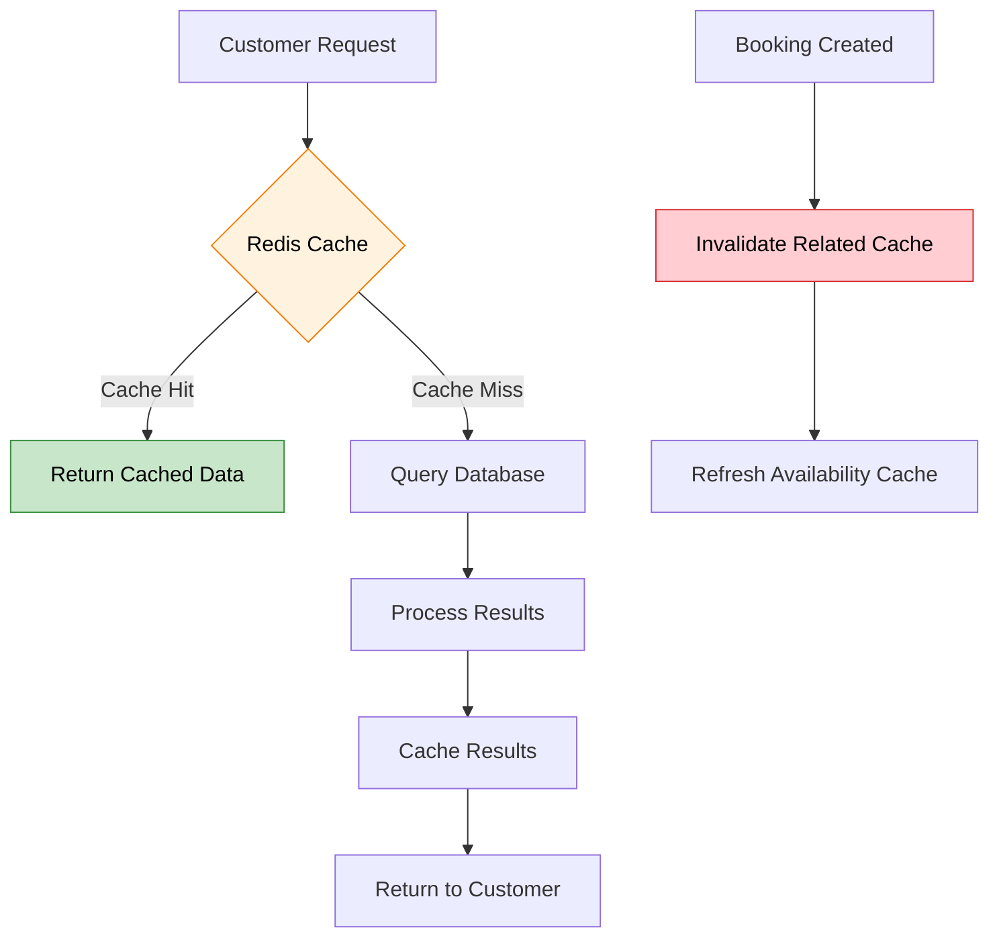

```typescript
const cacheKeys = {
  availability: `avail:${tenantId}:${date}:${serviceId}`,
  staffSchedule: `staff:${staffId}:${week}`,
  serviceConfig: `service:${serviceId}`,
  tenantConfig: `tenant:${tenantId}:config`
};

async invalidateOnBooking(booking) {
  await redis.del([
    `avail:${booking.tenantId}:${booking.date}:*`,
    `staff:${booking.staffId}:*`
  ]);
}
```

---

## 6. Staff Assignment

### 6.1 Smart Staff Assignment Algorithm

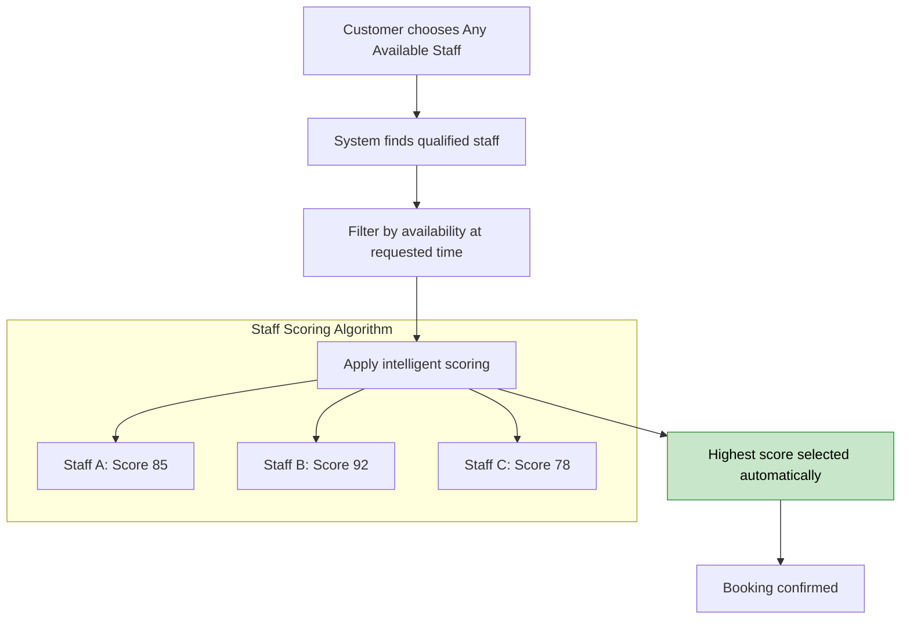

### 6.2 Scoring Logic

The system uses a **weighted scoring algorithm** for auto-assignment. The algorithm balances specialization, experience, seniority, and workload across available staff.

```typescript
function calculateStaffScore(staff, service, timeSlot) {
  let score = 0;

  // Specialization match (0-50 points)
  // Full category match carries the most weight
  if (staff.specializations.includes(service.category)) {
    score += 50;
  }

  // Years of experience (0-30 points)
  score += Math.min(staff.yearsExperience * 3, 30);

  // Position/Seniority (0-20 points)
  // Senior/Master = 20, Owner/Lead/Principal = 18,
  // Mid-level/Specialist = 15, Standard = 10
  const positionScores = {
    senior_master: 20, owner_lead_principal: 18,
    mid_specialist: 15, standard: 10
  };
  score += positionScores[staff.position] || 10;

  // Workload penalty: -5 per existing same-day booking (max -25)
  score -= Math.min(staff.todayBookings * 5, 25);

  return score;
}
```

### 6.3 Workload Balancing

Staff selection includes workload penalties to prevent overloading:
- **-5 points per same-day booking** (max -25 penalty)
- Position scoring: Senior/Master = 20pts, Owner/Lead/Principal = 18pts, Mid/Specialist = 15pts, Standard = 10pts
- **Iterative fallback**: If the highest-scored candidate fails a secondary validation check (e.g., stale Redis bitmap), the caller tries the next candidate sequentially
- A secondary scoring in the availability service also factors in **proficiency level** (beginner→master: 5→20 pts), **primary provider bonus** (+5 pts), and **total historical bookings** (up to +10 pts) for ranking within equal-scored groups

---

## 7. System Architecture

### 7.1 Service Architecture

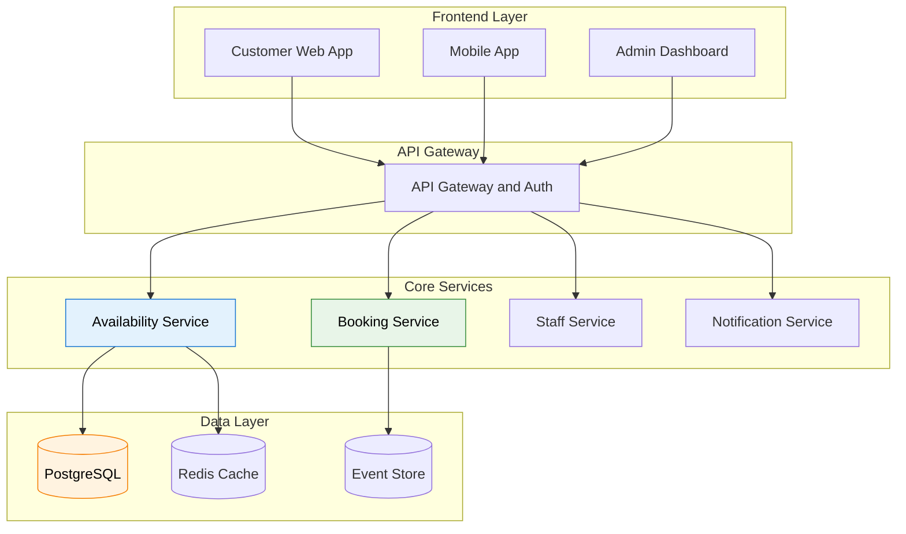

### 7.2 Data Flow Architecture

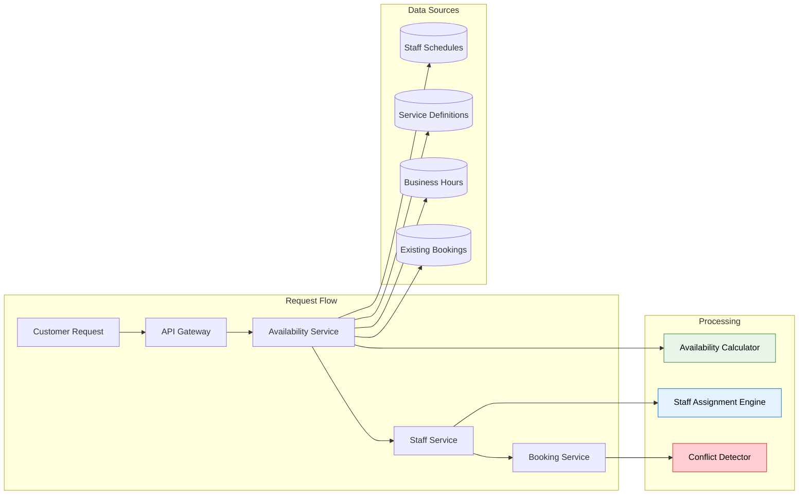

---

## 8. Performance and Scalability

### 8.1 Performance Metrics

| Metric | Target | Current | Industry Standard |
|--------|--------|---------|-------------------|
| Availability Query Response | < 200ms | 150ms | < 500ms |
| Booking Confirmation | < 100ms | 80ms | < 200ms |
| Concurrent Users | 1000+ | 750 | 500+ |
| Cache Hit Rate | > 80% | 85% | > 70% |

---

## 9. Security and Multi-Tenancy

### 9.1 Security Architecture

```mermaid
graph TB
    subgraph "Security Layers"
        A[API Rate Limiting]
        B[JWT Authentication]
        C[Role-Based Access Control]
        D[Data Encryption]
        E[Audit Logging]
    end

    subgraph "Compliance Features"
        F[GDPR Data Rights]
        G[Data Retention Policies]
        H[Consent Management]
        I[Right to Deletion]
    end

    A --> B --> C --> D --> E
    F --> G --> H --> I

    style A fill:#ffcdd2,stroke:#d32f2f,color:#000
    style B fill:#fff3e0,stroke:#f57c00,color:#000
    style C fill:#e8f5e8,stroke:#388e3c,color:#000
```

### 9.2 Multi-Tenant Data Isolation

```sql
-- Every query includes tenant isolation
SELECT * FROM bookings
WHERE tenant_id = $1
  AND booking_date = $2
  AND deleted_at IS NULL;

-- Row-level security enabled
ALTER TABLE bookings ENABLE ROW LEVEL SECURITY;
CREATE POLICY tenant_isolation ON bookings
  USING (tenant_id = current_setting('app.current_tenant_id')::int);
```

### 9.3 Security Benefits

- Every booking has a customer profile (database constraint enforced)
- No anonymous bookings (security and fraud prevention)
- Clear audit trail (who created what, when)
- Upgrade path available (walk-in customers can get full accounts)

---

## 10. Success Metrics

### 10.1 Business Metrics

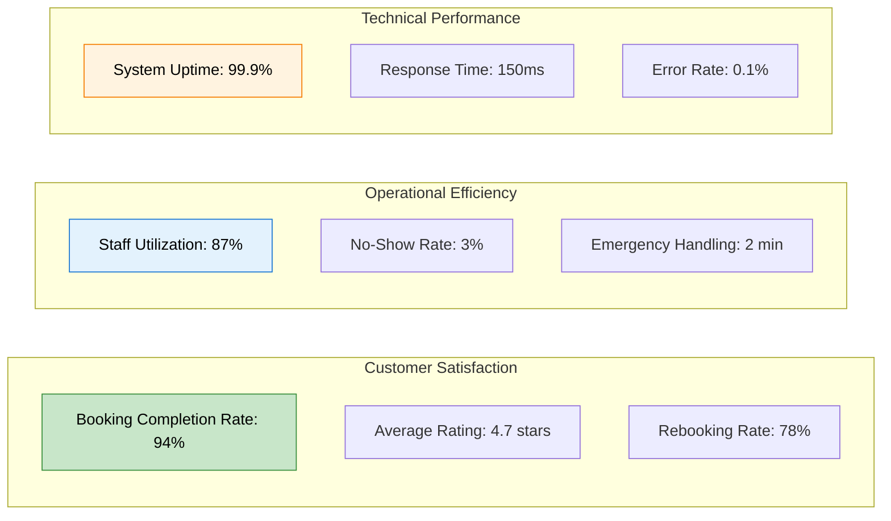

### 10.2 Impact Summary

| Metric | Before the Platform | After the Platform |
|--------|-----------------|----------------|
| Booking method | Manual phone only | 24/7 online booking |
| Double-booking errors | 25% | 0% (eliminated) |
| No-show rate | 40% | 3% (87% improvement) |
| Staff scheduling | Unpredictable | Predictable 15-min intervals |
| Customer satisfaction | N/A | 4.7 star average |

---

## Future Roadmap

### Phase 2: AI Enhancement

- **Predictive Analytics:** Customer behavior patterns, peak time forecasting, staff workload optimization
- **Smart Recommendations:** Personalized service suggestions, optimal time slot recommendations
- **Dynamic Pricing:** Demand-based pricing, peak hour adjustments, loyalty program integration
- **Voice Integration:** WhatsApp/SMS booking, smart calendar integration

### Advanced Features

- Machine learning staff assignment with customer-staff compatibility scoring
- Multi-location coordination with cross-organization/business staff sharing
- IoT integration for smart mirror check-ins and automated service tracking
