# Portfolio Note

> Extracted from production system, sanitized for portfolio use.

---

# Booking Lifecycle Features

**Status:** Production-ready (Rebook/Walk-in) | In Development (Reschedule)
**Last Updated:** February 2026

This document covers the lifecycle features that extend the core booking system: rebooking, rescheduling, and walk-in customer management (authentication, identity lifecycle, and audit).

---

## Table of Contents

1. [Rebook Feature](#1-rebook-feature)
2. [Reschedule Feature](#2-reschedule-feature)
3. [Walk-In Customer Management](#3-walk-in-customer-management)
4. [Walk-In Authentication Flows](#4-walk-in-authentication-flows)
5. [Walk-In Identity Lifecycle Audit](#5-walk-in-identity-lifecycle-audit)

---

## 1. Rebook Feature

### 1.1 Overview

Rebooking creates a **new booking** using data from a previously completed, cancelled, or no-show booking. It is not a modification — it is a fresh booking that inherits customer and service data from a source booking.

| Attribute | Transfer Behavior |
|-----------|-------------------|
| customer_id | Always transferred |
| services | Pre-filled (editable) |
| staff_id | Pre-filled (editable) |
| date/time | Never copied — must be chosen fresh |
| price | Recalculated from current pricing |
| booking_source | Set to `rebook` |

### 1.2 Feature Scope

**Phase 1 (In Scope):**
- Staff initiates rebook from completed/cancelled booking
- Pre-filled customer and services
- Fresh date/time selection with availability check
- Audit trail linking source and new booking

**Phase 2+ (Out of Scope):**
- Customer self-service rebook
- Automatic rebook suggestion to customers
- Recurring/subscription booking
- Batch rebook for multiple customers

### 1.3 Data Flow

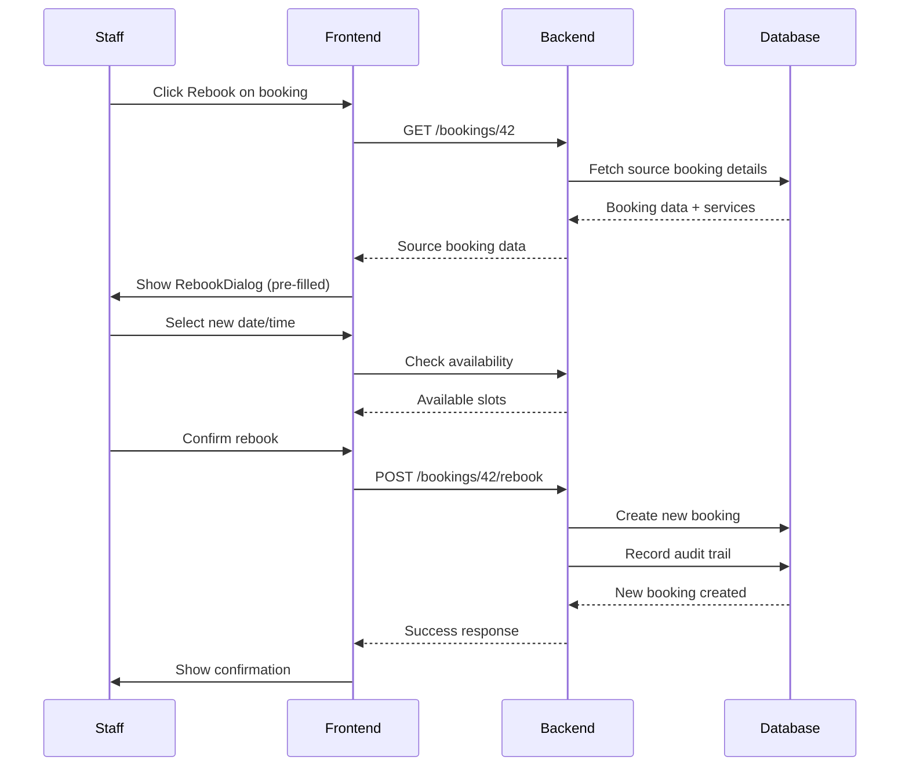
```mermaid
sequenceDiagram
    participant S as Staff
    participant UI as Frontend
    participant API as Backend
    participant DB as Database

    S->>UI: Click Rebook on booking #42
    UI->>API: GET /bookings/42
    API->>DB: Fetch source booking details
    DB-->>API: Booking data + services
    API-->>UI: Source booking data
    UI->>S: Show RebookDialog (pre-filled)
    S->>UI: Select new date/time
    UI->>API: Check availability
    API-->>UI: Available slots
    S->>UI: Confirm rebook
    UI->>API: POST /bookings/42/rebook
    API->>DB: Create new booking
    API->>DB: Record audit trail
    DB-->>API: New booking created
    API-->>UI: Success response
    UI->>S: Show confirmation
```

### 1.4 API Design

```
POST /api/tenants/:tenantSlug/bookings/:bookingId/rebook
```

**Request DTO:**

```typescript
interface RebookBookingDto {
  date: string;                    // ISO date
  startTime: string;               // HH:mm
  staffId?: number;                // Override staff (optional)
  serviceIds?: number[];           // Override services (optional)
  notes?: string;
}
```

**Response:**

```typescript
interface RebookResponse {
  booking: BookingDetail;
  rebookedFrom: {
    bookingId: number;
    originalDate: string;
    originalStatus: string;
  };
}
```

### 1.5 Service Layer

```typescript
async rebookBooking(bookingId: number, dto: RebookBookingDto, staffUser: StaffUser) {
  // 1. Fetch source booking with services
  const sourceBooking = await this.bookingRepository.findWithServices(bookingId);
  if (!sourceBooking) throw new NotFoundException('Source booking not found');

  // 2. Validate source booking belongs to tenant
  this.validateTenantAccess(sourceBooking, staffUser.tenantId);

  // 3. Build new booking DTO from source + overrides
  const createDto = {
    customerId: sourceBooking.customerId,
    staffId: dto.staffId ?? sourceBooking.staffId,
    serviceIds: dto.serviceIds ?? sourceBooking.services.map(s => s.serviceId),
    date: dto.date,
    startTime: dto.startTime,
    notes: dto.notes,
    bookingSource: 'rebook',
  };

  // 4. Delegate to existing createStaffBooking
  const newBooking = await this.bookingCreationService.createStaffBooking(createDto);

  // 5. Record audit trail
  await this.bookingHistoryService.recordRebook(sourceBooking.id, newBooking.id);

  return { booking: newBooking, rebookedFrom: sourceBooking };
}
```

### 1.6 Validation Rules

| Rule | Validation | Error |
|------|-----------|-------|
| Source exists | Booking must be found | 404 Not Found |
| Tenant match | Source tenant = Staff tenant | 403 Forbidden |
| Services active | All services must be currently active | 422 Inactive service |
| Staff qualified | Staff qualified for all services | 422 Unqualified staff |
| Time available | No conflicts at selected time | 409 Conflict |
| Customer active | Customer profile not archived | 422 Archived customer |

### 1.7 Database Design

No new tables required. Booking lineage tracked via `booking_history`:

```typescript
// Option A: booking_history for lineage
await db.insert(bookingHistory).values({
  bookingId: newBooking.id,
  action: 'rebook',
  previousBookingId: sourceBooking.id,
  changedBy: staffUser.id,
  metadata: { sourceBookingId: sourceBooking.id },
});
```

Rebook is available for ALL booking statuses (completed, cancelled, no_show, declined, etc.).

### 1.8 Frontend Component

```typescript
interface RebookBookingDialogProps {
  sourceBooking: BookingDetail;
  isOpen: boolean;
  onClose: () => void;
  onSuccess: (newBooking: BookingDetail) => void;
}
```

Component behavior:
1. Open dialog with pre-filled customer and services
2. Date/time picker shows only available slots
3. Staff selector defaults to original staff (changeable)
4. Service list pre-selected (editable — can add/remove)
5. Price recalculated in real-time based on current pricing
6. Submit creates new booking via rebook endpoint

Reused components: `DatePicker`, `TimeSlotSelector`, `StaffSelector`, `ServiceChecklist`, `BookingConfirmation`.

### 1.9 Edge Cases

| ID | Scenario | Handling |
|----|----------|----------|
| E1 | Source service deactivated | Show error, allow changing to different service |
| E2 | Source staff terminated | Default to "any available" |
| E3 | Source customer archived | Block rebook, show archived notice |
| E4 | Multi-staff source booking | Support partial rebook (subset of staff) |
| E5 | Price changed since original | Calculate with current prices, show difference |
| E6 | Tenant requires approval | New booking goes to pending_approval |
| E7 | Customer has outstanding debt | Warn but allow rebook |

### 1.10 Architectural Decisions

| Decision | Choice | Rationale |
|----------|--------|-----------|
| Rebook = new booking | Create new, not modify | Preserves history, simpler logic |
| No status restriction | Rebook from any status | Maximum staff flexibility |
| Reuse createStaffBooking | Delegate to existing | DRY principle, consistent validation |
| History table for lineage | booking_history metadata | No schema changes needed |
| Pre-fill not pre-commit | Customer/services editable | Flexibility over automation |

---

## 2. Reschedule Feature

### 2.1 Overview

Rescheduling changes the **date/time of an existing booking** without creating a new one. The booking ID persists, customer and services remain unchanged, and a reschedule fee may apply.

**Current Implementation State:**
- ~70% backend built
- Database schema: no changes required
- Remaining: admin endpoint, fee calculation, frontend dialog

### 2.2 Database Schema (Existing)

```sql
-- bookings table (no changes needed)
bookings: {
  id, customer_id, tenant_id, staff_id,
  booking_date, start_time, end_time,
  status, total_amount,
  special_requests  -- JSONB: stores reschedule_count
}

-- booking_services (no changes)
booking_services: { booking_id, service_id, staff_id, price, duration }

-- booking_history (existing, used for tracking changes)
booking_history: { booking_id, action, changed_by, previous_values, new_values }

-- Unique constraint prevents double booking
UNIQUE(tenant_id, staff_id, booking_date, start_time, deleted_at)
```

### 2.3 API Design

**Customer endpoint (existing):**

```
PATCH /api/tenants/:tenantSlug/bookings/:bookingId/reschedule
```

**Admin endpoint (new):**

```
PATCH /api/tenants/:tenantSlug/bookings/:bookingId/reschedule-admin
```

```typescript
interface AdminRescheduleDto {
  date: string;              // New date
  startTime: string;         // New start time
  staffId?: number;          // Optional staff change
  reason?: string;           // Admin reason
  waiveFee?: boolean;        // Admin can waive fee
}

interface RescheduleResponseDto {
  booking: BookingDetail;
  rescheduleFee: number;
  rescheduleCount: number;
  maxReschedules: number;
}
```

### 2.4 Business Rules

| Rule | Detail |
|------|--------|
| Status gate | Only `pending` or `confirmed` bookings can be rescheduled |
| Max reschedules | 3 reschedules per booking |
| Fee structure | >48h before: free; 24-48h: 10% of total; <24h: 20% of total |
| Admin waiver | Admin can waive reschedule fee |
| Status preservation | Status stays `confirmed` after reschedule |
| History tracking | `reschedule_count` stored in `special_requests` JSONB |

### 2.5 Data Flow

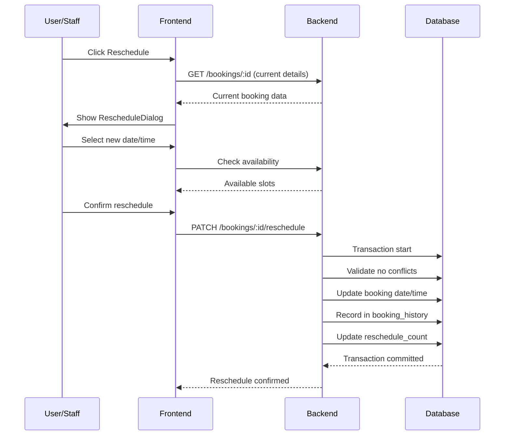
```mermaid
sequenceDiagram
    participant U as User/Staff
    participant UI as Frontend
    participant API as Backend
    participant DB as Database

    U->>UI: Click Reschedule
    UI->>API: GET /bookings/:id (current details)
    API-->>UI: Current booking data
    UI->>U: Show RescheduleDialog
    U->>UI: Select new date/time
    UI->>API: Check availability
    API-->>UI: Available slots
    U->>UI: Confirm reschedule
    UI->>API: PATCH /bookings/:id/reschedule
    API->>DB: Transaction start
    API->>DB: Validate no conflicts
    API->>DB: Update booking date/time
    API->>DB: Record in booking_history
    API->>DB: Update reschedule_count
    DB-->>API: Transaction committed
    API-->>UI: Reschedule confirmed
```

### 2.6 Edge Cases

| ID | Scenario | Handling |
|----|----------|----------|
| E1 | Overlapping booking at new time | Return 409 with conflict details |
| E2 | Staff unavailable at new time | Show alternative staff options |
| E3 | Race condition (concurrent reschedule) | Use DB unique constraint + transaction |
| E4 | Same date/time selected | No-op, return current booking |
| E5 | Multi-service chain | Recalculate all service times from new start |
| E6 | Outstanding payment/deposit | Handle refund/transfer of deposit |
| E7 | Reschedule limit reached | Block with clear error message |

### 2.7 Frontend Component

```typescript
interface RescheduleBookingDialogProps {
  booking: BookingDetail;
  isOpen: boolean;
  onClose: () => void;
  onSuccess: (updatedBooking: BookingDetail) => void;
}
```

Dialog includes: date/time picker, availability status indicator, reschedule fee display, and reschedule count (`"Reschedule 2 of 3"`).

### 2.8 Architectural Decisions

| Decision | Choice | Rationale |
|----------|--------|-----------|
| Same booking ID | Modify in-place | Preserves booking continuity |
| JSONB for count | special_requests field | No schema migration needed |
| Fee tiers | Time-based tiers | Industry standard, customer-friendly |
| Max reschedule limit | 3 per booking | Prevents abuse while allowing flexibility |
| Admin override | waiveFee flag | Operational flexibility |
| Transaction isolation | SERIALIZABLE | Prevents race conditions |

---

## 3. Walk-In Customer Management

### 3.1 Architecture Overview

Walk-in booking follows a 3-step frontend flow with a conflict resolution dialog:

```
Frontend Steps:
  Step 1: Customer Info (name, phone, email optional)
  Step 2: Service Selection (from tenant's active services)
  Step 3: Staff + Time Selection (availability-based)
  Conflict Dialog: Shows alternatives if 409 returned

Backend Flow:
  POST /staff-bookings
    -> Parse & validate DTO
    -> Find or create customer (walk-in user)
    -> Check staff availability
    -> Calculate conflict alternatives (if conflict)
    -> Create booking
    -> Return booking or 409 with alternatives
```

### 3.2 Bug Fixes (Architecture Impact)

**Bug Fix 1: Conflict Alternatives Dialog**

When staff is busy at requested time, the system returns a 409 response with three types of alternatives:

```typescript
// 409 Response (conflict detected)
{
  statusCode: 409,
  data: {
    alternatives: {
      sameStaffDifferentTime: TimeSlot[],       // Same staff, next available times
      differentStaffSameTime: StaffAlternative[], // Other staff at same time
      anyStaffAnyTime: TimeSlot[],               // Best available overall
    }
  }
}
```

**Bug Fix 2: Staff Auto-Assignment Scoring Bias**

Original algorithm over-weighted position score, causing lead/senior staff to get all bookings. Fixed with balanced scoring:

```typescript
function calculateStaffScore(staff) {
  return (
    positionScore(staff.position)  // 18-20 pts (narrowed range)
    + workloadPenalty(staff)       // -5 per same-day booking
    + experienceBonus(staff)       // 0-10 pts
  );
}
```

Added iterative fallback: if highest-scored staff fails availability validation, try next candidate.

**Bug Fix 3: Duration Mismatch**

Service duration in booking was calculated without `buffer_time_minutes`, causing incorrect end times. Fix includes buffer in total duration calculation.

### 3.3 E2E Test Results

All 7 test scenarios passing:

| Test | Description | Status |
|------|-------------|--------|
| 1 | Creates walk-in booking for new customer | Pass |
| 2 | Creates booking for existing customer via phone lookup | Pass |
| 3 | Handles staff conflict with alternatives dialog | Pass |
| 4 | Shows conflict alternatives for busy time slots | Pass |
| 5 | Supports service selection with duration display | Pass |
| 6 | Handles multiple service bookings | Pass |
| 7 | Shows appropriate error for invalid phone numbers | Pass |

---

## 4. Walk-In Authentication Flows

### 4.1 Authentication Types Overview

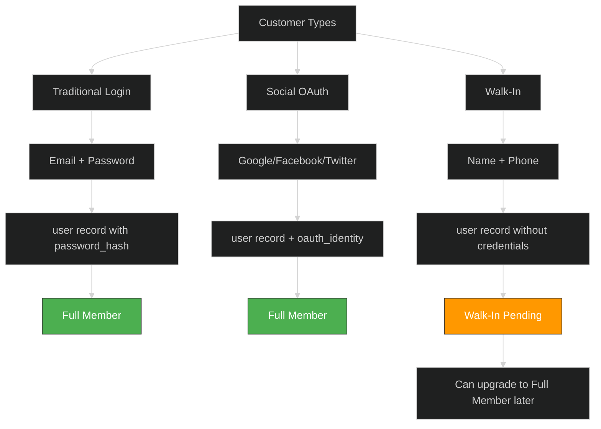
```mermaid
%%{init: {'theme': 'dark'}}%%
graph TD
    A[Customer Types] --> B[Traditional Login]
    A --> C[Social OAuth]
    A --> D[Walk-In]

    B --> B1[Email + Password]
    B1 --> B2[user record with password_hash]
    B2 --> B3[Full Member]

    C --> C1[Google/Facebook/Twitter]
    C1 --> C2[user record + oauth_identity]
    C2 --> C3[Full Member]

    D --> D1[Name + Phone]
    D1 --> D2[user record without credentials]
    D2 --> D3[Walk-In Pending]
    D3 --> D4[Can upgrade to Full Member later]

    style B3 fill:#4CAF50,stroke:#333,color:#fff
    style C3 fill:#4CAF50,stroke:#333,color:#fff
    style D3 fill:#FF9800,stroke:#333,color:#fff
```

### 4.2 Full Member Detection (isFullMember)

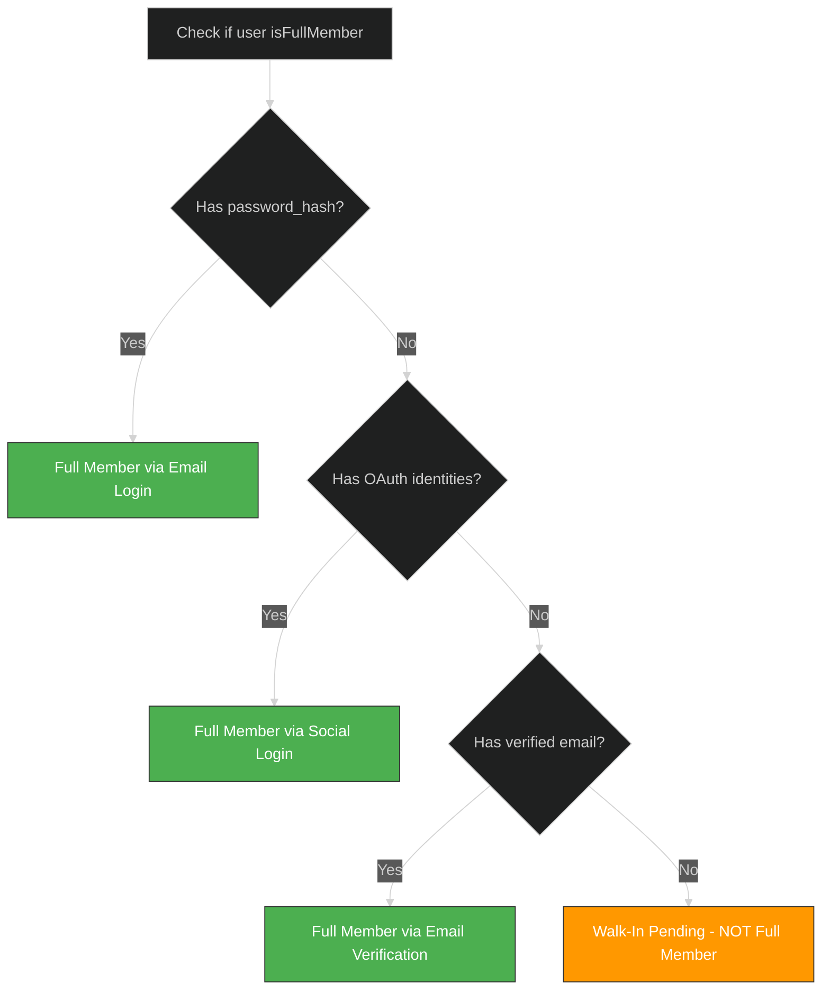
```mermaid
%%{init: {'theme': 'dark'}}%%
flowchart TD
    A[Check if user isFullMember] --> B{Has password_hash?}

    B -->|Yes| C[Full Member via Email Login]
    B -->|No| D{Has OAuth identities?}

    D -->|Yes| E[Full Member via Social Login]
    D -->|No| F{Has verified email?}

    F -->|Yes| G[Full Member via Email Verification]
    F -->|No| H[Walk-In Pending - NOT Full Member]

    style C fill:#4CAF50,stroke:#333,color:#fff
    style E fill:#4CAF50,stroke:#333,color:#fff
    style G fill:#4CAF50,stroke:#333,color:#fff
    style H fill:#FF9800,stroke:#333,color:#fff
```

### 4.3 Walk-In Creation Flow

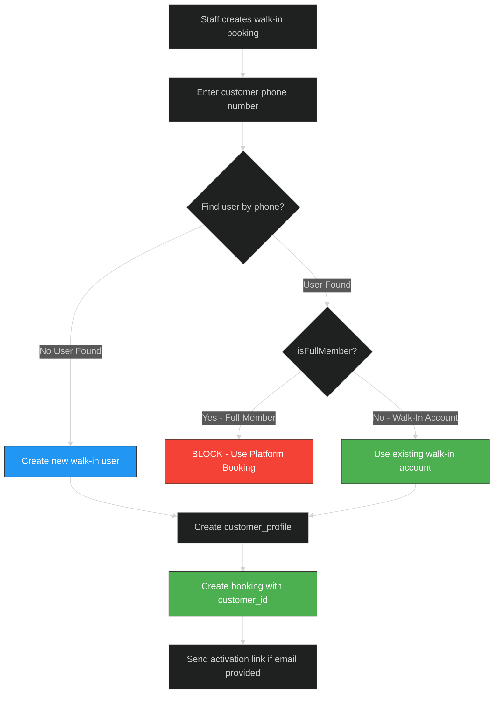
```mermaid
%%{init: {'theme': 'dark'}}%%
flowchart TD
    A[Staff creates walk-in booking] --> B[Enter customer phone number]
    B --> C{Find user by phone?}

    C -->|User Found| D{isFullMember?}
    C -->|No User Found| G[Create new walk-in user]

    D -->|Yes - Full Member| E[BLOCK - Use Platform Booking]
    D -->|No - Walk-In Account| F[Use existing walk-in account]

    G --> H[Create customer_profile]
    F --> H

    H --> I[Create booking with customer_id]
    I --> J[Send activation link if email provided]

    style E fill:#f44336,stroke:#333,color:#fff
    style F fill:#4CAF50,stroke:#333,color:#fff
    style G fill:#2196F3,stroke:#333,color:#fff
    style I fill:#4CAF50,stroke:#333,color:#fff
```

### 4.4 Bug Fix: Full Member Detection

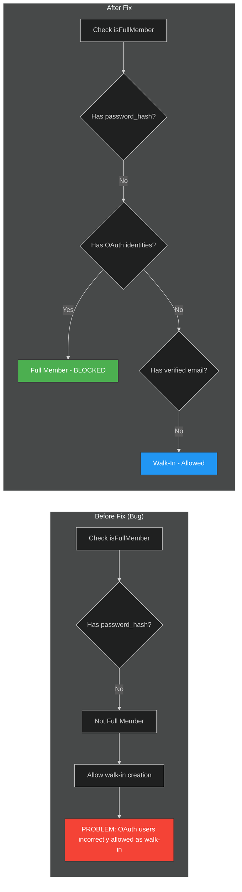
```mermaid
%%{init: {'theme': 'dark'}}%%
graph LR
    subgraph "Before Fix (Bug)"
        A1[Check isFullMember] --> B1{Has password_hash?}
        B1 -->|No| C1[Not Full Member]
        C1 --> D1[Allow walk-in creation]
        D1 --> E1[PROBLEM: OAuth users incorrectly allowed as walk-in]
    end

    subgraph "After Fix"
        A2[Check isFullMember] --> B2{Has password_hash?}
        B2 -->|No| C2{Has OAuth identities?}
        C2 -->|Yes| D2[Full Member - BLOCKED]
        C2 -->|No| E2{Has verified email?}
        E2 -->|No| F2[Walk-In - Allowed]
    end

    style E1 fill:#f44336,stroke:#333,color:#fff
    style D2 fill:#4CAF50,stroke:#333,color:#fff
    style F2 fill:#2196F3,stroke:#333,color:#fff
```

### 4.5 Auth Method Combinations


```mermaid
%%{init: {'theme': 'dark'}}%%
graph TD
    A[User Authentication States] --> B[Email Only]
    A --> C[OAuth Only]
    A --> D[Hybrid - Email + OAuth]
    A --> E[Walk-In Pending]

    B --> B1[Has: password_hash]
    B --> B2[Missing: oauth_identities]
    B --> B3[isFullMember: TRUE]
    B --> B4[Can add OAuth later]

    C --> C1[Has: oauth_identities]
    C --> C2[Missing: password_hash]
    C --> C3[isFullMember: TRUE]
    C --> C4[Can add password later]

    D --> D1[Has: password_hash + oauth_identities]
    D --> D2[isFullMember: TRUE]
    D --> D3[Most secure state]

    E --> E1[Has: nothing validated]
    E --> E2[isFullMember: FALSE]
    E --> E3[Created by: staff]
    E --> E4[Can upgrade via activation]

    style B3 fill:#4CAF50,stroke:#333,color:#fff
    style C3 fill:#4CAF50,stroke:#333,color:#fff
    style D2 fill:#4CAF50,stroke:#333,color:#fff
    style E2 fill:#FF9800,stroke:#333,color:#fff
```

### 4.6 Edge Case: OAuth Customer as Walk-In

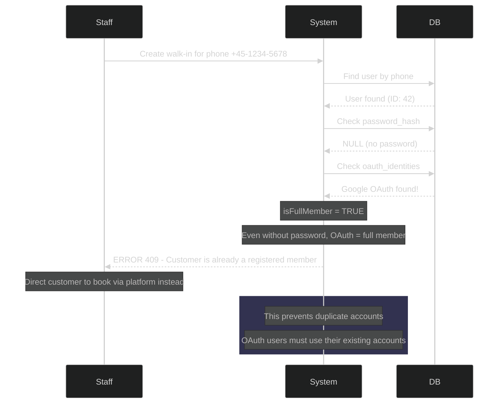
```mermaid
%%{init: {'theme': 'dark'}}%%
sequenceDiagram
    participant Staff
    participant System
    participant DB

    Staff->>System: Create walk-in for phone +45-1234-5678
    System->>DB: Find user by phone
    DB-->>System: User found (ID: 42)

    System->>DB: Check password_hash
    DB-->>System: NULL (no password)

    System->>DB: Check oauth_identities
    DB-->>System: Google OAuth found!

    Note over System: isFullMember = TRUE
    Note over System: Even without password, OAuth = full member

    System-->>Staff: ERROR 409 - Customer is already a registered member
    Note over Staff: Direct customer to book via platform instead

    rect rgb(50, 50, 80)
        Note over System: This prevents duplicate accounts
        Note over System: OAuth users must use their existing accounts
    end
```

### 4.7 Account Linking Flows

**Adding OAuth to existing email+password account:**

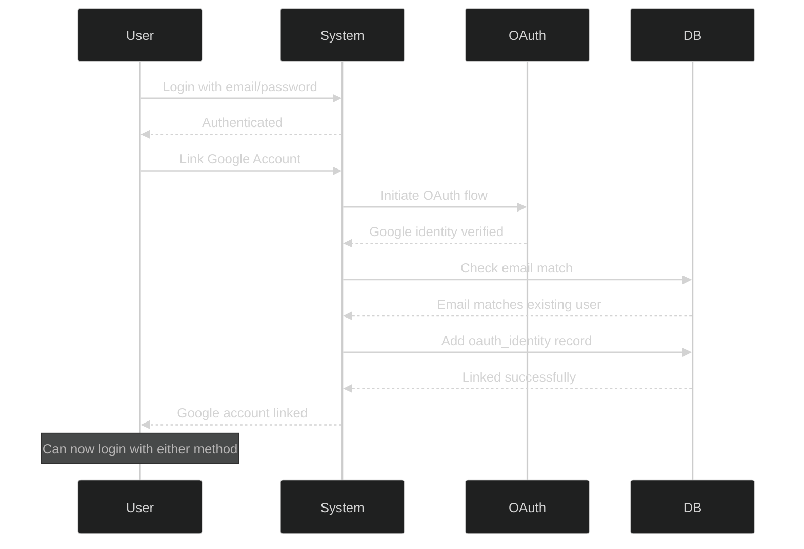
```mermaid
%%{init: {'theme': 'dark'}}%%
sequenceDiagram
    participant User
    participant System
    participant OAuth
    participant DB

    User->>System: Login with email/password
    System-->>User: Authenticated
    User->>System: Link Google Account
    System->>OAuth: Initiate OAuth flow
    OAuth-->>System: Google identity verified
    System->>DB: Check email match
    DB-->>System: Email matches existing user
    System->>DB: Add oauth_identity record
    DB-->>System: Linked successfully
    System-->>User: Google account linked
    Note over User: Can now login with either method
```

**Adding password to existing OAuth account:**

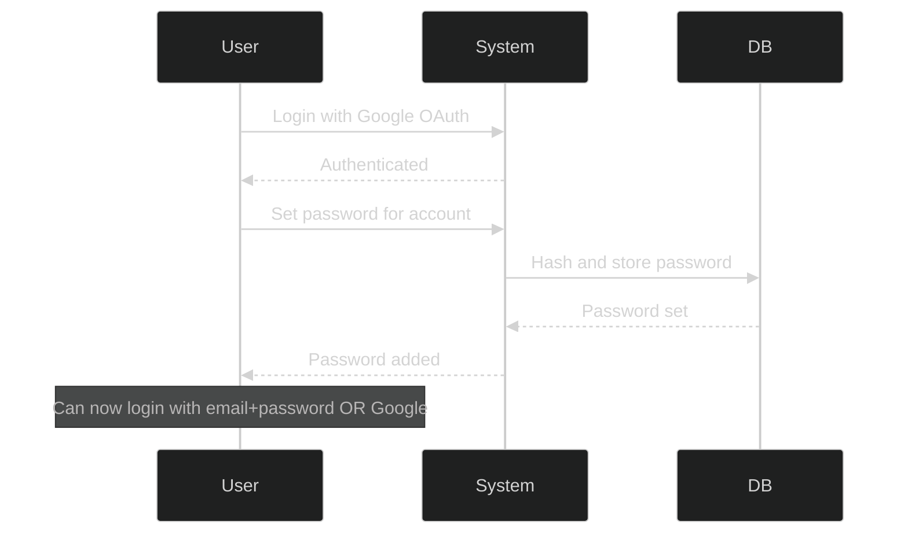
```mermaid
%%{init: {'theme': 'dark'}}%%
sequenceDiagram
    participant User
    participant System
    participant DB

    User->>System: Login with Google OAuth
    System-->>User: Authenticated
    User->>System: Set password for account
    System->>DB: Hash and store password
    DB-->>System: Password set
    System-->>User: Password added
    Note over User: Can now login with email+password OR Google
```

### 4.8 Complete User Lifecycle

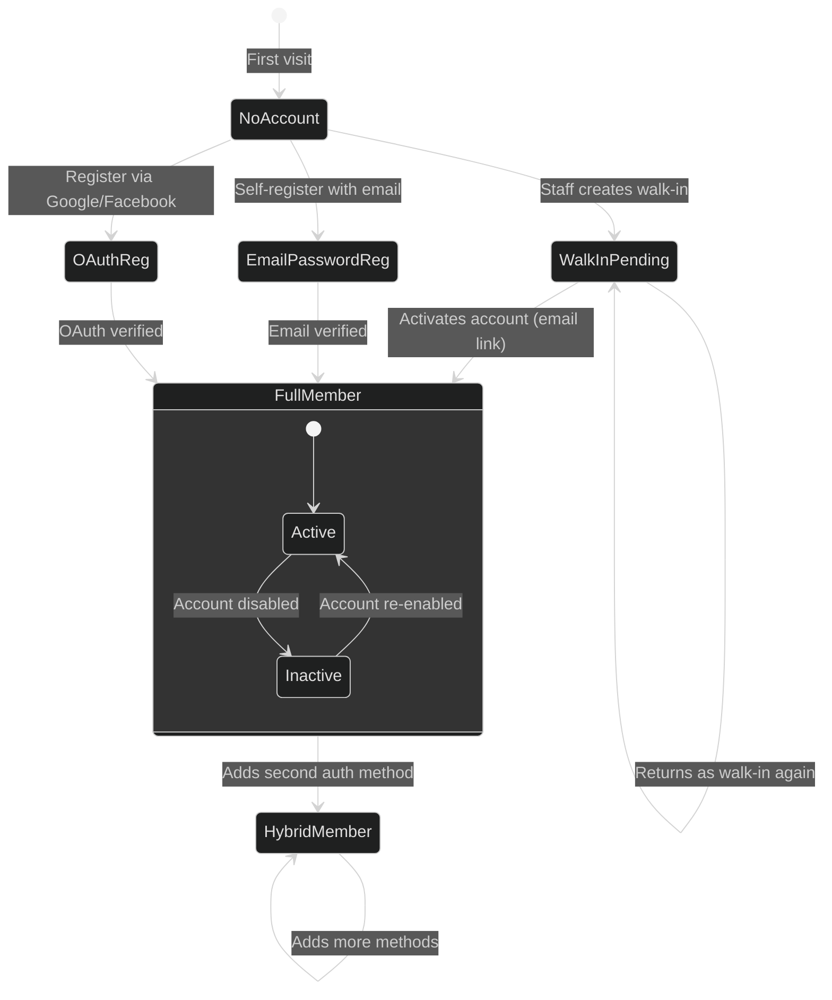
```mermaid
%%{init: {'theme': 'dark'}}%%
stateDiagram-v2
    [*] --> NoAccount: First visit

    NoAccount --> WalkInPending: Staff creates walk-in
    NoAccount --> EmailPasswordReg: Self-register with email
    NoAccount --> OAuthReg: Register via Google/Facebook

    WalkInPending --> FullMember: Activates account (email link)
    WalkInPending --> WalkInPending: Returns as walk-in again

    EmailPasswordReg --> FullMember: Email verified
    OAuthReg --> FullMember: OAuth verified

    FullMember --> HybridMember: Adds second auth method
    HybridMember --> HybridMember: Adds more methods

    state FullMember {
        [*] --> Active
        Active --> Inactive: Account disabled
        Inactive --> Active: Account re-enabled
    }
```

### 4.9 Security Decision Tree

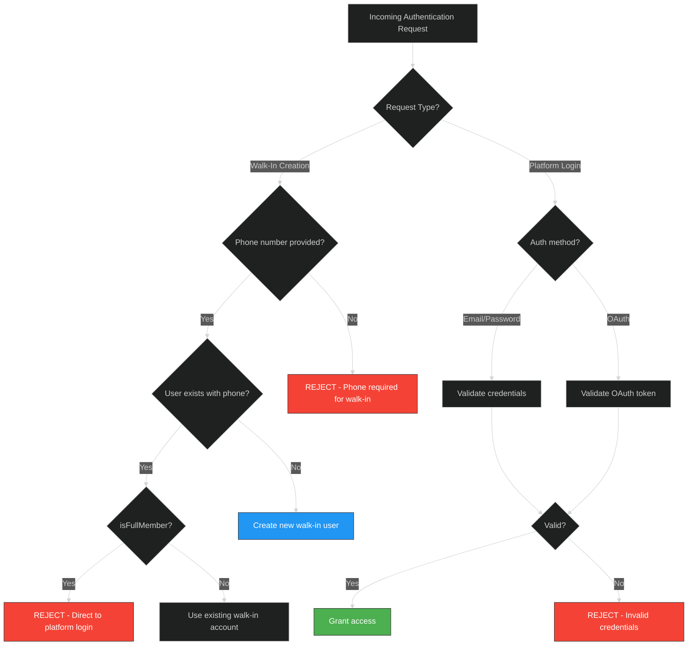
```mermaid
%%{init: {'theme': 'dark'}}%%
flowchart TD
    A[Incoming Authentication Request] --> B{Request Type?}

    B -->|Walk-In Creation| C{Phone number provided?}
    C -->|Yes| D{User exists with phone?}
    C -->|No| E[REJECT - Phone required for walk-in]

    D -->|Yes| F{isFullMember?}
    D -->|No| G[Create new walk-in user]

    F -->|Yes| H[REJECT - Direct to platform login]
    F -->|No| I[Use existing walk-in account]

    B -->|Platform Login| J{Auth method?}
    J -->|Email/Password| K[Validate credentials]
    J -->|OAuth| L[Validate OAuth token]

    K --> M{Valid?}
    L --> M
    M -->|Yes| N[Grant access]
    M -->|No| O[REJECT - Invalid credentials]

    style E fill:#f44336,stroke:#333,color:#fff
    style H fill:#f44336,stroke:#333,color:#fff
    style O fill:#f44336,stroke:#333,color:#fff
    style G fill:#2196F3,stroke:#333,color:#fff
    style N fill:#4CAF50,stroke:#333,color:#fff
```

### 4.10 Database Schema

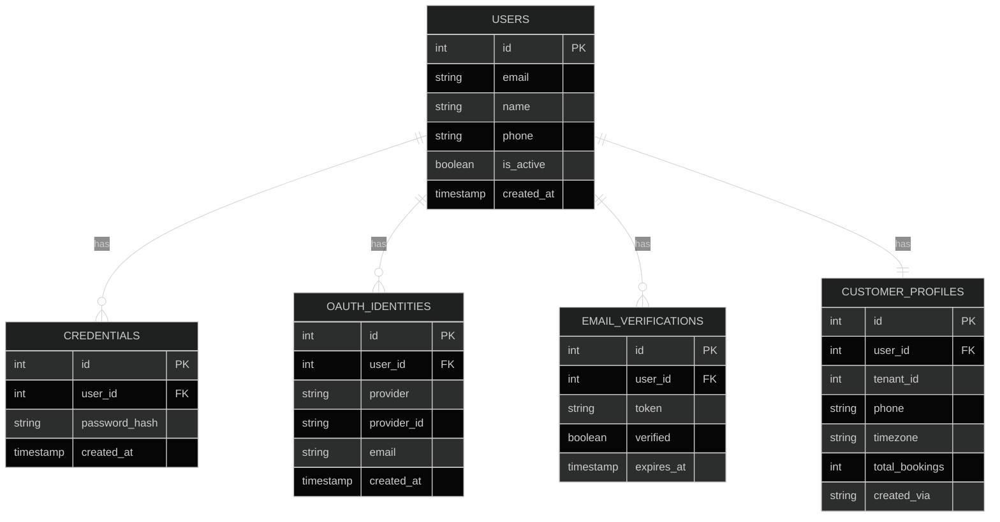
```mermaid
%%{init: {'theme': 'dark'}}%%
erDiagram
    USERS ||--o{ CREDENTIALS : has
    USERS ||--o{ OAUTH_IDENTITIES : has
    USERS ||--o{ EMAIL_VERIFICATIONS : has
    USERS ||--|| CUSTOMER_PROFILES : has

    USERS {
        int id PK
        string email
        string name
        string phone
        boolean is_active
        timestamp created_at
    }

    CREDENTIALS {
        int id PK
        int user_id FK
        string password_hash
        timestamp created_at
    }

    OAUTH_IDENTITIES {
        int id PK
        int user_id FK
        string provider
        string provider_id
        string email
        timestamp created_at
    }

    EMAIL_VERIFICATIONS {
        int id PK
        int user_id FK
        string token
        boolean verified
        timestamp expires_at
    }

    CUSTOMER_PROFILES {
        int id PK
        int user_id FK
        int tenant_id
        string phone
        string timezone
        int total_bookings
        string created_via
    }
```

### 4.11 Staff Dashboard: Customer Lookup

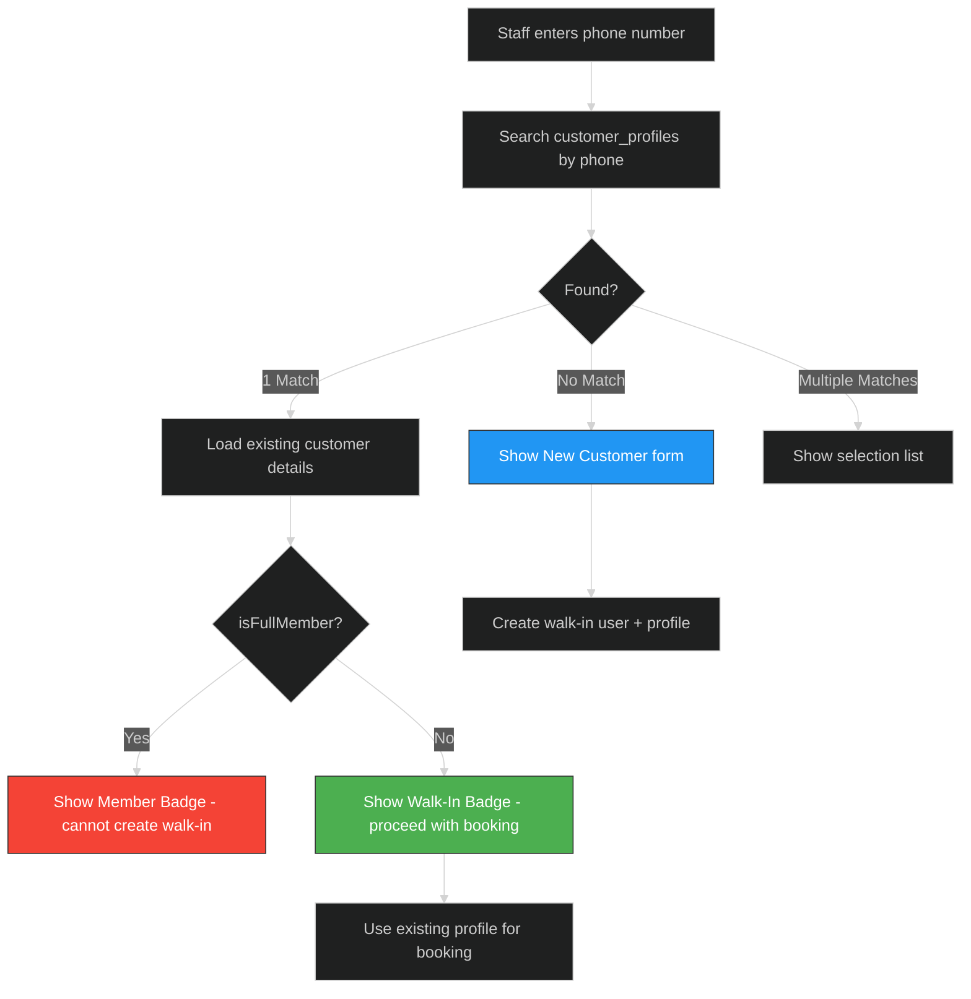
```mermaid
%%{init: {'theme': 'dark'}}%%
graph TD
    A[Staff enters phone number] --> B[Search customer_profiles by phone]
    B --> C{Found?}

    C -->|No Match| D[Show New Customer form]
    C -->|1 Match| E[Load existing customer details]
    C -->|Multiple Matches| F[Show selection list]

    E --> G{isFullMember?}
    G -->|Yes| H[Show Member Badge - cannot create walk-in]
    G -->|No| I[Show Walk-In Badge - proceed with booking]

    D --> J[Create walk-in user + profile]
    I --> K[Use existing profile for booking]

    style H fill:#f44336,stroke:#333,color:#fff
    style I fill:#4CAF50,stroke:#333,color:#fff
    style D fill:#2196F3,stroke:#333,color:#fff
```

### 4.12 SQL Query Flow for isFullMember

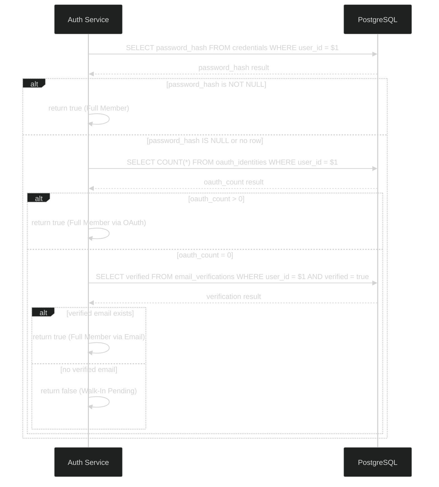
```mermaid
%%{init: {'theme': 'dark'}}%%
sequenceDiagram
    participant Service as Auth Service
    participant DB as PostgreSQL

    Service->>DB: SELECT password_hash FROM credentials WHERE user_id = $1
    DB-->>Service: password_hash result

    alt password_hash is NOT NULL
        Service->>Service: return true (Full Member)
    else password_hash IS NULL or no row
        Service->>DB: SELECT COUNT(*) FROM oauth_identities WHERE user_id = $1
        DB-->>Service: oauth_count result

        alt oauth_count > 0
            Service->>Service: return true (Full Member via OAuth)
        else oauth_count = 0
            Service->>DB: SELECT verified FROM email_verifications WHERE user_id = $1 AND verified = true
            DB-->>Service: verification result

            alt verified email exists
                Service->>Service: return true (Full Member via Email)
            else no verified email
                Service->>Service: return false (Walk-In Pending)
            end
        end
    end
```

### 4.13 Error Responses

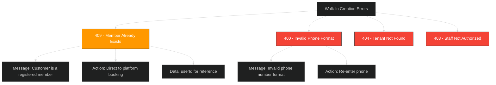
```mermaid
%%{init: {'theme': 'dark'}}%%
graph TD
    A[Walk-In Creation Errors] --> B[409 - Member Already Exists]
    A --> C[400 - Invalid Phone Format]
    A --> D[404 - Tenant Not Found]
    A --> E[403 - Staff Not Authorized]

    B --> B1[Message: Customer is a registered member]
    B --> B2[Action: Direct to platform booking]
    B --> B3[Data: userId for reference]

    C --> C1[Message: Invalid phone number format]
    C --> C2[Action: Re-enter phone]

    style B fill:#FF9800,stroke:#333,color:#fff
    style C fill:#f44336,stroke:#333,color:#fff
    style D fill:#f44336,stroke:#333,color:#fff
    style E fill:#f44336,stroke:#333,color:#fff
```

---

## 5. Walk-In Identity Lifecycle Audit

### 5.1 Executive Summary

The walk-in-to-full-customer transition has an architectural gap that risks duplicate user creation. The identity model is email-centric, but walk-in identity is phone-based, creating a disconnect in the transition path.

**Integrity Score: 6/10** — Intended path works, but edge cases create duplicate records.

### 5.2 Walk-In Record Creation

When staff creates a walk-in booking:

```
Records Created:
  1. users (name, phone, is_active=true)
  2. customer_profiles (user_id, phone, tenant_id, created_via='walk_in')
  3. email_verifications (if email provided: token generated, verified=false)
```

Phone is NOT involved in the full-customer transition — only email is used for account activation.

### 5.3 Transition Paths Analysis

#### Path 1 (Intended): Walk-In Activates via Token

```
Walk-in user receives activation email
  -> Clicks activation link
  -> Sets password
  -> email_verifications.verified = true
  -> credentials.password_hash created
  -> isFullMember = true

Status: WORKS CORRECTLY
```

#### Path 2 (Bug): No-Email Walk-In Self-Registers

```
Walk-in exists with phone only (no email)
  -> Same person visits website
  -> Self-registers with email + password
  -> System creates NEW user record (no phone match)
  -> DUPLICATE USER for same person

Bug: Phone-based identity not checked during registration
```

#### Path 3 (Bug): No-Email Walk-In Signs Up via OAuth

```
Walk-in exists with phone only
  -> Same person signs up via Google OAuth
  -> System creates NEW user (matched by email, not phone)
  -> DUPLICATE USER for same person

Bug: OAuth registration doesn't check phone-based identities
```

#### Path 4 (Edge Case): Walk-In with Email Tries Registration

```
Walk-in exists with email
  -> Same person tries to self-register with same email
  -> System returns generic error (email taken)
  -> User confused — no guidance to activate instead

Issue: Error message lacks actionable guidance
```

#### Path 5 (Edge Case): Walk-In with Email Uses OAuth

```
Walk-in exists with email
  -> Same person uses Google OAuth with same email
  -> OAuth links to existing user (email match)
  -> BUT: user.role may not include 'customer' for platform access

Issue: Missing role assignment during OAuth linking
```

### 5.4 Bug Registry

| ID | Description | Impact | Priority |
|----|------------|--------|----------|
| WI-001 | Phone not used for identity matching during registration | Duplicate users | HIGH |
| WI-002 | Phone not used for identity matching during OAuth | Duplicate users | HIGH |
| WI-003 | Generic error when walk-in email exists | Poor UX | MEDIUM |
| WI-004 | Missing role assignment on OAuth account linking | Access denied | MEDIUM |
| WI-005 | No unique constraint on phone in users table | Data integrity | MEDIUM |
| WI-006 | No automatic account merge utility | Operational burden | LOW |

### 5.5 Recommended Fix Strategy

**Phase 1: Detection (Critical)**
- Add phone-based user lookup in registration flow
- Add phone-based user lookup in OAuth flow
- If phone match found → prompt account linking instead of new creation

**Phase 2: UX Improvements**
- Replace generic "email taken" error with guidance: "An account exists. Activate your walk-in account."
- Add "Link existing account" flow for walk-in users

**Phase 3: Schema Hardening**
- Add unique constraint on phone in users table
- Add index on customer_profiles.phone for faster lookups

**Phase 4: Account Merge Utility**
- Admin tool to merge duplicate accounts
- Preserves booking history from both accounts
- Handles customer_profile consolidation

### 5.6 Architectural Decision Record

| Decision | Choice | Trade-off |
|----------|--------|-----------|
| Email-centric identity | Keep for now | Simpler auth, but phone gap exists |
| Phone as secondary identifier | Add matching, not primary | Backward compatible, incremental fix |
| No auto-merge | Manual merge first | Safety over automation |
| Unique phone constraint | Phase 3 | May require data cleanup first |

### 5.7 Code References

| Component | File | Key Method |
|-----------|------|------------|
| Walk-in creation | `staff-booking.service.ts` | `createWalkInBooking()` |
| isFullMember check | `customer.service.ts` | `isFullMember()` |
| OAuth registration | `auth.service.ts` | `handleOAuthCallback()` |
| Self-registration | `auth.service.ts` | `register()` |
| Customer lookup | `customer.repository.ts` | `findByPhone()` |
| Email verification | `verification.service.ts` | `verifyToken()` |
| Account activation | `activation.service.ts` | `activateWalkInAccount()` |
| Profile creation | `customer-profile.service.ts` | `createProfile()` |
