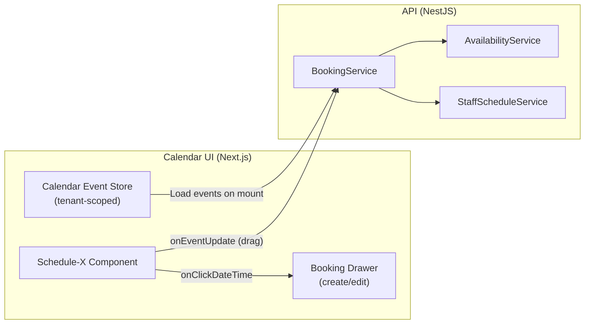
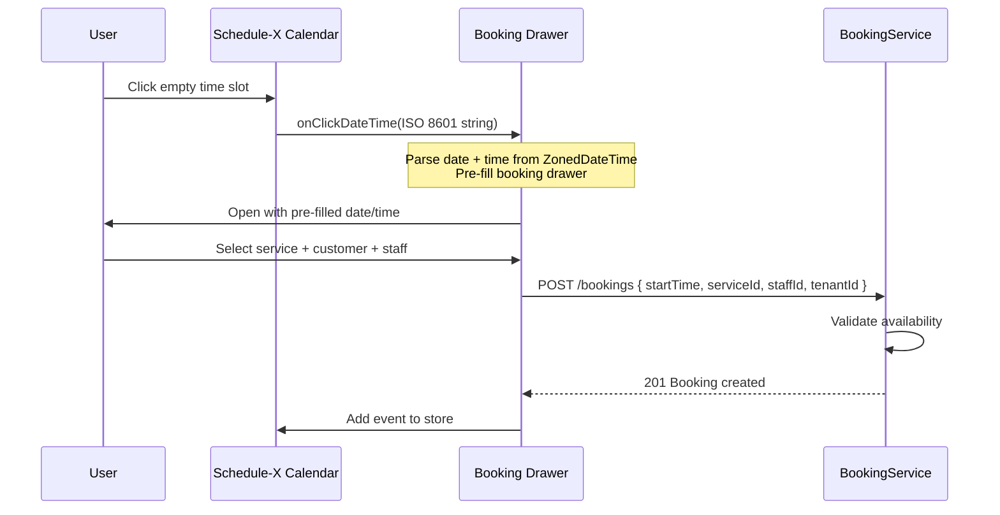
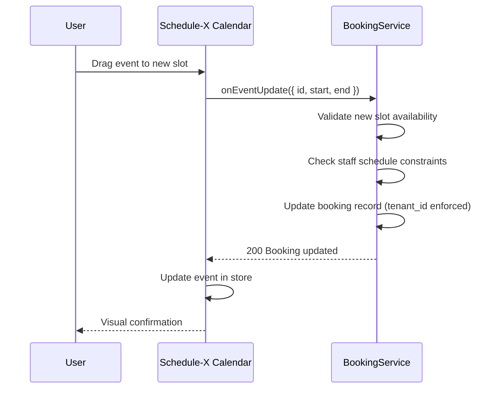
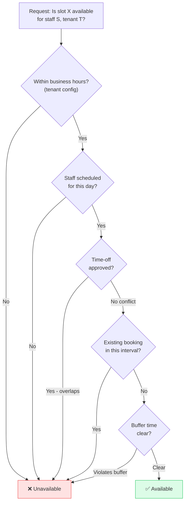
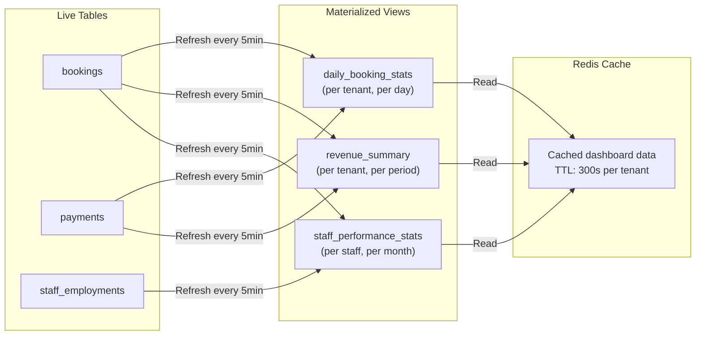

> **Source**: Extracted from production system, sanitized for portfolio use
> **Original**: DoneByMe Calendar, Scheduling & Analytics Architecture
> **Status**: Production Case Study

# Calendar, Scheduling & Analytics Architecture

## Executive Summary

The calendar system is the operational hub of the DoneByMe platform. Every booking, staff schedule, time-off request, and analytics report flows through it. This document covers the three core subsystems:

1. **Interactive Calendar** — real-time drag-and-drop scheduling UI powered by Schedule-X
2. **Availability Engine** — the algorithm that determines when a booking slot is open or blocked
3. **Analytics Layer** — pre-aggregated materialized views for instant dashboard metrics

---

## Part 1 — Interactive Calendar System

### Architecture: Schedule-X + React Integration

The calendar is built with `@schedule-x/react`, integrated with the tenant's booking data through a normalized event model.



### Event Data Model

Calendar events are normalized from the booking domain model:

```typescript
interface CalendarEvent {
  id: string;              // booking.id
  title: string;           // service name + customer name
  start: string;           // ISO 8601 with timezone
  end: string;             // start + duration
  extendedProps: {
    bookingId: string;
    tenantId: string;      // always present — tenant isolation
    staffId: string;
    status: BookingStatus;
    serviceId: string;
  };
}
```

### Click-to-Create Flow



### Drag-to-Reschedule Flow



---

## Part 2 — Availability Engine

### The Core Problem

A booking slot is available only when **all** of the following are true simultaneously:

1. The service is offered during that time (business hours)
2. The staff member is scheduled to work
3. The staff member has no conflicting booking
4. The staff member has no approved time-off
5. The time slot isn't blocked by a walk-in

### Availability Algorithm



### Interval Validation Query

The core query checks for overlapping intervals using PostgreSQL's half-open interval comparison:

```sql
-- Check if a new booking [new_start, new_end) conflicts with existing bookings
SELECT EXISTS (
  SELECT 1
  FROM bookings
  WHERE tenant_id = $1         -- always tenant-scoped
    AND staff_id = $2
    AND status NOT IN ('cancelled', 'expired', 'no_show')
    AND (
      -- New booking starts inside existing booking
      (start_time <= $3 AND end_time > $3)
      OR
      -- New booking ends inside existing booking
      (start_time < $4 AND end_time >= $4)
      OR
      -- New booking entirely contains existing booking
      (start_time >= $3 AND end_time <= $4)
    )
) AS has_conflict;
```

### Composite Index for Availability Queries

```sql
-- Covers the most common availability check: staff schedule for a given day
CREATE INDEX idx_bookings_tenant_staff_time
  ON bookings (tenant_id, staff_id, start_time, end_time)
  WHERE status NOT IN ('cancelled', 'expired', 'no_show');
```

This partial index excludes irrelevant statuses, keeping it small and fast.

---

## Part 3 — Analytics Layer (Materialized Views)

### Why Materialized Views?

Dashboard analytics need to answer questions like:
- "How many bookings did this tenant have this week?"
- "What's the revenue for the past 30 days?"
- "Which staff member has the highest booking rate?"

Running these aggregations on-demand against the live `bookings` table would be too slow at scale. Instead, we pre-aggregate with materialized views refreshed on a schedule.



### Materialized View Schema (Example)

```sql
CREATE MATERIALIZED VIEW daily_booking_stats AS
SELECT
  tenant_id,
  DATE(start_time AT TIME ZONE tenant_timezone) AS booking_date,
  COUNT(*) FILTER (WHERE status = 'completed') AS completed_count,
  COUNT(*) FILTER (WHERE status = 'cancelled') AS cancelled_count,
  COUNT(*) FILTER (WHERE status = 'no_show') AS no_show_count,
  COUNT(*) AS total_count,
  AVG(EXTRACT(EPOCH FROM (end_time - start_time))/60) AS avg_duration_minutes
FROM bookings
JOIN tenants ON tenants.id = bookings.tenant_id
GROUP BY tenant_id, booking_date
WITH DATA;

-- Index for fast tenant dashboard queries
CREATE UNIQUE INDEX ON daily_booking_stats (tenant_id, booking_date);
```

### Scheduled Refresh Strategy

| View | Refresh Schedule | Risk | Rationale |
|------|-----------------|------|-----------|
| `daily_booking_stats` | Every 5 minutes | LOW | Slightly stale OK for dashboards |
| `revenue_summary` | Every 5 minutes | LOW | Financial summaries don't need real-time |
| `staff_performance_stats` | Every hour | LOW | Historical aggregation, rarely changes |

### Refresh Security Model

Analytics refresh endpoints are protected:

```typescript
@Controller('analytics')
export class AnalyticsController {
  @Post('refresh/:viewName')
  @UseGuards(JwtAuthGuard, RolesGuard)
  @Roles('owner', 'manager')
  async refreshAnalytics(
    @TenantId() tenantId: string,
    @Param('viewName') viewName: string,
  ) {
    // Allowlist approach — only whitelisted view names accepted
    const ALLOWED_VIEWS = ['daily_booking_stats', 'revenue_summary', 'staff_performance_stats'];
    if (!ALLOWED_VIEWS.includes(viewName)) {
      throw new BadRequestException('Invalid view name');
    }

    // Tenant-scoped refresh — only refreshes this tenant's data
    return this.analyticsService.refreshView(viewName, tenantId);
  }
}
```

**Security design:**
- ✅ JWT required — no anonymous refresh
- ✅ Role check — only Owner/Manager can trigger refreshes
- ✅ Allowlist — viewName is validated against approved list (no SQL injection)
- ✅ Rate limiting — throttled to 1 refresh/minute per tenant
- ✅ Single-flight lock — prevents concurrent refresh storms

---

## Cron Job Architecture

Background jobs maintain booking lifecycle integrity:

| Job | Schedule | Purpose | Safety Mechanism |
|-----|----------|---------|-----------------|
| `ApprovalTimeoutCron` | Every 15 min | Expire pending approvals past deadline | Idempotent — checks `expires_at < NOW()` |
| `NoShowDetectionCron` | Every minute | Auto-mark no-shows | Only marks if `end_time < NOW() - 10min` |
| `StatsRefreshCron` | Every 5 min | Refresh analytics views | Single-flight lock prevents concurrent runs |
| `OrphanedFileCleanupCron` | 3AM daily | Delete unlinked upload files | Soft-delete first, hard-delete after 7 days |
| `DailySummaryCron` | 10PM | Send booking summaries to owners | Idempotent delivery tracking |

### Environment-Gated Activation

```typescript
// app.module.ts
imports: [
  ConfigModule.forRoot({ isGlobal: true }),
  // Gate the scheduler to prevent cron jobs running in test/dev environments
  ...(process.env.ENABLE_SCHEDULE === 'true' ? [ScheduleModule.forRoot()] : []),
  // ... other modules
]
```

This prevents cron jobs from running in development or test environments where they would corrupt test data.

---

## Performance Characteristics

| Operation | Mechanism | Typical Latency |
|-----------|-----------|----------------|
| Availability check (single slot) | Partial index scan | ~5ms |
| Calendar event load (day view) | Covering index + Redis cache | ~12ms |
| Dashboard metrics | Materialized view read | ~8ms |
| Materialized view refresh | Background job | ~200ms (non-blocking) |

---

## Related Documentation

- **[Booking System Architecture](../BOOKING/01-BOOKING_SYSTEM_ARCHITECTURE.md)** — Full booking lifecycle and state machine
- **[Interval Validation](../BOOKING/03-INTERVAL_VALIDATION.md)** — Deep dive on availability algorithm
- **[Analytics Reporting](./02-ANALYTICS_REPORTING.md)** — Business metrics and reporting patterns
- **[Staff Workflow](../STAFF/01-COMPLETE_STAFF_WORKFLOW.md)** — How staff schedules feed into availability
- **[Time-Off Architecture](../TIME_OFF/01-TIME_OFF_ARCHITECTURE.md)** — How approved time-off blocks calendar slots
