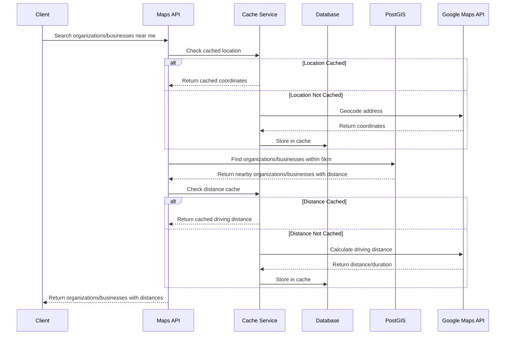
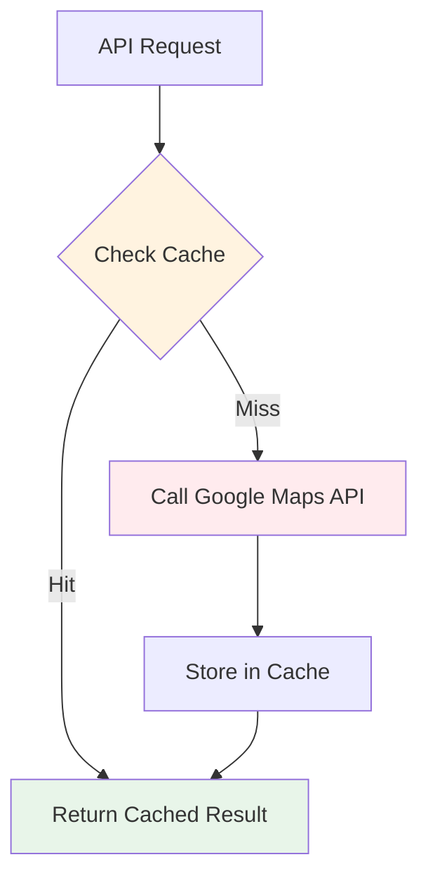
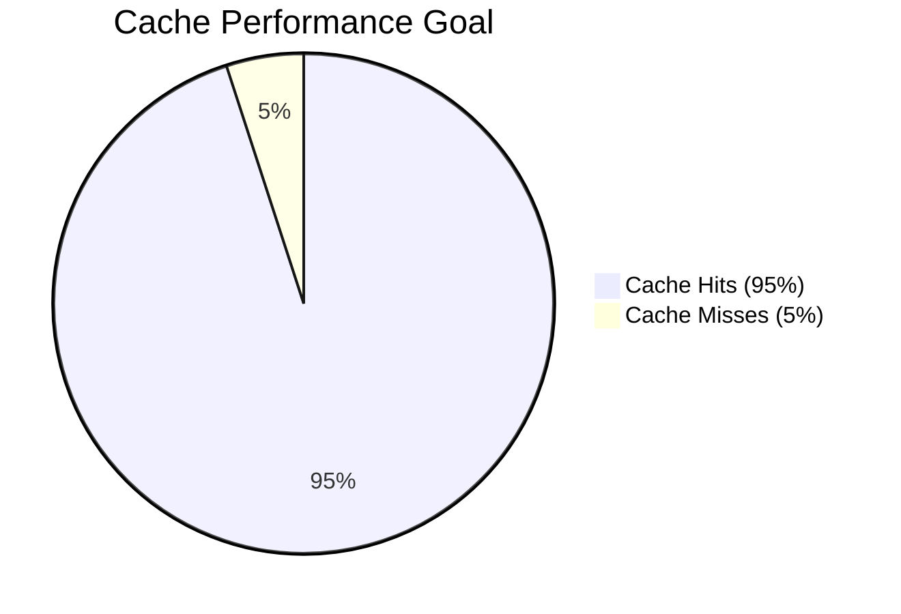

# Portfolio Note

> Extracted from production system, sanitized for portfolio use.

---

# Maps Module Architecture & Implementation Guide

**Version:** 1.0
**Last Updated:** November 26, 2025
**Status:** Implementation Ready
**Author:** the Platform Platform Team

---

## Table of Contents

1. [Overview](#overview)
2. [Architecture Design](#architecture-design)
3. [Cost Optimization Strategy](#cost-optimization-strategy)
4. [Caching Strategy](#caching-strategy)
5. [Database Schema](#database-schema)
6. [Core Services](#core-services)
7. [Repository Layer](#repository-layer)
8. [Controller & API Endpoints](#controller--api-endpoints)
9. [Integration with Existing Modules](#integration-with-existing-modules)
10. [Testing Strategy](#testing-strategy)
11. [Implementation Plan](#implementation-plan)
12. [Production Checklist](#production-checklist)
13. [References](#references)

---

## Overview

### Business Requirements

1. **Geocode organization/business Addresses** - Convert addresses to lat/lng coordinates
2. **Distance Calculation** - Calculate distance between customer and organizations/businesses
3. **Nearby organization/business Search** - Find organizations/businesses within X km radius
4. **Directions** - Provide directions URL to organization/business
5. **Address Autocomplete** - Help users enter addresses (future)

### Cost Considerations

Google Maps API Pricing:

- Geocoding: **$5 per 1000 requests**
- Distance Matrix: **$5 per 1000 elements**
- Places API: **$17 per 1000 requests**

**Goal:** Reduce API costs by **90%** through aggressive caching and PostGIS-first strategy.

### Key Principles

1. **PostGIS First** - Use free PostGIS for everything possible
2. **Cache Aggressively** - Target 95%+ cache hit rate
3. **Google as Fallback** - Only for driving directions & geocoding
4. **Tenant Isolation** - All data scoped by `tenant_id`

---

## Architecture Design

### Module Structure

```
apps/api/src/maps/
├── maps.module.ts                    # Module definition
│
├── controllers/
│   ├── maps.controller.ts            # Public API endpoints
│   └── maps.swagger.ts               # Swagger decorators
│
├── services/
│   ├── core/
│   │   ├── geocoding.service.ts      # Address <-> Coordinates
│   │   ├── distance.service.ts       # Distance calculations
│   │   └── location-search.service.ts # Nearby organization/business search
│   │
│   ├── external/
│   │   ├── google-maps-client.service.ts  # Google API wrapper
│   │   └── google-maps.types.ts           # API types
│   │
│   └── cache/
│       ├── geo-cache.service.ts      # Geocoding cache
│       └── distance-cache.service.ts # Distance cache
│
├── repositories/
│   ├── geocode-cache.repository.ts   # Geocoding cache CRUD
│   └── distance-cache.repository.ts  # Distance cache CRUD
│
├── dto/
│   ├── geocode.dto.ts
│   ├── reverse-geocode.dto.ts
│   ├── distance.dto.ts
│   ├── nearby-search.dto.ts
│   └── coordinates.dto.ts
│
├── types/
│   └── maps.types.ts                 # Shared types
│
└── __tests__/
    ├── geocoding.service.spec.ts
    ├── distance.service.spec.ts
    └── location-search.service.spec.ts
```

### High-Level Module Diagram

```
┌─────────────────────────────────────────────────────────────────┐
│                      MAPS MODULE                                 │
├─────────────────────────────────────────────────────────────────┤
│                                                                  │
│  ┌─────────────┐    ┌─────────────┐    ┌─────────────┐         │
│  │  Geocoding  │    │  Distance   │    │  Location   │         │
│  │   Service   │    │   Service   │    │   Search    │         │
│  └──────┬──────┘    └──────┬──────┘    └──────┬──────┘         │
│         │                  │                  │                  │
│         └──────────────────┼──────────────────┘                  │
│                            │                                     │
│                   ┌────────┴────────┐                           │
│                   │   Cache Layer   │                           │
│                   │ (Redis + DB)    │                           │
│                   └────────┬────────┘                           │
│                            │                                     │
│         ┌──────────────────┼──────────────────┐                 │
│         │                  │                  │                  │
│  ┌──────┴──────┐    ┌──────┴──────┐    ┌──────┴──────┐         │
│  │   PostGIS   │    │   Google    │    │  Database   │         │
│  │   (FREE)    │    │   Maps API  │    │   Cache     │         │
│  └─────────────┘    └─────────────┘    └─────────────┘         │
│                                                                  │
└─────────────────────────────────────────────────────────────────┘
```

### System Flow



### PostGIS vs Google Maps Decision Matrix

| Use Case               | PostGIS (Free) | Google Maps (Paid) |
| ---------------------- | -------------- | ------------------ |
| Straight-line distance | Yes            | No                 |
| Nearby search          | Yes            | No                 |
| Driving distance       | No             | Yes                |
| Driving time           | No             | Yes                |
| Traffic data           | No             | Yes                |
| Geocoding              | No             | Yes                |

---

## Cost Optimization Strategy

### Request Flow with Caching



### Operation Cost Matrix

| Operation                | First Choice | Fallback   | Cost per Miss |
| ------------------------ | ------------ | ---------- | ------------- |
| Distance (straight-line) | PostGIS      | -          | FREE          |
| Distance (driving)       | Cache        | Google API | ~$0.005       |
| Geocoding                | Cache        | Google API | ~$0.005       |
| Nearby search            | PostGIS      | -          | FREE          |

### Estimated Monthly Costs

| Scenario             | Cache Hit Rate | Google API Calls | Cost  |
| -------------------- | -------------- | ---------------- | ----- |
| Low usage (1k users) | 90%            | ~3,000           | ~$15  |
| Medium (10k users)   | 95%            | ~15,000          | ~$75  |
| High (100k users)    | 98%            | ~60,000          | ~$300 |

### Without Caching (Worst Case)

- 1000 organizations/businesses in database
- 10,000 searches per day
- Each search geocodes user location + calculates 10 distances
- **Monthly cost:** $1,500 - $3,000

**Savings with caching:** ~90% cost reduction.

### Rate Limiting

```typescript
// Rate limit: 10 geocoding requests per minute per tenant
@Throttle({ default: { limit: 10, ttl: 60000 } })
@Post('geocode')
async geocode() { ... }
```

---

## Caching Strategy

### Cache Hit Rate Target: 95%+



### Cache Invalidation Rules

| Data Type          | TTL     | Invalidation Trigger           |
| ------------------ | ------- | ------------------------------ |
| Geocoded addresses | Forever | Never (addresses don't change) |
| Distance matrix    | 30 days | Manual only                    |
| Places search      | 7 days  | Manual only                    |
| Tenant location    | Forever | Tenant updates address         |

### Cache Warming Strategy

```typescript
// Warm cache for popular routes on deployment
async warmCache() {
  const popularSalons = await this.getTop100Salons();

  for (const organization/business of popularSalons) {
    // Pre-geocode all organization/business addresses
    await this.geocodingService.geocode(organization/business.address);

    // Pre-calculate distances between nearby organizations/businesses
    const nearby = await this.findNearbySalons(organization/business.location, 10);
    for (const neighbor of nearby) {
      await this.distanceService.calculateDistance(
        organization/business.location,
        neighbor.location,
        'driving',
      );
    }
  }
}
```

---

## Database Schema

### Geocoding Cache Table

```sql
CREATE TABLE geocoded_addresses (
    id SERIAL PRIMARY KEY,

    -- Address Details
    address_text TEXT NOT NULL,
    normalized_address TEXT,

    -- Coordinates
    latitude DECIMAL(10, 8) NOT NULL,
    longitude DECIMAL(11, 8) NOT NULL,
    location GEOGRAPHY(POINT, 4326),

    -- Google Place Data
    place_id VARCHAR(255),
    place_type VARCHAR(50),
    location_type VARCHAR(50),

    -- Usage Tracking
    hit_count INTEGER DEFAULT 0,
    last_accessed_at TIMESTAMP WITH TIME ZONE DEFAULT NOW(),

    -- Timestamps
    created_at TIMESTAMP WITH TIME ZONE DEFAULT NOW(),

    CONSTRAINT uq_geocoded_address UNIQUE (normalized_address)
);

-- Indexes
CREATE INDEX idx_geocoded_addresses_text
  ON geocoded_addresses USING gin(to_tsvector('english', address_text));
CREATE INDEX idx_geocoded_addresses_location
  ON geocoded_addresses USING GIST(location);
CREATE INDEX idx_geocoded_place_id
  ON geocoded_addresses(place_id);
```

### Distance Cache Table

```sql
CREATE TABLE distance_cache (
    id SERIAL PRIMARY KEY,

    -- Origin & Destination
    origin_latitude DECIMAL(10, 8) NOT NULL,
    origin_longitude DECIMAL(11, 8) NOT NULL,
    destination_latitude DECIMAL(10, 8) NOT NULL,
    destination_longitude DECIMAL(11, 8) NOT NULL,

    -- Optional tenant links
    origin_tenant_id INTEGER REFERENCES tenants(id),
    destination_tenant_id INTEGER REFERENCES tenants(id),

    -- Distance Data
    distance_meters INTEGER NOT NULL,
    distance_km DECIMAL(10, 2) NOT NULL,
    duration_seconds INTEGER NOT NULL,
    duration_minutes INTEGER NOT NULL,

    -- Traffic Data
    duration_in_traffic_seconds INTEGER,
    traffic_condition VARCHAR(50),

    -- Route Data
    polyline TEXT,
    travel_mode VARCHAR(20) DEFAULT 'driving',

    -- Cache Expiry
    expires_at TIMESTAMP WITH TIME ZONE DEFAULT NOW() + INTERVAL '30 days',

    -- Usage Tracking
    hit_count INTEGER DEFAULT 0,
    last_accessed_at TIMESTAMP WITH TIME ZONE DEFAULT NOW(),

    -- Timestamps
    created_at TIMESTAMP WITH TIME ZONE DEFAULT NOW(),

    CONSTRAINT uq_distance_cache UNIQUE (
        origin_latitude, origin_longitude,
        destination_latitude, destination_longitude,
        travel_mode
    )
);

-- Indexes
CREATE INDEX idx_distance_cache_origin
  ON distance_cache(origin_latitude, origin_longitude);
CREATE INDEX idx_distance_cache_destination
  ON distance_cache(destination_latitude, destination_longitude);
CREATE INDEX idx_distance_cache_expires
  ON distance_cache(expires_at);
CREATE INDEX idx_distance_cache_tenants
  ON distance_cache(origin_tenant_id, destination_tenant_id);
```

### Tenants Table Spatial Extension

```sql
-- Add PostGIS column to tenants table
ALTER TABLE tenants
ADD COLUMN IF NOT EXISTS location GEOGRAPHY(POINT, 4326);

-- Spatial index
CREATE INDEX IF NOT EXISTS idx_tenants_location
ON tenants USING GIST(location);

-- Auto-update trigger
CREATE OR REPLACE FUNCTION update_tenant_location()
RETURNS TRIGGER AS $$
BEGIN
    IF NEW.latitude IS NOT NULL AND NEW.longitude IS NOT NULL THEN
        NEW.location := ST_SetSRID(
            ST_MakePoint(NEW.longitude, NEW.latitude),
            4326
        )::geography;
    ELSE
        NEW.location := NULL;
    END IF;
    RETURN NEW;
END;
$$ LANGUAGE plpgsql;

CREATE TRIGGER trigger_update_tenant_location
    BEFORE INSERT OR UPDATE OF latitude, longitude ON tenants
    FOR EACH ROW
    EXECUTE FUNCTION update_tenant_location();
```

### PostGIS Distance Query Example

```sql
-- Find organizations/businesses within 5km using PostGIS (FREE, no API cost)
SELECT
  id, name,
  ST_Distance(
    location::geography,
    ST_SetSRID(ST_MakePoint(-73.9857, 40.7484), 4326)::geography
  ) / 1000 AS distance_km
FROM tenants
WHERE ST_DWithin(
  location::geography,
  ST_SetSRID(ST_MakePoint(-73.9857, 40.7484), 4326)::geography,
  5000  -- 5km radius in meters
)
ORDER BY distance_km;
```

---

## Core Services

### 1. Google Maps Client Service

```typescript
// apps/api/src/maps/services/external/google-maps-client.service.ts

import {
  Client,
  GeocodeResponse,
  DistanceMatrixResponse,
} from '@googlemaps/google-maps-services-js';
import { Injectable, Logger, OnModuleInit } from '@nestjs/common';
import { ConfigService } from '@nestjs/config';

export interface Coordinates {
  latitude: number;
  longitude: number;
}

export interface GeocodeResult {
  formattedAddress: string;
  coordinates: Coordinates;
  placeId: string;
  locationType: string;
}

export interface DistanceResult {
  distanceMeters: number;
  distanceKm: number;
  durationSeconds: number;
  durationMinutes: number;
  durationInTrafficSeconds?: number;
}

@Injectable()
export class GoogleMapsClientService implements OnModuleInit {
  private readonly logger = new Logger(GoogleMapsClientService.name);
  private client: Client;
  private apiKey: string;

  constructor(private readonly configService: ConfigService) {}

  onModuleInit() {
    this.apiKey = this.configService.getOrThrow('GOOGLE_MAPS_API_KEY');
    this.client = new Client({});
    this.logger.log('Google Maps client initialized');
  }

  isReady(): boolean {
    return !!this.apiKey && !!this.client;
  }

  async geocode(address: string): Promise<GeocodeResult | null> {
    try {
      const response = await this.client.geocode({
        params: {
          address,
          key: this.apiKey,
        },
      });

      if (response.data.status !== 'OK' || !response.data.results.length) {
        this.logger.warn(`Geocoding failed for: ${address}`);
        return null;
      }

      const result = response.data.results[0];
      return {
        formattedAddress: result.formatted_address,
        coordinates: {
          latitude: result.geometry.location.lat,
          longitude: result.geometry.location.lng,
        },
        placeId: result.place_id,
        locationType: result.geometry.location_type,
      };
    } catch (error) {
      this.logger.error(`Geocoding error: ${error.message}`);
      throw error;
    }
  }

  async reverseGeocode(coords: Coordinates): Promise<GeocodeResult | null> {
    try {
      const response = await this.client.reverseGeocode({
        params: {
          latlng: { lat: coords.latitude, lng: coords.longitude },
          key: this.apiKey,
        },
      });

      if (response.data.status !== 'OK' || !response.data.results.length) {
        return null;
      }

      const result = response.data.results[0];
      return {
        formattedAddress: result.formatted_address,
        coordinates: coords,
        placeId: result.place_id,
        locationType: result.geometry.location_type,
      };
    } catch (error) {
      this.logger.error(`Reverse geocoding error: ${error.message}`);
      throw error;
    }
  }

  async calculateDistance(
    origin: Coordinates,
    destination: Coordinates,
    mode: 'driving' | 'walking' | 'transit' = 'driving',
  ): Promise<DistanceResult | null> {
    try {
      const response = await this.client.distancematrix({
        params: {
          origins: [`${origin.latitude},${origin.longitude}`],
          destinations: [`${destination.latitude},${destination.longitude}`],
          mode: mode as any,
          departure_time: 'now',
          key: this.apiKey,
        },
      });

      if (response.data.status !== 'OK') {
        return null;
      }

      const element = response.data.rows[0]?.elements[0];
      if (!element || element.status !== 'OK') {
        return null;
      }

      return {
        distanceMeters: element.distance.value,
        distanceKm: element.distance.value / 1000,
        durationSeconds: element.duration.value,
        durationMinutes: Math.ceil(element.duration.value / 60),
        durationInTrafficSeconds: element.duration_in_traffic?.value,
      };
    } catch (error) {
      this.logger.error(`Distance calculation error: ${error.message}`);
      throw error;
    }
  }

  getDirectionsUrl(origin: Coordinates, destination: Coordinates): string {
    return `https://www.google.com/maps/dir/?api=1&origin=${origin.latitude},${origin.longitude}&destination=${destination.latitude},${destination.longitude}&travelmode=driving`;
  }
}
```

### 2. Geocoding Service

```typescript
// apps/api/src/maps/services/core/geocoding.service.ts

import { Injectable, Logger } from '@nestjs/common';
import {
  GoogleMapsClientService,
  Coordinates,
  GeocodeResult,
} from '../external/google-maps-client.service';
import { GeocodeCacheRepository } from '../../repositories/geocode-cache.repository';

export interface CachedGeocodeResult extends GeocodeResult {
  cached: boolean;
  cacheId?: number;
}

@Injectable()
export class GeocodingService {
  private readonly logger = new Logger(GeocodingService.name);

  constructor(
    private readonly googleClient: GoogleMapsClientService,
    private readonly cacheRepo: GeocodeCacheRepository,
  ) {}

  /**
   * Geocode address to coordinates (with caching)
   * STRATEGY: Cache first, Google API if miss
   */
  async geocode(address: string): Promise<CachedGeocodeResult | null> {
    const normalizedAddress = this.normalizeAddress(address);

    // 1. Check cache
    const cached = await this.cacheRepo.findByAddress(normalizedAddress);
    if (cached) {
      this.logger.debug(`Cache HIT for: ${address}`);
      await this.cacheRepo.incrementHitCount(cached.id);
      return {
        formattedAddress: cached.normalized_address ?? address,
        coordinates: {
          latitude: parseFloat(cached.latitude),
          longitude: parseFloat(cached.longitude),
        },
        placeId: cached.place_id ?? '',
        locationType: cached.location_type ?? '',
        cached: true,
        cacheId: cached.id,
      };
    }

    // 2. Check if Google client is ready
    if (!this.googleClient.isReady()) {
      this.logger.warn('Google Maps client not configured');
      return null;
    }

    // 3. Call Google API
    this.logger.debug(`Cache MISS, calling Google API for: ${address}`);
    const googleResult = await this.googleClient.geocode(address);
    if (!googleResult) {
      return null;
    }

    // 4. Store in cache (permanent)
    const savedCache = await this.cacheRepo.create({
      address_text: address,
      normalized_address: googleResult.formattedAddress,
      latitude: googleResult.coordinates.latitude.toString(),
      longitude: googleResult.coordinates.longitude.toString(),
      place_id: googleResult.placeId,
      location_type: googleResult.locationType,
    });

    return {
      ...googleResult,
      cached: false,
      cacheId: savedCache.id,
    };
  }

  /**
   * Reverse geocode coordinates to address (with caching)
   */
  async reverseGeocode(
    coords: Coordinates,
  ): Promise<CachedGeocodeResult | null> {
    // ~11 meters tolerance
    const cached = await this.cacheRepo.findByCoordinates(
      coords.latitude,
      coords.longitude,
      0.0001,
    );

    if (cached) {
      this.logger.debug(`Reverse geocode cache HIT`);
      await this.cacheRepo.incrementHitCount(cached.id);
      return {
        formattedAddress: cached.normalized_address ?? '',
        coordinates: coords,
        placeId: cached.place_id ?? '',
        locationType: cached.location_type ?? '',
        cached: true,
        cacheId: cached.id,
      };
    }

    if (!this.googleClient.isReady()) {
      return null;
    }

    const googleResult = await this.googleClient.reverseGeocode(coords);
    if (!googleResult) {
      return null;
    }

    const savedCache = await this.cacheRepo.create({
      address_text: googleResult.formattedAddress,
      normalized_address: googleResult.formattedAddress,
      latitude: coords.latitude.toString(),
      longitude: coords.longitude.toString(),
      place_id: googleResult.placeId,
      location_type: googleResult.locationType,
    });

    return {
      ...googleResult,
      cached: false,
      cacheId: savedCache.id,
    };
  }

  private normalizeAddress(address: string): string {
    return address
      .toLowerCase()
      .trim()
      .replace(/\s+/g, ' ')
      .replace(/[.,]/g, '');
  }
}
```

### 3. Distance Service

```typescript
// apps/api/src/maps/services/core/distance.service.ts

import { Injectable, Logger } from '@nestjs/common';
import { sql } from 'drizzle-orm';
import { NodePgDatabase } from 'drizzle-orm/node-postgres';
import { schema } from '@the platform/db';
import { InjectDb } from '../../../database/decorators/inject-db.decorator';
import {
  GoogleMapsClientService,
  Coordinates,
  DistanceResult,
} from '../external/google-maps-client.service';
import { DistanceCacheRepository } from '../../repositories/distance-cache.repository';

export type DistanceMode = 'straight' | 'driving' | 'walking';

export interface CachedDistanceResult extends DistanceResult {
  cached: boolean;
  mode: DistanceMode;
}

@Injectable()
export class DistanceService {
  private readonly logger = new Logger(DistanceService.name);

  constructor(
    @InjectDb() private readonly db: NodePgDatabase<typeof schema>,
    private readonly googleClient: GoogleMapsClientService,
    private readonly cacheRepo: DistanceCacheRepository,
  ) {}

  /**
   * Calculate distance between two points
   *
   * STRATEGY:
   * - 'straight' mode: Use PostGIS (FREE, instant)
   * - 'driving'/'walking' mode: Check cache, then Google API
   */
  async calculateDistance(
    origin: Coordinates,
    destination: Coordinates,
    mode: DistanceMode = 'driving',
  ): Promise<CachedDistanceResult> {
    if (mode === 'straight') {
      return this.calculateStraightLine(origin, destination);
    }

    // For driving/walking: Check cache first
    const cached = await this.cacheRepo.findByRoute(
      origin,
      destination,
      mode === 'walking' ? 'walking' : 'driving',
    );

    if (cached && !this.isCacheExpired(cached.expires_at)) {
      this.logger.debug('Distance cache HIT');
      await this.cacheRepo.incrementHitCount(cached.id);
      return {
        distanceMeters: cached.distance_meters,
        distanceKm: parseFloat(cached.distance_km),
        durationSeconds: cached.duration_seconds,
        durationMinutes: cached.duration_minutes,
        durationInTrafficSeconds:
          cached.duration_in_traffic_seconds ?? undefined,
        cached: true,
        mode,
      };
    }

    // Call Google API
    if (!this.googleClient.isReady()) {
      this.logger.warn(
        'Google Maps not available, using straight-line distance',
      );
      return this.calculateStraightLine(origin, destination);
    }

    this.logger.debug('Distance cache MISS, calling Google API');
    const googleResult = await this.googleClient.calculateDistance(
      origin,
      destination,
      mode === 'walking' ? 'walking' : 'driving',
    );

    if (!googleResult) {
      return this.calculateStraightLine(origin, destination);
    }

    // Cache for 30 days
    await this.cacheRepo.create({
      origin_latitude: origin.latitude.toString(),
      origin_longitude: origin.longitude.toString(),
      destination_latitude: destination.latitude.toString(),
      destination_longitude: destination.longitude.toString(),
      distance_meters: googleResult.distanceMeters,
      distance_km: googleResult.distanceKm.toString(),
      duration_seconds: googleResult.durationSeconds,
      duration_minutes: googleResult.durationMinutes,
      duration_in_traffic_seconds:
        googleResult.durationInTrafficSeconds ?? null,
      travel_mode: mode === 'walking' ? 'walking' : 'driving',
      expires_at: new Date(Date.now() + 30 * 24 * 60 * 60 * 1000),
    });

    return {
      ...googleResult,
      cached: false,
      mode,
    };
  }

  /**
   * Straight-line distance via PostGIS (FREE)
   */
  private async calculateStraightLine(
    origin: Coordinates,
    destination: Coordinates,
  ): Promise<CachedDistanceResult> {
    const result = await this.db.execute(sql`
      SELECT ST_Distance(
        ST_SetSRID(ST_MakePoint(${origin.longitude}, ${origin.latitude}), 4326)::geography,
        ST_SetSRID(ST_MakePoint(${destination.longitude}, ${destination.latitude}), 4326)::geography
      ) AS distance_meters
    `);

    const distanceMeters = parseFloat(result.rows[0].distance_meters as string);
    const distanceKm = distanceMeters / 1000;
    const walkingMinutes = Math.ceil(distanceKm * 12); // ~5 km/h

    return {
      distanceMeters: Math.round(distanceMeters),
      distanceKm: Math.round(distanceKm * 100) / 100,
      durationSeconds: walkingMinutes * 60,
      durationMinutes: walkingMinutes,
      cached: false,
      mode: 'straight',
    };
  }

  private isCacheExpired(expiresAt: Date | null): boolean {
    if (!expiresAt) return false;
    return new Date() > new Date(expiresAt);
  }

  getDirectionsUrl(origin: Coordinates, destination: Coordinates): string {
    return this.googleClient.getDirectionsUrl(origin, destination);
  }
}
```

### 4. Location Search Service

```typescript
// apps/api/src/maps/services/core/location-search.service.ts

import { Injectable, Logger } from '@nestjs/common';
import { and, eq, isNull, sql, asc } from 'drizzle-orm';
import { NodePgDatabase } from 'drizzle-orm/node-postgres';
import { schema } from '@the platform/db';
import { InjectDb } from '../../../database/decorators/inject-db.decorator';
import { DistanceService, Coordinates } from './distance.service';

export interface SearchOptions {
  radiusKm?: number;
  limit?: number;
  offset?: number;
  includeDrivingDistance?: boolean;
  sortBy?: 'distance' | 'rating' | 'name';
  activeOnly?: boolean;
}

export interface NearbyTenant {
  id: number;
  name: string;
  address: string | null;
  city: string | null;
  latitude: number;
  longitude: number;
  distanceKm: number;
  drivingDistanceKm?: number;
  drivingDurationMinutes?: number;
  averageRating?: number;
  totalReviews?: number;
}

@Injectable()
export class LocationSearchService {
  private readonly logger = new Logger(LocationSearchService.name);
  private readonly DEFAULT_RADIUS_KM = 10;
  private readonly MAX_RADIUS_KM = 50;
  private readonly DEFAULT_LIMIT = 20;

  constructor(
    @InjectDb() private readonly db: NodePgDatabase<typeof schema>,
    private readonly distanceService: DistanceService,
  ) {}

  /**
   * Find nearby organizations/businesses using PostGIS (FREE)
   *
   * STRATEGY:
   * 1. PostGIS for fast spatial query + straight-line distance
   * 2. Optionally enhance with driving distance (Google API)
   */
  async findNearbySalons(
    location: Coordinates,
    options: SearchOptions = {},
  ): Promise<{ tenants: NearbyTenant[]; total: number }> {
    const {
      radiusKm = this.DEFAULT_RADIUS_KM,
      limit = this.DEFAULT_LIMIT,
      offset = 0,
      includeDrivingDistance = false,
      sortBy = 'distance',
      activeOnly = true,
    } = options;

    const safeRadius = Math.min(radiusKm, this.MAX_RADIUS_KM);
    const radiusMeters = safeRadius * 1000;

    this.logger.debug(
      `Searching within ${safeRadius}km of (${location.latitude}, ${location.longitude})`,
    );

    const conditions = [
      sql`ST_DWithin(
        ${schema.tenants.location}::geography,
        ST_SetSRID(ST_MakePoint(${location.longitude}, ${location.latitude}), 4326)::geography,
        ${radiusMeters}
      )`,
    ];

    if (activeOnly) {
      conditions.push(eq(schema.tenants.active, true));
      conditions.push(isNull(schema.tenants.deleted_at));
    }

    const query = this.db
      .select({
        id: schema.tenants.id,
        name: schema.tenants.name,
        address: schema.tenants.address_line1,
        city: schema.tenants.city,
        latitude: sql<number>`CAST(${schema.tenants.latitude} AS FLOAT)`,
        longitude: sql<number>`CAST(${schema.tenants.longitude} AS FLOAT)`,
        distanceKm: sql<number>`
          ROUND(
            CAST(
              ST_Distance(
                ${schema.tenants.location}::geography,
                ST_SetSRID(ST_MakePoint(${location.longitude}, ${location.latitude}), 4326)::geography
              ) / 1000 AS NUMERIC
            ), 2
          )
        `.as('distance_km'),
      })
      .from(schema.tenants)
      .where(and(...conditions));

    let orderedQuery;
    switch (sortBy) {
      case 'distance':
        orderedQuery = query.orderBy(asc(sql`distance_km`));
        break;
      case 'name':
        orderedQuery = query.orderBy(asc(schema.tenants.name));
        break;
      default:
        orderedQuery = query.orderBy(asc(sql`distance_km`));
    }

    const tenants = await orderedQuery.limit(limit).offset(offset);

    const countResult = await this.db
      .select({ count: sql<number>`COUNT(*)` })
      .from(schema.tenants)
      .where(and(...conditions));

    const total = Number(countResult[0]?.count ?? 0);

    let enhancedTenants = tenants as NearbyTenant[];

    if (includeDrivingDistance && tenants.length > 0) {
      enhancedTenants = await this.enhanceWithDrivingDistance(
        location,
        tenants as NearbyTenant[],
      );
    }

    this.logger.debug(
      `Found ${enhancedTenants.length} organizations/businesses within ${safeRadius}km`,
    );

    return { tenants: enhancedTenants, total };
  }

  private async enhanceWithDrivingDistance(
    origin: Coordinates,
    tenants: NearbyTenant[],
  ): Promise<NearbyTenant[]> {
    return Promise.all(
      tenants.map(async (tenant) => {
        try {
          const drivingResult = await this.distanceService.calculateDistance(
            origin,
            { latitude: tenant.latitude, longitude: tenant.longitude },
            'driving',
          );

          return {
            ...tenant,
            drivingDistanceKm: drivingResult.distanceKm,
            drivingDurationMinutes: drivingResult.durationMinutes,
          };
        } catch (error) {
          this.logger.warn(
            `Failed to get driving distance for tenant ${tenant.id}`,
          );
          return tenant;
        }
      }),
    );
  }

  async findNearestSalon(location: Coordinates): Promise<NearbyTenant | null> {
    const result = await this.findNearbySalons(location, {
      radiusKm: this.MAX_RADIUS_KM,
      limit: 1,
      includeDrivingDistance: true,
    });

    return result.tenants[0] ?? null;
  }

  async isWithinServiceArea(location: Coordinates): Promise<boolean> {
    const result = await this.findNearbySalons(location, {
      radiusKm: this.MAX_RADIUS_KM,
      limit: 1,
      includeDrivingDistance: false,
    });

    return result.total > 0;
  }
}
```

---

## Repository Layer

### Geocode Cache Repository

```typescript
// apps/api/src/maps/repositories/geocode-cache.repository.ts

import { Injectable, Logger } from '@nestjs/common';
import { sql } from 'drizzle-orm';
import { NodePgDatabase } from 'drizzle-orm/node-postgres';
import { schema } from '@the platform/db';
import { InjectDb } from '../../database/decorators/inject-db.decorator';

interface CreateGeocodeCacheInput {
  address_text: string;
  normalized_address: string;
  latitude: string;
  longitude: string;
  place_id?: string;
  location_type?: string;
}

@Injectable()
export class GeocodeCacheRepository {
  private readonly logger = new Logger(GeocodeCacheRepository.name);

  constructor(@InjectDb() private readonly db: NodePgDatabase<typeof schema>) {}

  async findByAddress(address: string) {
    const normalizedSearch = address.toLowerCase().trim();

    const results = await this.db.execute(sql`
      SELECT * FROM geocoded_addresses
      WHERE LOWER(address_text) = ${normalizedSearch}
         OR LOWER(normalized_address) = ${normalizedSearch}
      LIMIT 1
    `);

    return results.rows[0] ?? null;
  }

  async findByCoordinates(
    lat: number,
    lng: number,
    tolerance: number = 0.0001,
  ) {
    const results = await this.db.execute(sql`
      SELECT * FROM geocoded_addresses
      WHERE ABS(CAST(latitude AS FLOAT) - ${lat}) < ${tolerance}
        AND ABS(CAST(longitude AS FLOAT) - ${lng}) < ${tolerance}
      LIMIT 1
    `);

    return results.rows[0] ?? null;
  }

  async create(input: CreateGeocodeCacheInput) {
    const result = await this.db.execute(sql`
      INSERT INTO geocoded_addresses (
        address_text,
        normalized_address,
        latitude,
        longitude,
        location,
        place_id,
        location_type,
        created_at
      ) VALUES (
        ${input.address_text},
        ${input.normalized_address},
        ${input.latitude},
        ${input.longitude},
        ST_SetSRID(ST_MakePoint(${parseFloat(input.longitude)}, ${parseFloat(input.latitude)}), 4326)::geography,
        ${input.place_id ?? null},
        ${input.location_type ?? null},
        NOW()
      )
      ON CONFLICT (normalized_address) DO UPDATE SET
        hit_count = geocoded_addresses.hit_count + 1,
        last_accessed_at = NOW()
      RETURNING *
    `);

    return result.rows[0];
  }

  async incrementHitCount(id: number) {
    await this.db.execute(sql`
      UPDATE geocoded_addresses
      SET hit_count = hit_count + 1,
          last_accessed_at = NOW()
      WHERE id = ${id}
    `);
  }

  async getStats() {
    const result = await this.db.execute(sql`
      SELECT
        COUNT(*) as total_entries,
        SUM(hit_count) as total_hits,
        AVG(hit_count) as avg_hits_per_entry,
        MAX(last_accessed_at) as last_access
      FROM geocoded_addresses
    `);

    return result.rows[0];
  }
}
```

### Distance Cache Repository

```typescript
// apps/api/src/maps/repositories/distance-cache.repository.ts

import { Injectable, Logger } from '@nestjs/common';
import { sql } from 'drizzle-orm';
import { NodePgDatabase } from 'drizzle-orm/node-postgres';
import { schema } from '@the platform/db';
import { InjectDb } from '../../database/decorators/inject-db.decorator';
import { Coordinates } from '../services/core/distance.service';

interface CreateDistanceCacheInput {
  origin_latitude: string;
  origin_longitude: string;
  destination_latitude: string;
  destination_longitude: string;
  distance_meters: number;
  distance_km: string;
  duration_seconds: number;
  duration_minutes: number;
  duration_in_traffic_seconds?: number | null;
  travel_mode: string;
  expires_at: Date;
}

@Injectable()
export class DistanceCacheRepository {
  private readonly logger = new Logger(DistanceCacheRepository.name);

  constructor(@InjectDb() private readonly db: NodePgDatabase<typeof schema>) {}

  async findByRoute(
    origin: Coordinates,
    destination: Coordinates,
    mode: string,
    tolerance: number = 0.001, // ~111 meters
  ) {
    const result = await this.db.execute(sql`
      SELECT * FROM distance_cache
      WHERE ABS(CAST(origin_latitude AS FLOAT) - ${origin.latitude}) < ${tolerance}
        AND ABS(CAST(origin_longitude AS FLOAT) - ${origin.longitude}) < ${tolerance}
        AND ABS(CAST(destination_latitude AS FLOAT) - ${destination.latitude}) < ${tolerance}
        AND ABS(CAST(destination_longitude AS FLOAT) - ${destination.longitude}) < ${tolerance}
        AND travel_mode = ${mode}
        AND expires_at > NOW()
      LIMIT 1
    `);

    return result.rows[0] ?? null;
  }

  async create(input: CreateDistanceCacheInput) {
    const result = await this.db.execute(sql`
      INSERT INTO distance_cache (
        origin_latitude,
        origin_longitude,
        destination_latitude,
        destination_longitude,
        distance_meters,
        distance_km,
        duration_seconds,
        duration_minutes,
        duration_in_traffic_seconds,
        travel_mode,
        expires_at,
        created_at
      ) VALUES (
        ${input.origin_latitude},
        ${input.origin_longitude},
        ${input.destination_latitude},
        ${input.destination_longitude},
        ${input.distance_meters},
        ${input.distance_km},
        ${input.duration_seconds},
        ${input.duration_minutes},
        ${input.duration_in_traffic_seconds ?? null},
        ${input.travel_mode},
        ${input.expires_at},
        NOW()
      )
      ON CONFLICT (origin_latitude, origin_longitude, destination_latitude, destination_longitude, travel_mode)
      DO UPDATE SET
        distance_meters = EXCLUDED.distance_meters,
        distance_km = EXCLUDED.distance_km,
        duration_seconds = EXCLUDED.duration_seconds,
        duration_minutes = EXCLUDED.duration_minutes,
        expires_at = EXCLUDED.expires_at,
        hit_count = distance_cache.hit_count + 1,
        last_accessed_at = NOW()
      RETURNING *
    `);

    return result.rows[0];
  }

  async incrementHitCount(id: number) {
    await this.db.execute(sql`
      UPDATE distance_cache
      SET hit_count = hit_count + 1,
          last_accessed_at = NOW()
      WHERE id = ${id}
    `);
  }

  async cleanupExpired(): Promise<number> {
    const result = await this.db.execute(sql`
      DELETE FROM distance_cache
      WHERE expires_at < NOW()
    `);

    return result.rowCount ?? 0;
  }
}
```

---

## Controller & API Endpoints

### Maps Controller

```typescript
// apps/api/src/maps/controllers/maps.controller.ts

import {
  Controller,
  Get,
  Post,
  Body,
  Query,
  UseGuards,
  HttpCode,
  HttpStatus,
} from '@nestjs/common';
import { ApiTags, ApiOperation, ApiResponse } from '@nestjs/swagger';
import { Throttle } from '@nestjs/throttler';
import { Public } from '../../auth/decorators/public.decorator';
import { GeocodingService } from '../services/core/geocoding.service';
import { DistanceService } from '../services/core/distance.service';
import { LocationSearchService } from '../services/core/location-search.service';
import {
  GeocodeDto,
  ReverseGeocodeDto,
  DistanceDto,
  NearbySearchDto,
} from '../dto';

@ApiTags('Maps')
@Controller('maps')
export class MapsController {
  constructor(
    private readonly geocodingService: GeocodingService,
    private readonly distanceService: DistanceService,
    private readonly locationSearchService: LocationSearchService,
  ) {}

  @Post('geocode')
  @Public()
  @HttpCode(HttpStatus.OK)
  @Throttle({ default: { limit: 10, ttl: 60000 } })
  @ApiOperation({ summary: 'Convert address to coordinates' })
  @ApiResponse({ status: 200, description: 'Geocoding successful' })
  async geocode(@Body() dto: GeocodeDto) {
    const result = await this.geocodingService.geocode(dto.address);
    return { success: true, data: result };
  }

  @Post('reverse-geocode')
  @Public()
  @HttpCode(HttpStatus.OK)
  @Throttle({ default: { limit: 10, ttl: 60000 } })
  @ApiOperation({ summary: 'Convert coordinates to address' })
  async reverseGeocode(@Body() dto: ReverseGeocodeDto) {
    const result = await this.geocodingService.reverseGeocode({
      latitude: dto.latitude,
      longitude: dto.longitude,
    });
    return { success: true, data: result };
  }

  @Post('distance')
  @Public()
  @HttpCode(HttpStatus.OK)
  @Throttle({ default: { limit: 20, ttl: 60000 } })
  @ApiOperation({ summary: 'Calculate distance between two points' })
  async calculateDistance(@Body() dto: DistanceDto) {
    const result = await this.distanceService.calculateDistance(
      dto.origin,
      dto.destination,
      dto.mode ?? 'driving',
    );
    return { success: true, data: result };
  }

  @Get('directions')
  @Public()
  @ApiOperation({ summary: 'Get Google Maps directions URL' })
  async getDirections(
    @Query('originLat') originLat: number,
    @Query('originLng') originLng: number,
    @Query('destLat') destLat: number,
    @Query('destLng') destLng: number,
  ) {
    const url = this.distanceService.getDirectionsUrl(
      { latitude: originLat, longitude: originLng },
      { latitude: destLat, longitude: destLng },
    );
    return { success: true, data: { url } };
  }

  @Get('nearby')
  @Public()
  @ApiOperation({ summary: 'Find nearby organizations/businesses' })
  @ApiResponse({
    status: 200,
    description: 'Returns nearby organizations/businesses with distances',
  })
  async findNearby(@Query() dto: NearbySearchDto) {
    const result = await this.locationSearchService.findNearbySalons(
      { latitude: dto.lat, longitude: dto.lng },
      {
        radiusKm: dto.radius,
        limit: dto.limit,
        offset: dto.offset,
        includeDrivingDistance: dto.includeDriving,
        sortBy: dto.sortBy,
      },
    );

    return {
      success: true,
      data: result.tenants,
      pagination: {
        total: result.total,
        limit: dto.limit ?? 20,
        offset: dto.offset ?? 0,
      },
    };
  }

  @Get('service-area')
  @Public()
  @ApiOperation({ summary: 'Check if location is within service area' })
  async checkServiceArea(@Query('lat') lat: number, @Query('lng') lng: number) {
    const isWithin = await this.locationSearchService.isWithinServiceArea({
      latitude: lat,
      longitude: lng,
    });

    return { success: true, data: { withinServiceArea: isWithin } };
  }
}
```

### API Endpoint Reference

```
POST /api/v1/maps/geocode
  Request:  { "address": "123 Main St, New York, NY 10001" }
  Response: { "result": { "address": "...", "coordinates": { "latitude": 40.7484, "longitude": -73.9857 }, "placeId": "...", "cached": true } }

POST /api/v1/maps/reverse-geocode
  Request:  { "latitude": 40.7484, "longitude": -73.9857 }
  Response: { "address": "Empire State Building, New York, NY 10001, USA", "placeId": "..." }

POST /api/v1/maps/distance
  Request:  { "origin": { "latitude": 40.7484, "longitude": -73.9857 }, "destination": { "latitude": 40.7589, "longitude": -73.9851 }, "mode": "driving" }
  Response: { "distance": { "meters": 1200, "km": 1.2 }, "duration": { "seconds": 180, "minutes": 3 }, "cached": true }

GET /api/v1/tenants/nearby?lat=40.7484&lng=-73.9857&radius=5&drivingDistance=true
  Response: { "organizations/businesses": [ { "id": 123, "name": "Glamour organization/business", "distanceKm": 0.8, "drivingDistanceKm": 1.2, "drivingDurationMinutes": 4 } ], "total": 15 }

GET /api/v1/maps/directions?originLat=40.7484&originLng=-73.9857&destLat=40.7589&destLng=-73.9851
  Response: { "url": "https://www.google.com/maps/dir/?api=1&..." }

GET /api/v1/maps/service-area?lat=40.7484&lng=-73.9857
  Response: { "withinServiceArea": true }
```

---

## Integration with Existing Modules

### Discovery Module

```typescript
// apps/api/src/discovery/services/discovery.service.ts

async searchProviders(filters: SearchFilters) {
  const baseQuery = this.buildBaseQuery(filters);

  // Add location filter if coordinates provided
  if (filters.latitude && filters.longitude) {
    const nearbyTenants = await this.locationSearchService.findNearbySalons(
      { latitude: filters.latitude, longitude: filters.longitude },
      { radiusKm: filters.radiusKm ?? 10 }
    );

    baseQuery.where(
      inArray(schema.tenants.id, nearbyTenants.tenants.map(t => t.id))
    );
  }

  return baseQuery;
}
```

### Tenant Creation (Auto-geocode)

```typescript
// apps/api/src/tenants/services/tenant.service.ts

async createTenant(dto: CreateTenantDto) {
  // Auto-geocode if address provided without coordinates
  if (dto.address && (!dto.latitude || !dto.longitude)) {
    const geocoded = await this.geocodingService.geocode(dto.fullAddress);
    if (geocoded) {
      dto.latitude = geocoded.coordinates.latitude;
      dto.longitude = geocoded.coordinates.longitude;
    }
  }

  return this.tenantRepo.create(dto);
}
```

---

## Testing Strategy

### Unit Tests

```typescript
// apps/api/src/maps/__tests__/geocoding.service.spec.ts

describe('GeocodingService', () => {
  let service: GeocodingService;
  let googleClient: jest.Mocked<GoogleMapsClientService>;
  let cacheRepo: jest.Mocked<GeocodeCacheRepository>;

  beforeEach(async () => {
    // Setup mocks
  });

  describe('geocode', () => {
    it('should return cached result on cache hit', async () => {
      cacheRepo.findByAddress.mockResolvedValue({
        id: 1,
        latitude: '40.7484',
        longitude: '-73.9857',
        normalized_address: '123 Main St',
      });

      const result = await service.geocode('123 Main St');

      expect(result?.cached).toBe(true);
      expect(googleClient.geocode).not.toHaveBeenCalled();
    });

    it('should call Google API on cache miss', async () => {
      cacheRepo.findByAddress.mockResolvedValue(null);
      googleClient.isReady.mockReturnValue(true);
      googleClient.geocode.mockResolvedValue({
        formattedAddress: '123 Main St, NYC',
        coordinates: { latitude: 40.7484, longitude: -73.9857 },
        placeId: 'abc123',
        locationType: 'ROOFTOP',
      });

      const result = await service.geocode('123 Main St');

      expect(result?.cached).toBe(false);
      expect(googleClient.geocode).toHaveBeenCalledWith('123 Main St');
      expect(cacheRepo.create).toHaveBeenCalled();
    });
  });
});

describe('LocationSearchService', () => {
  it('should find organizations/businesses within 5km radius', async () => {
    const results = await service.findNearbySalons(
      { latitude: 40.7484, longitude: -73.9857 },
      { radiusKm: 5 },
    );

    expect(results.tenants.length).toBeGreaterThan(0);
    expect(results.tenants[0].distanceKm).toBeLessThanOrEqual(5);
  });
});
```

### Health Check Endpoint

```typescript
// apps/api/src/maps/controllers/maps-health.controller.ts

@Controller('maps')
export class MapsHealthController {
  @Get('health')
  @Public()
  async healthCheck() {
    const checks = {
      postgis: await this.checkPostGIS(),
      googleMaps: await this.checkGoogleMaps(),
      cache: await this.checkCacheTables(),
    };

    return {
      status: Object.values(checks).every((c) => c.status === 'ok')
        ? 'healthy'
        : 'degraded',
      checks,
    };
  }
}
```

---

## Implementation Plan

### Phase 1: Foundation (Day 1-2)

```bash
# Install dependencies
pnpm add @googlemaps/google-maps-services-js

# Create module structure
mkdir -p apps/api/src/maps/{controllers,services/{core,external,cache},repositories,dto,types,__tests__}

# Run PostGIS setup
pnpm --filter @the platform/db run setup:maps
```

### Phase 2: Core Services (Day 3-5)

- [ ] Google Maps Client Service
- [ ] Geocoding Service + Cache
- [ ] Distance Service + PostGIS
- [ ] Location Search Service
- [ ] Repository layer (geocode + distance cache)

### Phase 3: API Layer (Day 6-7)

- [ ] Controller with all endpoints
- [ ] DTO validation (Zod)
- [ ] Swagger documentation
- [ ] Rate limiting per tenant

### Phase 4: Integration & Testing (Day 8-10)

- [ ] Connect to Discovery module
- [ ] Connect to Tenants module (auto-geocode)
- [ ] Add nearby search to search filters
- [ ] Unit tests for all services
- [ ] Integration tests for API endpoints
- [ ] Cache performance testing
- [ ] API documentation (Swagger)

---

## Production Checklist

- [ ] PostGIS extension installed in production DB
- [ ] Cache tables created (`geocoded_addresses`, `distance_cache`)
- [ ] Spatial indexes created
- [ ] Google Maps API key configured
- [ ] API key restrictions enabled (by IP for backend, by domain for frontend)
- [ ] Rate limiting active (10 req/min per tenant for geocode, 20 for distance)
- [ ] Cache warming cron job scheduled
- [ ] Monitoring for cache hit rate (target: >95%)
- [ ] Alerts for API quota usage (>80%)
- [ ] Error handling for API failures with PostGIS fallback
- [ ] Backup strategy for cache tables
- [ ] Cost monitoring dashboard
- [ ] Budget alerts configured in GCP ($50/month development)

---

## References

- [Google Maps Platform Documentation](https://developers.google.com/maps/documentation)
- [Geocoding API](https://developers.google.com/maps/documentation/geocoding)
- [Distance Matrix API](https://developers.google.com/maps/documentation/distance-matrix)
- [PostGIS Documentation](https://postgis.net/documentation/)
- [PostGIS Distance Calculations](https://postgis.net/docs/ST_Distance.html)
- [POSTGIS_SETUP_GUIDE.md](./POSTGIS_SETUP_GUIDE.md) - Operational setup for PostGIS, Docker, and Google Maps API
