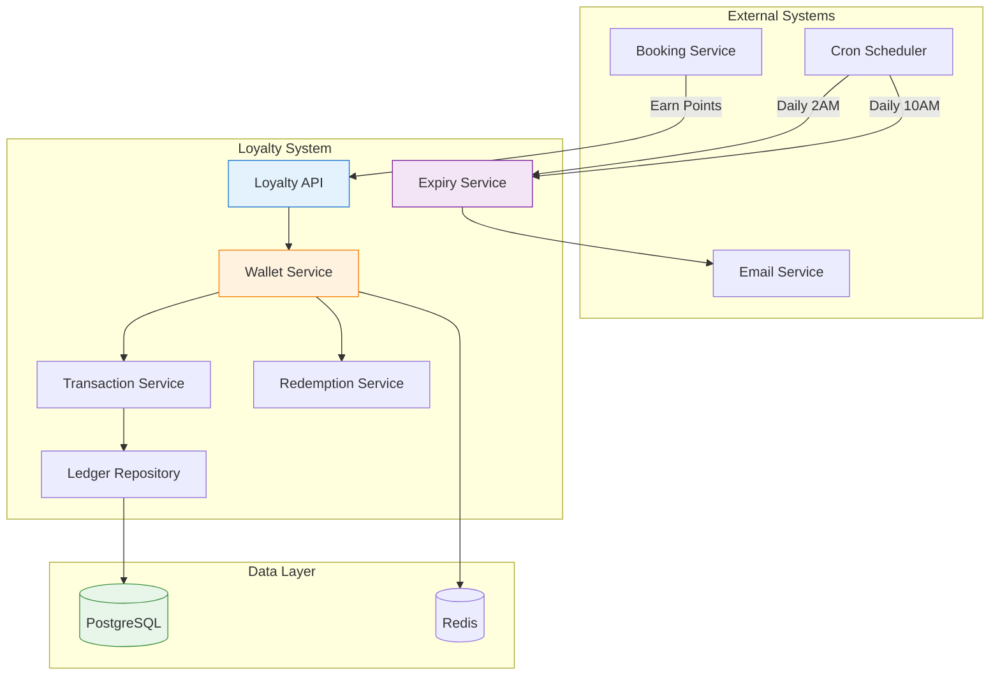
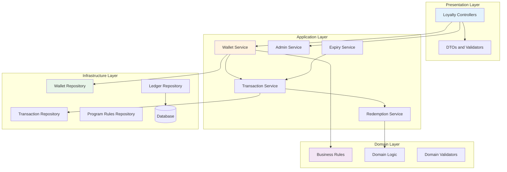
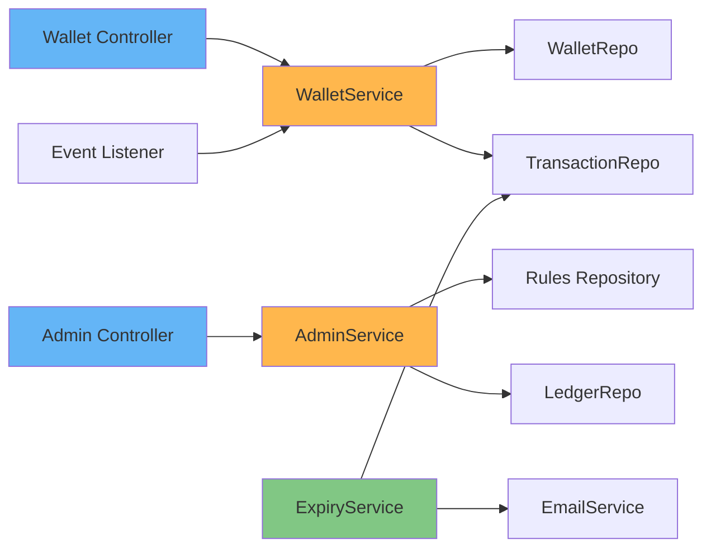
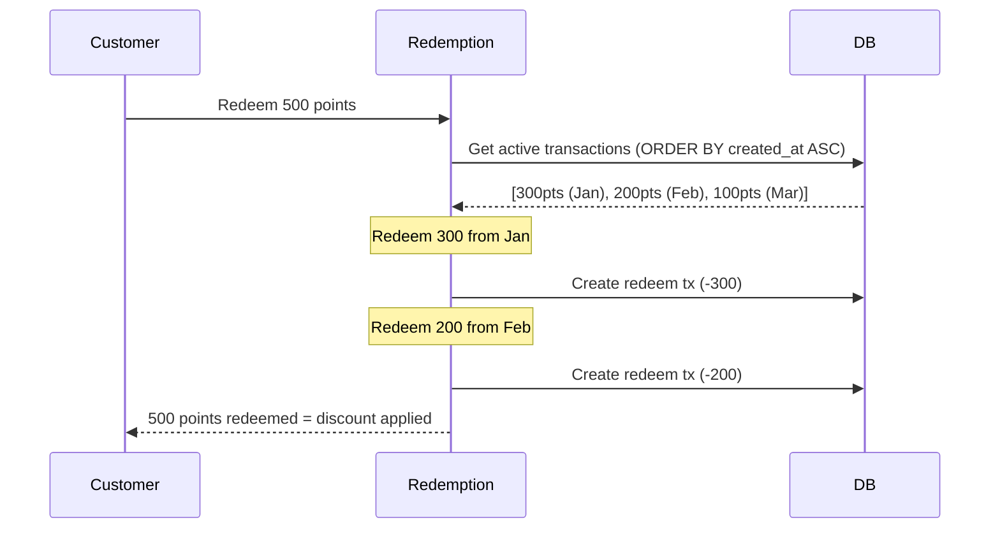
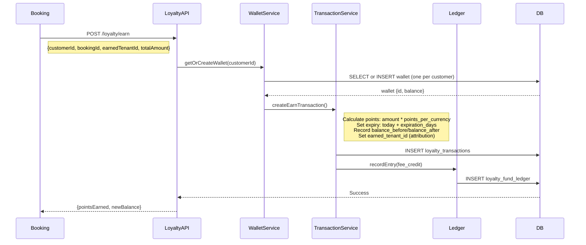
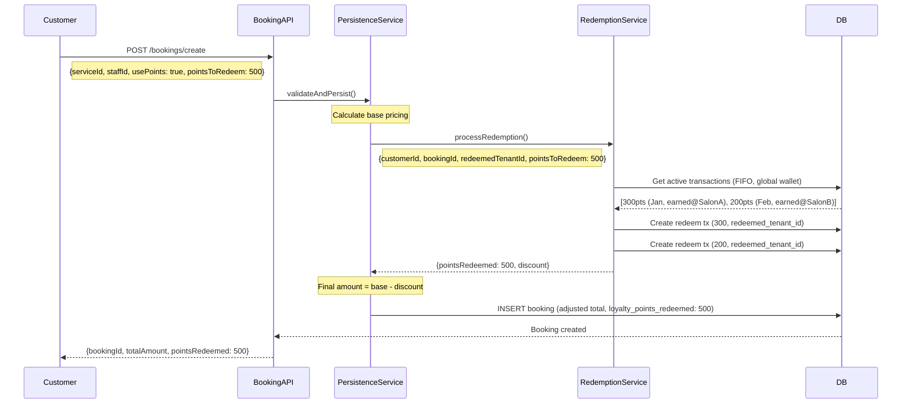
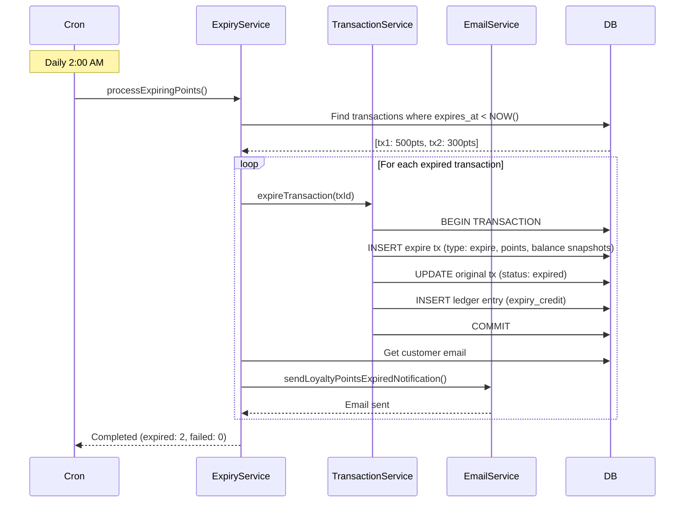

# Portfolio Note

> Extracted from production system, sanitized for portfolio use.

---

# Loyalty System Architecture

**Status:** Production Ready
**Last Updated:** February 17, 2026
**Version:** 2.1 - Global Wallet with Tenant Attribution

---

## Table of Contents

1. [Executive Summary](#executive-summary)
2. [System Overview](#system-overview)
3. [Architecture Design](#architecture-design)
4. [Database Schema (Source of Truth)](#database-schema-source-of-truth)
5. [Core Components](#core-components)
6. [Business Flows](#business-flows)
7. [Business Rules](#business-rules)
8. [Tenant Attribution Model](#tenant-attribution-model)
9. [Technical Patterns](#technical-patterns)
10. [Automation and Cron Jobs](#automation-and-cron-jobs)
11. [Email Notifications](#email-notifications)
12. [Multi-Tenancy and Security](#multi-tenancy-and-security)
13. [Testing Strategy](#testing-strategy)
14. [Operational Guidelines](#operational-guidelines)
15. [Quick Start for Developers](#quick-start-for-developers)
16. [FAQ](#faq)
17. [Migration History](#migration-history)
18. [Future Enhancements](#future-enhancements)

---

## Executive Summary

The the Platform loyalty system is a **global, cross-organization/business points wallet** similar to Uber credits or Amazon points. Customers earn and redeem points across any organization/business on the platform, with transparent tenant attribution for financial settlement.

### Key Characteristics

- **Global Wallet**: One wallet per customer, usable at any organization/business
- **Cross-organization/business Redemption**: Earn at organization/business A, redeem at organization/business B
- **Tenant Attribution**: Track earn/redeem organization/business for accounting
- **Platform-Level Rules**: Single set of rates for all organizations/businesses
- **FIFO Redemption**: Oldest points redeemed first
- **Auto-Expiry**: Points expire after configurable number of days with email warnings
- **Transaction Safety**: All operations wrapped in database transactions
- **Audit Trail**: Complete history via immutable ledger with balance snapshots

---

## System Overview

### System Boundaries



### Core Capabilities

| Capability              | Description                               | Status   |
| ----------------------- | ----------------------------------------- | -------- |
| Earn Points             | Award points on booking completion        | Complete |
| Redeem Points           | Use points for discounts (FIFO)           | Complete |
| Expiry Management       | Auto-expire after configurable days       | Complete |
| Email Notifications     | 7-day, 1-day warnings + expired notice    | Complete |
| Wallet Balance          | Real-time balance calculation             | Complete |
| Transaction History     | Complete audit trail with balance snapshots| Complete |
| Tenant Attribution      | Track earn/redeem by organization/business for accounting | Complete |
| Global Redemption       | Use points at any organization/business on platform       | Complete |
| Idempotent Transactions | Prevent duplicate point awards            | Complete |

---

## Architecture Design

### Clean Architecture Layers



### Module Structure

```
apps/api/src/loyalty/
├── controllers/
│   ├── loyalty-wallet.controller.ts       # Customer-facing REST endpoints
│   └── loyalty-admin.controller.ts        # Admin REST endpoints
├── services/
│   ├── loyalty-wallet.service.ts          # Wallet operations
│   ├── loyalty-admin.service.ts           # Admin operations
│   └── loyalty-expiry.service.ts          # Expiry automation
├── repositories/
│   ├── loyalty-wallet.repository.ts
│   ├── loyalty-transaction.repository.ts
│   ├── loyalty-program-rules.repository.ts
│   └── loyalty-fund-ledger.repository.ts
├── dtos/
│   ├── earn-points.dto.ts
│   ├── redeem-points.dto.ts
│   └── wallet-response.dto.ts
├── listeners/
│   └── loyalty-event.listener.ts          # Event-driven point earning
├── swagger/
│   ├── loyalty-wallet.swagger.ts
│   └── loyalty-admin.swagger.ts
└── loyalty.module.ts
```

### Dependency Injection Graph



---

## Database Schema (Source of Truth)

> These definitions reflect the actual Drizzle ORM schema in `packages/db/src/schema/loyalty/`.
> If this documentation diverges from the code, update the documentation.

### loyalty_wallets - Customer Global Wallet

**File:** `packages/db/src/schema/loyalty/loyalty-wallets.ts`

No `tenant_id` column. One wallet per customer, usable across all organizations/businesses.

| Column             | Type                     | Constraints                        | Notes                       |
| ------------------ | ------------------------ | ---------------------------------- | --------------------------- |
| id                 | serial                   | PRIMARY KEY                        |                             |
| customer_id        | integer                  | NOT NULL, UNIQUE, FK customer_profiles | One wallet per customer |
| balance            | integer                  | NOT NULL, DEFAULT 0, CHECK >= 0    | Materialized balance        |
| lifetime_earned    | integer                  | NOT NULL, DEFAULT 0, CHECK >= 0    | Cumulative earned total     |
| lifetime_redeemed  | integer                  | NOT NULL, DEFAULT 0, CHECK >= 0    | Cumulative redeemed total   |
| lifetime_expired   | integer                  | NOT NULL, DEFAULT 0, CHECK >= 0    | Cumulative expired total    |
| last_activity_at   | timestamp with time zone | DEFAULT NOW()                      |                             |
| created_at         | timestamp with time zone | DEFAULT NOW()                      |                             |
| updated_at         | timestamp with time zone | DEFAULT NOW()                      |                             |
| deleted_at         | timestamp with time zone | nullable                           | Soft delete support         |

**Indexes:**

- `idx_loyalty_wallet_customer` on `(customer_id)`
- `idx_loyalty_wallet_active` on `(customer_id)` WHERE `deleted_at IS NULL`

### loyalty_program_rules - Platform Configuration (Singleton)

**File:** `packages/db/src/schema/loyalty/loyalty-program-rules.ts`

No `tenant_id` column. Single row controls platform-wide loyalty behavior.

| Column              | Type          | Constraints                        | Default  | Notes                    |
| ------------------- | ------------- | ---------------------------------- | -------- | ------------------------ |
| id                  | serial        | PRIMARY KEY                        |          |                          |
| is_enabled          | boolean       | NOT NULL                           | true     | Master toggle            |
| points_per_currency | decimal(8,4)  | NOT NULL, CHECK > 0                | 1.0000   | Points earned per $1     |
| redemption_value    | decimal(8,4)  | NOT NULL, CHECK > 0                | 0.0100   | Dollar value per point   |
| max_redemption_rate | decimal(5,2)  | NOT NULL, CHECK > 0 AND <= 100     | 20.00    | Max % discount on booking|
| loyalty_fee_rate    | decimal(5,4)  | NOT NULL, CHECK >= 0 AND <= 100    | 0.0100   | Platform fee rate        |
| expiration_days     | integer       | NOT NULL, CHECK > 0                | 60       | Days until points expire |
| created_at          | timestamp with time zone | DEFAULT NOW()             |          |                          |
| updated_at          | timestamp with time zone | DEFAULT NOW()             |          |                          |

### loyalty_transactions - Point Movements with Attribution

**File:** `packages/db/src/schema/loyalty/loyalty-transactions.ts`

| Column               | Type                          | Constraints                     | Notes                          |
| -------------------- | ----------------------------- | ------------------------------- | ------------------------------ |
| id                   | serial                        | PRIMARY KEY                     |                                |
| wallet_id            | integer                       | NOT NULL, FK loyalty_wallets    |                                |
| type                 | enum (loyalty_transaction_type_v2) | NOT NULL                   | 'earn', 'redeem', 'expire', 'adjustment' |
| status               | enum (loyalty_transaction_status_v2) | NOT NULL, DEFAULT 'active' | 'active', 'settled', 'expired', 'voided' |
| idempotency_key      | varchar(255)                  | UNIQUE, nullable                | Prevents duplicate transactions|
| points               | integer                       | NOT NULL, CHECK > 0             | Always positive                |
| monetary_value       | decimal(12,2)                 | NOT NULL, CHECK >= 0            | Dollar equivalent              |
| balance_before       | integer                       | NOT NULL, CHECK >= 0            | Wallet balance snapshot before |
| balance_after        | integer                       | NOT NULL, CHECK >= 0            | Wallet balance snapshot after  |
| earned_tenant_id     | integer                       | nullable, FK tenants            | Which organization/business gave points        |
| redeemed_tenant_id   | integer                       | nullable, FK tenants            | Which organization/business redeemed points    |
| booking_id           | integer                       | nullable, FK bookings           |                                |
| earned_at            | timestamp with time zone      | DEFAULT NOW()                   |                                |
| expires_at           | timestamp with time zone      | NOT NULL                        |                                |
| settled_at           | timestamp with time zone      | nullable                        |                                |
| metadata             | jsonb                         | nullable                        | Flexible metadata storage      |
| created_at           | timestamp with time zone      | DEFAULT NOW()                   |                                |

**Indexes:**

- `idx_loyalty_txn_wallet` on `(wallet_id)`
- `idx_loyalty_txn_status` on `(status)`
- `idx_loyalty_txn_expiry` on `(expires_at)` WHERE `status = 'active'`
- `idx_loyalty_txn_booking` on `(booking_id)`
- `idx_loyalty_txn_earned_tenant` on `(earned_tenant_id)`
- `idx_loyalty_txn_redeemed_tenant` on `(redeemed_tenant_id)`
- `idx_loyalty_txn_idempotency` on `(idempotency_key)`

### loyalty_fund_ledger - Financial Accounting

**File:** `packages/db/src/schema/loyalty/loyalty-fund-ledger.ts`

| Column                 | Type                          | Constraints                     | Notes                        |
| ---------------------- | ----------------------------- | ------------------------------- | ---------------------------- |
| id                     | serial                        | PRIMARY KEY                     |                              |
| type                   | enum (loyalty_fund_entry_type)| NOT NULL                        | 'fee_credit', 'redemption_debit', 'expiry_credit', 'adjustment' |
| amount                 | decimal(12,2)                 | NOT NULL                        |                              |
| balance_before         | decimal(12,2)                 | NOT NULL, CHECK >= 0            | Fund balance snapshot before |
| balance_after          | decimal(12,2)                 | NOT NULL, CHECK >= 0            | Fund balance snapshot after  |
| booking_id             | integer                       | nullable, FK bookings           |                              |
| loyalty_transaction_id | integer                       | nullable, FK loyalty_transactions|                             |
| tenant_id              | integer                       | nullable, FK tenants            | Per-organization/business accounting         |
| notes                  | text                          | nullable                        |                              |
| created_by             | integer                       | nullable, FK users              | Audit: who created entry     |
| created_at             | timestamp with time zone      | DEFAULT NOW()                   |                              |

**Indexes:**

- `idx_loyalty_fund_type` on `(type)`
- `idx_loyalty_fund_booking` on `(booking_id)`
- `idx_loyalty_fund_tenant` on `(tenant_id)`
- `idx_loyalty_fund_date` on `(created_at)`

---

## Core Components

### Wallet Service

**Responsibility:** Manage customer wallet lifecycle and balance calculation.

| Method                    | Purpose                             | Transaction Safe  |
| ------------------------- | ----------------------------------- | ----------------- |
| `getOrCreateWallet()`     | Get/create customer wallet          | Yes               |
| `getBalance()`            | Calculate current available balance | No (read-only)    |
| `getTransactionHistory()` | Retrieve all transactions           | No (read-only)    |
| `getExpiringPoints()`     | Find points expiring soon           | No (read-only)    |

**Balance Calculation Logic:**

```typescript
// Real-time balance = SUM of all active transactions
const balance = await db
  .select({ total: sql`COALESCE(SUM(points), 0)` })
  .from(loyaltyTransactions)
  .where(
    and(
      eq(loyaltyTransactions.wallet_id, walletId),
      eq(loyaltyTransactions.status, 'active'),
    ),
  );
```

### Transaction Service

**Responsibility:** Create and manage loyalty transactions (earn/redeem/expire/adjust).

| Type       | Points   | Status Lifecycle            | Reversible |
| ---------- | -------- | --------------------------- | ---------- |
| earn       | Positive | active -> expired           | Yes        |
| redeem     | Positive | active (permanent)          | No         |
| expire     | Positive | active (permanent)          | No         |
| adjustment | Positive | active (permanent)          | No         |

> Note: `points` column is always positive (CHECK > 0). The `type` column determines
> whether points are added or subtracted from the wallet balance.

### Redemption Service

**Responsibility:** Handle FIFO redemption logic for booking discounts.

**FIFO Algorithm:**



**Implementation:**

```typescript
async processRedemption(input: {
  customerId: number;
  bookingId: number;
  redeemedTenantId: number;
  pointsToRedeem: number;
}): Promise<{
  pointsRedeemed: number;
  monetaryDiscount: number;
  redemptionDetails: Array<{ transactionId: number; points: number }>;
}> {
  // 1. Get active transactions (FIFO order) from customer's GLOBAL wallet
  const activeTransactions = await this.getActiveTransactions(customerId);

  // 2. Redeem from oldest first
  let remaining = pointsToRedeem;
  const redemptions = [];

  for (const tx of activeTransactions) {
    if (remaining <= 0) break;
    const toRedeem = Math.min(tx.points, remaining);
    await this.createRedeemTransaction(wallet.id, toRedeem, bookingId);
    redemptions.push({ transactionId: tx.id, points: toRedeem });
    remaining -= toRedeem;
  }

  // 3. Calculate discount using platform rules
  const monetaryDiscount = pointsToRedeem * rules.redemptionValue;

  return { pointsRedeemed, monetaryDiscount, redemptionDetails: redemptions };
}
```

### Expiry Service

**Responsibility:** Automated point expiration and notification management.

| Schedule     | Job                       | Purpose                              |
| ------------ | ------------------------- | ------------------------------------ |
| `0 2 * * *`  | `processExpiringPoints()` | Expire points past configured days   |
| `0 10 * * *` | `sendExpiryReminders()`   | Send 7-day and 1-day warnings        |

### Event Listener

**Responsibility:** React to booking completion events to award points automatically.

**File:** `apps/api/src/loyalty/listeners/loyalty-event.listener.ts`

---

## Business Flows

### Earn Points Flow

**Trigger:** Booking marked as `completed`



### Redeem Points Flow (Booking Integration)

**Trigger:** Customer creates booking with `usePoints: true`



**Booking Integration Code:**

```typescript
// booking-persistence.service.ts
async persistBooking(dto: CreateBookingDto) {
  const pricing = await this.pricingService.calculate(...);

  let loyaltyDiscount = 0;
  let loyaltyPointsRedeemed = 0;

  if (dto.usePoints && dto.pointsToRedeem) {
    const result = await this.loyaltyRedemptionService.processRedemption({
      customerId: dto.customerId,
      bookingId: tempBookingId,
      redeemedTenantId: dto.tenantId,
      pointsToRedeem: dto.pointsToRedeem,
    });
    loyaltyDiscount = result.monetaryDiscount;
    loyaltyPointsRedeemed = result.pointsRedeemed;
  }

  const finalTotal = Math.max(0, pricing.totalAmount - loyaltyDiscount);

  const booking = await this.db.insert(bookings).values({
    ...dto,
    total_amount: finalTotal,
    loyalty_points_redeemed: loyaltyPointsRedeemed,
  });

  return booking;
}
```

### Point Expiry Flow

**Trigger:** Automated cron job (daily 2:00 AM)



---

## Business Rules

| Rule                 | Value (default)           | Configurable | Notes                          |
|----------------------|---------------------------|--------------|--------------------------------|
| Earn Rate            | 1.0 pt per $1             | Yes          | Platform-wide `points_per_currency` |
| Redemption Value     | $0.01 per point           | Yes          | Platform-wide `redemption_value` |
| Max Discount         | 20%                       | Yes          | Of booking total `max_redemption_rate` |
| Expiration           | 60 days                   | Yes          | From earn date `expiration_days` |
| Platform Fee         | 1%                        | Yes          | On point transactions `loyalty_fee_rate` |
| FIFO Order           | Yes                       | No           | Always oldest first            |
| Cross-organization/business          | Yes                       | No           | Global wallet design           |
| Idempotency          | Yes                       | No           | Via `idempotency_key` on transactions |

### API Endpoints

```typescript
// Get customer redemption info (global wallet)
GET /loyalty/wallet/redemption-info
Response: {
  isEnabled: true,
  balance: 1500,
  pointsPerCurrency: 1.0,
  redemptionValue: 0.01,
  maxRedemptionRate: 20.0
}

// Get transaction history
GET /loyalty/wallet/transactions
Response: {
  transactions: [
    {
      type: 'earn',
      points: 1000,
      monetaryValue: 10.00,
      earnedAtSalon: 'organization/business A',
      balanceBefore: 500,
      balanceAfter: 1500,
      createdAt: '2026-01-01',
      expiresAt: '2026-03-02',
      status: 'active'
    }
  ],
  totalBalance: 1500
}

// Award points (internal - called by booking service)
POST /loyalty/wallet/earn
Body: {
  customerId: 1,
  bookingId: 123,
  earnedTenantId: 456,
  totalAmount: 100.00
}

// Process redemption (internal - called by booking service)
POST /loyalty/wallet/redeem
Body: {
  customerId: 1,
  bookingId: 789,
  redeemedTenantId: 456,
  pointsToRedeem: 500
}
```

---

## Tenant Attribution Model

**Purpose:** Track which organization/business earned/redeemed points for financial settlement.

**Example Scenario:**

```
Customer Sara:
  +-- Jan 1: Books at organization/business A ($100) -> Earns 100 points
  |         Database: earned_tenant_id = organization/business A ID
  |
  +-- Jan 15: Books at organization/business B ($50), redeems 50 points
              Database: redeemed_tenant_id = organization/business B ID

Financial Settlement:
  +-- organization/business A funded: 100 points ($1.00 value at $0.01/pt)
  +-- organization/business B redeemed: 50 points ($0.50 discount given)
  +-- Net Platform Liability: 50 points ($0.50)
```

**Ledger Entries:**

```sql
-- When Sara earned at organization/business A (platform collects fee)
INSERT INTO loyalty_fund_ledger (
  type: 'fee_credit',
  amount: 1.00,
  balance_before: 0.00,
  balance_after: 1.00,
  tenant_id: <organization/business A>,
  notes: '100 points earned from booking'
);

-- When Sara redeemed at organization/business B
INSERT INTO loyalty_fund_ledger (
  type: 'redemption_debit',
  amount: 0.50,
  balance_before: 1.00,
  balance_after: 0.50,
  tenant_id: <organization/business B>,
  notes: '50 points redeemed for booking discount'
);
```

---

## Technical Patterns

### Transaction Safety

All write operations are wrapped in database transactions:

```typescript
async processRedemption(input: RedemptionInput) {
  return this.db.transaction(async (tx) => {
    const wallet = await this.walletRepo.findByCustomerId(
      input.customerId, tx
    );

    if (wallet.balance < input.pointsToRedeem) {
      throw new InsufficientPointsException();
    }

    const redemptions = await this.createRedemptions(input, tx);

    for (const redemption of redemptions) {
      await this.ledgerRepo.recordEntry({
        type: 'redemption_debit',
        amount: redemption.monetaryValue,
        balance_before: ...,
        balance_after: ...,
      }, tx);
    }

    return { pointsRedeemed: input.pointsToRedeem, redemptions };
  });
}
```

### Repository Pattern

Strict separation between data access and business logic:

```typescript
// Repository: Data access only
class LoyaltyTransactionRepository {
  async findActiveByWallet(walletId: number) {
    return this.db
      .select()
      .from(loyaltyTransactions)
      .where(
        and(
          eq(loyaltyTransactions.wallet_id, walletId),
          eq(loyaltyTransactions.status, 'active'),
        ),
      )
      .orderBy(asc(loyaltyTransactions.created_at));
  }
}

// Service: Business logic
class LoyaltyTransactionService {
  async createEarnTransaction(input: EarnInput) {
    const points = this.calculatePoints(input.amount);
    const expiryDate = this.calculateExpiry();
    if (points < 0) throw new InvalidPointsException();

    return this.transactionRepo.create({
      wallet_id: input.walletId,
      type: 'earn',
      points,
      expires_at: expiryDate,
    });
  }
}
```

### Caching Strategy

```typescript
// Cache key pattern: loyalty:wallet:{customerId}:balance
const cacheKey = `loyalty:wallet:${customerId}:balance`;

async getBalance(customerId: number) {
  const cached = await this.cacheService.get(cacheKey);
  if (cached) return JSON.parse(cached);

  const balance = await this.calculateBalance(customerId);
  await this.cacheService.set(cacheKey, JSON.stringify(balance), 300); // 5 min TTL
  return balance;
}

// Invalidate on any write operation
async createTransaction(tx: Transaction) {
  await this.transactionRepo.create(tx);
  await this.cacheService.del(`loyalty:wallet:${tx.customer_id}:balance`);
}
```

### Error Handling

Custom exception hierarchy for clear error responses:

```typescript
export class LoyaltyException extends HttpException {
  constructor(message: string, status: HttpStatus) {
    super({ error: 'LOYALTY_ERROR', message }, status);
  }
}

export class InsufficientPointsException extends LoyaltyException {
  constructor(available: number, requested: number) {
    super(
      `Insufficient points. Available: ${available}, Requested: ${requested}`,
      HttpStatus.BAD_REQUEST,
    );
  }
}

export class WalletNotFoundException extends LoyaltyException {
  constructor(customerId: number) {
    super(`Wallet not found for customer ${customerId}`, HttpStatus.NOT_FOUND);
  }
}

export class ExpiredPointsException extends LoyaltyException {
  constructor() {
    super('Cannot redeem expired points', HttpStatus.BAD_REQUEST);
  }
}
```

---

## Automation and Cron Jobs

### Job Schedule

| Job                         | Schedule       | Purpose                             | Estimated Runtime |
| --------------------------- | -------------- | ----------------------------------- | ----------------- |
| Process Expiring Points     | Daily 2:00 AM  | Expire points past configured days  | 2-5 minutes       |
| Send Expiry Reminders       | Daily 10:00 AM | Send 7-day and 1-day warnings       | 5-10 minutes      |

### Implementation

```typescript
@Injectable()
export class LoyaltyExpiryService {
  private readonly logger = new Logger(LoyaltyExpiryService.name);

  @Cron('0 2 * * *', { name: 'processExpiringPoints' })
  async processExpiringPoints() {
    this.logger.log('[CRON] Starting point expiry process...');
    const startTime = Date.now();
    let expired = 0;
    let failed = 0;

    try {
      const transactions = await this.transactionRepo.findExpiredTransactions();
      this.logger.log(`[CRON] Found ${transactions.length} expired transactions`);

      for (const tx of transactions) {
        try {
          await this.expireTransaction(tx);
          expired++;
        } catch (error) {
          this.logger.error(
            `[CRON] Failed to expire transaction ${tx.id}`,
            error instanceof Error ? error.stack : String(error),
          );
          failed++;
        }
      }

      const duration = Date.now() - startTime;
      this.logger.log(
        `[CRON] Expiry process completed. ` +
        `Expired: ${expired}, Failed: ${failed}, Duration: ${duration}ms`,
      );
    } catch (error) {
      this.logger.error(
        '[CRON] Expiry process failed',
        error instanceof Error ? error.stack : String(error),
      );
    }
  }

  @Cron('0 10 * * *', { name: 'sendExpiryReminders' })
  async sendExpiryReminders() {
    this.logger.log('[CRON] Starting expiry reminder process...');
    await this.send7DayReminders();
    await this.send1DayReminders();
    this.logger.log('[CRON] Reminder process completed');
  }
}
```

### Monitoring and Alerts

**Log patterns:**

```
[CRON] Starting point expiry process...
[CRON] Found 45 expired transactions
[CRON] Expired transaction 12345: 500 points for customer 678
[CRON] Sent expiry notification to customer@email.com
[CRON] Expiry process completed. Expired: 45, Failed: 0, Duration: 3240ms
```

**Alert triggers:**

- Failed > 10% of transactions
- Runtime > 10 minutes
- Email delivery failure rate > 5%

---

## Email Notifications

### Template System

**Templates location:** `packages/email/src/templates/loyalty/`

| Template             | Trigger              | Subject                                  |
| -------------------- | -------------------- | ---------------------------------------- |
| `expiring-7day.hbs`  | 7 days before expiry | "Your the Platform points expire in 7 days!" |
| `expiring-1day.hbs`  | 1 day before expiry  | "Last chance! Points expire tomorrow"    |
| `points-expired.hbs` | After expiry         | "Your loyalty points have expired"       |

### Email Service Integration

```typescript
@Injectable()
export class EmailService {
  async sendLoyaltyExpiryWarning7Day(
    to: string,
    customerName: string,
    expiringPoints: number,
    expiryDate: string,
    totalBalance: number,
    bookingUrl: string,
  ) {
    const monetaryValue = (expiringPoints * rules.redemptionValue).toFixed(2);

    await this.sendTemplatedEmail({
      to,
      subject: 'Your the Platform points expire in 7 days!',
      template: 'loyalty/expiring-7day',
      context: {
        customerName,
        expiringPoints,
        expiryDate,
        monetaryValue,
        totalBalance,
        bookingUrl,
      },
    });
  }
}
```

---

## Multi-Tenancy and Security

### Global Wallet Architecture

One wallet per customer with no `tenant_id` on the wallet itself:

```typescript
// Global wallet query (no tenant filter)
async findByCustomerId(customerId: number) {
  return this.db
    .select()
    .from(loyaltyWallets)
    .where(eq(loyaltyWallets.customer_id, customerId));
}

// Transactions track attribution via earned_tenant_id / redeemed_tenant_id
```

### Authorization Guard

```typescript
@Injectable()
export class LoyaltyOwnershipGuard implements CanActivate {
  canActivate(context: ExecutionContext): boolean {
    const request = context.switchToHttp().getRequest();
    const user = request.user;
    const tokenCustomerId = user.customerId;
    const requestCustomerId = parseInt(request.params.customerId);

    if (tokenCustomerId !== requestCustomerId) {
      throw new ForbiddenException(
        'Unauthorized: Cannot access other customer wallets',
      );
    }
    return true;
  }
}
```

### Access Control Summary

| Resource          | Customer Access         | organization/business Access              | Platform Access |
| ----------------- | ----------------------- | ------------------------- | --------------- |
| Wallet Balance    | Own wallet only         | Not directly              | All wallets     |
| Transactions      | Own transactions only   | Attributed transactions   | All             |
| Program Rules     | Read-only               | Read-only                 | Read/Write      |
| Fund Ledger       | Not accessible          | Own tenant entries        | All entries     |

---

## Testing Strategy

### Test Pyramid

```
           /\
          /  \    E2E Tests (5%)
         /----\   - Full booking + redemption flow
        /      \
       /--------\ Integration Tests (25%)
      /          \ - Service interactions
     /------------\ - Database transactions
    /--------------\ Unit Tests (70%)
   /                \ - Business logic
  /------------------\ - FIFO algorithm
                       - Balance calculations
```

### Key Test Scenarios

**Unit Tests:**

```typescript
describe('LoyaltyRedemptionService', () => {
  it('should redeem points using FIFO', async () => {
    const transactions = [
      { id: 1, points: 300, created_at: '2024-01-01' },
      { id: 2, points: 200, created_at: '2024-01-15' },
      { id: 3, points: 100, created_at: '2024-02-01' },
    ];

    const result = await service.processRedemption({ pointsToRedeem: 450 });

    expect(result.pointsRedeemed).toBe(450);
    expect(result.redemptionDetails).toEqual([
      { transactionId: 1, points: 300 },
      { transactionId: 2, points: 150 },
    ]);
  });

  it('should throw error when insufficient points', async () => {
    await expect(
      service.processRedemption({ pointsToRedeem: 500 }),
    ).rejects.toThrow(InsufficientPointsException);
  });
});
```

**Integration Tests:**

```typescript
describe('Booking with Loyalty Redemption', () => {
  it('should apply loyalty discount to booking total', async () => {
    const customer = await createTestCustomer();
    await earnPoints(customer.id, 1000);

    const booking = await bookingService.create({
      customerId: customer.id,
      serviceId: 1,
      totalAmount: 50,
      usePoints: true,
      pointsToRedeem: 500,
    });

    expect(booking.total_amount).toBe(45);
    expect(booking.loyalty_points_redeemed).toBe(500);

    const balance = await loyaltyService.getBalance(customer.id);
    expect(balance).toBe(500);
  });
});
```

**Security Tests:**

```typescript
describe('Customer Wallet Security', () => {
  it('should not allow accessing other customer wallets', async () => {
    const customer1 = await createCustomer();
    const customer2 = await createCustomer();
    await earnPoints(customer1.id, 1000);

    await expect(
      walletService.getBalance(customer1.id, customer2.authToken),
    ).rejects.toThrow(ForbiddenException);
  });

  it('should allow cross-organization/business redemption', async () => {
    const customer = await createCustomer();
    await earnPoints(customer.id, 1000, { tenantId: 1 });

    const result = await redemptionService.processRedemption({
      customerId: customer.id,
      bookingTenantId: 2,
      pointsToRedeem: 500,
    });

    expect(result.pointsRedeemed).toBe(500);
    expect(result.transaction.redeemed_tenant_id).toBe(2);
  });
});
```

### Test Locations

- `apps/api/src/loyalty/services/__tests__/loyalty-wallet.service.spec.ts`
- `apps/api/src/loyalty/services/__tests__/loyalty-admin.service.spec.ts`
- `apps/api/src/loyalty/listeners/__tests__/loyalty-event.listener.spec.ts`

---

## Operational Guidelines

### Deployment Checklist

- [ ] Database migrations applied (`pnpm --filter @the platform/db migrate`)
- [ ] Redis cache cleared for loyalty keys
- [ ] Environment variables configured: `FRONTEND_URL`, `SMTP_*`, `DATABASE_URL`
- [ ] Cron jobs enabled in production scheduler
- [ ] Monitoring dashboards configured
- [ ] Alert rules configured

### Monitoring Queries

```sql
-- Active wallets (global count)
SELECT COUNT(*) as active_wallets
FROM loyalty_wallets
WHERE deleted_at IS NULL;

-- Total active points (platform-wide)
SELECT SUM(balance) as total_active_points
FROM loyalty_wallets
WHERE deleted_at IS NULL;

-- Points by organization/business (attribution tracking)
SELECT
  t.name as salon_name,
  SUM(lt.points) as points_earned
FROM loyalty_transactions lt
JOIN tenants t ON t.id = lt.earned_tenant_id
WHERE lt.status = 'active' AND lt.type = 'earn'
GROUP BY t.id, t.name
ORDER BY points_earned DESC;

-- Points expiring this week
SELECT COUNT(*) as expiring_count, SUM(points) as expiring_points
FROM loyalty_transactions
WHERE status = 'active'
  AND expires_at BETWEEN NOW() AND NOW() + INTERVAL '7 days';
```

### Performance Benchmarks

| Operation     | Target Latency | Max Latency | Notes                 |
| ------------- | -------------- | ----------- | --------------------- |
| Get Balance   | < 50ms         | 200ms       | With Redis cache      |
| Earn Points   | < 100ms        | 300ms       | Single transaction    |
| Redeem Points | < 150ms        | 500ms       | FIFO lookup + writes  |
| Expiry Job    | < 5min         | 10min       | Processes all records |
| Email Send    | < 2s           | 5s          | Per notification      |

### Troubleshooting Guide

**Issue: Points not earned after booking**

```bash
# Check transaction record
SELECT * FROM loyalty_transactions WHERE booking_id = 12345;

# Check wallet exists
SELECT * FROM loyalty_wallets WHERE customer_id = 678;
```

**Issue: Redemption fails with "Insufficient points"**

```typescript
const wallet = await walletService.getBalance(customerId);
console.log('Available balance:', wallet.balance);

const expiring = await walletService.getExpiringPoints(customerId, 7);
console.log('Expiring in 7 days:', expiring);
```

**Issue: Email notifications not sent**

```bash
# Check cron job execution
docker logs api | grep "CRON"

# Check email service logs
docker logs api | grep "LOYALTY.*email"
```

### Rollback Procedures

**Scenario: Need to reverse expiry job**

```sql
-- 1. Find expired points from last run
SELECT * FROM loyalty_transactions
WHERE type = 'expire'
  AND created_at > NOW() - INTERVAL '2 hours';

-- 2. Restore points (manual SQL - use with caution)
BEGIN;
DELETE FROM loyalty_transactions WHERE id IN (/* expired tx IDs */);
UPDATE loyalty_transactions SET status = 'active' WHERE id IN (/* original tx IDs */);
COMMIT;
```

---

## Quick Start for Developers

### Database Setup

```bash
pnpm --filter @the platform/db generate
pnpm --filter @the platform/db migrate
```

### Running Tests

```bash
cd apps/api
npx jest loyalty --no-coverage --verbose
```

### Development Server

```bash
# Backend (includes cron jobs)
pnpm --filter @app/api dev

# Frontend
pnpm --filter web dev
```

### Related Code Locations

| Component         | Path                                                                 |
| ----------------- | -------------------------------------------------------------------- |
| DB Schema         | `packages/db/src/schema/loyalty/*.ts`                                |
| Backend Module    | `apps/api/src/loyalty/`                                              |
| Frontend API      | `apps/web/src/lib/api/loyalty-api.ts`                                |
| Redemption UI     | `apps/web/src/components/features/booking/molecules/loyalty-points-redemption.tsx` |
| Wallet Seeder     | `packages/db/src/seeders/loyalty-wallet-seeder.ts`                   |

---

## FAQ

**Q: Where do I find the database schema?**
A: See [Database Schema (Source of Truth)](#database-schema-source-of-truth) above. Code lives in `packages/db/src/schema/loyalty/`.

**Q: How do I implement loyalty in a new booking flow?**
A: See [Redeem Points Flow](#redeem-points-flow-booking-integration) for the complete integration pattern.

**Q: What is the difference between earned_tenant_id and redeemed_tenant_id?**
A: See [Tenant Attribution Model](#tenant-attribution-model). `earned_tenant_id` records which organization/business's booking generated the points. `redeemed_tenant_id` records which organization/business's booking consumed the points.

**Q: Can a customer redeem points at a different organization/business than where they earned them?**
A: Yes. That is the core feature of the global wallet design which has no `tenant_id` on the wallet itself.

**Q: Who pays for the discount when cross-organization/business redemption happens?**
A: The `loyalty_fund_ledger` tracks financial attribution per tenant. See [Tenant Attribution Model](#tenant-attribution-model).

**Q: What are the transaction types and statuses?**
A: Types: `earn`, `redeem`, `expire`, `adjustment`. Statuses: `active`, `settled`, `expired`, `voided`.

---

## Migration History

### v1.0 to v2.0 (February 2026)

**Breaking Changes:**

- Removed `tenant_id` from `loyalty_program_rules`
- Removed `tenant_id` from `loyalty_wallets`
- Added `earned_tenant_id` to `loyalty_transactions`
- Added `redeemed_tenant_id` to `loyalty_transactions`

**Migration:** `0003_chunky_quasimodo.sql`

**Rationale:** Prevent arbitrage risk where customers earn at one rate (organization/business A) and redeem at another (organization/business B). Global rules ensure consistent economics.

### Deprecated Documents (Removed February 2026)

- **GLOBAL_WALLET_PROPOSAL.md** - Was a proposal; global wallet is now implemented.
- **CUSTOMER_LOYALTY_UX_COMPLETE_GUIDE.md** - Described outdated per-tenant model.

---

## Future Enhancements

### Phase 2 Features (Not Implemented)

| Feature             | Description                               | Complexity |
| ------------------- | ----------------------------------------- | ---------- |
| Tier System         | Bronze/Silver/Gold tiers with multipliers | Medium     |
| Referral Points     | Earn points for referring friends          | Low        |
| Bonus Events        | Double points on holidays                 | Low        |
| Point Transfer      | Transfer points between customers         | High       |

### Architecture Evolution

**Current:** Global wallet with tenant attribution tracking.
**Future:** Enhanced settlement automation between platform and organizations/businesses.

---

**Document Owner:** Engineering Team
**Review Frequency:** Quarterly
**Last Review:** February 17, 2026
