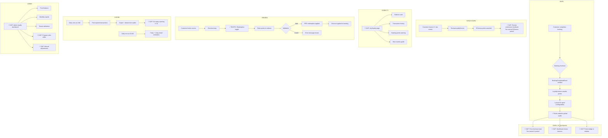

# Portfolio Note

> Extracted from production system, sanitized for portfolio use.

---

# Loyalty Program — UX Integration Architecture

**Status:** Planning
**Version:** 1.0
**Created:** February 2026
**Companion:** [LOYALTY_ARCHITECTURE.md](./LOYALTY_ARCHITECTURE.md) (backend reference)

---

## Table of Contents

1. [Executive Summary](#executive-summary)
2. [Audit Findings](#audit-findings)
3. [Full Point Lifecycle — UX Flow](#full-point-lifecycle--ux-flow)
4. [Phase 1: Customer Visibility](#phase-1-customer-visibility--foundation)
5. [Phase 2: Enhanced UX & Admin](#phase-2-enhanced-ux--admin-dashboard)
6. [Phase 3: Engagement & Growth](#phase-3-engagement--growth)
7. [Backend Fixes Required](#backend-fixes-required)
8. [Component Architecture](#component-architecture)
9. [API Integration Map](#api-integration-map)
10. [i18n Key Plan](#i18n-key-plan)
11. [Quality & Accessibility](#quality--accessibility)

---

## Executive Summary

The loyalty backend is **fully implemented** — points earning, FIFO redemption, auto-expiry, review bonuses, fund ledger, and admin reports all work. The frontend has **only one loyalty component**: the redemption toggle at booking checkout.

**The gap:** Customers cannot see their points balance, transaction history, or expiring points. There is no admin dashboard for loyalty management. The "Loyalty & Rewards" sidebar link is disabled with a "Soon" badge.

This document defines a 3-phase plan to build a complete loyalty UX that transforms a hidden checkout feature into a visible value driver.

### System Scores (Pre-Fix)

| Layer | Score | Notes |
|-------|-------|-------|
| Database Schema | **+6/10** | Strong constraints, missing concurrency control |
| Backend Logic | **+5/10** | Clean architecture, 5 HIGH-severity bugs (race conditions, FIFO partial consumption) |
| Frontend UX | **+2/10** | Only redemption UI exists. No dashboard, no visibility, no admin |
| **Overall** | **+4/10** | Backend production-ready with bugs; frontend barely started |

---

## Audit Findings

### Database Schema (4 tables)

**Strengths:**
- Excellent CHECK constraints on all financial fields
- Balance snapshots (`balance_before`/`balance_after`) on transactions and fund ledger
- Idempotency keys prevent duplicate awards
- Global wallet model with dual tenant attribution (`earned_tenant_id`/`redeemed_tenant_id`)
- Proper CASCADE behavior on FKs
- Partial indexes for soft delete and expiry processing

**Issues Found:**

| # | Severity | Issue |
|---|----------|-------|
| H1 | HIGH | No optimistic locking on `loyalty_wallets.balance` — race conditions |
| H2 | HIGH | `expires_at` is NOT NULL on all transaction types — semantic error |
| H3 | HIGH | `points > 0` CHECK blocks zero-point adjustments |
| M1 | MEDIUM | Redundant index on `idempotency_key` (unique + explicit index) |
| M2 | MEDIUM | Redundant index on `customer_id` (unique + explicit index) |
| M3 | MEDIUM | Missing composite index `(wallet_id, status)` |
| M4 | MEDIUM | Missing composite index `(wallet_id, type)` |
| M5 | MEDIUM | Missing index on `fund_ledger.loyalty_transaction_id` |
| M6 | MEDIUM | No sign constraint on fund ledger `amount` |
| M7 | MEDIUM | Empty object for `loyaltyProgramRulesRelations` |
| M8 | MEDIUM | No `updated_at` on `loyalty_transactions` |
| M9 | MEDIUM | No per-tenant rule overrides (global singleton) |
| M10 | MEDIUM | Monetary value precision truncation (4→2 decimals) |

### Backend Logic (7 services)

**Strengths:**
- Clean controller → service → repository → Drizzle layering
- Event-driven decoupling (booking doesn't depend on loyalty)
- Errors in loyalty never fail the booking (graceful degradation)
- Good Swagger documentation and DTO validation
- Module exports only `LoyaltyWalletService` — clean boundary

**Critical Bugs:**

| # | Severity | Issue | File |
|---|----------|-------|------|
| H1 | **CRITICAL** | FIFO partial consumption not tracked — remaining points on source transaction never decremented → potential double-spend | `loyalty-wallet.service.ts` |
| H2 | HIGH | Read-then-write race on `incrementBalances()` — no `SELECT FOR UPDATE` | `loyalty-wallet.repository.ts` |
| H3 | HIGH | Race on fund ledger — `getLatestBalance()` reads stale data | `loyalty-fund-ledger.repository.ts` |
| H4 | HIGH | `getWalletSummary()` called outside transaction in redemption check | `booking-loyalty-redemption.service.ts` |
| H5 | HIGH | No `FOR UPDATE` on `findActiveForRedemption` — concurrent redemptions can double-spend | `loyalty-transaction.repository.ts` |
| M5 | MEDIUM | Review bonus (50 pts) hardcoded instead of using program rules | `review-loyalty.service.ts` |
| M6 | MEDIUM | `maxRedemptionRate` semantic confusion — raw decimal vs percentage | `loyalty-wallet.service.ts` |

**Test Coverage Gaps:**
- `LoyaltyExpiryService` — **0 tests** (processes daily cron)
- `BookingLoyaltyRedemptionService` — **0 tests** (booking integration)
- `ReviewLoyaltyService` — **0 tests** (review bonus flow)

### Frontend (2 files)

| Component | Status |
|-----------|--------|
| `LoyaltyPointsRedemption` (301 LOC) | ✅ Complete — checkout redemption toggle with balance display |
| `loyalty-api.ts` (20 LOC) | ✅ Exists — only `getRedemptionInfo()` |
| Customer sidebar "Loyalty & Rewards" | ⚠️ Disabled — `badge: 'Soon'` |
| Loyalty dashboard page | ❌ Missing |
| Transaction history | ❌ Missing |
| Expiring points warning | ❌ Missing |
| Post-booking "points earned" feedback | ❌ Missing |
| Points balance in navigation | ❌ Missing |
| Admin loyalty dashboard | ❌ Missing |
| Admin program rules editor | ❌ Missing |

### Available Backend API Endpoints (Unused by Frontend)

| Endpoint | Guard | Frontend Consumer |
|----------|-------|-------------------|
| `GET /loyalty/wallet` | Customer | ❌ None |
| `GET /loyalty/wallet/transactions` | Customer | ❌ None |
| `GET /loyalty/wallet/expiring` | Customer | ❌ None |
| `GET /loyalty/wallet/redemption-info` | Customer | ✅ `loyalty-api.ts` |
| `GET /admin/loyalty/fund-balance` | Platform Admin | ❌ None |
| `GET /admin/loyalty/reports/monthly` | Platform Admin | ❌ None |
| `GET /admin/loyalty/attribution` | Platform Admin | ❌ None |

---

## Full Point Lifecycle — UX Flow



### Point Lifecycle Summary

| Stage | Backend | Frontend | UX Gap |
|-------|---------|----------|--------|
| **Earn (booking)** | ✅ Event-driven, idempotent | ❌ No feedback | Customer doesn't know they earned points |
| **Earn (review)** | ✅ 50 pts for 4+ stars | ❌ No feedback | Hidden bonus — no motivation to review |
| **View balance** | ✅ `GET /wallet` API | ❌ No page | Must wait until checkout to see balance |
| **View history** | ✅ `GET /wallet/transactions` | ❌ No page | Cannot see earn/redeem breakdown |
| **View expiring** | ✅ `GET /wallet/expiring` | ❌ No warning | Points expire silently |
| **Redeem** | ✅ FIFO with validation | ✅ Checkout toggle | Only touchpoint — works well |
| **Expire** | ✅ Daily cron + email | ❌ No in-app warning | Relies solely on email |
| **Admin manage** | ✅ Fund + reports APIs | ❌ No dashboard | Requires direct DB access |

---

## Phase 1: Customer Visibility — Foundation

**Goal:** Make loyalty points visible to every customer at every touchpoint.
**Risk:** LOW — read-only UI consuming existing endpoints.
**Duration:** ~3-5 days
**Backend changes:** None (all APIs exist)

### 1.1 Loyalty Dashboard Page (`/my/loyalty`)

The primary customer-facing page for their loyalty program.

**Route:** `apps/web/src/app/[locale]/(customer)/my/loyalty/page.tsx`

```
┌──────────────────────────────────────────────────────┐
│  🎁 Loyalty & Rewards                                │
├──────────────────────────────────────────────────────┤
│                                                      │
│  ┌─────────────────────┐  ┌────────────────────────┐ │
│  │  Your Balance       │  │  Points Expiring Soon  │ │
│  │  ┌───────────────┐  │  │  ⚠ 120 pts expire      │ │
│  │  │   1,250 pts   │  │  │  in 7 days             │ │
│  │  │   ≈ $12.50    │  │  │                        │ │
│  │  └───────────────┘  │  │  [Book Now to Use →]   │ │
│  │  Lifetime: 3,400    │  │                        │ │
│  │  Redeemed: 1,950    │  └────────────────────────┘ │
│  │  Expired: 200       │                             │
│  └─────────────────────┘                             │
│                                                      │
│  ┌──────────────────────────────────────────────────┐│
│  │  How It Works                                    ││
│  │  ┌──────┐  ┌──────┐  ┌──────┐  ┌──────┐        ││
│  │  │ Book │→│ Earn │→│ Save │→│Redeem│             ││
│  │  │      │  │ 1pt/ │  │  or  │  │ at   │         ││
│  │  │      │  │ $1   │  │ use  │  │check-│         ││
│  │  │      │  │      │  │      │  │ out  │         ││
│  │  └──────┘  └──────┘  └──────┘  └──────┘         ││
│  └──────────────────────────────────────────────────┘│
│                                                      │
│  ┌──────────────────────────────────────────────────┐│
│  │  Points History                         [Filter] ││
│  ├──────────┬────────┬──────────┬──────────────────┤│
│  │ Date     │ Type   │ Points   │ Details          ││
│  ├──────────┼────────┼──────────┼──────────────────┤│
│  │ Feb 15   │ Earned │ +85 pts  │ Haircut @ organization/business  ││
│  │ Feb 12   │ Redeemed│ -200 pts│ Discount applied ││
│  │ Feb 10   │ Bonus  │ +50 pts  │ Review reward    ││
│  │ Feb 01   │ Expired│ -30 pts  │ Points expired   ││
│  └──────────┴────────┴──────────┴──────────────────┘│
│                           [Load More]                │
└──────────────────────────────────────────────────────┘
```

**Components:**
- `loyalty-balance-card.tsx` — Current balance + monetary equivalent + lifetime stats
- `loyalty-expiring-banner.tsx` — Warning card with CTA to book (only shown when points expiring within 14 days)
- `loyalty-how-it-works.tsx` — Static explainer with program rates from API
- `loyalty-history-list.tsx` — Paginated transaction table with type filters

**Data Sources:**
- `GET /loyalty/wallet` → balance, lifetimeEarned, lifetimeRedeemed, lifetimeExpired, tenantBreakdown, expiringBalance
- `GET /loyalty/wallet/transactions?page=1&limit=20&type=earn` → paginated history
- `GET /loyalty/wallet/expiring?days=14` → expiring points detail

### 1.2 Sidebar Activation

Remove `disabled: true` and `badge: 'Soon'` from the loyalty entry in `sidebar-config.ts`. Add a dynamic points badge showing current balance.

```typescript
// Before
{
  id: 'loyalty',
  disabled: true,
  badge: 'Soon',
}

// After
{
  id: 'loyalty',
  // badge will be dynamic — set from wallet API
}
```

**Dynamic Badge Component:** `loyalty-points-badge.tsx`
- Fetches wallet balance on mount (client component)
- Shows formatted number (e.g., "1.2K" for 1,250)
- Uses `Badge` variant with accent color
- Skeleton loader while fetching
- Graceful empty state (no badge if 0 or error)

### 1.3 Post-Booking Points Earned Feedback

After a booking is completed and points are awarded, show a celebratory toast or banner on the booking success page.

**Location:** Booking success/confirmation page
**Trigger:** When navigating to success page after checkout
**Data:** Can be computed client-side: `floor(totalPrice × pointsPerCurrency)` from the redemption info already fetched during checkout

```
┌─────────────────────────────────────────┐
│  🎉 You earned 85 points!              │
│  Book again to earn more rewards       │
│  [View My Points →]                    │
└─────────────────────────────────────────┘
```

### 1.4 Expiring Points Warning Badge

Add a warning indicator in the sidebar or dashboard home when points are expiring within 7 days.

**Component:** Reuse `loyalty-expiring-banner.tsx` as a compact variant
**Location:** Customer dashboard home page (`/my`)
**Data:** `GET /loyalty/wallet` → `expiringBalance` field

### 1.5 Server API Layer

Create `loyalty-server.ts` following the established `server-api.ts` pattern:

```typescript
// apps/web/src/lib/api/loyalty-server.ts
export async function getWalletSummary(): Promise<WalletSummary> { ... }
export async function getWalletTransactions(params: TransactionQuery): Promise<PaginatedTransactions> { ... }
export async function getExpiringPoints(days: number): Promise<ExpiringPoints> { ... }
```

### 1.6 i18n Keys (Phase 1)

New keys in `apps/web/src/messages/en/customer-dashboard.json` under a `loyalty` namespace:

```json
{
  "loyalty": {
    "pageTitle": "Loyalty & Rewards",
    "balance": {
      "title": "Your Points Balance",
      "points": "{count, plural, one {# point} other {# points}}",
      "equivalent": "Worth approximately {amount}",
      "lifetime": "Lifetime Earned",
      "redeemed": "Redeemed",
      "expired": "Expired"
    },
    "expiring": {
      "title": "Points Expiring Soon",
      "warning": "{count, plural, one {# point expires} other {# points expire}} in {days} days",
      "cta": "Book now to use them",
      "noneExpiring": "No points expiring soon"
    },
    "howItWorks": {
      "title": "How It Works",
      "step1Title": "Book",
      "step1Desc": "Complete a booking at any organization/business",
      "step2Title": "Earn",
      "step2Desc": "Get {rate} point for every $1 spent",
      "step3Title": "Save",
      "step3Desc": "Accumulate points over time",
      "step4Title": "Redeem",
      "step4Desc": "Use points for discounts at checkout"
    },
    "history": {
      "title": "Points History",
      "filterAll": "All",
      "filterEarned": "Earned",
      "filterRedeemed": "Redeemed",
      "filterExpired": "Expired",
      "date": "Date",
      "type": "Type",
      "points": "Points",
      "details": "Details",
      "empty": "No point activity yet. Complete a booking to start earning!",
      "loadMore": "Load More"
    },
    "earned": {
      "toast": "You earned {count, plural, one {# point} other {# points}}!",
      "toastSub": "Book again to earn more rewards",
      "viewPoints": "View My Points"
    },
    "badge": {
      "abbreviation": "{count}K"
    }
  }
}
```

### Phase 1 File Manifest

| File | Type | Action |
|------|------|--------|
| `apps/web/src/app/[locale]/(customer)/my/loyalty/page.tsx` | Page | Create |
| `apps/web/src/app/[locale]/(customer)/my/loyalty/_components/loyalty-balance-card.tsx` | Component | Create |
| `apps/web/src/app/[locale]/(customer)/my/loyalty/_components/loyalty-expiring-banner.tsx` | Component | Create |
| `apps/web/src/app/[locale]/(customer)/my/loyalty/_components/loyalty-how-it-works.tsx` | Component | Create |
| `apps/web/src/app/[locale]/(customer)/my/loyalty/_components/loyalty-history-list.tsx` | Component | Create |
| `apps/web/src/app/[locale]/(customer)/my/_components/sidebar/loyalty-points-badge.tsx` | Component | Create |
| `apps/web/src/lib/api/loyalty-server.ts` | Server API | Create |
| `apps/web/src/lib/api/loyalty-api.ts` | Client API | Extend (add `getWalletSummary`, etc.) |
| `apps/web/src/app/[locale]/(customer)/my/_components/sidebar/sidebar-config.ts` | Config | Modify (enable loyalty) |
| `apps/web/src/messages/en/customer-dashboard.json` | i18n | Extend |
| `apps/web/src/messages/da/customer-dashboard.json` | i18n | Extend |

---

## Phase 2: Enhanced UX & Admin Dashboard

**Goal:** Admin loyalty management + enhanced customer engagement features.
**Risk:** MEDIUM — admin read endpoints exist; rules editor requires new backend endpoint.
**Duration:** ~5-8 days
**Backend changes:** Add admin CRUD endpoints for program rules + manual adjustment endpoint

### 2.1 Admin Loyalty Dashboard

**Route:** `apps/web/src/app/[locale]/(partner)/dashboard/loyalty/page.tsx`

For platform administrators to monitor and manage the loyalty program.

```
┌──────────────────────────────────────────────────────────┐
│  Loyalty Program Management                  [Settings]  │
├──────────────────────────────────────────────────────────┤
│                                                          │
│  ┌──────────┐ ┌──────────┐ ┌──────────┐ ┌──────────┐   │
│  │ Fund Bal │ │ Pts Out  │ │ Redeemed │ │ Expired  │   │
│  │ $4,250   │ │ 425,000  │ │ 195,000  │ │ 20,000   │   │
│  │          │ │ ≈ $4,250 │ │ this mo. │ │ this mo. │   │
│  └──────────┘ └──────────┘ └──────────┘ └──────────┘   │
│                                                          │
│  ┌──────────────────────────────────────────────────────┐│
│  │  Monthly Report — February 2026           [Export]   ││
│  │  Total Earned: 15,400 pts ($154.00 fund liability)  ││
│  │  Total Redeemed: 8,200 pts ($82.00 fund released)   ││
│  │  Total Expired: 1,100 pts ($11.00 credit back)      ││
│  │  Net Liability Change: +$61.00                      ││
│  └──────────────────────────────────────────────────────┘│
│                                                          │
│  ┌──────────────────────────────────────────────────────┐│
│  │  organization/business Attribution                                   ││
│  ├──────────┬──────────┬───────────┬───────────────────┤│
│  │ organization/business    │ Earned   │ Redeemed  │ Net Contribution  ││
│  ├──────────┼──────────┼───────────┼───────────────────┤│
│  │ SalonA   │ 5,200 pt │ 3,100 pt  │ +$21.00          ││
│  │ SalonB   │ 3,800 pt │ 4,500 pt  │ -$7.00           ││
│  └──────────┴──────────┴───────────┴───────────────────┘│
└──────────────────────────────────────────────────────────┘
```

**Data Sources:**
- `GET /admin/loyalty/fund-balance` → fund health
- `GET /admin/loyalty/reports/monthly?month=2026-02` → monthly stats
- `GET /admin/loyalty/attribution` → per-organization/business breakdown

### 2.2 Program Rules Editor (Requires Backend Work)

**New Backend Endpoint Required:** `PATCH /admin/loyalty/rules`

```
┌────────────────────────────────────────────────┐
│  Program Settings                              │
├────────────────────────────────────────────────┤
│  Program Status: [● Enabled / ○ Disabled]      │
│                                                │
│  Earning Rate:  [1] point per $1 spent         │
│  Point Value:   $[0.01] per point redeemed     │
│  Max Discount:  [20]% of booking total         │
│  Expiry Period: [60] days                      │
│  Platform Fee:  [1]% of booking total          │
│                                                │
│  ⚠ Changes affect all future transactions     │
│  Existing points are not affected             │
│                                                │
│  [Save Changes]  [Reset to Defaults]          │
└────────────────────────────────────────────────┘
```

### 2.3 Customer Loyalty Page Enhancements

- **Tenant breakdown tab**: "Where I earned" — show points earned per organization/business
- **Earn rate info**: Pull live rates from `/loyalty/wallet/redemption-info` and display on dashboard
- **Mobile-optimized history**: Swipeable transaction cards on mobile instead of table
- **Deep linking**: Link from booking detail to loyalty transaction (and vice versa)

### 2.4 Post-Review Bonus Feedback

When a customer submits a 4+ star review, show:

```
┌─────────────────────────────────────────┐
│  🌟 Thank you for your review!          │
│  You earned 50 bonus points!            │
│  [View My Points →]                     │
└─────────────────────────────────────────┘
```

### 2.5 Admin Sidebar Update

Add "Loyalty" entry to the partner/admin sidebar navigation.

### Phase 2 Backend Work Required

| Endpoint | Method | Purpose | Risk |
|----------|--------|---------|------|
| `/admin/loyalty/rules` | `PATCH` | Update program rules | MEDIUM |
| `/admin/loyalty/adjust` | `POST` | Manual point adjustment for a customer | HIGH |
| `/admin/loyalty/rules` | `GET` | Read current program rules | LOW |

### Phase 2 File Manifest

| File | Type | Action |
|------|------|--------|
| `apps/web/src/app/[locale]/(partner)/dashboard/loyalty/page.tsx` | Page | Create |
| `apps/web/src/app/[locale]/(partner)/dashboard/loyalty/_components/fund-health-cards.tsx` | Component | Create |
| `apps/web/src/app/[locale]/(partner)/dashboard/loyalty/_components/monthly-report.tsx` | Component | Create |
| `apps/web/src/app/[locale]/(partner)/dashboard/loyalty/_components/organization/business-attribution-table.tsx` | Component | Create |
| `apps/web/src/app/[locale]/(partner)/dashboard/loyalty/_components/program-rules-editor.tsx` | Component | Create |
| `apps/web/src/lib/api/loyalty-admin-api.ts` | Client API | Create |
| `apps/web/src/lib/api/loyalty-admin-server.ts` | Server API | Create |
| `apps/api/src/loyalty/controllers/loyalty-admin.controller.ts` | Controller | Modify (add PATCH/POST) |
| `apps/api/src/loyalty/services/loyalty-admin.service.ts` | Service | Modify (add update/adjust) |
| `apps/api/src/loyalty/dtos/update-rules.dto.ts` | DTO | Create |
| `apps/api/src/loyalty/dtos/manual-adjustment.dto.ts` | DTO | Create |
| Partner sidebar config | Config | Modify (add loyalty) |
| `apps/web/src/messages/en/dashboard.json` | i18n | Extend |

---

## Phase 3: Engagement & Growth

**Goal:** Turn loyalty into a growth engine with gamification and referrals.
**Risk:** HIGH — requires new backend features, schema changes, and complex UX.
**Duration:** ~10-15 days
**Backend changes:** Significant new features

### 3.1 Loyalty Tiers (Bronze / Silver / Gold)

Introduce tier levels based on lifetime earning to create status motivation.

```
┌──────────────────────────────────────────────────────┐
│  Your Tier: 🥈 Silver                        │
│  ▓▓▓▓▓▓▓▓▓▓▓▓▓▓░░░░░░  2,400 / 5,000 pts to Gold  │
│                                                      │
│  Silver Benefits:                                    │
│  • 1.25x points on every booking                    │
│  • Priority booking slots                           │
│  • Exclusive monthly offers                         │
└──────────────────────────────────────────────────────┘
```

**Schema Change:** Add tier columns to `loyalty_wallets` or a new `loyalty_tiers` table.
**Backend:** Tier calculation on wallet update, multiplier applied during earning.

### 3.2 Referral Bonus Points

Award points when a referred customer completes their first booking.

```
┌─────────────────────────────────────────┐
│  Invite Friends, Earn Points            │
│  Share your code: ABCD1234              │
│  You get 200 pts, they get 100 pts      │
│  [Copy Link]  [Share]                   │
└─────────────────────────────────────────┘
```

**Schema Change:** Referral tracking table.
**Backend:** Referral event listener, bonus award on first booking.

### 3.3 Points Multiplier Events

Limited-time promotions: "2x points this weekend!"

**Backend:** Multiplier field on `loyalty_program_rules` + date range.
**Frontend:** Banner on search/booking pages during active promotions.

### 3.4 Points Gifting

Allow customers to gift points to other customers.

### 3.5 Redemption Catalog

Beyond booking discounts: gift cards, products, exclusive experiences.

---

## Backend Fixes Required

These backend bugs should be fixed **before or during Phase 1** to ensure data integrity.

### Priority 1: Critical (Before Phase 1)

| Fix | Description | Risk |
|-----|-------------|------|
| **FIFO partial consumption tracking** | Track remaining points on source `earn` transactions when partially consumed during redemption. Add a `remaining_points` column or use `points - consumed_points` pattern. | HIGH |
| **Add `SELECT FOR UPDATE` on wallet row** | In `incrementBalances()`, lock the wallet row before read-then-write. | HIGH |
| **Add `FOR UPDATE` on FIFO source transactions** | In `findActiveForRedemption()`, lock rows being consumed. | HIGH |
| **Fix fund ledger race** | Lock latest entry or use atomic SQL increment in `recordEntry()`. | HIGH |

### Priority 2: Important (During Phase 1-2)

| Fix | Description | Risk |
|-----|-------------|------|
| Remove redundant indexes (M1, M2) | Drop duplicate indexes on `idempotency_key` and `customer_id` | LOW |
| Add missing composite indexes (M3, M4, M5) | `(wallet_id, status)`, `(wallet_id, type)`, `(fund_ledger.loyalty_transaction_id)` | LOW |
| Make `expires_at` nullable | Only require on `earn` type transactions | MEDIUM |
| Add `updated_at` to transactions | Track status change timestamps | LOW |
| Make review bonus configurable | Read from `loyalty_program_rules` instead of hardcoded 50 | LOW |
| Increase `monetary_value` precision | `decimal(12,4)` to match `redemption_value` precision | LOW |

---

## Component Architecture

### Phase 1 Component Tree

```
/my/loyalty (page.tsx — Server Component)
├── loyalty-balance-card.tsx (Server Component)
│   ├── Balance display (points + monetary equivalent)
│   ├── Lifetime stats (earned / redeemed / expired)
│   └── Tier indicator (Phase 3)
│
├── loyalty-expiring-banner.tsx (Server Component)
│   ├── Expiry countdown
│   └── CTA button → /search
│
├── loyalty-how-it-works.tsx (Server Component)
│   └── 4-step visual explainer with live rates
│
└── loyalty-history-list.tsx (Client Component)
    ├── Type filter tabs (All / Earned / Redeemed / Expired)
    ├── Transaction row items
    └── Load more pagination

Sidebar
└── loyalty-points-badge.tsx (Client Component)
    └── Compact balance badge

Booking Success
└── loyalty-earned-toast.tsx (Client Component)
    └── Celebratory points feedback
```

### Data Flow

```
Server Component (page.tsx)
  │
  ├─ serverApi.get('/loyalty/wallet')      → WalletSummary
  ├─ serverApi.get('/loyalty/wallet/expiring?days=14') → ExpiringPoints
  │
  └─ Pass as props to child components
       │
       └─ Client Component (loyalty-history-list.tsx)
            │
            └─ apiClient.get('/loyalty/wallet/transactions') → Paginated (client-side fetch for pagination)
```

---

## API Integration Map

### Customer APIs

| API Endpoint | Frontend Consumer | Data Used |
|-------------|-------------------|-----------|
| `GET /loyalty/wallet` | `loyalty-balance-card.tsx`, `loyalty-points-badge.tsx`, dashboard home widget | `balance`, `lifetimeEarned`, `lifetimeRedeemed`, `lifetimeExpired`, `expiringBalance`, `tenantBreakdown` |
| `GET /loyalty/wallet/transactions` | `loyalty-history-list.tsx` | Paginated list with `type`, `points`, `monetaryValue`, `createdAt`, `notes` |
| `GET /loyalty/wallet/expiring` | `loyalty-expiring-banner.tsx` | Points + dates within N days |
| `GET /loyalty/wallet/redemption-info` | `loyalty-points-redemption.tsx` (existing), `loyalty-how-it-works.tsx` | `pointsPerCurrency`, `redemptionValue`, `maxRedemptionRate` |

### Admin APIs

| API Endpoint | Frontend Consumer | Data Used |
|-------------|-------------------|-----------|
| `GET /admin/loyalty/fund-balance` | `fund-health-cards.tsx` | `totalFund`, `totalLiability` |
| `GET /admin/loyalty/reports/monthly` | `monthly-report.tsx` | `earned`, `redeemed`, `expired`, `netChange` |
| `GET /admin/loyalty/attribution` | `organization/business-attribution-table.tsx` | Per-tenant earn/redeem breakdown |

### Shared Types Needed

```typescript
// packages/api-client/src/types/loyalty.ts (or apps/web/src/types/loyalty.ts)

interface WalletSummary {
  id: number;
  balance: number;
  lifetimeEarned: number;
  lifetimeRedeemed: number;
  lifetimeExpired: number;
  lastActivityAt: string | null;
  expiringBalance: {
    next7Days: number;
    next30Days: number;
  };
  tenantBreakdown: Array<{
    tenantId: number;
    tenantName: string;
    totalEarned: number;
  }>;
}

interface LoyaltyTransaction {
  id: number;
  type: 'earn' | 'redeem' | 'expire' | 'adjustment';
  status: 'active' | 'settled' | 'expired' | 'voided';
  points: number;
  monetaryValue: string;
  balanceBefore: number;
  balanceAfter: number;
  notes: string | null;
  earnedTenantName: string | null;
  redeemedTenantName: string | null;
  createdAt: string;
  expiresAt: string | null;
}

interface PaginatedTransactions {
  data: LoyaltyTransaction[];
  total: number;
  page: number;
  limit: number;
  hasMore: boolean;
}

interface ExpiringPoints {
  totalExpiring: number;
  transactions: Array<{
    id: number;
    points: number;
    expiresAt: string;
  }>;
}
```

---

## i18n Key Plan

### Phase 1 Keys

**File:** `apps/web/src/messages/en/customer-dashboard.json` → `loyalty` namespace
**Count:** ~35 keys (see Section 1.6 above)

### Phase 2 Keys

**File:** `apps/web/src/messages/en/dashboard.json` → `loyalty` namespace
**Count:** ~25 keys

```json
{
  "loyalty": {
    "admin": {
      "pageTitle": "Loyalty Program Management",
      "fundBalance": "Fund Balance",
      "outstandingPoints": "Outstanding Points",
      "redeemedThisMonth": "Redeemed This Month",
      "expiredThisMonth": "Expired This Month",
      "monthlyReport": "Monthly Report",
      "totalEarned": "Total Earned",
      "totalRedeemed": "Total Redeemed",
      "totalExpired": "Total Expired",
      "netLiability": "Net Liability Change",
      "salonAttribution": "organization/business Attribution",
      "organization/business": "organization/business",
      "earned": "Earned",
      "redeemed": "Redeemed",
      "netContribution": "Net Contribution",
      "settings": "Program Settings",
      "programStatus": "Program Status",
      "enabled": "Enabled",
      "disabled": "Disabled",
      "earningRate": "Earning Rate",
      "pointValue": "Point Value",
      "maxDiscount": "Maximum Discount",
      "expiryPeriod": "Expiry Period",
      "platformFee": "Platform Fee",
      "saveChanges": "Save Changes",
      "resetDefaults": "Reset to Defaults",
      "changeWarning": "Changes affect all future transactions. Existing points are not affected."
    }
  }
}
```

---

## Quality & Accessibility

### WCAG 2.2 AA Requirements

| Requirement | Implementation |
|-------------|---------------|
| Color contrast | Points positive (green) ≥ 4.5:1, negative (red) ≥ 4.5:1, muted text ≥ 3:1 |
| Screen reader | Balance card uses `aria-label` with full context: "Your loyalty balance is 1,250 points, worth approximately twelve dollars and fifty cents" |
| Keyboard navigation | All interactive elements focusable. History filters use roving tabindex. |
| Focus management | When filter changes, announce result count via `aria-live="polite"` region |
| Color independence | Transaction types use icons + text labels, not just color coding |
| Empty states | Descriptive empty state with guidance: "No point activity yet. Complete a booking to start earning!" |
| Loading states | Skeleton loaders for balance card and history list |
| Error states | Retry button with clear error message. Points badge degrades gracefully (no badge shown). |

### Mobile-First Design

- Balance card: full width, centered text
- History: card layout on mobile (no table), table on desktop
- Expiring banner: compact with icon on mobile
- How it works: vertical stack on mobile, horizontal on desktop

### Performance

- Server-side render balance and expiring data (no client fetch on initial load)
- Client-side pagination for history (avoid loading all transactions)
- Cache wallet summary with 60s TTL (points don't change frequently)
- Skeleton loaders prevent layout shift

---

## Implementation Priority Matrix

```
                Impact
                  ▲
                  │
          HIGH    │  ┌─────────────┐  ┌───────────────────┐
                  │  │ 1.1 Loyalty │  │ 2.1 Admin         │
                  │  │ Dashboard   │  │ Dashboard         │
                  │  └─────────────┘  └───────────────────┘
                  │  ┌─────────────┐
                  │  │ 1.2 Sidebar │
                  │  │ Activation  │
                  │  └─────────────┘
          MED     │  ┌─────────────┐  ┌───────────────────┐
                  │  │ 1.3 Post-   │  │ 2.2 Rules Editor  │
                  │  │ booking     │  │                   │
                  │  │ feedback    │  └───────────────────┘
                  │  └─────────────┘  ┌───────────────────┐
                  │                   │ 2.4 Review bonus  │
                  │                   │ feedback          │
          LOW     │                   └───────────────────┘
                  │                   ┌───────────────────┐
                  │                   │ 3.x Tiers,        │
                  │                   │ Referrals, etc.   │
                  │                   └───────────────────┘
                  └──────────────────────────────────────────▶
                        LOW              MEDIUM           HIGH
                                     Effort
```

---

## Summary

| Phase | Scope | Duration | Backend Changes | Risk |
|-------|-------|----------|-----------------|------|
| **Phase 1** | Customer visibility: dashboard, sidebar, post-booking feedback, expiry warnings | 3-5 days | None (fix critical bugs in parallel) | LOW |
| **Phase 2** | Admin dashboard, rules editor, review bonus feedback, enhanced customer UX | 5-8 days | 3 new endpoints (PATCH rules, POST adjust, GET rules) | MEDIUM |
| **Phase 3** | Tiers, referrals, multiplier events, gifting, redemption catalog | 10-15 days | New tables, services, event handlers | HIGH |

**Immediate next step:** Fix the 5 HIGH-severity backend bugs (FIFO tracking, race conditions) while building Phase 1 frontend in parallel — they are independent workstreams.

---

*This document was generated with accessibility in mind, but manual review and testing with tools like [Accessibility Insights](https://accessibilityinsights.io/) is recommended for the implemented components.*
