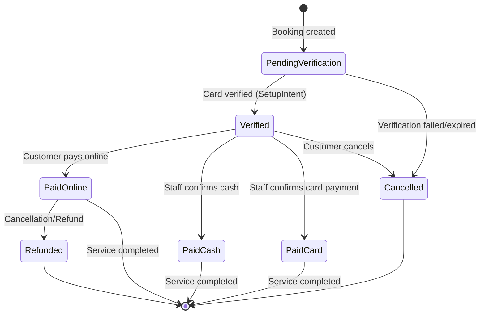
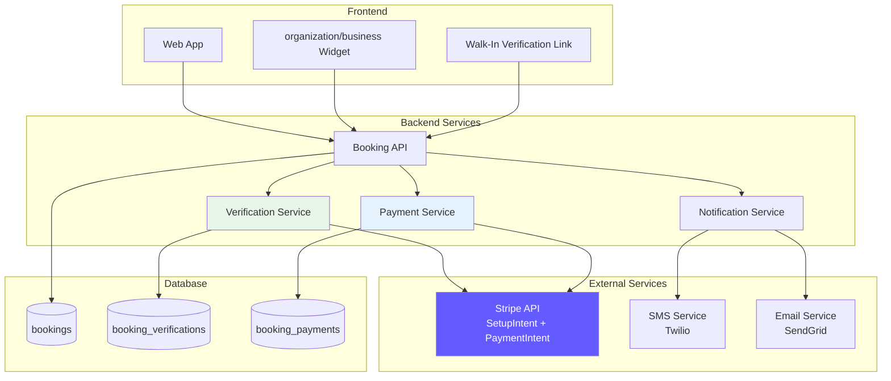
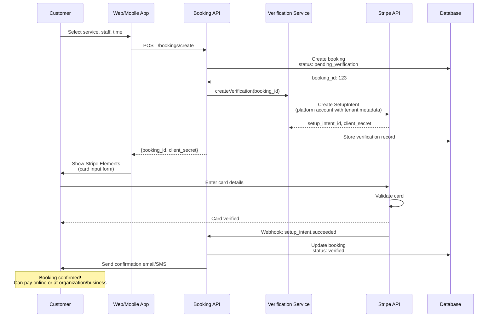
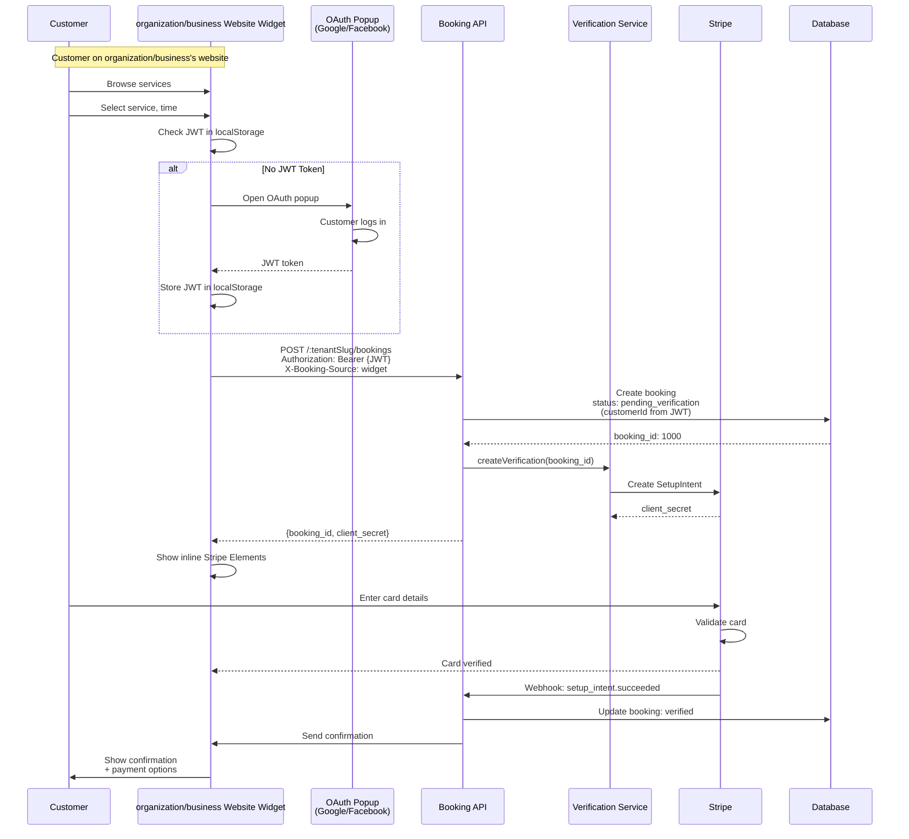
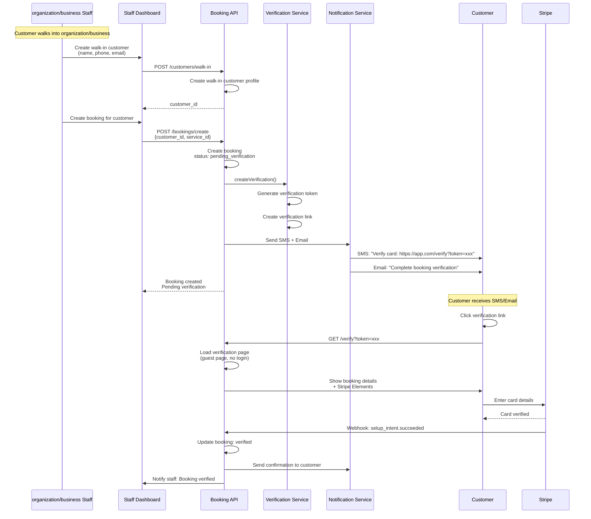
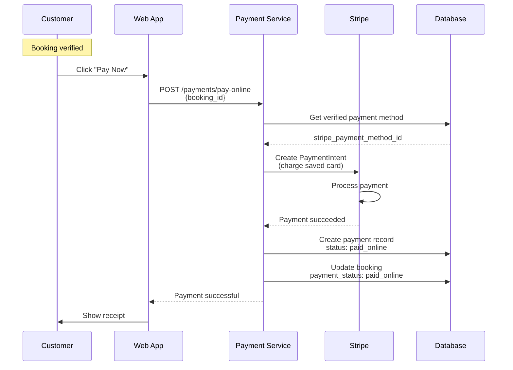
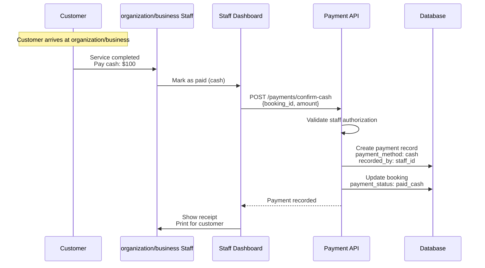
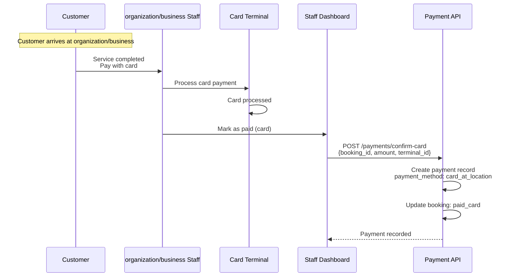
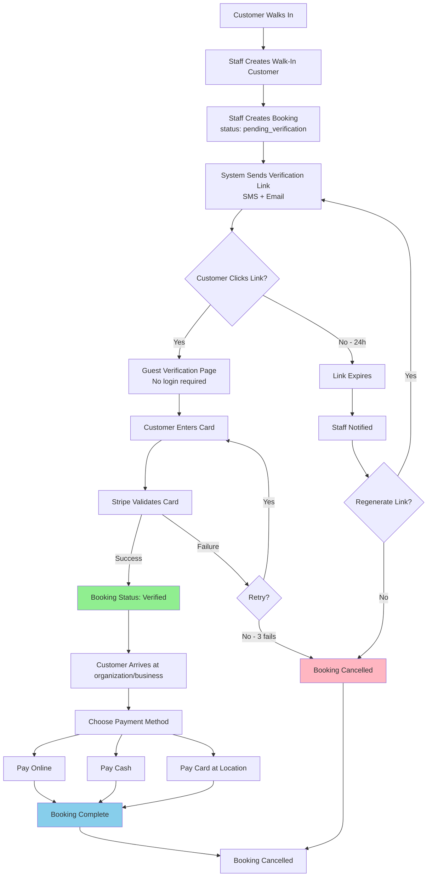

# Portfolio Note

> Extracted from production system, sanitized for portfolio use.

---

# Payment Architecture

**Version:** 3.0 (Consolidated)
**Last Updated:** February 2025
**Status:** Production Design
**Author:** the Platform Platform Team

---

## Table of Contents

1. [Platform Payment Model](#1-platform-payment-model)
2. [Business Requirements](#2-business-requirements)
3. [Architecture Overview](#3-architecture-overview)
4. [Service Architecture](#4-service-architecture)
5. [Booking Flows](#5-booking-flows)
6. [Payment Collection](#6-payment-collection)
7. [Walk-In Flow](#7-walk-in-flow)
8. [Database Schema](#8-database-schema)
9. [API Endpoints](#9-api-endpoints)
10. [Webhook Processing](#10-webhook-processing)
11. [Stripe Metadata Convention](#11-stripe-metadata-convention)
12. [Security and Compliance](#12-security-and-compliance)
13. [Testing Strategy](#13-testing-strategy)
14. [Production Checklist](#14-production-checklist)
15. [Architecture Decisions](#15-architecture-decisions)
16. [Settlement (Future)](#16-settlement-future)
17. [Environment Variables](#17-environment-variables)
18. [Implementation Plan](#18-implementation-plan)
19. [References](#19-references)

---

## 1. Platform Payment Model

the Platform uses a **Platform-Level Stripe** architecture (like Uber/Lyft), NOT tenant-level Stripe Connect. This means:

- **ONE** Stripe account for the entire platform
- Platform collects all payments
- `tenant_id` tracked in database and Stripe metadata for settlement/reporting
- Platform settles with tenants via separate process (bank transfers)

### Why Platform-Level (vs. Stripe Connect)?

| Aspect | Platform Model | Stripe Connect |
|--------|----------------|----------------|
| Complexity | Simple | Complex onboarding per tenant |
| Compliance | Platform handles | Each tenant responsible |
| Fees | Lower (no Connect fees) | Higher |
| Control | Full control | Shared with Stripe |
| Settlement | Manual/automated transfers | Automatic splits |

---

## 2. Business Requirements

### Client Requirements (Confirmed)

1. **Mandatory Card Verification** — ALL bookings require card verification to prevent fraud
2. **Payment Flexibility** — After booking confirmed, customer can pay:
   - Online (via Stripe)
   - Cash at organization/business
   - Card at organization/business location
3. **Walk-In Support** — Staff can create bookings for walk-in customers
4. **Guest Checkout** — No account creation required for card verification

### Why Card Verification?

| Problem            | Solution                                                |
| ------------------ | ------------------------------------------------------- |
| **Fraud bookings** | Card verification ensures real customer                 |
| **No-shows**       | Verified card can be charged for no-show fee            |
| **Fake accounts**  | Card validation prevents spam bookings                  |
| **Resource waste** | Staff time protected, slots reserved for real customers |

---

## 3. Architecture Overview

### Payment State Machine



### System Components



---

## 4. Service Architecture

```
+--------------------------------------------------------------+
|                     PaymentModule                            |
+--------------------------------------------------------------+
|                                                              |
|  +---------------------+    +-------------------------+     |
|  | PaymentController   |    | VerificationController  |     |
|  | POST /intent        |    | POST /verification      |     |
|  | POST /capture       |    | GET /token/:token       |     |
|  | POST /refund        |    | GET /booking/:id        |     |
|  | POST /no-show       |    +-------------------------+     |
|  +---------------------+                                    |
|           |                        |                         |
|           v                        v                         |
|  +---------------------+    +-------------------------+     |
|  | PaymentService      |    | VerificationService     |     |
|  | - createPaymentIntent|   | - createVerification    |     |
|  | - capturePayment    |    | - completeVerification  |     |
|  | - refundPayment     |    | - handleFailed          |     |
|  | - chargeNoShowFee   |    +-------------------------+     |
|  | - confirmMobilePayment|          |                        |
|  | - walkInPayOnline   |            |                        |
|  +---------------------+            |                        |
|           |                         |                        |
|           v                         v                        |
|  +-----------------------------------------------+          |
|  |           StripeClientService                 |          |
|  |  (Platform Stripe SDK - Single Account)       |          |
|  |  - createSetupIntent()                        |          |
|  |  - createPaymentIntent()                      |          |
|  |  - capturePaymentIntent()                     |          |
|  |  - createRefund()                             |          |
|  |  - createCustomer()                           |          |
|  +-----------------------------------------------+          |
|                         |                                    |
|                         v                                    |
|  +-----------------------------------------------+          |
|  |              Repositories                     |          |
|  |  - BookingPaymentRepository                   |          |
|  |  - CustomerPaymentMethodRepository            |          |
|  |  - BookingVerificationRepository              |          |
|  |  - TenantPaymentConfigRepository              |          |
|  |  - TipAssignmentRepository                    |          |
|  |  - TenantTipPolicyRepository                  |          |
|  |  - InvoiceRepository / InvoiceItemRepository  |          |
|  |  - PaymentReceiptRepository                   |          |
|  |  - CheckoutSessionRepository                  |          |
|  +-----------------------------------------------+          |
+--------------------------------------------------------------+
```

### Additional Services

| Service | Responsibility |
|---------|---------------|
| `TipService` | Record tips (ACID), get/set tip policy, proportional/equal split, allocation validation |
| `InvoiceService` | Generate invoices (auto number + line items), get by booking, mark paid |
| `CheckoutSessionService` | Split payment sessions — start, add/remove payment, complete, part-paid, resume, void |

---

## 5. Booking Flows

### Flow 1: Regular Customer Books Online



**Key Points:**

- Booking created immediately in `pending_verification` state
- Stripe SetupIntent validates card without charging
- Webhook confirms verification, booking transitions to `verified`
- Customer can now pay online or at organization/business

---

### Flow 2: Widget Booking (OAuth - Same as Web)



**Key Points:**

- **Same API as web platform**: `POST /:tenantSlug/bookings`
- **JWT authentication required** via OAuth popup (Google/Facebook/Twitter)
- OAuth providers pre-verify email (no separate verification needed)
- Uses existing customer profile from JWT token
- Only difference: `X-Booking-Source: widget` header for analytics

---

### Flow 3: Walk-In Booking (Staff Creates)



**Key Points:**

- Staff creates booking first
- Customer receives verification link via SMS/Email
- Customer verifies card on guest page (no login required)
- Staff notified when verification complete
- Booking automatically confirmed after verification

---

## 6. Payment Collection

### Option 1: Pay Online Immediately



**Benefits:**

- Instant payment confirmation
- No-show risk eliminated
- Platform commission collected automatically

---

### Option 2: Pay Cash at organization/business



**Key Points:**

- Card verification already done (prevents no-show)
- Staff confirms cash payment
- No Stripe fees
- No platform commission (cash goes directly to organization/business)

---

### Option 3: Pay Card at organization/business



**Key Points:**

- Physical card terminal used
- Staff confirms payment in system
- No online transaction (organization/business handles directly)
- No platform commission

### Option 4: Pay via Mobile Pay

Mobile pay (e.g., MobilePay, Apple Pay at location) follows the same pattern as cash/card at location. Staff confirms the mobile payment in the system with gateway set to `mobile_pay`.

### Option 5: Walk-In Pay Online (One-Time Card Charge)

Walk-in customers without saved cards can pay via a one-time Stripe charge using a card token collected through Stripe Elements at the front desk. This uses `PaymentService.walkInPayOnline()` with ACID transaction and auto-refund compensation on failure.

---

## 7. Walk-In Flow (Detailed)

### Walk-In Customer Journey



---

## 8. Database Schema

### Overview

```
+-------------------------+
|  booking_payments       | -- Tracks all payments per booking
+-------------------------+
|  - tenant_id            |   Which organization/business
|  - booking_id           |   Which booking
|  - payment_type         |   booking/deposit/no_show_fee/tip/refund
|  - gateway_payment_intent_id | Stripe PaymentIntent ID
|  - amount, currency     |
|  - payment_status       |   pending/authorized/captured/failed/refunded
|  - platform_fee         |   Platform's cut
|  - checkout_session_id  |   FK to checkout_sessions (nullable, for split payments)
+-------------------------+

+-------------------------+
|  customer_payment_methods | -- Saved cards
+-------------------------+
|  - customer_id          |
|  - gateway_customer_id  |   Stripe Customer ID
|  - gateway_payment_method_id | Stripe PaymentMethod ID
|  - card_last_four, card_brand |
|  - is_validated         |   Verified via SetupIntent
|  - can_auto_charge      |   Can charge without customer present
+-------------------------+

+-------------------------+
|  tenant_payment_configs | -- Business settings (NOT Stripe accounts)
+-------------------------+
|  - card_verification_required |
|  - no_show_fee_percentage |
|  - late_cancellation_fee_percentage |
|  - default_currency     |
|  - accept_tips          |
+-------------------------+

+-------------------------+
|  booking_verifications  | -- Card verification tracking
+-------------------------+
|  - stripe_setup_intent_id |
|  - stripe_customer_id   |
|  - verification_token   |
|  - status (pending/verified/failed) |
+-------------------------+

+-------------------------+
|  tip_assignments        | -- Staff tip allocations per payment
+-------------------------+
|  - payment_id           |
|  - employment_id        |
|  - amount               |
+-------------------------+

+-------------------------+
|  tenant_tip_policies    | -- Per-tenant tip configuration
+-------------------------+
|  - tenant_id            |
|  - assignment_method    |   proportional/manual/equal/full
|  - split_method         |   proportional/equal/manual
|  - pool_recipients      |   all_staff/service_staff_only
+-------------------------+

+-------------------------+
|  invoices               | -- Invoice records linked to bookings
+-------------------------+
|  - booking_id           |
|  - invoice_number       |   INV-{tenantId}-{paddedCount}
|  - status               |   draft/sent/paid/overdue/cancelled/void
+-------------------------+

+-------------------------+
|  invoice_items          | -- Line items for invoices
+-------------------------+
|  - invoice_id           |
|  - description, amount  |
+-------------------------+

+-------------------------+
|  payment_receipts       | -- Receipt tracking
+-------------------------+
|  - payment_id           |
|  - receipt_number       |   RCP-{tenantId}-{base36timestamp}-{random}
|  - type                 |   payment/refund/deposit
+-------------------------+

+-------------------------+
|  checkout_sessions      | -- Split payment sessions
+-------------------------+
|  - booking_id           |
|  - tenant_id            |
|  - status               |   in_progress/completed/part_paid/voided
|  - total/paid/remaining |
+-------------------------+
```

### Detailed Table Definitions

#### Booking Verifications

```sql
CREATE TABLE booking_verifications (
    id SERIAL PRIMARY KEY,
    tenant_id INTEGER NOT NULL REFERENCES tenants(id),
    booking_id INTEGER NOT NULL REFERENCES bookings(id) UNIQUE,

    -- Stripe SetupIntent
    stripe_setup_intent_id VARCHAR(255) UNIQUE,
    stripe_payment_method_id VARCHAR(255),

    -- Verification Status
    status VARCHAR(50) NOT NULL DEFAULT 'pending',
    -- pending, verified, failed, expired, cancelled

    -- Walk-In Verification Token
    verification_token UUID UNIQUE,
    verification_link TEXT,

    -- Guest Info (for walk-ins)
    guest_email VARCHAR(255),
    guest_phone VARCHAR(20),

    -- Tracking
    attempts INTEGER DEFAULT 0,
    last_attempt_at TIMESTAMP WITH TIME ZONE,
    verified_at TIMESTAMP WITH TIME ZONE,
    expires_at TIMESTAMP WITH TIME ZONE DEFAULT NOW() + INTERVAL '24 hours',

    -- Client Info (fraud detection)
    ip_address INET,
    user_agent TEXT,

    -- Metadata
    metadata JSONB,

    -- Timestamps
    created_at TIMESTAMP WITH TIME ZONE DEFAULT NOW(),
    updated_at TIMESTAMP WITH TIME ZONE DEFAULT NOW(),

    CONSTRAINT chk_max_attempts CHECK (attempts <= 5)
);

CREATE INDEX idx_booking_verifications_tenant ON booking_verifications(tenant_id);
CREATE INDEX idx_booking_verifications_booking ON booking_verifications(booking_id);
CREATE INDEX idx_booking_verifications_token ON booking_verifications(verification_token);
CREATE INDEX idx_booking_verifications_status ON booking_verifications(status);
CREATE INDEX idx_booking_verifications_expires ON booking_verifications(expires_at);
```

#### Booking Payments

```sql
CREATE TABLE booking_payments (
    id SERIAL PRIMARY KEY,
    tenant_id INTEGER NOT NULL REFERENCES tenants(id),
    booking_id INTEGER NOT NULL REFERENCES bookings(id),

    -- Payment Details
    amount DECIMAL(12, 2) NOT NULL,
    currency VARCHAR(3) NOT NULL DEFAULT 'USD',

    -- Payment Method
    payment_method VARCHAR(50) NOT NULL,
    -- online, cash, card_at_location, mobile_pay

    -- Stripe Details (if online payment)
    stripe_payment_intent_id VARCHAR(255) UNIQUE,
    stripe_charge_id VARCHAR(255),
    stripe_payment_method_id VARCHAR(255),

    -- Offline Payment Details
    recorded_by_staff_id INTEGER REFERENCES users(id),
    terminal_id VARCHAR(255),
    receipt_number VARCHAR(100),

    -- Platform Commission (only for online payments)
    platform_fee DECIMAL(12, 2) DEFAULT 0,
    net_amount DECIMAL(12, 2) NOT NULL,

    -- Split Payment
    checkout_session_id INTEGER REFERENCES checkout_sessions(id),

    -- Status
    status VARCHAR(50) NOT NULL DEFAULT 'completed',
    -- completed, refunded, partially_refunded, failed

    -- Refund Info
    refunded_amount DECIMAL(12, 2) DEFAULT 0,
    refund_reason TEXT,

    -- Timestamps
    paid_at TIMESTAMP WITH TIME ZONE DEFAULT NOW(),
    created_at TIMESTAMP WITH TIME ZONE DEFAULT NOW(),
    updated_at TIMESTAMP WITH TIME ZONE DEFAULT NOW(),

    CONSTRAINT chk_payment_amount_positive CHECK (amount > 0),
    CONSTRAINT chk_net_amount_positive CHECK (net_amount >= 0),
    CONSTRAINT chk_refund_valid CHECK (refunded_amount <= amount)
);

CREATE INDEX idx_booking_payments_tenant ON booking_payments(tenant_id);
CREATE INDEX idx_booking_payments_booking ON booking_payments(booking_id);
CREATE INDEX idx_booking_payments_method ON booking_payments(payment_method);
CREATE INDEX idx_booking_payments_date ON booking_payments(paid_at);
CREATE INDEX idx_booking_payments_staff ON booking_payments(recorded_by_staff_id);
```

#### Bookings Table Updates

```sql
ALTER TABLE bookings
ADD COLUMN IF NOT EXISTS payment_status VARCHAR(50) DEFAULT 'pending_verification',
-- pending_verification, verified, paid_online, paid_cash, paid_card, refunded

ADD COLUMN IF NOT EXISTS stripe_payment_method_id VARCHAR(255),

ADD COLUMN IF NOT EXISTS verification_sent_at TIMESTAMP WITH TIME ZONE,

ADD COLUMN IF NOT EXISTS verified_at TIMESTAMP WITH TIME ZONE;

CREATE INDEX IF NOT EXISTS idx_bookings_payment_status
ON bookings(tenant_id, payment_status);

CREATE INDEX IF NOT EXISTS idx_bookings_verification_pending
ON bookings(tenant_id, payment_status, verification_sent_at)
WHERE payment_status = 'pending_verification';
```

---

## 9. API Endpoints

### Verification Endpoints

```typescript
// Create Booking with Verification
POST /api/v1/bookings/create
Authorization: Bearer {token}
X-Tenant-ID: {tenant_id}

Request:
{
  "customerId": 123,
  "serviceId": 456,
  "staffId": 789,
  "startTime": "2025-11-25T10:00:00Z",
  "notes": "First time customer"
}

Response: 201 Created
{
  "booking": {
    "id": 999,
    "status": "pending_verification",
    "paymentStatus": "pending_verification"
  },
  "verification": {
    "setupIntentClientSecret": "seti_xxx_secret_yyy",
    "expiresAt": "2025-11-26T10:00:00Z"
  }
}


// Widget Booking (Same as Web)
POST /api/v1/:tenantSlug/bookings
Authorization: Bearer {jwt_token}
X-Tenant-ID: {tenant_id}
X-Booking-Source: widget

Request:
{
  "serviceId": 456,
  "staffId": 789,
  "startTime": "2025-11-25T10:00:00Z",
  "notes": "Booked via widget"
}

Response: 201 Created
{
  "booking": {
    "id": 1000,
    "customerId": 123,
    "status": "pending_verification",
    "paymentStatus": "pending_verification"
  },
  "verification": {
    "setupIntentClientSecret": "seti_xxx_secret_yyy",
    "expiresAt": "2025-11-26T10:00:00Z"
  }
}


// Walk-In Booking (Staff Only)
POST /api/v1/bookings/create-walk-in
Authorization: Bearer {staff_token}
X-Tenant-ID: {tenant_id}

Request:
{
  "walkInCustomer": {
    "name": "Jane Smith",
    "phone": "+1234567890",
    "email": "jane@example.com"
  },
  "serviceId": 456,
  "staffId": 789,
  "startTime": "2025-11-25T14:00:00Z"
}

Response: 201 Created
{
  "booking": {
    "id": 1001,
    "paymentStatus": "pending_verification"
  },
  "verification": {
    "verificationToken": "uuid-xxx-yyy-zzz",
    "verificationLink": "https://app.the platform.com/verify?token=uuid-xxx-yyy-zzz",
    "expiresAt": "2025-11-26T14:00:00Z"
  },
  "message": "Verification link sent to customer via SMS and Email"
}


// Verify Card (Guest Page)
GET /api/v1/verify?token={verification_token}

Response: 200 OK
{
  "booking": {
    "id": 1001,
    "service": "Haircut",
    "staff": "Sara Johnson",
    "startTime": "2025-11-25T14:00:00Z",
    "amount": 50.00
  },
  "verification": {
    "setupIntentClientSecret": "seti_xxx_secret_yyy",
    "expiresAt": "2025-11-26T14:00:00Z"
  }
}


// Confirm Verification (Webhook Handler)
POST /api/v1/webhooks/stripe
Stripe-Signature: {signature}

Webhook Event:
{
  "type": "setup_intent.succeeded",
  "data": {
    "object": {
      "id": "seti_xxx",
      "payment_method": "pm_xxx",
      "metadata": {
        "booking_id": "1001",
        "tenant_id": "1"
      }
    }
  }
}

Response: 200 OK
{
  "received": true
}


// Regenerate Verification Link (Staff Only)
POST /api/v1/bookings/:id/regenerate-verification
Authorization: Bearer {staff_token}
X-Tenant-ID: {tenant_id}

Response: 200 OK
{
  "verification": {
    "verificationLink": "https://app.the platform.com/verify?token=new-uuid",
    "expiresAt": "2025-11-27T10:00:00Z"
  },
  "message": "New verification link sent to customer"
}
```

### Payment Collection Endpoints

```typescript
// Pay Online (Customer)
POST /api/v1/payments/pay-online
Authorization: Bearer {token}
X-Tenant-ID: {tenant_id}

Request:
{
  "bookingId": 999
}

Response: 200 OK
{
  "payment": {
    "id": 1111,
    "amount": 50.00,
    "currency": "USD",
    "status": "completed",
    "paymentMethod": "online",
    "paidAt": "2025-11-25T10:30:00Z"
  },
  "booking": {
    "id": 999,
    "paymentStatus": "paid_online"
  }
}


// Confirm Cash Payment (Staff Only)
POST /api/v1/payments/confirm-cash
Authorization: Bearer {staff_token}
X-Tenant-ID: {tenant_id}

Request:
{
  "bookingId": 1000,
  "amount": 50.00,
  "receiptNumber": "CASH-2025-001"
}

Response: 200 OK
{
  "payment": {
    "id": 1112,
    "amount": 50.00,
    "paymentMethod": "cash",
    "recordedBy": {
      "staffId": 789,
      "staffName": "Sara Johnson"
    },
    "paidAt": "2025-11-25T15:00:00Z"
  }
}


// Confirm Card Payment at Location (Staff Only)
POST /api/v1/payments/confirm-card-at-location
Authorization: Bearer {staff_token}
X-Tenant-ID: {tenant_id}

Request:
{
  "bookingId": 1001,
  "amount": 50.00,
  "terminalId": "reader_xxx",
  "receiptNumber": "CARD-2025-002"
}

Response: 200 OK
{
  "payment": {
    "id": 1113,
    "amount": 50.00,
    "paymentMethod": "card_at_location",
    "terminalId": "reader_xxx",
    "paidAt": "2025-11-25T16:00:00Z"
  }
}


// Confirm Mobile Payment (Staff Only)
POST /api/v1/payments/confirm-mobile-pay
Authorization: Bearer {staff_token}
X-Tenant-ID: {tenant_id}

Request:
{
  "bookingId": 1002,
  "amount": 75.00,
  "mobilePayProvider": "mobilepay",
  "transactionReference": "MP-2025-001"
}


// Walk-In Pay Online (One-Time Card Charge)
POST /api/v1/payments/walk-in/pay-online
Authorization: Bearer {staff_token}
X-Tenant-ID: {tenant_id}

Request:
{
  "bookingId": 1003,
  "amount": 60.00,
  "cardToken": "tok_xxx",
  "currency": "DKK",
  "customerEmail": "walkin@example.com",
  "customerName": "Walk-In Customer"
}


// Get Payment Status
GET /api/v1/bookings/:id/payment-status
Authorization: Bearer {token}
X-Tenant-ID: {tenant_id}

Response: 200 OK
{
  "booking": {
    "id": 999,
    "paymentStatus": "verified"
  },
  "verification": {
    "status": "verified",
    "verifiedAt": "2025-11-25T10:00:00Z"
  },
  "payment": null,
  "availablePaymentMethods": [
    "online",
    "cash",
    "card_at_location"
  ]
}
```

### Tip and Invoice Endpoints

| Method | Endpoint | Description |
|--------|----------|-------------|
| POST | `/payments/tip` | Record tip with staff allocations |
| GET | `/payments/tip/policy` | Get tenant tip policy |
| POST | `/payments/invoice` | Generate invoice |
| GET | `/payments/invoice/booking/:bookingId` | Get invoice by booking |

### Checkout Session Endpoints (Split Payments)

| Method | Endpoint | Description |
|--------|----------|-------------|
| POST | `/payments/checkout/start` | Start checkout session |
| POST | `/payments/checkout/add-payment` | Add split payment |
| POST | `/payments/checkout/remove-payment` | Remove split payment |
| POST | `/payments/checkout/complete` | Complete checkout |
| POST | `/payments/checkout/save-part-paid` | Save as partially paid |
| POST | `/payments/checkout/resume` | Resume part-paid session |
| POST | `/payments/checkout/void` | Void session |
| GET | `/payments/checkout/:id` | Get session |
| GET | `/payments/checkout/booking/:bookingId` | Get session by booking |

### Payment Controller Summary

| Method | Endpoint | Description |
|--------|----------|-------------|
| POST | `/payments/intent` | Create PaymentIntent |
| POST | `/payments/capture` | Capture authorized payment |
| POST | `/payments/refund` | Refund payment |
| POST | `/payments/no-show` | Charge no-show fee |
| GET | `/payments/booking/:id` | Get payments for booking |
| GET | `/payments/booking/:id/summary` | Get payment summary |
| GET | `/payments/tenant/summary` | Get tenant payment summary |

### Verification Controller Summary

| Method | Endpoint | Description |
|--------|----------|-------------|
| POST | `/payments/verification` | Create verification |
| GET | `/payments/verification/token/:token` | Get by token (public) |
| GET | `/payments/verification/booking/:id` | Get by booking |
| DELETE | `/payments/verification/:id` | Cancel verification |

### Webhook Controller

| Method | Endpoint | Description |
|--------|----------|-------------|
| POST | `/payments/webhook/stripe` | Handle Stripe webhooks |

---

## 10. Webhook Processing

```
Stripe --> POST /payments/webhook/stripe
                    |
                    v
         WebhookService.processWebhook()
                    |
    +---------------+---------------+
    |               |               |
    v               v               v
setup_intent   payment_intent   payment_intent
.succeeded     .succeeded       .payment_failed
    |               |               |
    v               v               v
Complete       Update          Update
Verification   booking_payments booking_payments
               status=captured  status=failed
```

### Webhook Signature Verification

```typescript
const signature = request.headers['stripe-signature'];
const event = stripe.webhooks.constructEvent(
  request.body,
  signature,
  process.env.STRIPE_WEBHOOK_SECRET,
);
```

---

## 11. Stripe Metadata Convention

All Stripe objects include metadata for tracking:

```json
{
  "platform": "the platform",
  "tenant_id": "123",
  "booking_id": "456",
  "customer_id": "789",
  "payment_type": "booking | no_show_fee | tip"
}
```

---

## 12. Security and Compliance

### PCI DSS Compliance

**Stripe Handles All Card Data**

- Card numbers are never stored on the Platform servers
- Stripe Elements collects card data securely
- Only Stripe PaymentMethod IDs (tokens) are stored

**HTTPS Only**

- All API endpoints use TLS 1.2+
- Verification links use HTTPS
- No sensitive data in URL parameters

### Fraud Prevention

| Measure                   | Implementation                                  |
| ------------------------- | ----------------------------------------------- |
| **IP Tracking**           | Record IP address for each verification attempt |
| **Rate Limiting**         | Max 3 verification attempts per booking         |
| **Token Expiry**          | Verification links expire after 24 hours        |
| **Device Fingerprinting** | Store user agent, browser info                  |
| **No-Show Tracking**      | Flag customers with multiple no-shows           |
| **Card Validation**       | Stripe validates card validity, funds, CVC      |

### Multi-Tenant Isolation

```typescript
// EVERY query must include tenant_id
await db
  .select()
  .from(bookingVerifications)
  .where(
    and(
      eq(bookingVerifications.token, verificationToken),
      eq(bookingVerifications.tenant_id, tenantId),
    ),
  );
```

---

## 13. Testing Strategy

### Unit Tests

```typescript
describe('VerificationService', () => {
  it('should create SetupIntent for booking', async () => {
    const result = await service.createSetupIntent(bookingId, tenantId);

    expect(result.setupIntentId).toBeDefined();
    expect(result.clientSecret).toBeDefined();
    expect(result.expiresAt).toBeDefined();
  });

  it('should generate walk-in verification token', async () => {
    const result = await service.generateWalkInToken(bookingId);

    expect(result.token).toMatch(/^[a-f0-9-]{36}$/);
    expect(result.link).toContain('verify?token=');
  });

  it('should reject expired verification tokens', async () => {
    const expiredToken = await createExpiredToken();

    await expect(service.validateToken(expiredToken)).rejects.toThrow(
      'Verification link expired',
    );
  });
});
```

### Integration Tests

```typescript
describe('Booking Verification Flow', () => {
  it('should complete full regular booking flow', async () => {
    const booking = await bookingService.create({
      customerId: 123,
      serviceId: 456,
      tenantId: 1,
    });
    expect(booking.paymentStatus).toBe('pending_verification');

    await simulateStripeWebhook('setup_intent.succeeded', {
      bookingId: booking.id,
    });

    const updated = await bookingService.findById(booking.id);
    expect(updated.paymentStatus).toBe('verified');
  });

  it('should complete walk-in verification flow', async () => {
    const result = await bookingController.createWalkIn({
      walkInCustomer: { name: 'Jane', phone: '+1234567890' },
      serviceId: 456,
    });

    expect(mockSMS.send).toHaveBeenCalledWith(
      '+1234567890',
      expect.stringContaining('verify?token='),
    );

    const verification = await verificationService.validateToken(
      result.verification.token,
    );
    expect(verification.booking.paymentStatus).toBe('pending_verification');

    await simulateStripeWebhook('setup_intent.succeeded', {
      bookingId: verification.booking.id,
    });

    const confirmed = await bookingService.findById(verification.booking.id);
    expect(confirmed.paymentStatus).toBe('verified');
  });
});
```

### Load Testing

```bash
# Test 100 concurrent verifications
artillery quick \
  --count 100 \
  --num 10 \
  https://api.the platform.com/bookings/create

# Expected: All succeed, <500ms response time
```

---

## 14. Production Checklist

### Stripe Configuration

- [ ] Platform-wide Stripe account configured (single account for all tenants)
- [ ] Webhook endpoints configured
  - `setup_intent.succeeded`
  - `payment_intent.succeeded`
  - `payment_intent.payment_failed`
- [ ] Webhook signing secret stored in env
- [ ] Test mode thoroughly tested
- [ ] Production API keys configured
- [ ] tenant_id tracked in Stripe metadata for reporting

### Database

- [ ] Migrations applied to production
- [ ] Indexes created for performance
- [ ] Row-level security policies active
- [ ] Backup strategy confirmed

### Services

- [ ] SMS service configured (Twilio/AWS SNS)
- [ ] Email service configured (SendGrid/AWS SES)
- [ ] Rate limiting active (10 req/min per tenant)
- [ ] Monitoring and alerts setup

### Security

- [ ] HTTPS enforced on all endpoints
- [ ] Webhook signature verification active
- [ ] IP whitelisting for webhooks
- [ ] Audit logging enabled
- [ ] PCI DSS compliance checklist complete

### Documentation

- [ ] API documentation published (Swagger)
- [ ] Staff training guide created
- [ ] Customer verification guide created
- [ ] Troubleshooting runbook prepared

---

## 15. Architecture Decisions

| Decision | Choice | Rationale |
| --- | --- | --- |
| Stripe model | Platform-wide (single account) | Simpler than Connect, lower fees, full control |
| Walk-in card payment | One-time Stripe token (no saved cards) | Walk-ins don't have accounts; Stripe Elements collects card at front desk |
| Tip split rounding | Last-penny to final team member | Ensures exact total match without floating-point drift |
| Invoice numbering | `INV-{tenantId}-{paddedCount}` | Tenant-scoped, sequential, human-readable |
| Receipt numbering | `RCP-{tenantId}-{base36timestamp}-{random}` | Unique, collision-resistant |
| DB primary keys | `serial()` (auto-increment int) | Matches existing codebase pattern |
| Tip tolerance | +/-$0.01 | Handles floating-point rounding in split calculations |
| Split payment model | Checkout session with linked payments | Enables partial pay, resume, void; one active session per booking |
| Rounding tolerance | +/-0.01 on checkout completion | Prevents floating-point issues when summing multiple payment amounts |

---

## 16. Settlement (Future)

The platform will settle with tenants via:

1. Calculate captured payments minus refunds per tenant
2. Subtract platform fee
3. Transfer to tenant's bank account (via Stripe Transfers or external)
4. Track in `settlement_records` table (to be created)

---

## 17. Environment Variables

```bash
# Required
STRIPE_SECRET_KEY=sk_test_xxx        # Platform Stripe secret key
STRIPE_WEBHOOK_SECRET=whsec_xxx      # Webhook signing secret

# Optional
FRONTEND_URL=http://localhost:3000    # For verification links
```

---

## 18. Implementation Plan

### Phase 1: Core Verification (Week 1)

- Database: `booking_verifications` and `booking_payments` tables
- Update `bookings` table with payment fields
- Verification module structure
- Install Stripe SDK
- `VerificationService` — create SetupIntent, generate walk-in token, validate token
- Repository layer for verifications
- Webhook handler: `setup_intent.succeeded`
- Update booking status to `verified`, store PaymentMethod ID
- Send confirmation notifications

### Phase 2: Booking Flows (Week 2)

- Update `BookingService.create()` — add verification step
- Widget booking endpoint
- Frontend Stripe Elements integration
- Guest checkout page
- Walk-in booking endpoint
- `NotificationService.sendVerificationLink()` — SMS + Email
- Public guest verification page (no auth)
- Staff dashboard: pending verifications view
- Regenerate verification link feature

### Phase 3: Payment Collection (Week 3)

- `PaymentService.payOnline()` — charge saved card
- PaymentIntent with saved PaymentMethod
- Platform commission calculation
- `PaymentService.confirmCash()` — staff confirms cash
- `PaymentService.confirmCardAtLocation()` — staff confirms card
- Staff authorization checks
- Receipt generation and audit logging
- Full payment flow testing (all methods)
- Multi-tenant isolation tests
- Performance testing (100+ concurrent verifications)
- API documentation (Swagger)

---

## 19. References

- [Stripe SetupIntents Documentation](https://stripe.com/docs/payments/save-and-reuse)
- [Stripe PaymentIntents Documentation](https://stripe.com/docs/payments/payment-intents)
- [PCI DSS Compliance Guide](https://stripe.com/docs/security)

---

**Open Questions:**

- No-show policy: Should we charge verified card for no-shows? — Pending
- Verification link expiry: 24 hours OK? — Pending
