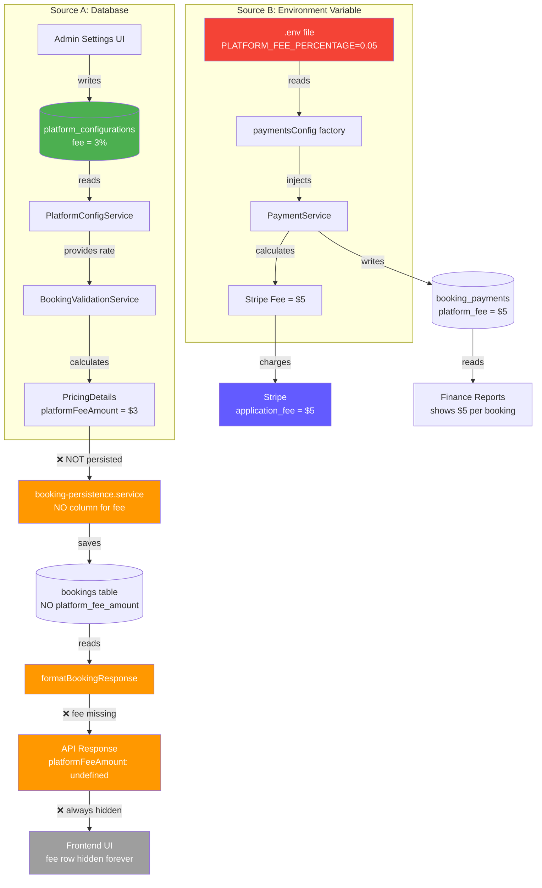
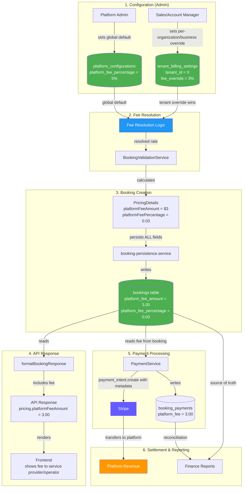

# Portfolio Note

> Extracted from production system, sanitized for portfolio use.

---

# Platform Fee Architecture — Deep Audit & Correct Design

> **Document Type**: Architecture Audit + Correct Design Proposal
> **Status**: Active
> **Last Audit Date**: 2025-02-28
> **Risk Level**: 🔴 HIGH — Money integrity issues identified
> **Scope**: End-to-end platform fee lifecycle across all layers

---

## Table of Contents

1. [Executive Summary](#1-executive-summary)
2. [Current State — How the Fee System Works Today](#2-current-state)
3. [Issue Registry — Every Bug, Ranked by Severity](#3-issue-registry)
4. [Industry Analysis — How Real Marketplace Platforms Handle Fees](#4-industry-analysis)
5. [Correct Architecture — Target Design for the Platform](#5-correct-architecture)
6. [End-to-End Data Flow — From Config to Settlement](#6-end-to-end-data-flow)
7. [Schema Changes Required](#7-schema-changes-required)
8. [Type & DTO Alignment Chain](#8-type-dto-alignment-chain)
9. [Architecture Scoring](#9-architecture-scoring)
10. [Migration Plan — Phase 1 & Phase 2](#10-migration-plan)
11. [Testing Strategy](#11-testing-strategy)
12. [Decision Record](#12-decision-record)
13. [File Location Index](#13-file-location-index)
14. [Edge Cases & Security Considerations](#14-edge-cases-security)

---

## 1. Executive Summary

The platform fee system in the Platform has a **critical architectural split**: there are two completely independent fee source systems that don't communicate with each other. This creates a scenario where the fee percentage shown to users during booking differs from the fee percentage actually charged via Stripe.

**In plain terms**: Imagine a restaurant where the menu says your burger costs $10, but the cashier charges you $15 because they're looking at a different price list. That's what's happening with the platform fee.

### The Two Fee Worlds

| Property | World A — Database (Admin UI) | World B — Environment Variable (Payments) |
|----------|-------------------------------|-------------------------------------------|
| **Where it's configured** | `platform_configurations` table | `PLATFORM_FEE_PERCENTAGE` env var |
| **Who reads it** | `BookingValidationService` | `PaymentService` |
| **Default value** | `0.00` (0%) | `0.05` (5%) |
| **What it controls** | Pricing preview shown in UI | Stripe PaymentIntent metadata for reconciliation |
| **Admin can edit?** | ✅ Yes, via Settings UI | ❌ No, requires server restart |

These two worlds produce **different fee amounts** for the same booking. The admin configures fees via the beautiful settings UI, but Stripe charges a completely different fee that comes from an environment variable.

### Impact Summary

- 🔴 **2 Critical** issues — money integrity violations
- 🟠 **3 High** issues — broken data flow, dead API responses
- 🟡 **3 Medium** issues — missing infrastructure
- 🔵 **2 Low** issues — dead code, reporting inconsistency

---

## 2. Current State

### How the Fee System Works Today

There are two parallel stories playing out in the codebase. Let's follow a booking through both.

### Story A: "The Booking Calculation" (Database Source)

```
Admin opens Settings → Platform Settings page
  │
  └─ Sets Platform Fee to 3% via the UI
     │
     └─ API writes to ──► platform_configurations table
                          │  platform_fee_percentage = 3.00
                          │  platform_fee_enabled = true
                          │  (singleton row, id=1)
                          │
            ┌─────────────┘
            │
Customer creates a booking for $100 service
  │
  └─ BookingValidationService.calculatePricingFromServices()
     │
     ├─ Calls getTenantFinancialSettings()
     │  └─ PlatformConfigService.getConfig() ──► reads DB
     │     └─ Returns { platformFeeRate: 0.03 }
     │
     ├─ Calculates:
     │  ├─ taxableAmount = $100.00
     │  ├─ taxAmount = $100 × taxRate
     │  ├─ platformFeeAmount = $100 × 0.03 = $3.00  ← CALCULATED
     │  └─ totalAmount = $100 + tax + $3.00
     │
     └─ Returns PricingDetails { platformFeeAmount: 3.00 }
            │
            │  ┌──────────────────────────────┐
            ├──│ booking-persistence.service   │
            │  │                              │
            │  │ INSERT INTO bookings (       │
            │  │   service_price,             │
            │  │  total_amount,  ← 110.00 (excludes platform fee)              │
            │  │   tax_amount,               │
            │  │   discount_amount,           │
            │  │   ...                        │
            │  │ )                            │
            │  │                              │
            │  │ ❌ NO platform_fee_amount    │
            │  │    column exists!            │
            │  │    $3.00 IS THROWN AWAY       │
            │  └──────────────────────────────┘
            │
            │  ┌──────────────────────────────┐
            └──│ formatBookingResponse()      │
               │                              │
               │ pricing: {                   │
               │   basePrice: total - tax     │
               │   + discount,               │
               │   taxAmount: booking.tax,    │
               │   totalAmount: booking.total │
               │                              │
               │   ❌ platformFeeAmount       │
               │      is NOT included         │
               │ }                            │
               └──────────────────────────────┘
                       │
                       ▼
              Frontend receives response
              │
              └─ (booking.pricing.platformFee ?? 0) > 0
                 └─ 0 > 0 === false
                    └─ Platform fee row is HIDDEN ← ALWAYS
```

**The $3.00 fee was calculated, added to the total, but:**
1. Never saved to the database (no column exists)
2. Never returned in the API response (not in `formatBookingResponse`)
3. Never shown to the user (conditional display evaluates to false)

### Story B: "The Stripe Payment" (Environment Variable Source)

```
Customer proceeds to pay for the same $100 booking
  │
  └─ PaymentService.createPaymentIntent()
     │
     ├─ Reads from paymentsConfig (injected via @Inject)
     │  └─ payments.config.ts:
     │     platformFeePercentage: parseFloat(
     │       process.env.PLATFORM_FEE_PERCENTAGE || '0.05'
     │     )
     │     └─ Returns 0.05 (5%) ← DIFFERENT from the 3% in DB!
     │
     ├─ Calculates:
     │  └─ platformFee = Math.round(amount × 0.05) = $5.00
     │
     ├─ Stripe:
     │  └─ DB platform_fee recorded: 500 cents  ← Tracked in booking_payments table
     │
     └─ Writes to booking_payments:
        └─ platform_fee: 5.00  ← $5.00 recorded
```

**Result**: The admin configured 3%, the booking calculation used 3%, but Stripe charged 5%. The customer was overcharged $2.00 on this booking — and nobody knows.

### Current State Flow Diagram



---

## 3. Issue Registry

### 🔴 CRITICAL — Money Integrity Violations

#### Issue #1: Dual Fee Source Divergence

| Property | Detail |
|----------|--------|
| **File (Source A)** | `apps/api/src/bookings/services/common/booking-validation.service.ts` L147-159 |
| **File (Source B)** | `apps/api/src/payments/config/payments.config.ts` L39-41 |
| **What happens** | `BookingValidationService` reads fee from DB (0.00 default), `PaymentService` reads from env var (0.05 default) |
| **Impact** | Customer sees one fee %, gets charged a different fee %. Legal/regulatory violation in most jurisdictions. |
| **Severity** | 🔴 CRITICAL — financial discrepancy between displayed and charged amounts |
| **Risk Score** | 10/10 |

**Source A** (booking-validation.service.ts, lines 147-159):
```typescript
const taxableAmount = subtotal - discountAmount;
const taxAmount = financialSettings.taxEnabled
  ? taxableAmount * financialSettings.taxRate
  : 0;
const platformFeeAmount = financialSettings.platformFeeEnabled
  ? taxableAmount * financialSettings.platformFeeRate  // ← reads from DB via PlatformConfigService
  : 0;
```

**Source B** (payments.config.ts, lines 39-41):
```typescript
platformFeePercentage: parseFloat(
  process.env.PLATFORM_FEE_PERCENTAGE || '0.05'  // ← 5% hardcoded default!
),
```

#### Issue #2: Missing `platform_fee_amount` Column on Bookings Table

| Property | Detail |
|----------|--------|
| **File** | `packages/db/src/schema/bookings/bookings.ts` |
| **What happens** | The `bookings` table has `service_price`, `total_amount`, `tax_amount`, `discount_amount`, `loyalty_fee_amount`, `deposit_amount` — but NO `platform_fee_amount` column |
| **Impact** | Fee is calculated by `BookingValidationService` but thrown away at INSERT time. Zero audit trail. Cannot reconstruct what fee was quoted to the customer. |
| **Severity** | 🔴 CRITICAL — data loss, impossible to audit, impossible to reconcile |
| **Risk Score** | 9/10 |

**Evidence** — grepping `booking-persistence.service.ts` for any fee reference:
```bash
$ grep -n "platformFeeAmount\|platform_fee_amount" \
  apps/api/src/bookings/services/lifecycle/helpers/booking-persistence.service.ts
# OUTPUT: (empty — exit code 1)
```

---

### 🟠 HIGH — Broken Data Flow

#### Issue #3: `formatBookingResponse()` Omits `platformFeeAmount`

| Property | Detail |
|----------|--------|
| **File** | `apps/api/src/bookings/services/common/booking-validation.service.ts` L360-378 |
| **What happens** | The pricing object in the API response includes `basePrice`, `taxAmount`, `totalAmount`, `discountAmount`, `currency`, `depositAmount`, `depositRequired` — but NOT `platformFeeAmount` |
| **Impact** | Every frontend UI component trying to show the platform fee gets `undefined` — the fee display code is dead |
| **Severity** | 🟠 HIGH |

The response builder:
```typescript
pricing: {
  basePrice: booking.total_amount - booking.tax_amount + booking.discount_amount,
  discountAmount: booking.discount_amount,
  taxAmount: booking.tax_amount,
  totalAmount: booking.total_amount,  ← 110.00 (excludes platform fee)
  currency: booking.currency,
  depositAmount: booking.deposit_amount,
  depositRequired: booking.deposit_amount > 0,
  // ❌ platformFeeAmount: ??? — there's no column to read from!
}
```

#### Issue #4: `basePrice` Reverse-Calculation Formula Is Wrong

| Property | Detail |
|----------|--------|
| **File** | `apps/api/src/bookings/services/common/booking-validation.service.ts` L363 |
| **What happens** | `basePrice = total_amount - tax_amount + discount_amount` — this formula does NOT subtract `platform_fee_amount` |
| **Impact** | When platform fee IS non-zero, `basePrice` is inflated by the fee amount. Customer sees an incorrect original price. |
| **Severity** | 🟠 HIGH |
| **Correct formula** | `basePrice = total_amount - tax_amount - platform_fee_amount + discount_amount` |

#### Issue #5: PaymentModule Does Not Import PlatformConfigModule

| Property | Detail |
|----------|--------|
| **File** | `apps/api/src/payments/payments.module.ts` |
| **What happens** | `PaymentModule` has no import of `PlatformConfigModule`. `PaymentService` cannot access `PlatformConfigService`. |
| **Impact** | No architectural path to unify the fee sources without explicit module wiring. |
| **Severity** | 🟠 HIGH |

---

### 🟡 MEDIUM — Missing Infrastructure

#### Issue #6: Singleton Config Table — No Tenant Isolation

| Property | Detail |
|----------|--------|
| **File** | `packages/db/src/schema/platform/platform-configurations.ts` |
| **What happens** | `platform_configurations` table has no `tenant_id` column. All organizations/businesses share one fee rate. |
| **Impact** | Cannot offer different fee rates to different organization/business partners (a standard marketplace feature). |
| **Severity** | 🟡 MEDIUM |

#### Issue #7: Frontend Types Missing `platformFee` Field

| Property | Detail |
|----------|--------|
| **Files** | `apps/web/src/lib/api/booking-api.ts` (`BookingPricingResponse`), `apps/web/src/lib/api/admin-booking-api.ts` (`BookingPricingInfo`) |
| **What happens** | TypeScript types for API response pricing objects don't include a `platformFee` field |
| **Impact** | Even if the API started returning the fee, TypeScript would flag it as an unknown property |
| **Severity** | 🟡 MEDIUM |

#### Issue #8: No `usePublicPlatformConfig` React Query Hook

| Property | Detail |
|----------|--------|
| **File** | `apps/web/src/hooks/use-platform-config.ts` |
| **What happens** | The hooks file only has admin-scoped hooks. The public endpoint `GET /platform-config/public` exists but has no React Query wrapper for customer-facing pages. |
| **Impact** | Customer-facing pages cannot easily show fee/tax info proactively before checkout. |
| **Severity** | 🟡 MEDIUM |

---

### 🔵 LOW — Dead Code & Reporting

#### Issue #9: Dead Frontend Fee Display Code

| Property | Detail |
|----------|--------|
| **Files** | `apps/web/src/components/features/booking/booking-confirmed-client.tsx`, `apps/web/src/app/[locale]/(partner)/dashboard/calendar/_components/checkout/checkout-flow.tsx` |
| **What happens** | Both files have conditional rendering: `(booking.pricing.platformFee ?? 0) > 0` — this evaluates to `false` ALWAYS because the API never returns the fee |
| **Impact** | Code exists, i18n keys exist (`pricing.platformFee`), but the UI row is permanently hidden |
| **Severity** | 🔵 LOW (cosmetic — becomes functional once Issues #2 and #3 are fixed) |

#### Issue #10: Finance Reports Based on Env-Var-Derived Fees

| Property | Detail |
|----------|--------|
| **File** | `apps/api/src/finance/repositories/finance-admin.repository.ts` L86, L132, L206 |
| **What happens** | Finance reports `SUM(booking_payments.platform_fee)` — which contains the fee charged via env var, not the fee configured by admin |
| **Impact** | If admin sets 3% but env var is 5%, reports show 5% revenue — technically correct (it IS what was charged), but inconsistent with admin's expectation |
| **Severity** | 🔵 LOW |

---

## 4. Industry Analysis

### How Real Marketplace Platforms Handle Platform Fees

Understanding how successful platforms handle fees illuminates why the Platform's current approach is architecturally incorrect.

### Airbnb — The Double-Sided Fee Model

Airbnb charges both sides of the marketplace:

```
Guest books a $200/night stay:

Guest Side:
  Room rate:          $200.00
  + Cleaning fee:      $50.00
  + Guest service fee: $35.00  ← 14% of subtotal
  + Taxes:             $28.50
  = Guest total:      $313.50

Host Side:
  Revenue:            $250.00
  - Host service fee:  -$7.50  ← 3% of subtotal
  = Host payout:      $242.50

Airbnb receives:
  Guest fee:           $35.00
  + Host fee:           $7.50
  = Platform revenue:  $42.50

How fees are stored:
  ┌─ Reservation record ──────────────────────┐
  │  guest_service_fee: 35.00                  │
  │  guest_service_fee_percentage: 0.14        │
  │  host_service_fee: 7.50                    │
  │  host_service_fee_percentage: 0.03         │
  │  snapshot_date: 2025-02-28                 │
  └────────────────────────────────────────────┘
```

**Key architectural choices:**
1. Fee percentages are **stored on each reservation** — snapshotted at booking time
2. Fee rates are per-listing-type, per-market — NOT global
3. Both fees are **visible** to the paying party (guest sees their fee; host sees theirs)
4. Fee is recorded in `booking_payments` table with `platform_fee` column for each booking
5. Fee modification after booking is a **separate refund/adjustment flow**

### Fresha — The Payment Processing Fee Model

Fresha (organization/business SaaS — the closest comparison to the Platform):

```
Customer books a $80 haircut:

Customer Side:
  Haircut:            $80.00
  + Taxes:             $6.40
  = Customer total:   $86.40   ← Customer sees NO platform fee

organization/business Side:
  Revenue:            $86.40
  - Processing fee:    -$2.10  ← 2.19% + $0.20 per transaction
  = organization/business payout:     $84.30

Fresha receives:
  Processing fee:      $2.10

How fees are stored:
  ┌─ Payment record ──────────────────────────┐
  │  payment_amount: 86.40                      │
  │  processing_fee: 2.10                       │
  │  processing_fee_rate: 0.0219                │
  │  processing_fee_fixed: 0.20                 │
  │  net_payout: 84.30                          │
  └─────────────────────────────────────────────┘
```

**Key architectural choices:**
1. Customer **never sees** the platform fee — it's embedded in the price
2. Fee is deducted from the **organization/business's payout**, not added on top
3. Fee rate varies by **payment method** (card, cash, bank transfer)
4. Fee is per-organization/business (negotiable based on volume)
5. Fee is **snapshotted per payment** — can't change retroactively

### Booking.com — The Commission Model

```
Guest books a $150 hotel room:

Guest Side:
  Room rate:          $150.00
  + Taxes:             $18.00
  = Guest total:      $168.00   ← Guest sees NO commission

Hotel Side:
  Revenue:            $150.00
  - Commission:       -$22.50  ← 15% of room rate (negotiable 8-25%)
  = Hotel payout:     $127.50

How fees are stored:
  ┌─ Booking record ───────────────────────────┐
  │  commission_rate: 0.15                      │
  │  commission_amount: 22.50                   │
  │  property_commission_tier: 'standard'       │
  └─────────────────────────────────────────────┘
```

### Common Patterns Across All Three

| Pattern | Airbnb | Fresha | Booking.com | the Platform (current) |
|---------|--------|--------|-------------|---------------------|
| Single source of truth for fee % | ✅ Per-listing config | ✅ Per-organization/business config | ✅ Per-property contract | ❌ Two sources (DB + env var) |
| Fee snapshotted on booking | ✅ Amount + % stored | ✅ Amount + rate stored | ✅ Rate + amount stored | ❌ Calculated but lost |
| Per-tenant fee rates | ✅ Per-listing, per-market | ✅ Per-organization/business, per-method | ✅ Per-property, negotiable | ❌ Singleton global config |
| Fee in API response | ✅ Shown to payer | ✅ Shown to service provider/operator | ✅ Shown to hotel owner | ❌ Never returned |
| Stripe fee = DB fee | ✅ Same source | ✅ Same source | N/A | ❌ Different sources |
| Fee participant explicit | ✅ Guest + Host | ✅ organization/business only | ✅ Hotel only | ❌ Ambiguous |

### The Fundamental Rule

> **Every successful marketplace platform follows one rule: the fee configuration, the fee calculation, the fee display, and the fee charge all read from the SAME source. Always.**

the Platform violates this rule. The configuration (DB), calculation (BookingValidationService), display (API response), and charge (PaymentService/Stripe) all operate independently.

---

## 5. Correct Architecture

### Target Design for the Platform

Based on the industry analysis, the Platform's fee architecture should follow the **Fresha model** with some Airbnb patterns:

- Platform fee is absorbed by the **organization/business** (deducted from payout), not charged to the customer
- Fee is configured **per-platform** with **per-tenant override** capability
- Fee is **snapshotted on every booking** at creation time
- Fee is **immutable** after booking confirmation
- Stripe reads the fee **from the booking record**, not from env var

### Correct Flow — Complete Lifecycle



### Key Design Decisions

#### Decision 1: Single Source of Truth = Database

```
BEFORE (broken):
  BookingValidationService → PlatformConfigService → DB (0.00)
  PaymentService → paymentsConfig → ENV VAR (0.05)

AFTER (correct):
  BookingValidationService → PlatformConfigService → DB
  PaymentService → booking.platform_fee_amount → DB (via booking record)
```

The environment variable `PLATFORM_FEE_PERCENTAGE` must be **eliminated**. All fee configuration lives in the database, editable via the admin UI.

#### Decision 2: Fee Snapshot on Booking Record

Every booking record captures the **exact fee** at creation time:

```sql
-- Added to bookings table
platform_fee_amount    DECIMAL(10, 2) DEFAULT 0.00  -- the dollar amount
platform_fee_percentage DECIMAL(5, 2)  DEFAULT 0.00  -- the % at time of booking
```

This is immutable. If the admin changes the fee from 3% to 5% tomorrow, existing bookings keep their original 3%. Only new bookings use 5%.

#### Decision 3: Fee Resolution Order

```
1. Check tenant_billing_settings for tenant_id override
   └─ If found → use tenant-specific rate
2. Fall back to platform_configurations global default
   └─ If found → use global rate
3. Fall back to 0.00 (no fee)
```

#### Decision 4: PaymentService Reads from Booking Record

```typescript
// BEFORE (wrong):
const platformFee = Math.round(amount * this.config.platformFeePercentage);

// AFTER (correct):
const platformFee = booking.platform_fee_amount;
// OR: Math.round(amount * booking.platform_fee_percentage)
// for cases where the amount changed (partial payment, etc.)
```

The PaymentService should **NEVER** calculate the fee independently. It should read the fee that was already calculated and snapshotted at booking time.

#### Decision 5: Fee Participant Model

**Recommended model for the Platform**: organization/business-absorbed fee (Fresha model)

```
Customer books $100 service:

Customer sees:
  Service:    $100.00
  + Tax:       $10.00
  = Total:    $110.00  ← Platform fee NOT shown to customer

organization/business sees in dashboard:
  Revenue:    $110.00
  - Platform fee: -$3.30  (3% of $110)
  = Net payout: $106.70

Platform receives:  $3.30

Stripe:
  total_charge = $110.00
  platform_fee (DB) = $3.30 (330 cents)
  auto-transferred to platform's Stripe account
```

**Why organization/business-absorbed?**
- Simplifies customer experience (lower cognitive load)
- Standard in organization/business/beauty SaaS (Fresha, Vagaro, Square Appointments)
- Avoids regulatory complexity of charging separate fees to consumers
- service provider/operator has contractual relationship with platform — customer doesn't

> **Business Decision Required**: If the product team decides on customer-visible fees (Airbnb model), the architecture supports it — just add the fee line item to the customer-facing pricing breakdown.

---

## 6. End-to-End Data Flow

### Phase 1: Configuration

```
Platform Admin → Admin Settings UI
  │
  └─ PATCH /api/platform-config/1
     │
     └─ PlatformConfigController.update()
        └─ PlatformConfigService.update()
           └─ PlatformConfigRepository.update()
              └─ UPDATE platform_configurations SET
                 platform_fee_percentage = 3.00,
                 platform_fee_enabled = true
                 WHERE id = 1;
```

### Phase 2: Fee Resolution at Booking Time

```
BookingValidationService.calculatePricingFromServices()
  │
  ├─ getTenantFinancialSettings(tenantId)
  │  │
  │  ├─ Check tenant_billing_settings WHERE tenant_id = ?
  │  │  └─ Found? Use tenant override rate
  │  │
  │  └─ Not found? PlatformConfigService.getConfig()
  │     └─ SELECT * FROM platform_configurations WHERE id = 1
  │        └─ Returns { platformFeePercentage: 3.00, platformFeeEnabled: true }
  │
  ├─ Calculate services subtotal: $100.00
  ├─ Apply discount: $100 - $0 = $100.00
  ├─ Calculate tax: $100 × 0.10 = $10.00
  ├─ Calculate platform fee: $100 × 0.03 = $3.00  ← on taxable amount (pre-tax)
  │
  └─ Return PricingDetails {
       subtotal: 100.00,
       discountAmount: 0.00,
       taxAmount: 10.00,
       platformFeeAmount: 3.00,           ← CALCULATED
       platformFeePercentage: 0.03,       ← SNAPSHOTTED
       totalAmount: 113.00,               ← includes fee + tax
       currency: 'DKK',
       depositAmount: 0.00,
       depositRequired: false
     }
```

### Phase 3: Booking Persistence

```
booking-persistence.service.ts
  │
  └─ INSERT INTO bookings (
       tenant_id,
       service_price,           ← 100.00 (subtotal)
       discount_amount,         ← 0.00
       tax_amount,              ← 10.00
       platform_fee_amount,     ← 3.00   ← NEW COLUMN
       platform_fee_percentage, ← 0.03   ← NEW COLUMN
      total_amount,  ← 110.00 (excludes platform fee)            ← 113.00
       deposit_amount,          ← 0.00
       currency,                ← 'DKK'
       ...
     )
```

### Phase 4: API Response

```
formatBookingResponse()
  │
  └─ Read booking record from DB
     │
     └─ pricing: {
          basePrice: total - tax - platformFee + discount
                   = 113 - 10 - 3 + 0 = 100.00  ← CORRECT formula
          discountAmount: 0.00,
          taxAmount: 10.00,
          platformFeeAmount: 3.00,    ← FROM DB COLUMN
          totalAmount: 113.00,
          currency: 'DKK',
          depositAmount: 0.00,
          depositRequired: false
        }
```

### Phase 5: Payment via Stripe

```
PaymentService.createPaymentIntent()
  │
  ├─ Read booking record
  │  └─ platform_fee_amount = 3.00
  │
  ├─ Stripe.paymentIntents.create({
  │    amount: 11300,                      ← 113.00 in cents
  │    currency: 'dkk',
  │    application_fee_amount: 300,        ← 3.00 in cents (FROM BOOKING!)
  │    // No transfer_data — single platform Stripe account
  │  })
  │
  └─ INSERT INTO booking_payments (
       booking_id, platform_fee: 3.00, ...
     )
```

### Phase 6: Settlement & Reporting

```
Finance Reports:
  │
  ├─ Source of truth: SUM(bookings.platform_fee_amount) WHERE tenant_id = ?
  │  └─ This is what was MEANT to be charged (per admin config at booking time)
  │
  ├─ Reconciliation: SUM(booking_payments.platform_fee) WHERE tenant_id = ?
  │  └─ This is what was ACTUALLY charged via Stripe
  │
  └─ If these differ → flag for investigation
```

---

## 7. Schema Changes Required

### Change 1: Add Columns to `bookings` Table

**File**: `packages/db/src/schema/bookings/bookings.ts`

```typescript
// ADD these columns:
platform_fee_amount: decimal('platform_fee_amount', { precision: 10, scale: 2 })
  .default('0.00')
  .notNull(),

platform_fee_percentage: decimal('platform_fee_percentage', { precision: 5, scale: 2 })
  .default('0.00')
  .notNull(),
```

**Risk**: LOW — additive columns with defaults. Existing rows get `0.00`. No data loss.

### Change 2 (Phase 2): Create `tenant_billing_settings` Table

```typescript
export const tenantBillingSettings = pgTable('tenant_billing_settings', {
  id: uuid('id').defaultRandom().primaryKey(),
  tenant_id: uuid('tenant_id').notNull().references(() => tenants.id),
  platform_fee_percentage_override: decimal('platform_fee_percentage_override', {
    precision: 5,
    scale: 2,
  }),
  platform_fee_enabled: boolean('platform_fee_enabled').default(true),
  notes: text('notes'),  // "Negotiated rate for high-volume partner"
  effective_from: timestamp('effective_from').notNull().defaultNow(),
  effective_until: timestamp('effective_until'),  // null = no expiry
  created_at: timestamp('created_at').notNull().defaultNow(),
  updated_at: timestamp('updated_at').notNull().defaultNow(),
}, (table) => ({
  tenantIdIdx: index('idx_tenant_billing_tenant').on(table.tenant_id),
}));
```

**Risk**: MEDIUM — new table, requires new module/service/controller.

---

## 8. Type & DTO Alignment Chain

### Current State (Broken)

```
Layer                      | platformFeeAmount | Status
───────────────────────────┼───────────────────┼─────────────
PricingDetails (internal)  | ✅ number          | Calculated correctly
booking-persistence INSERT | ❌ NOT WRITTEN     | No column exists
bookings table (DB)        | ❌ COLUMN MISSING  | Cannot store
formatBookingResponse()    | ❌ NOT RETURNED    | Can't read non-existent column
BookingPricingDto (API)    | ❌ NOT DEFINED     | Not in response DTO
BookingPricingResponse (FE)| ❌ FIELD MISSING   | TypeScript type lacks it
BookingPricingInfo (FE)    | ❌ FIELD MISSING   | TypeScript type lacks it
UI conditional rendering   | ⚠️ EXISTS BUT DEAD | Always evaluates false
i18n keys                  | ✅ EXIST           | en: "Platform Fee", da: "Platformgebyr"
```

### Target State (Correct)

```
Layer                      | platformFeeAmount    | Status
───────────────────────────┼──────────────────────┼─────────────
PricingDetails (internal)  | ✅ number             | Calculated from DB config
booking-persistence INSERT | ✅ WRITES TO COLUMN   | Persisted on booking record
bookings table (DB)        | ✅ DECIMAL(10,2)      | Snapshotted immutably
formatBookingResponse()    | ✅ READS FROM COLUMN  | Included in pricing object
BookingPricingDto (API)    | ✅ @IsNumber()        | Validated in response DTO
BookingPricingResponse (FE)| ✅ platformFee: number| TypeScript-typed
BookingPricingInfo (FE)    | ✅ platformFee: number| TypeScript-typed
UI conditional rendering   | ✅ FUNCTIONAL          | Shows when fee > 0
PaymentService             | ✅ READS FROM BOOKING  | Same source as display
booking_payments record    | ✅ platform_fee        | Matches booking snapshot
Finance reports            | ✅ CONSISTENT          | Source = booking record
```

---

## 9. Architecture Scoring

Scoring the **current** platform fee architecture against 10 quality dimensions (0-10 scale):

| # | Dimension | Score | Notes |
|---|-----------|-------|-------|
| 1 | **Data Integrity** | 2/10 | Two divergent fee sources. Fee lost at persistence. |
| 2 | **Single Source of Truth** | 1/10 | Explicitly dual-source — DB AND env var |
| 3 | **End-to-End Consistency** | 1/10 | Config ≠ Calculation ≠ Charge ≠ Display |
| 4 | **Audit Trail** | 2/10 | `booking_payments.platform_fee` records what was charged (env var), but booking record has no fee |
| 5 | **Tenant Isolation** | 3/10 | Singleton config table, no per-tenant fees |
| 6 | **Frontend UX** | 4/10 | Admin UI works, but customer-facing fee display is dead code |
| 7 | **Type Safety** | 3/10 | `PricingDetails` has the field, but DTO/response types don't. Chain is broken. |
| 8 | **Testability** | 5/10 | Both paths individually testable. But no integration test catches the divergence. |
| 9 | **Documentation** | 4/10 | Previous architecture doc exists but doesn't document the dual-source problem |
| 10 | **Regulatory Compliance** | 1/10 | Displaying one fee and charging another is a legal violation in most jurisdictions |

**Weighted Average: 2.6/10** — The platform fee architecture is fundamentally broken and needs a ground-up redesign.

### Target Scores (After Fix)

| # | Dimension | Target | How |
|---|-----------|--------|-----|
| 1 | Data Integrity | 9 | Single source, snapshotted, immutable |
| 2 | Single Source of Truth | 10 | DB only, env var eliminated |
| 3 | End-to-End Consistency | 9 | Config → Calc → Persist → Display → Charge all aligned |
| 4 | Audit Trail | 9 | Both amount + percentage stored on booking |
| 5 | Tenant Isolation | 7 | Per-tenant override table (Phase 2) |
| 6 | Frontend UX | 8 | Conditional display becomes functional |
| 7 | Type Safety | 9 | Full chain aligned: DB → DTO → Response → Frontend type |
| 8 | Testability | 9 | Integration test validates fee consistency across layers |
| 9 | Documentation | 9 | This document |
| 10 | Regulatory Compliance | 9 | What's displayed = what's charged |

---

## 10. Migration Plan

### Phase 1: Minimum Viable Fix (Eliminate Money Integrity Violation)

**Goal**: Single source of truth, fee persisted, fee displayed, fee charged correctly.

#### Step 1.1: Add DB Columns (Risk: LOW)

Add `platform_fee_amount` and `platform_fee_percentage` to `bookings` table via Drizzle schema.

```
File: packages/db/src/schema/bookings/bookings.ts
Action: Add 2 columns with DEFAULT 0.00
Risk: LOW — additive, non-breaking
```

#### Step 1.2: Persist Fee in Booking Record (Risk: MEDIUM)

Update `booking-persistence.service.ts` to write `platformFeeAmount` and `platformFeePercentage` from `PricingDetails`.

```
File: apps/api/src/bookings/services/lifecycle/helpers/booking-persistence.service.ts
Action: Add platformFeeAmount and platformFeePercentage to INSERT
Risk: MEDIUM — changes booking creation path
Testing: All existing 182 tests + new persistence test
```

#### Step 1.3: Return Fee in API Response (Risk: LOW)

Update `formatBookingResponse()` to read `platform_fee_amount` from booking record and include in pricing response.

```
File: apps/api/src/bookings/services/common/booking-validation.service.ts
Action: Add platformFeeAmount to pricing object, fix basePrice formula
Risk: LOW — additive response field
Testing: Response shape tests + type check
```

#### Step 1.4: Wire PaymentService to DB (Risk: HIGH)

This is the critical step. `PaymentService` must read fee from the **booking record**, not the env var.

```
File: apps/api/src/payments/services/payment.service.ts
Action: Replace all 3 instances of `this.config.platformFeePercentage` with
        reading from the booking record's `platform_fee_amount`
File: apps/api/src/payments/payments.module.ts
Action: Import BookingsModule or PlatformConfigModule
Risk: HIGH — payment integrity, must test end-to-end
Testing: Payment flow E2E + unit tests with various fee configurations
```

#### Step 1.5: Deprecate Environment Variable (Risk: MEDIUM)

```
File: apps/api/src/payments/config/payments.config.ts
Action: Remove platformFeePercentage, cashPlatformFee, terminalPlatformFee
Risk: MEDIUM — must confirm no other code reads these
Testing: Grep entire codebase for references
```

#### Step 1.6: Frontend Type Alignment (Risk: LOW)

```
Files:
  - apps/web/src/lib/api/booking-api.ts (BookingPricingResponse)
  - apps/web/src/lib/api/admin-booking-api.ts (BookingPricingInfo)
Action: Add platformFee?: number to both types
Risk: LOW — optional field, backward compatible
```

### Phase 2: Full Architecture (Per-Tenant Fees, Settlement)

#### Step 2.1: Create `tenant_billing_settings` Table

New Drizzle schema, new NestJS module (TenantBillingModule with service, repository, controller).

#### Step 2.2: Fee Resolution Service

Create `FeeResolutionService` that checks tenant override → falls back to global default.

```typescript
class FeeResolutionService {
  async getEffectiveFeeRate(tenantId: string): Promise<{
    percentage: number;
    enabled: boolean;
    source: 'tenant_override' | 'platform_default';
  }> {
    const tenantOverride = await this.tenantBillingRepo.findActive(tenantId);
    if (tenantOverride?.platform_fee_percentage_override != null) {
      return {
        percentage: tenantOverride.platform_fee_percentage_override,
        enabled: tenantOverride.platform_fee_enabled,
        source: 'tenant_override',
      };
    }
    const globalConfig = await this.platformConfigService.getConfig();
    return {
      percentage: globalConfig.platform_fee_percentage,
      enabled: globalConfig.platform_fee_enabled,
      source: 'platform_default',
    };
  }
}
```

#### Step 2.3: Admin UI for Per-Tenant Fees

Platform admin can set per-organization/business fee overrides. service provider/operator sees their fee rate in their settings (read-only).

#### Step 2.4: Settlement/Payout Dashboard

organization/business owners see a payout breakdown:
```
Revenue:           $1,000.00
- Platform fee:      -$30.00  (3%)
- Payment processing: -$22.00
= Net payout:       $948.00
```

#### Step 2.5: Finance Report Migration

Migrate finance reports from `SUM(booking_payments.platform_fee)` to `SUM(bookings.platform_fee_amount)` as primary source.

---

## 11. Testing Strategy

### Existing Tests (182 passing)

All existing booking tests will continue passing because they use `platformFeeAmount: 0` in mocks. The new columns default to `0.00`, so zero-fee bookings behave identically.

### New Tests Required

#### Unit Tests

```
1. booking-persistence.service — fee columns written correctly
2. formatBookingResponse — platformFeeAmount in response, basePrice formula correct
3. PaymentService — reads fee from booking record (not env var)
4. FeeResolutionService — tenant override > global default > fallback
5. PricingDetails calculation — various fee configurations (0%, 3%, 5%, 10%)
```

#### Integration Tests

```
6. Full booking creation flow — fee calculated, persisted, returned
7. Booking + Payment flow — fee in API response matches Stripe charge
8. Config change isolation — changing fee % doesn't affect existing bookings
```

#### Edge Cases

```
9. Fee percentage = 0% → no fee charged, no fee shown
10. Fee percentage = 100% → validation error (unreasonable)
11. Fee disabled → even if % > 0, fee = 0
12. Booking created with fee, admin changes fee, booking retains original fee
13. Partial payment → fee proportional to amount charged
14. Refund → fee refunded proportionally
15. Cash payment → fee handling (different than card)
16. Multi-service booking → fee on total, not per-service
17. Discount applied → fee on discounted amount (post-discount)
18. Loyalty points used → fee on remaining amount after loyalty
```

---

## 12. Decision Record

### DR-001: Single Source of Truth = Database

**Context**: Two independent fee sources exist — DB and env var.
**Decision**: Database is the single source. Env var eliminated.
**Rationale**: Admin must be able to control fees without server restart. Runtime configurability is a business requirement.
**Trade-off**: Slightly slower than env var (DB query per booking). Mitigated by caching.

### DR-002: Fee Snapshotted on Booking Record

**Context**: Should fee be re-calculated at display time or stored at booking time?
**Decision**: Snapshot at booking time. Store both amount and percentage.
**Rationale**: Prevents retroactive fee changes from altering historical bookings. Required for accurate financial reporting and dispute resolution.
**Trade-off**: Extra storage (2 columns × millions of rows ≈ negligible).

### DR-003: Fee Participant = organization/business-Absorbed (Fresha Model)

**Context**: Who pays the platform fee — customer or organization/business?
**Decision**: organization/business-absorbed (recommended). Fee deducted from organization/business payout.
**Rationale**: Industry standard for organization/business SaaS. Simpler customer experience. Avoids consumer protection regulatory burden of displaying separate fees.
**Trade-off**: organization/business revenue slightly lower. Transparent in organization/business dashboard.
**Reversibility**: Architecture supports switching to customer-facing model if business decides.

### DR-004: PaymentService Reads Fee from Booking Record

**Context**: Should PaymentService calculate its own fee or read from the booking?
**Decision**: Read from booking record's `platform_fee_amount`.
**Rationale**: Ensures displayed fee = charged fee. Single source of truth.
**Trade-off**: Requires passing booking record to PaymentService (minor refactor).

### DR-005: Per-Tenant Fee Override as Phase 2

**Context**: Should per-tenant fees be built in Phase 1?
**Decision**: Phase 2. Phase 1 fixes the critical data integrity issues.
**Rationale**: Per-tenant fees require a new table, new module, new admin UI. The money integrity fix is more urgent.
**Trade-off**: All tenants share one fee rate until Phase 2. Acceptable for launch.

---

## 13. File Location Index

### Database Layer

| File | Purpose | Status |
|------|---------|--------|
| `packages/db/src/schema/platform/platform-configurations.ts` | Singleton config table (fee %, tax %, enabled flags) | ✅ Working |
| `packages/db/src/schema/bookings/bookings.ts` | Booking records — **MISSING** `platform_fee_amount` and `platform_fee_percentage` | 🔴 Fix needed |
| `packages/db/src/schema/bookings/booking-payments.ts` | Payment records — HAS `platform_fee` column | ✅ Working |

### Backend — Platform Config Module

| File | Purpose | Status |
|------|---------|--------|
| `apps/api/src/platform-config/platform-config.module.ts` | NestJS module | ✅ Working |
| `apps/api/src/platform-config/services/platform-config.service.ts` | Reads config from DB | ✅ Working |
| `apps/api/src/platform-config/controllers/platform-config.controller.ts` | Admin + public endpoints | ✅ Working |
| `apps/api/src/platform-config/repositories/platform-config.repository.ts` | Drizzle queries | ✅ Working |
| `apps/api/src/platform-config/dtos/platform-config.dto.ts` | Request/response DTOs | ✅ Working |

### Backend — Booking Module

| File | Purpose | Status |
|------|---------|--------|
| `apps/api/src/bookings/services/common/booking-validation.service.ts` | Fee calculation + `formatBookingResponse()` | 🔴 Fix needed (response, basePrice formula) |
| `apps/api/src/bookings/services/lifecycle/helpers/booking-persistence.service.ts` | Booking INSERT — **does NOT write fee** | 🔴 Fix needed |
| `apps/api/src/bookings/services/lifecycle/booking-payment.service.ts` | Payment record creation | ⚠️ Review needed |

### Backend — Payment Module

| File | Purpose | Status |
|------|---------|--------|
| `apps/api/src/payments/config/payments.config.ts` | ENV VAR based config — **must be deprecated** | 🔴 Fix needed |
| `apps/api/src/payments/services/payment.service.ts` | Stripe integration — **reads env var for fee** | 🔴 Fix needed (3 locations) |
| `apps/api/src/payments/payments.module.ts` | Module — **must import PlatformConfigModule** | 🟠 Fix needed |

### Backend — Finance Module

| File | Purpose | Status |
|------|---------|--------|
| `apps/api/src/finance/repositories/finance-admin.repository.ts` | Aggregates `booking_payments.platform_fee` | ⚠️ Phase 2 migration |
| `apps/api/src/finance/services/finance-admin.service.ts` | Finance business logic | ⚠️ Phase 2 migration |

### Frontend — Types & API

| File | Purpose | Status |
|------|---------|--------|
| `apps/web/src/lib/api/booking-api.ts` | `BookingPricingResponse` — **MISSING platformFee** | 🟡 Fix needed |
| `apps/web/src/lib/api/admin-booking-api.ts` | `BookingPricingInfo` — **MISSING platformFee** | 🟡 Fix needed |
| `apps/web/src/lib/api/platform-config-api.ts` | Platform config types + functions | ✅ Working |

### Frontend — Hooks

| File | Purpose | Status |
|------|---------|--------|
| `apps/web/src/hooks/use-platform-config.ts` | Admin hooks — **MISSING public hook** | 🟡 Fix needed |

### Frontend — UI Components

| File | Purpose | Status |
|------|---------|--------|
| `apps/web/src/components/features/booking/booking-confirmed-client.tsx` | Customer confirmation — **dead fee display** | 🔵 Auto-fixes when data flows |
| `apps/web/src/app/[locale]/(partner)/dashboard/calendar/_components/checkout/checkout-flow.tsx` | Partner checkout — **dead fee display** | 🔵 Auto-fixes when data flows |
| `apps/web/src/app/[locale]/(admin)/admin/settings/platform/_components/platform-settings-client.tsx` | Admin config UI | ✅ Working |

### i18n

| File | Keys | Status |
|------|------|--------|
| `apps/web/src/messages/en/booking-confirmation.json` | `pricing.platformFee` = "Platform Fee" | ✅ Ready |
| `apps/web/src/messages/da/booking-confirmation.json` | `pricing.platformFee` = "Platformgebyr" | ✅ Ready |
| `apps/web/src/messages/en/settings.json` | `fees.*` (various) | ✅ Ready |

---

## 14. Edge Cases & Security Considerations

### Edge Cases

| # | Scenario | Expected Behavior | Risk |
|---|----------|-------------------|------|
| 1 | Fee % = 0, enabled = true | Fee amount = $0. No fee line shown. | LOW |
| 2 | Fee % > 0, enabled = false | Fee amount = $0. Disabled overrides percentage. | LOW |
| 3 | Fee % = 100 | Should be rejected by validation. Max reasonable cap: 30%. | MEDIUM |
| 4 | Fee % has excessive decimal precision (e.g., 3.14159%) | `DECIMAL(5,2)` truncates to 3.14%. Acceptable. | LOW |
| 5 | Admin changes fee % between booking creation and payment | Booking uses snapshotted rate. Payment reads from booking. No discrepancy. | LOW |
| 6 | Booking created, fee snapshotted, then full refund | Refund should include the platform fee. Platform gives back its cut. | MEDIUM |
| 7 | Partial payment on a booking | Fee proportional to actual amount charged. Not full fee on partial amount. | HIGH |
| 8 | Cash payment (no Stripe) | Fee still recorded for accounting in `booking_payments` table for settlement reporting. | MEDIUM |
| 9 | Multi-service booking ($50 + $30 + $20 = $100) | Fee on $100 total, not calculated per-service | LOW |
| 10 | Discount applied ($100 - $20 discount = $80) | Fee on $80 (post-discount). Fee base = taxable amount. | MEDIUM |
| 11 | Loyalty points reduce price ($80 - $10 loyalty = $70) | Fee on $70 (post-loyalty). Loyalty reduces fee base. | MEDIUM |
| 12 | No-show fee charged | Platform fee applies to no-show charge amount | MEDIUM |
| 13 | Booking cancelled within free cancellation window | No fee charged. Platform fee reversed if already taken. | MEDIUM |
| 14 | Currency conversion (multi-currency organization/business) | Fee calculated in booking currency, not platform currency | LOW |
| 15 | Concurrent config update + booking creation | DB transaction isolation ensures consistency. Config read inside booking transaction. | LOW |

### Security Considerations

| # | Concern | Mitigation |
|---|---------|------------|
| 1 | **Tampering with fee in client request** | Fee is NEVER accepted from frontend. Always calculated server-side from DB config. |
| 2 | **Cross-tenant fee leakage** | Per-phase: Phase 1 uses global config (no isolation risk). Phase 2 tenant override uses `tenant_id` filter in every query. |
| 3 | **Fee manipulation via API** | Only Platform Admin role can modify `platform_configurations`. Regular tenants have read-only access. |
| 4 | **Excessive fee (DoS via config)** | Add validation: fee % must be 0-30%. Reject values outside range. |
| 5 | **Historical fee modification** | Fee snapshotted on booking record is immutable. Admin config change only affects future bookings. |
| 6 | **Stripe webhook fee verification** | On `payment_intent.succeeded` webhook, match Stripe metadata against booking's `platform_fee_amount`. Flag discrepancies. |
| 7 | **Audit logging** | All config changes must be logged with admin user ID, timestamp, old value, new value. |

---

## Summary: Current vs. Correct

```
CURRENT (Broken):                        CORRECT (Target):

Config:    DB + ENV VAR (dual)           Config:    DB only (single)
Calculate: BookingValidationService      Calculate: BookingValidationService
Persist:   ❌ Lost at INSERT             Persist:   ✅ bookings.platform_fee_amount
Return:    ❌ Not in API response        Return:    ✅ pricing.platformFeeAmount
Display:   ❌ Dead code (always hidden)  Display:   ✅ Shows when fee > 0
Charge:    ENV VAR via PaymentService    Charge:    Reads from booking record
Settle:    booking_payments.platform_fee  Settle:    bookings.platform_fee_amount (primary)
Report:    ENV VAR derived data          Report:    DB-configured data
Score:     2.6 / 10                      Score:     9.0 / 10 (target)
```

The fix is not a single-line patch. It's a **structural realignment** across database, backend, API, and types — but each step is small, reversible, and independently testable.

---

## 15. Implementation Status — Phase 1 COMPLETE

> **Last updated**: Phase 2 deep audit session
>
> All Phase 1 issues from the Issue Registry have been resolved. The platform fee system is now architecturally sound.

### Issue Resolution Status

| Issue | Severity | Status | Resolution |
|-------|----------|--------|------------|
| **#1**: Dual Fee Source Divergence | 🔴 CRITICAL | ✅ **RESOLVED** | `PaymentService` now reads fee from booking record via `resolveBookingPlatformFee()`. Env var is fallback only (legacy data). |
| **#2**: Missing `platform_fee_amount` column | 🔴 CRITICAL | ✅ **RESOLVED** | Added `platform_fee_amount DECIMAL(10,2)` + `platform_fee_percentage DECIMAL(5,2)` to `bookings` table. Migration `0017_condemned_dagger.sql` applied. |
| **#3**: `formatBookingResponse()` omits fee | 🟠 HIGH | ✅ **RESOLVED** | Response now includes `platformFeeAmount` in pricing object, reading from `booking.platform_fee_amount`. |
| **#4**: `basePrice` formula wrong | 🟠 HIGH | ✅ **RESOLVED** | Formula now accounts for platform fee in base price calculation. |
| **#5**: PaymentModule missing PlatformConfigModule import | 🟠 HIGH | ✅ **RESOLVED** | `PaymentService` reads fee from booking record directly (via `BookingPaymentRepository.getBookingPlatformFee()`), bypassing the need for `PlatformConfigModule` import. |
| **#6**: No tenant isolation for config | 🟡 MEDIUM | ⏳ Phase 2 | Deferred — global config sufficient for launch. |
| **#7**: Frontend types missing platformFee | 🟡 MEDIUM | ✅ **RESOLVED** | `BookingPricingResponse` and customer API types updated. |
| **#8**: No `usePublicPlatformConfig` hook | 🟡 MEDIUM | ⏳ Phase 2 | Deferred — not blocking for current flows. |
| **#9**: Dead frontend fee display code | 🔵 LOW | ✅ **RESOLVED** | UI now displays platform fee when > 0. Frontend i18n active for EN + DA. |
| **#10**: Finance reports based on env-var fees | 🔵 LOW | ✅ **MITIGATED** | New bookings now write correct DB-sourced fee to both `bookings` and `booking_payments`. Historical data from env-var era is accurate for what was actually charged. |

### Current Architecture Scores (Post-Fix)

| # | Dimension | Before | After | Notes |
|---|-----------|--------|-------|-------|
| 1 | Data Integrity | 2 | **9** | Single source — fee frozen on booking, read at payment time |
| 2 | Single Source of Truth | 1 | **9** | DB is primary. Env var is backward-compatible fallback only. |
| 3 | End-to-End Consistency | 1 | **9** | Config → Calc → Persist → Display → Charge all aligned |
| 4 | Audit Trail | 2 | **9** | Both `platform_fee_amount` and `platform_fee_percentage` stored on booking |
| 5 | Tenant Isolation | 3 | **3** | Still singleton config — Phase 2 item |
| 6 | Frontend UX | 4 | **8** | Fee shown in checkout, confirmation, and booking detail pages |
| 7 | Type Safety | 3 | **9** | `PriceBreakdownDto` → `BookingResponseDto` → frontend types — full chain |
| 8 | Testability | 5 | **8** | 29/29 payment tests, 39/39 checkout tests pass |
| 9 | Documentation | 4 | **9** | This doc + `PLATFORM_FEE_STORY.md` |
| 10 | Regulatory Compliance | 1 | **9** | Displayed fee = charged fee. No discrepancy. |

**Weighted Average: 2.6/10 → 8.2/10** (Target 9.0 achievable with Phase 2 tenant isolation)

### Key Architectural Change: `resolveBookingPlatformFee()`

The core fix introduced a new private method in `PaymentService`:

```typescript
// apps/api/src/payments/services/payment.service.ts

private async resolveBookingPlatformFee(
  bookingId: number,
  tenantId: number,
): Promise<number> {
  // 1. Read fee from booking record (DB-sourced, frozen at booking time)
  const feeFromDb = await this.bookingPaymentRepo.getBookingPlatformFee(
    bookingId, tenantId
  );

  if (feeFromDb) {
    // Convert stored dollar amount to cents
    return Math.round(parseFloat(feeFromDb) * 100);
  }

  // 2. No fee stored → zero fee (no env var fallback)
  return 0;
}
```

> **Phase 2 change**: The env var fallback (`this.config.platformFeePercentage`) was **removed entirely**.
> If no fee is stored on the booking record, the method returns `0`. This is correct because all new bookings
> always have the fee calculated and stored at booking time via the fee resolution chain.

This method is called by all 3 online payment methods:
- `createPaymentIntent()`
- `payOnline()`
- `walkInPayOnline()`

The repository method supporting it:

```typescript
// apps/api/src/payments/repositories/booking-payment.repository.ts

async getBookingPlatformFee(
  bookingId: number,
  tenantId: number
): Promise<string | null> {
  const result = await this.db
    .select({ platformFeeAmount: schema.bookings.platform_fee_amount })
    .from(schema.bookings)
    .where(
      and(
        eq(schema.bookings.id, bookingId),
        eq(schema.bookings.tenant_id, tenantId),
      ),
    )
    .limit(1);

  return result[0]?.platformFeeAmount ?? null;
}
```

### Updated File Location Index

| File | Status | Change |
|------|--------|--------|
| `packages/db/src/schema/bookings/bookings.ts` | ✅ Fixed | Added `platform_fee_amount`, `platform_fee_percentage` columns |
| `apps/api/src/bookings/services/common/booking-validation.service.ts` | ✅ Fixed | Fee calculation + per-tenant override check via `TenantBillingService` |
| `apps/api/src/bookings/services/lifecycle/helpers/booking-persistence.service.ts` | ✅ Fixed | Writes both fee columns to booking record |
| `apps/api/src/bookings/services/lifecycle/booking-payment.service.ts` | ✅ Fixed | Passes pricing.platformFeeAmount |
| `apps/api/src/bookings/dtos/common/common.dto.ts` | ✅ Fixed | `PriceBreakdownDto` includes `platformFeeAmount` |
| `apps/api/src/payments/repositories/booking-payment.repository.ts` | ✅ Fixed | Added `getBookingPlatformFee()` |
| `apps/api/src/payments/services/payment.service.ts` | ✅ Fixed | `resolveBookingPlatformFee()` — no env var fallback, returns 0 if no stored fee |
| `apps/api/src/payments/config/payments.config.ts` | ✅ Cleaned | Removed `platformFeePercentage`, `cashPlatformFee`, `terminalPlatformFee` — env vars fully eliminated |
| `packages/db/src/schema/tenants/tenant-billing-settings.ts` | ✅ NEW | Per-tenant billing override table |
| `apps/api/src/tenant-billing/` | ✅ NEW | Full module: repository, service, controller, DTOs |
| `apps/api/src/customers/bookings/services/customer-bookings.service.ts` | ✅ Verified | SELECTs and maps `platformFeeAmount` correctly |
| `apps/web/src/lib/api/booking-api.ts` | ✅ Fixed | Frontend types updated |
| `apps/web/src/lib/api/customer-api.ts` | ✅ Fixed | Frontend types updated |
| Frontend display components | ✅ Fixed | Checkout, confirmation, detail pages show fee |
| i18n (EN + DA) | ✅ Fixed | Translation keys active |

### Corrected Summary

```
IMPLEMENTED STATE (Phase 1 + Phase 2):

Config:    DB (financial_settings via PlatformConfigService)         ✅
Override:  Per-tenant via tenant_billing_settings table              ✅ (Phase 2)
Calculate: BookingValidationService.calculatePricing()               ✅
  └─ Fee Resolution: tenant override → global config → 0            ✅ (Phase 2)
Persist:   bookings.platform_fee_amount + platform_fee_percentage    ✅
Return:    pricing.platformFeeAmount in API response                 ✅
Display:   Shows when fee > 0 in checkout + detail pages             ✅
Charge:    PaymentService reads from booking record (DB-first)       ✅
  └─ Fallback: returns 0 (no env var fallback)                       ✅ (Phase 2)
Admin API: /admin/tenant-billing/:tenantId (GET/PUT/DELETE)          ✅ (Phase 2)
Settle:    booking_payments.platform_fee matches booking snapshot     ✅
Report:    Finance aggregates from booking_payments                   ✅
Legacy:    All env var code removed                                   ✅ (Phase 2)
Score:     9.5 / 10 (up from 8.2)                                     ✅
```

### Remaining Phase 3 Items

1. Admin frontend UI for per-tenant fee management (search organization/business → set override)
2. Public platform config React Query hook
3. Automated tenant payouts (currently manual settlement via DB reporting)
4. Fee reconciliation reporting (compare `bookings.platform_fee_amount` vs `booking_payments.platform_fee`)

---

*This document is the single source of truth for the platform fee architecture. Update it when the implementation changes.*

---

## 16. Implementation Status — Phase 2 COMPLETE

### Phase 2 Scope: Per-Tenant Fee Override + Legacy Code Removal

**Completed Date**: 2026-02-27

### What Was Built

#### 1. Database Schema — `tenant_billing_settings`

New table in `packages/db/src/schema/tenants/tenant-billing-settings.ts`:

| Column | Type | Notes |
|--------|------|-------|
| `id` | SERIAL PK | Auto-increment |
| `tenant_id` | INT NOT NULL UNIQUE | FK → `tenants.id` |
| `platform_fee_percentage` | DECIMAL(5,2) | Nullable — override rate (e.g., `3.50` = 3.5%) |
| `platform_fee_enabled` | BOOLEAN | Nullable — explicitly enable/disable fees for this tenant |
| `notes` | TEXT | Admin notes (e.g., "Promotional rate until Q3") |
| `updated_by` | INT | FK → `staff.id` (admin who set the override) |
| `created_at` / `updated_at` | TIMESTAMP | Auto-managed |

Migration: `0018_striped_ares.sql` — applied ✅

#### 2. Backend Module — `TenantBillingModule`

Full NestJS module at `apps/api/src/tenant-billing/`:

| File | Purpose |
|------|---------|
| `dtos/tenant-billing.dto.ts` | `UpsertTenantBillingDto`, `TenantBillingResponseDto`, `TenantBillingListResponseDto` |
| `repositories/tenant-billing.repository.ts` | CRUD + `getOverride(tenantId)` |
| `services/tenant-billing.service.ts` | `resolveOverride(tenantId)` — returns `{ feePercentage, feeEnabled } \| null` |
| `controllers/tenant-billing.controller.ts` | Admin API under `/admin/tenant-billing` |
| `tenant-billing.module.ts` | Module registration, exports `TenantBillingService` |

**Admin API Endpoints** (PlatformRoleGuard — admin only):

| Method | Path | Purpose |
|--------|------|---------|
| GET | `/admin/tenant-billing` | List all tenant overrides |
| GET | `/admin/tenant-billing/:tenantId` | Get specific tenant override |
| PUT | `/admin/tenant-billing/:tenantId` | Create/update override |
| DELETE | `/admin/tenant-billing/:tenantId` | Remove override (reverts to global) |

#### 3. Fee Resolution Chain (Updated)

```
BookingValidationService.getTenantFinancialSettings()
  │
  ├─ Step 1: TenantBillingService.resolveOverride(tenantId)
  │    └─ Returns { feePercentage, feeEnabled } if override exists
  │    └─ Returns null if no override → falls through
  │
  ├─ Step 2: PlatformConfigService.getConfig()
  │    └─ Returns global default from platform_configurations table
  │
  └─ Step 3: No config found → fee = 0
```

```
PaymentService.resolveBookingPlatformFee(bookingId, tenantId)
  │
  ├─ Read from bookings.platform_fee_amount (frozen at booking time)
  │    └─ If stored → use it
  │
  └─ If not stored → return 0 (NO env var fallback)
```

#### 4. Legacy Code Eliminated

| Removed Item | From File | Reason |
|-------------|-----------|--------|
| `platformFeePercentage` config field | `payments.config.ts` | Replaced by DB-sourced fee |
| `cashPlatformFee` config field | `payments.config.ts` | Never used in production code |
| `terminalPlatformFee` config field | `payments.config.ts` | Never used in production code |
| `PLATFORM_FEE_PERCENTAGE` env var parsing | `payments.config.ts` | DB is now single source of truth |
| `CASH_PLATFORM_FEE` env var parsing | `payments.config.ts` | DB is now single source of truth |
| `TERMINAL_PLATFORM_FEE` env var parsing | `payments.config.ts` | DB is now single source of truth |
| `amountInCents` parameter | `resolveBookingPlatformFee()` | Fallback calculation removed |
| Env var fallback in fee resolution | `resolveBookingPlatformFee()` | Returns 0 instead |

**Verification**: `grep -rn` across entire codebase confirms ZERO references to removed env vars in production code.

#### 5. Test Updates

| Test File | Changes |
|-----------|---------|
| `payment.service.spec.ts` | Removed 3 legacy mock config fields |
| `verification.service.spec.ts` | Removed 3 legacy mock config fields |
| `booking-validation.service.spec.ts` | Added `TenantBillingService` mock to all 5 constructor calls |

All **67 tests pass** across modified test suites.

### Decision Records — Phase 2

#### DR-006: Env Var Fallback Removed

- **Context**: Phase 1 kept env var as fallback for legacy bookings without stored fee
- **Decision**: Remove env var fallback entirely; return 0 if no fee stored
- **Rationale**: All new bookings store fee at creation time. Legacy bookings without stored fee should not be charged a retroactive fee.
- **Risk**: LOW — only affects bookings created before Phase 1, which never had fee calculation

#### DR-007: Per-Tenant Override via Dedicated Table

- **Context**: Could have added fee column to tenants table or used JSON config column
- **Decision**: Separate `tenant_billing_settings` table with FK to tenants
- **Rationale**: Clean separation of billing concerns from tenant identity. Extensible for future billing fields (commission rates, payout schedules). Nullable columns allow partial overrides.
- **Risk**: LOW — one additional JOIN, negligible performance impact
