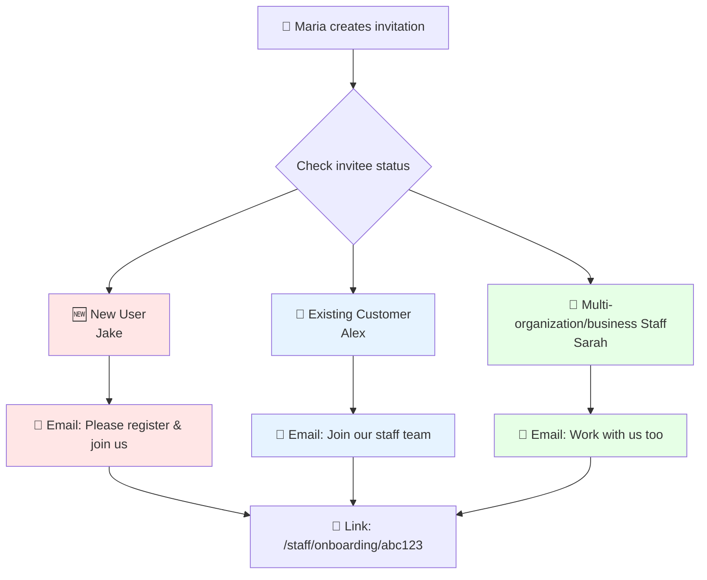
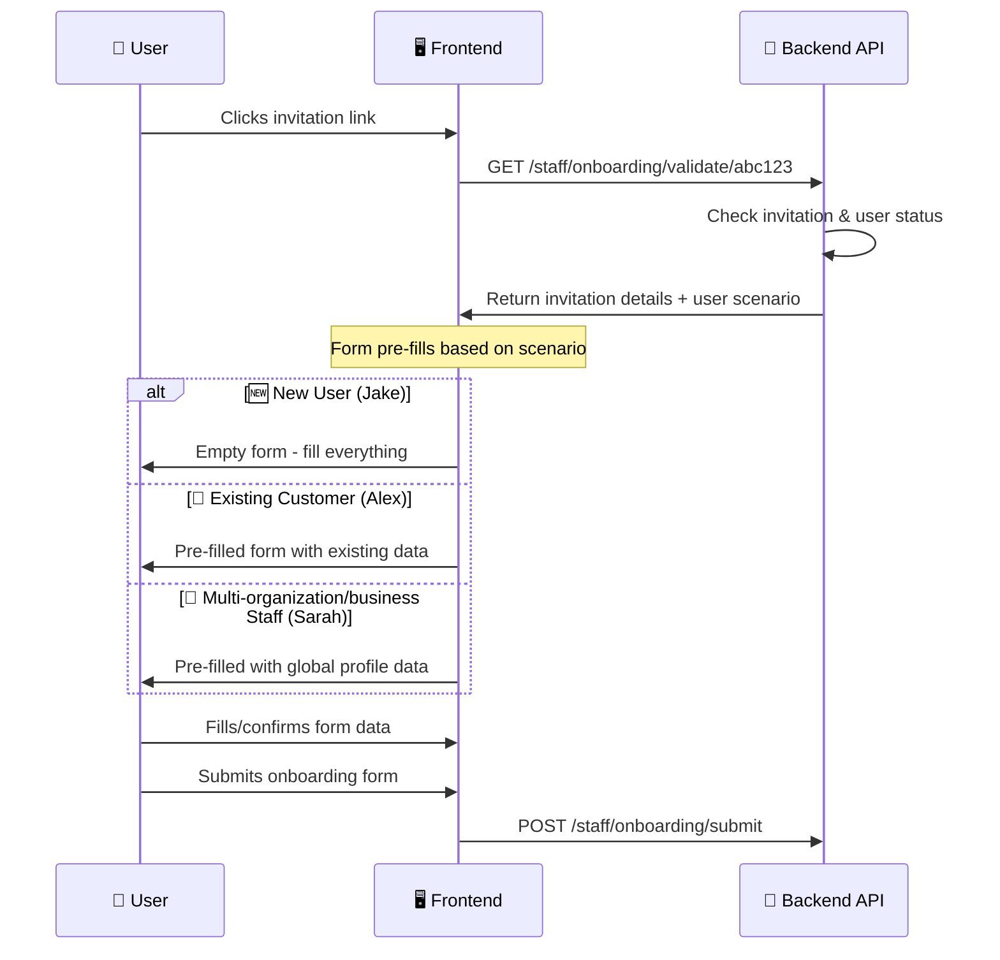
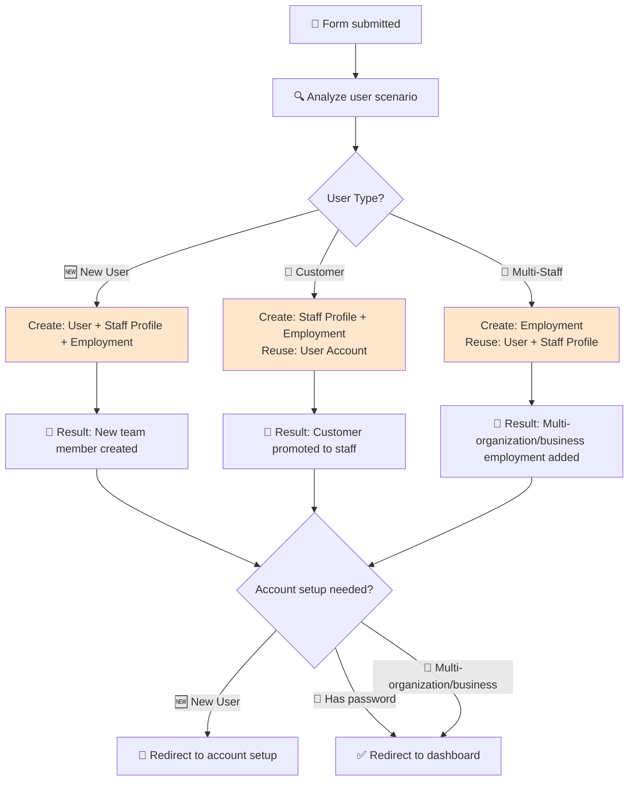
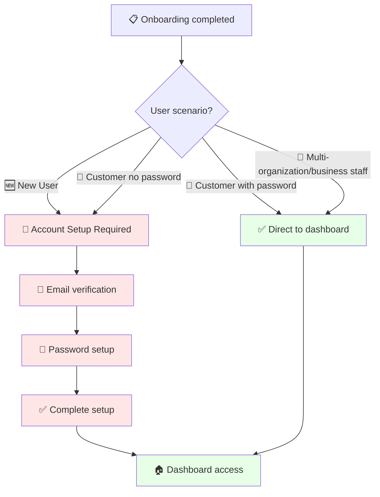
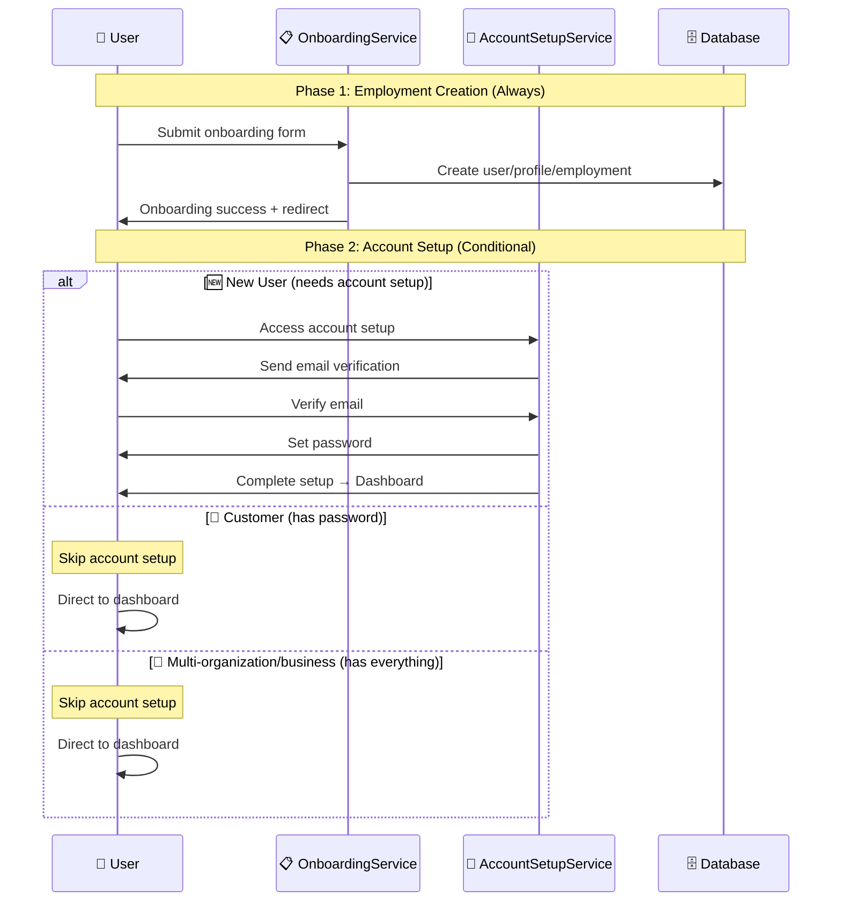
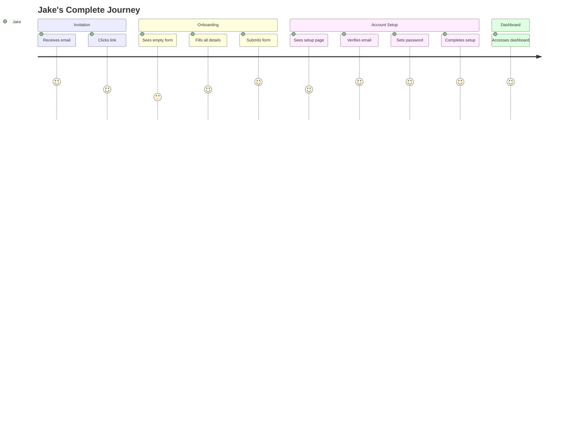
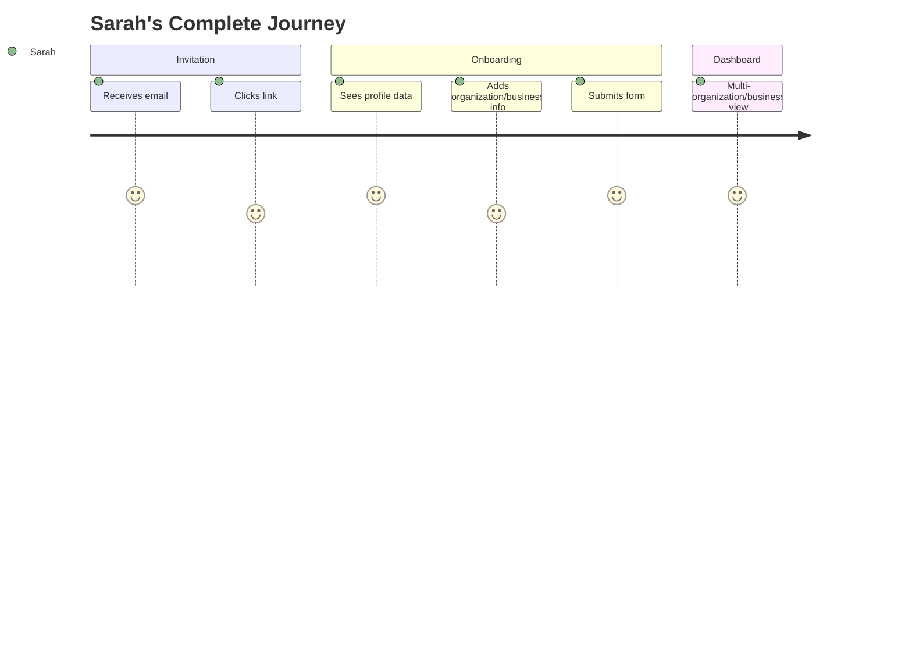

# Portfolio Note

> Extracted from production system, sanitized for portfolio use.

---

# Complete Staff Workflow - All Scenarios Explained

## The Complete Picture: Invitation to Dashboard

This document explains the **ENTIRE** staff workflow from invitation to dashboard access, covering all user scenarios, frontend behavior, and backend processing.

---

## The 3 User Scenarios

### Who Gets Invited?

| Scenario   | User Type            | Has Account? | Is Staff? | Example                               |
| ---------- | -------------------- | ------------ | --------- | ------------------------------------- |
| **Flow 1** | New User          | No        | No     | Jake - never used platform            |
| **Flow 2** | Existing Customer | Yes       | No     | Alex - books appointments as customer |
| **Flow 3** | Multi-organization/business Staff | Yes       | Yes    | Sarah - works at Uptown Glamour       |

---

## Complete Workflow Breakdown

### Phase 1: Invitation Sent



**Key Point:** All scenarios get the same invitation email with the same onboarding link.

---

### Phase 2: Frontend Onboarding Form



#### Frontend Form Behavior

| Scenario                 | Form Fields                   | Pre-filled Data    | User Action             |
| ------------------------ | ----------------------------- | ------------------ | ----------------------- |
| **New User**          | All empty                     | None               | Fill everything         |
| **Existing Customer** | Name, email, phone pre-filled | From user account  | Confirm/update details  |
| **Multi-organization/business Staff** | Profile data pre-filled       | From staff profile | Add organization/business-specific info |

---

### Phase 3: Backend Onboarding Processing



#### Backend Processing Details

```typescript
// staff-onboarding.service.ts - executeAtomicOnboarding()

if (!scenario.existing_account) {
  // 🆕 NEW USER (Jake)
  userId = await createNewUser(data);
  staffProfileId = await createNewStaffProfile(userId, data);
  employmentId = await createEmployment(staffProfileId, data);
} else if (!scenario.existing_staff_profile) {
  // 👤 EXISTING CUSTOMER (Alex)
  userId = scenario.user_id;
  staffProfileId = await createNewStaffProfile(userId, data);
  employmentId = await createEmployment(staffProfileId, data);
} else {
  // 💼 MULTI-organization/business STAFF (Sarah)
  userId = scenario.user_id;
  staffProfileId = scenario.staff_profile_id; // REUSE existing
  employmentId = await createEmployment(staffProfileId, data);
}
```

---

### Phase 4: Post-Onboarding Routing



---

## Account Setup vs Onboarding

### When Does What Happen?

| Service                       | Purpose                        | When Used              | For Who                                 |
| ----------------------------- | ------------------------------ | ---------------------- | --------------------------------------- |
| **StaffOnboardingService** | Create employment relationship | Always (all scenarios) | Everyone                                |
| **AccountSetupService**    | Set up login credentials       | Only when needed       | New users + customers without passwords |

### The Flow Relationship



---

## Frontend Implementation Guide

### Onboarding Form Component

```typescript
// OnboardingForm.tsx
const OnboardingForm = ({ invitationToken }) => {
  const [userScenario, setUserScenario] = useState(null);
  const [formData, setFormData] = useState({});

  useEffect(() => {
    // Validate token and get user scenario
    validateInvitation(invitationToken).then((response) => {
      setUserScenario(response.user_scenario);

      // Pre-fill form based on scenario
      if (response.user_scenario === 'existing_customer') {
        setFormData({
          firstName: response.user_data.name.split(' ')[0],
          lastName: response.user_data.name.split(' ')[1],
          email: response.user_data.email,
          phone: response.user_data.phone,
        });
      } else if (response.user_scenario === 'multi_salon_staff') {
        setFormData({
          ...response.staff_profile_data,
          // Only organization/business-specific fields remain empty
        });
      }
    });
  }, [invitationToken]);

  const handleSubmit = async (data) => {
    const result = await submitOnboarding({
      ...data,
      invitation_token: invitationToken,
    });

    // Route based on result
    if (result.requires_account_setup) {
      router.push(`/staff/account-setup?profile=${result.staff_profile_id}`);
    } else {
      router.push('/staff/dashboard');
    }
  };
};
```

### Account Setup Flow

```typescript
// AccountSetupFlow.tsx
const AccountSetupFlow = ({ staffProfileId }) => {
  const [currentStep, setCurrentStep] = useState('email_verification');

  useEffect(() => {
    // Check current setup status
    getAccountSetupStatus(staffProfileId).then(status => {
      setCurrentStep(status.next_step);
    });
  }, []);

  const steps = {
    'email_verification': <EmailVerificationStep />,
    'password_setup': <PasswordSetupStep />,
    'complete_setup': <CompleteSetupStep />
  };

  return (
    <div>
      <ProgressBar currentStep={currentStep} />
      {steps[currentStep]}
    </div>
  );
};
```

---

## Detailed Scenario Examples

### Scenario 1: Jake (New User)



**Database Changes:**

```sql
-- New records created
users: INSERT new user
staff_profiles: INSERT new profile
staff_employments: INSERT new employment
user_verifications: INSERT email verification
user_credentials: INSERT password hash
```

### Scenario 2: Alex (Existing Customer)


**Database Changes:**

```sql
-- Reuse existing, create new
users: REUSE existing
staff_profiles: INSERT new profile
staff_employments: INSERT new employment
-- No account setup needed (has password)
```

### Scenario 3: Sarah (Multi-organization/business Staff)



**Database Changes:**

```sql
-- Reuse everything, add employment
users: REUSE existing
staff_profiles: REUSE existing
staff_employments: INSERT additional employment
-- No account setup needed (has everything)
```

---

## Summary

**The Flow:**

1. **Invitation** - Same for all scenarios
2. **Onboarding Form** - Pre-fills based on user type
3. **Backend Processing** - Creates appropriate records
4. **Routing Decision** - Account setup vs dashboard
5. **Dashboard Access** - Multi-organization/business aware

**The Scenarios:**

- **New User:** Full journey (onboarding -> account setup -> dashboard)
- **Existing Customer:** Medium journey (onboarding -> dashboard)
- **Multi-organization/business Staff:** Short journey (onboarding -> dashboard)

---

## Actual Module Structure (Verified Against Codebase)

The staff module (`apps/api/src/staff/`) contains **10 controllers** and **18 services** organized into 3 service subdirectories.

### Controllers (10)

| Controller | File | Purpose |
|---|---|---|
| `AdminStaffController` | `admin-staff.controller.ts` | Admin-level staff management |
| `OwnerProfileCompletionController` | `owner-profile-completion.controller.ts` | Owner profile completion flow |
| `PublicStaffController` | `public-staff.controller.ts` | Public-facing staff endpoints |
| `StaffAccountSetupController` | `staff-account-setup.controller.ts` | Account setup for new staff |
| `StaffInvitationsPublicController` | `staff-invitations-public.controller.ts` | Public invitation validation |
| `StaffInvitationsController` | `staff-invitations.controller.ts` | Invitation management (authenticated) |
| `StaffOnboardingFormController` | `staff-onboarding-form.controller.ts` | Onboarding form submission |
| `StaffProfileCompletionController` | `staff-profile-completion.controller.ts` | Staff profile completion |
| `StaffProfileController` | `staff-profile.controller.ts` | Staff profile CRUD |
| `StaffScheduleController` | `staff-schedule.controller.ts` | Staff schedule management |

### Services (18, in 3 subdirectories)

**invitations/** (5 services):
- `StaffInvitationCoreService` - Core invitation logic
- `StaffInvitationResponseService` - Invitation response handling
- `StaffInvitationTransformationService` - Data transformation
- `StaffInvitationValidationService` - Invitation validation rules
- `StaffInvitationsService` - Invitation orchestration

**management/** (6 services):
- `AdminStaffService` - Admin staff operations
- `PublicStaffService` - Public staff queries
- `ScheduleProposalService` - Schedule proposals
- `StaffEmploymentsService` - Employment record management
- `StaffProfileCompletionService` - Profile completion tracking
- `StaffProfileService` - Profile CRUD

**onboarding/** (7 services):
- `AccountSetupService` - Credential setup for new users
- `OwnerProfileCompletionService` - Owner profile completion
- `StaffEmploymentLifecycleService` - Employment lifecycle management
- `StaffOnboardingIdentityService` - Identity resolution during onboarding
- `StaffOnboardingService` - Onboarding orchestration
- `StaffProfileProvisioningService` - Profile creation during onboarding
- `StaffUserDetectionService` - User scenario detection (new/existing/multi-organization/business)

### Repositories (10)

- `AccountSetupRepository`
- `ScheduleProposalRepository`
- `StaffAvailabilityRepository`
- `StaffEmploymentRepository`
- `StaffInvitationsRepository`
- `StaffProfileRepository`
- `StaffSalonAssociationsRepository`
- `StaffServicesRepository`
- `StaffSpecializationsRepository`
- `UserRepository` (imported from `users` module)

### Discrepancies Between Doc and Code

1. **Doc says "One service handles employment creation (StaffOnboardingService)"** - In reality, onboarding is decomposed into 7 services with clear SRP: identity detection, profile provisioning, employment lifecycle, etc.
2. **Doc references `executeAtomicOnboarding()` in `staff-onboarding.service.ts`** - The actual service file is `staff-onboarding.service.ts` in `services/onboarding/`. The method name should be verified against the actual source.
3. **Doc does not mention** `OwnerProfileCompletionController`, `StaffProfileCompletionController`, `StaffScheduleController`, or `PublicStaffController` - these are additional controllers beyond what the invitation/onboarding workflow covers.
4. **Doc does not cover** schedule management, profile completion flows, or admin staff operations - the module scope is broader than onboarding alone.
5. **Invitation service is decomposed into 5 services** (core, response, transformation, validation, orchestration) - more granular than the doc implies.
