# Portfolio Note

> Extracted from production system, sanitized for portfolio use.

---

# Staff Time-Off Management System

## Table of Contents

1. [System Overview](#system-overview)
2. [Architecture Design](#architecture-design)
3. [Database Schema](#database-schema)
4. [API Design](#api-design)
5. [Business Logic](#business-logic)
6. [Complete Operational Flow](#complete-operational-flow)
7. [Edge Cases and Handling](#edge-cases-and-handling)
8. [Customer Communication Templates](#customer-communication-templates)
9. [Manager Escalation Workflow](#manager-escalation-workflow)
10. [Implementation Status Dashboard](#implementation-status-dashboard)
11. [Implementation Roadmap](#implementation-roadmap)
12. [KPIs and Success Metrics](#kpis-and-success-metrics)
13. [Codebase Discrepancies](#codebase-discrepancies)

---

## System Overview

### What is Time-Off Management?

A comprehensive system allowing staff members to request time off (vacation, sick leave, holidays) and managers to approve/reject these requests, with automatic integration into the booking availability system.

### Core Objectives

1. **Staff Self-Service**: Staff can request time off without manager intervention
2. **Manager Oversight**: Managers approve/reject requests with business rule validation
3. **Automatic Blocking**: Approved time-off automatically blocks booking availability
4. **Customer Communication**: Notify customers with existing bookings during time-off
5. **Conflict Detection**: Prevent overlapping time-off and validate business rules

### Key Features

- Multiple time-off types (vacation, sick, holiday, personal, emergency)
- Request/approval workflow
- Recurring time-off patterns (every Monday off)
- Public holiday management per organization/business
- Partial day time-off (half-day, custom hours)
- Time-off balance tracking
- Auto-blocking of availability slots
- Customer rebooking assistance

**Core Principle:** Balance staff well-being, customer satisfaction, and business continuity through intelligent automation and strategic human intervention.

### Business Requirements

> **Original Requirement**: "Calendar Management - Mark holidays or unavailable days."

**Enhanced Requirements:**

1. **Staff Time-Off Requests** - Staff can request vacation, sick leave, personal days. Specify date ranges, full/partial days. Add notes/reasons. View request status.
2. **Manager Approval Workflow** - Managers see all pending requests. Approve/reject with optional notes. Override approvals for emergencies. View team calendar.
3. **Automatic Availability Blocking** - Approved time-off blocks booking slots. Customers cannot book staff during time-off. Existing bookings show conflict warnings. Auto-suggest alternative staff.
4. **Public Holidays** - organization/business owners define public holidays per location. Auto-apply to all staff or select staff. Support country-specific holiday calendars. Automatic year-end rollover.
5. **Time-Off Balance Management** - Track available vacation days per staff. Configurable accrual rates. Carry-over policies. Balance warnings when low.

---

## Architecture Design

### High-Level System Architecture

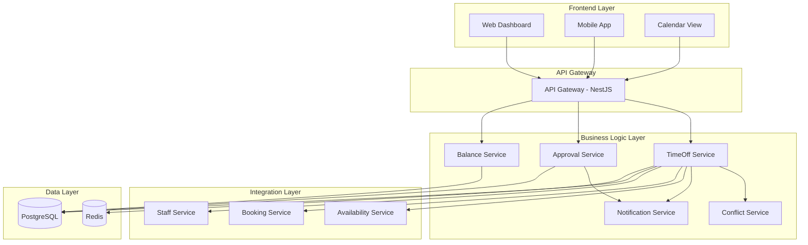
```mermaid
graph TB
    subgraph "Frontend Layer"
        WEB[Web Dashboard]
        MOBILE[Mobile App]
        CALENDAR[Calendar View]
    end

    subgraph "API Gateway"
        GATEWAY[API Gateway - NestJS]
    end

    subgraph "Business Logic Layer"
        TIMEOFF[TimeOff Service]
        APPROVAL[Approval Service]
        BALANCE[Balance Service]
        CONFLICT[Conflict Service]
        NOTIFICATION[Notification Service]
    end

    subgraph "Integration Layer"
        AVAIL[Availability Service]
        BOOKING[Booking Service]
        STAFF[Staff Service]
    end

    subgraph "Data Layer"
        DB[(PostgreSQL)]
        CACHE[(Redis)]
    end

    WEB --> GATEWAY
    MOBILE --> GATEWAY
    CALENDAR --> GATEWAY

    GATEWAY --> TIMEOFF
    GATEWAY --> APPROVAL
    GATEWAY --> BALANCE

    TIMEOFF --> CONFLICT
    TIMEOFF --> NOTIFICATION
    APPROVAL --> NOTIFICATION

    TIMEOFF --> AVAIL
    TIMEOFF --> BOOKING
    TIMEOFF --> STAFF

    TIMEOFF --> DB
    TIMEOFF --> CACHE
    BALANCE --> DB
    APPROVAL --> DB
```

### Component Responsibilities

#### 1. TimeOffService

```typescript
class TimeOffService {
  createRequest(staffId, data): Promise<TimeOffRequest>;
  getMyRequests(staffId): Promise<TimeOffRequest[]>;
  cancelRequest(requestId, staffId): Promise<void>;
  getPendingRequests(tenantId): Promise<TimeOffRequest[]>;
  getTeamCalendar(tenantId, dateRange): Promise<CalendarView>;
  createRecurringTimeOff(staffId, pattern): Promise<RecurringTimeOff>;
  generateInstancesFromRecurring(recurringId): Promise<TimeOffRequest[]>;
}
```

#### 2. ApprovalService

```typescript
class ApprovalService {
  approveRequest(requestId, managerId, notes?): Promise<void>;
  rejectRequest(requestId, managerId, reason): Promise<void>;
  bulkApprove(requestIds, managerId): Promise<void>;
  shouldAutoApprove(request: TimeOffRequest): boolean;
  applyAutoApprovalRules(request): Promise<void>;
}
```

#### 3. BalanceService

```typescript
class BalanceService {
  getStaffBalance(staffId, tenantId): Promise<Balance>;
  accrueBalance(staffId, amount, reason): Promise<void>;
  deductBalance(staffId, days, requestId): Promise<void>;
  calculateAccrual(staffId, employmentDate): Promise<number>;
  checkSufficientBalance(staffId, requestedDays): Promise<boolean>;
}
```

#### 4. ConflictService

```typescript
class ConflictService {
  detectOverlappingRequests(staffId, dateRange): Promise<Conflict[]>;
  checkTeamCoverageRequirements(tenantId, date): Promise<boolean>;
  findAffectedBookings(staffId, dateRange): Promise<Booking[]>;
  suggestAlternatives(conflict): Promise<Alternative[]>;
}
```

---

## Database Schema

### Core Tables Architecture

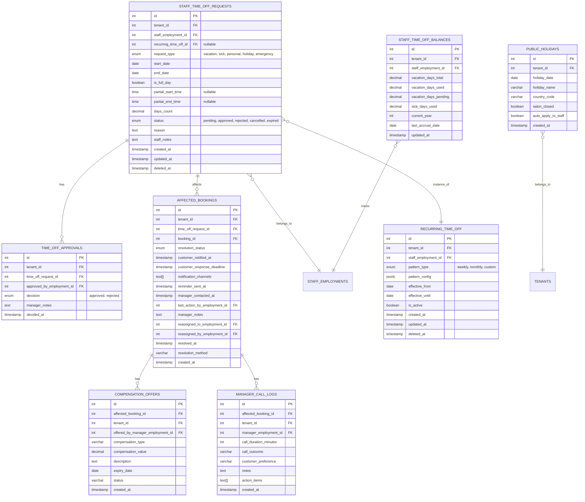
```mermaid
erDiagram
    STAFF_TIME_OFF_REQUESTS ||--o{ TIME_OFF_APPROVALS : "has"
    STAFF_TIME_OFF_REQUESTS ||--o{ AFFECTED_BOOKINGS : "affects"
    STAFF_TIME_OFF_REQUESTS }o--|| STAFF_EMPLOYMENTS : "belongs_to"
    STAFF_TIME_OFF_REQUESTS }o--|| RECURRING_TIME_OFF : "instance_of"

    STAFF_TIME_OFF_BALANCES }o--|| STAFF_EMPLOYMENTS : "tracks"
    PUBLIC_HOLIDAYS }o--|| TENANTS : "belongs_to"
    AFFECTED_BOOKINGS ||--o{ COMPENSATION_OFFERS : "has"
    AFFECTED_BOOKINGS ||--o{ MANAGER_CALL_LOGS : "has"

    STAFF_TIME_OFF_REQUESTS {
        int id PK
        int tenant_id FK
        int staff_employment_id FK
        int recurring_time_off_id FK "nullable"
        enum request_type "vacation, sick, personal, holiday, emergency"
        date start_date
        date end_date
        boolean is_full_day
        time partial_start_time "nullable"
        time partial_end_time "nullable"
        decimal days_count
        enum status "pending, approved, rejected, cancelled, expired"
        text reason
        text staff_notes
        timestamp created_at
        timestamp updated_at
        timestamp deleted_at
    }

    TIME_OFF_APPROVALS {
        int id PK
        int tenant_id FK
        int time_off_request_id FK
        int approved_by_employment_id FK
        enum decision "approved, rejected"
        text manager_notes
        timestamp decided_at
    }

    RECURRING_TIME_OFF {
        int id PK
        int tenant_id FK
        int staff_employment_id FK
        enum pattern_type "weekly, monthly, custom"
        jsonb pattern_config
        date effective_from
        date effective_until
        boolean is_active
        timestamp created_at
        timestamp updated_at
        timestamp deleted_at
    }

    STAFF_TIME_OFF_BALANCES {
        int id PK
        int tenant_id FK
        int staff_employment_id FK
        decimal vacation_days_total
        decimal vacation_days_used
        decimal vacation_days_pending
        decimal sick_days_used
        int current_year
        date last_accrual_date
        timestamp updated_at
    }

    PUBLIC_HOLIDAYS {
        int id PK
        int tenant_id FK
        date holiday_date
        varchar holiday_name
        varchar country_code
        boolean salon_closed
        boolean auto_apply_to_staff
        timestamp created_at
    }

    AFFECTED_BOOKINGS {
        int id PK
        int tenant_id FK
        int time_off_request_id FK
        int booking_id FK
        enum resolution_status
        timestamp customer_notified_at
        timestamp customer_response_deadline
        text[] notification_channels
        timestamp reminder_sent_at
        timestamp manager_contacted_at
        int last_action_by_employment_id FK
        text manager_notes
        int reassigned_to_employment_id FK
        int reassigned_by_employment_id FK
        timestamp resolved_at
        varchar resolution_method
        timestamp created_at
    }

    COMPENSATION_OFFERS {
        int id PK
        int affected_booking_id FK
        int tenant_id FK
        int offered_by_manager_employment_id FK
        varchar compensation_type
        decimal compensation_value
        text description
        date expiry_date
        varchar status
        timestamp created_at
    }

    MANAGER_CALL_LOGS {
        int id PK
        int affected_booking_id FK
        int tenant_id FK
        int manager_employment_id FK
        int call_duration_minutes
        varchar call_outcome
        varchar customer_preference
        text notes
        text[] action_items
        timestamp created_at
    }
```

### Resolution Status Enum (Actual Code)

The `affectedBookingResolutionEnum` values in code are:

- `pending` - Initial state after detection
- `customer_rescheduled` - Customer chose a new time
- `customer_reassigned` - Customer accepted alternative staff
- `customer_cancelled` - Customer chose to cancel
- `manager_calling_customer` - Manager is personally contacting customer
- `manager_reassigned` - Manager manually reassigned staff
- `manager_cancelled` - Manager force-cancelled
- `auto_reassigned` - System auto-reassigned
- `auto_cancelled` - System auto-cancelled after deadline

### Key Indexes

```sql
-- Time-off request queries
CREATE INDEX idx_time_off_staff_status ON staff_time_off_requests(tenant_id, staff_employment_id, status, start_date) WHERE deleted_at IS NULL;
CREATE INDEX idx_time_off_tenant_pending ON staff_time_off_requests(tenant_id, status, created_at) WHERE status = 'pending' AND deleted_at IS NULL;
CREATE INDEX idx_time_off_staff_dates ON staff_time_off_requests(tenant_id, staff_employment_id, start_date, end_date) WHERE deleted_at IS NULL;
CREATE INDEX idx_time_off_tenant_date ON staff_time_off_requests(tenant_id, start_date, end_date) WHERE deleted_at IS NULL;
CREATE INDEX idx_time_off_tenant_staff_date ON staff_time_off_requests(tenant_id, staff_employment_id, start_date) WHERE status = 'approved' AND deleted_at IS NULL;

-- Balance lookups
CREATE INDEX idx_balance_staff_year ON staff_time_off_balances(tenant_id, staff_employment_id, current_year);

-- Holiday lookups
CREATE INDEX idx_holiday_tenant_date ON public_holidays(tenant_id, holiday_date);
CREATE INDEX idx_holiday_country ON public_holidays(tenant_id, country_code);

-- Recurring pattern lookups
CREATE INDEX idx_recurring_staff_active ON recurring_time_off(tenant_id, staff_employment_id) WHERE is_active = true AND deleted_at IS NULL;

-- Affected bookings
CREATE INDEX idx_affected_tenant_request ON affected_bookings(tenant_id, time_off_request_id, resolution_status);
CREATE INDEX idx_affected_booking ON affected_bookings(tenant_id, booking_id);
CREATE INDEX idx_affected_pending ON affected_bookings(tenant_id, resolution_status, customer_response_deadline) WHERE resolution_status = 'pending';
CREATE INDEX idx_affected_deadline ON affected_bookings(tenant_id, customer_response_deadline) WHERE resolution_status = 'pending' AND customer_response_deadline IS NOT NULL;
```

### Schema Assessment

The `affected_bookings` table design strikes the right balance:

- Tracks complete workflow: notification to customer response to resolution
- Enables audit trail: who did what, when, and why
- Supports automation: deadlines, reminders, escalations
- Manager oversight: notes, manual actions, escalation tracking
- Multi-tenant compliant: uses `tenant_id` + `staffEmployments.id`
- Business intelligence: resolution methods, response times, patterns

Additional tables (`compensation_offers`, `manager_call_logs`) extend the core workflow with dedicated tracking for VIP handling and compensation packages.

---

## API Design

### Staff Self-Service APIs

```typescript
// GET /:tenantSlug/staff/me/time-off/balance
interface TimeOffBalanceResponse {
  vacation: {
    total: number;
    used: number;
    pending: number;
    available: number;
  };
  sickDays: { used: number };
  currentYear: number;
  nextAccrual: { date: string; amount: number };
}

// GET /:tenantSlug/staff/me/time-off?status=pending&year=2025
interface GetMyTimeOffResponse {
  requests: TimeOffRequest[];
  summary: { pending: number; approved: number; rejected: number };
}

// POST /:tenantSlug/staff/me/time-off
interface CreateTimeOffRequestDto {
  requestType: 'vacation' | 'sick' | 'personal' | 'emergency';
  startDate: string;
  endDate: string;
  isFullDay: boolean;
  partialStartTime?: string;
  partialEndTime?: string;
  reason?: string;
  staffNotes?: string;
}

// DELETE /:tenantSlug/staff/me/time-off/:requestId
interface CancelTimeOffResponse {
  success: boolean;
  message: string;
  refundedDays: number;
}

// POST /:tenantSlug/staff/me/time-off/recurring
interface CreateRecurringTimeOffDto {
  patternType: 'weekly' | 'monthly' | 'custom';
  patternConfig: {
    dayOfWeek?: 'monday' | 'tuesday' | 'wednesday' | 'thursday' | 'friday' | 'saturday' | 'sunday';
    fullDay?: boolean;
    startTime?: string;
    endTime?: string;
  };
  effectiveFrom: string;
  effectiveUntil?: string;
}
```

### Manager/Admin APIs

```typescript
// GET /:tenantSlug/staff/time-off/pending
interface GetPendingRequestsResponse {
  requests: Array<TimeOffRequest & {
    staffName: string;
    currentBalance: number;
    affectedBookings: number;
  }>;
}

// POST /:tenantSlug/staff/time-off/:requestId/approve
interface ApproveTimeOffDto {
  managerNotes?: string;
  autoReassignBookings?: boolean;
}

// POST /:tenantSlug/staff/time-off/:requestId/reject
interface RejectTimeOffDto {
  reason: string;
  managerNotes?: string;
}

// GET /:tenantSlug/staff/time-off/calendar?month=2025-06
interface TeamCalendarResponse {
  month: string;
  staffMembers: Array<{
    staffId: number;
    staffName: string;
    timeOff: Array<{ date: string; type: string; status: string }>;
  }>;
  publicHolidays: Array<{ date: string; name: string }>;
}

// POST /:tenantSlug/staff/time-off/bulk-approve
interface BulkApproveDto {
  requestIds: number[];
  managerNotes?: string;
}
```

### Public Holiday APIs

```typescript
// POST /:tenantSlug/admin/public-holidays
interface CreatePublicHolidayDto {
  holidayDate: string;
  holidayName: string;
  countryCode?: string;
  salonClosed: boolean;
  autoApplyToStaff: boolean;
}

// GET /:tenantSlug/admin/public-holidays?year=2025
interface GetPublicHolidaysResponse {
  holidays: PublicHoliday[];
  totalCount: number;
}

// POST /:tenantSlug/admin/public-holidays/import
interface ImportHolidaysDto {
  countryCode: string;
  year: number;
  autoApplyToStaff: boolean;
}
```

---

## Business Logic

### Approval Rules Engine

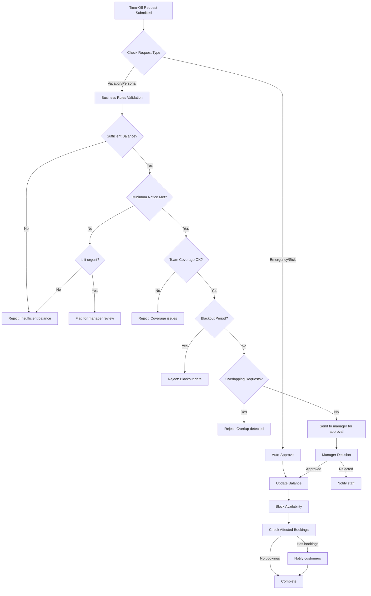
```mermaid
flowchart TD
    A[Time-Off Request Submitted] --> B{Check Request Type}

    B -->|Emergency/Sick| C[Auto-Approve]
    B -->|Vacation/Personal| D[Business Rules Validation]

    D --> E{Sufficient Balance?}
    E -->|No| F[Reject: Insufficient balance]
    E -->|Yes| G{Minimum Notice Met?}

    G -->|No| H{Is it urgent?}
    H -->|Yes| I[Flag for manager review]
    H -->|No| F
    G -->|Yes| J{Team Coverage OK?}

    J -->|No| K[Reject: Coverage issues]
    J -->|Yes| L{Blackout Period?}

    L -->|Yes| M[Reject: Blackout date]
    L -->|No| N{Overlapping Requests?}

    N -->|Yes| O[Reject: Overlap detected]
    N -->|No| P[Send to manager for approval]

    C --> Q[Update Balance]
    P --> R[Manager Decision]
    R -->|Approved| Q
    R -->|Rejected| S[Notify staff]

    Q --> T[Block Availability]
    T --> U[Check Affected Bookings]
    U -->|Has bookings| V[Notify customers]
    U -->|No bookings| W[Complete]
    V --> W
```

### Balance Accrual Logic

**Accrual Policies:**

- Full-time: 20 days/year (1.67 days/month)
- Part-time: Pro-rated based on hours
- New employees: Immediate accrual after probation (3 months)
- Carry-over: Max 5 days to next year

```typescript
class BalanceAccrualService {
  // Runs on 1st of each month
  async accrueMonthlyBalance(staffEmploymentId: number): Promise<void> {
    const policy = await this.getAccrualPolicy(staffEmploymentId);
    const balance = await this.getCurrentBalance(staffEmploymentId);

    if (this.isInProbation(policy)) {
      this.logger.log('Staff in probation - no accrual');
      return;
    }

    const accrualAmount = policy.monthlyAccrual;

    await this.db
      .update(staffTimeOffBalances)
      .set({
        vacation_days_total: balance.vacation_days_total + accrualAmount,
        last_accrual_date: new Date(),
      })
      .where(eq(staffTimeOffBalances.staff_employment_id, staffEmploymentId));
  }

  // Runs on Dec 31st
  async processYearEndCarryOver(staffEmploymentId: number): Promise<void> {
    const balance = await this.getCurrentBalance(staffEmploymentId);
    const policy = await this.getAccrualPolicy(staffEmploymentId);

    const unusedDays = balance.vacation_days_total - balance.vacation_days_used;
    const carryOverDays = Math.min(unusedDays, policy.maxCarryOver);

    await this.db.insert(staffTimeOffBalances).values({
      staff_employment_id: staffEmploymentId,
      tenant_id: balance.tenant_id,
      vacation_days_total: carryOverDays,
      vacation_days_used: 0,
      vacation_days_pending: 0,
      current_year: new Date().getFullYear() + 1,
      last_accrual_date: new Date(),
    });
  }
}
```

### Conflict Detection Algorithm

```typescript
class ConflictDetectionService {
  async detectConflicts(request: TimeOffRequestDto): Promise<Conflict[]> {
    const conflicts: Conflict[] = [];

    // 1. Overlapping time-off requests
    const overlapping = await this.findOverlappingRequests(
      request.staffEmploymentId, request.startDate, request.endDate,
    );
    if (overlapping.length > 0) {
      conflicts.push({
        type: 'overlapping_request',
        severity: 'error',
        message: 'You already have time-off scheduled for these dates',
        details: overlapping,
      });
    }

    // 2. Team coverage requirements
    const teamCoverage = await this.checkTeamCoverage(
      request.tenantId, request.startDate, request.endDate,
    );
    if (!teamCoverage.adequate) {
      conflicts.push({
        type: 'insufficient_coverage',
        severity: 'warning',
        message: `Team coverage may be affected (${teamCoverage.availableStaff}/${teamCoverage.requiredStaff} available)`,
        details: teamCoverage,
      });
    }

    // 3. Blackout periods (busy seasons)
    const blackout = await this.checkBlackoutPeriods(
      request.tenantId, request.startDate, request.endDate,
    );
    if (blackout.isBlackout) {
      conflicts.push({
        type: 'blackout_period',
        severity: 'error',
        message: `Time-off not allowed during ${blackout.periodName}`,
      });
    }

    // 4. Affected bookings
    const affectedBookings = await this.findAffectedBookings(
      request.staffEmploymentId, request.startDate, request.endDate,
    );
    if (affectedBookings.length > 0) {
      conflicts.push({
        type: 'existing_bookings',
        severity: 'warning',
        message: `${affectedBookings.length} customer bookings will be affected`,
        details: affectedBookings,
      });
    }

    // 5. Minimum notice period
    const daysUntilStart = this.calculateDaysUntil(request.startDate);
    const minimumNotice = await this.getMinimumNoticePolicy(request.tenantId);
    if (daysUntilStart < minimumNotice && request.requestType !== 'emergency') {
      conflicts.push({
        type: 'insufficient_notice',
        severity: 'error',
        message: `Minimum ${minimumNotice} days notice required (you provided ${daysUntilStart} days)`,
      });
    }

    return conflicts;
  }
}
```

---

## Complete Operational Flow

### Master Flow Diagram

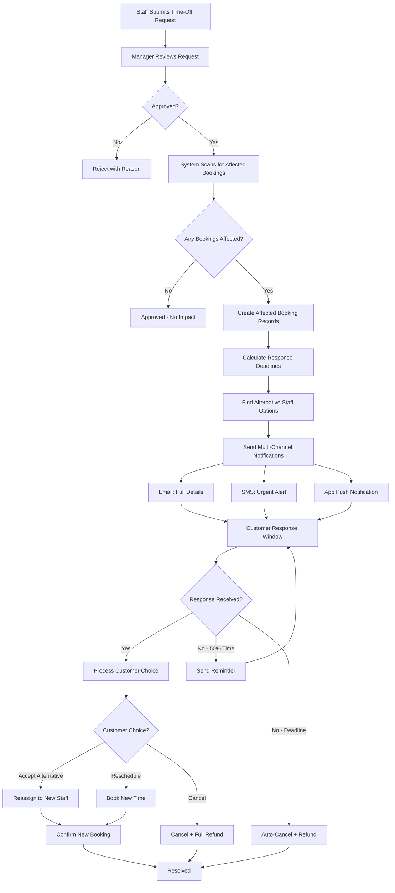
```mermaid
flowchart TD
    Start[Staff Submits Time-Off Request] --> Review[Manager Reviews Request]
    Review --> Approve{Approved?}
    Approve -->|No| Reject[Reject with Reason]
    Approve -->|Yes| Scan[System Scans for Affected Bookings]

    Scan --> Check{Any Bookings Affected?}
    Check -->|No| Done1[Approved - No Impact]
    Check -->|Yes| Create[Create Affected Booking Records]

    Create --> Calculate[Calculate Response Deadlines]
    Calculate --> FindAlt[Find Alternative Staff Options]
    FindAlt --> Notify[Send Multi-Channel Notifications]

    Notify --> Email[Email: Full Details]
    Notify --> SMS[SMS: Urgent Alert]
    Notify --> Push[App Push Notification]

    Email --> Wait[Customer Response Window]
    SMS --> Wait
    Push --> Wait

    Wait --> Monitor{Response Received?}
    Monitor -->|Yes| Process[Process Customer Choice]
    Monitor -->|No - 50% Time| Reminder[Send Reminder]
    Reminder --> Wait

    Monitor -->|No - Deadline| AutoCancel[Auto-Cancel + Refund]

    Process --> Choice{Customer Choice?}
    Choice -->|Accept Alternative| Reassign[Reassign to New Staff]
    Choice -->|Reschedule| NewTime[Book New Time]
    Choice -->|Cancel| Cancel[Cancel + Full Refund]

    Reassign --> Confirm[Confirm New Booking]
    NewTime --> Confirm
    Cancel --> Done2[Resolved]
    AutoCancel --> Done2
    Confirm --> Done2
```

### Phase 1: Time-Off Approval (0-1 hour)

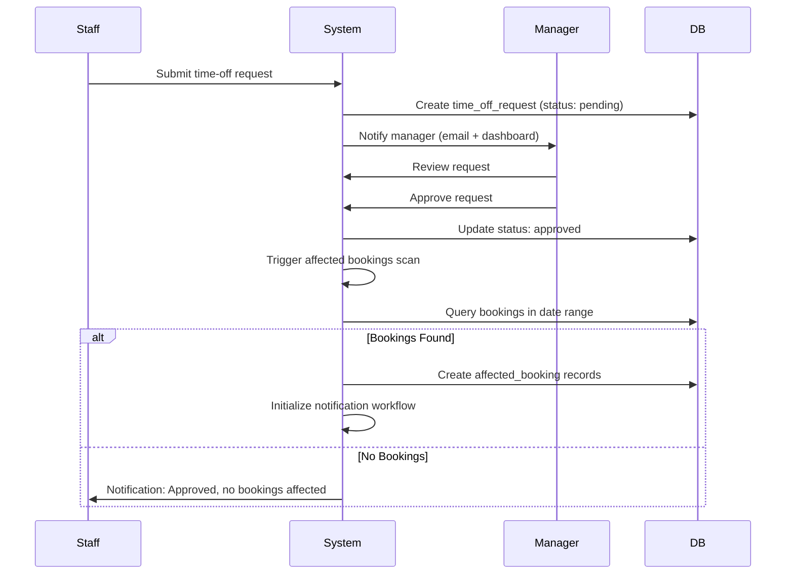
```mermaid
sequenceDiagram
    participant Staff
    participant System
    participant Manager
    participant DB

    Staff->>System: Submit time-off request
    System->>DB: Create time_off_request (status: pending)
    System->>Manager: Notify manager (email + dashboard)

    Manager->>System: Review request
    Manager->>System: Approve request

    System->>DB: Update status: approved
    System->>System: Trigger affected bookings scan
    System->>DB: Query bookings in date range

    alt Bookings Found
        System->>DB: Create affected_booking records
        System->>System: Initialize notification workflow
    else No Bookings
        System->>Staff: Notification: Approved, no bookings affected
    end
```

**Key Actions:**

1. Immediate scan for affected bookings (0-5 minutes)
2. Create affected_bookings records with initial status: `pending`
3. Calculate response deadlines based on booking date
4. Identify alternative staff with same qualifications
5. Queue notification jobs

**Affected Bookings Detection:**

```typescript
function findAffectedBookings(timeOffRequest) {
  return db.bookings.where({
    tenant_id: timeOffRequest.tenant_id,
    primary_staff_employment_id: timeOffRequest.staff_employment_id,
    booking_date: between(timeOffRequest.start_date, timeOffRequest.end_date),
    status: in(['confirmed', 'pending']),
    deleted_at: null,
  });
}
```

### Phase 2: Customer Notification (0-2 hours)

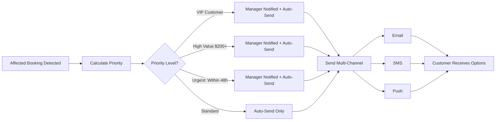
```mermaid
flowchart LR
    A[Affected Booking Detected] --> B[Calculate Priority]
    B --> C{Priority Level?}

    C -->|VIP Customer| D[Manager Notified + Auto-Send]
    C -->|High Value $200+| E[Manager Notified + Auto-Send]
    C -->|Urgent: Within 48h| F[Manager Notified + Auto-Send]
    C -->|Standard| G[Auto-Send Only]

    D --> H[Send Multi-Channel]
    E --> H
    F --> H
    G --> H

    H --> I[Email]
    H --> J[SMS]
    H --> K[Push]

    I --> L[Customer Receives Options]
    J --> L
    K --> L
```

**Response Deadline Calculation:**

```typescript
function calculateResponseDeadline(booking_date: Date, approval_time: Date): Date {
  const daysUntilBooking = daysBetween(approval_time, booking_date);

  if (daysUntilBooking <= 2) {
    return addHours(approval_time, 12);   // URGENT: 12-hour window
  } else if (daysUntilBooking <= 7) {
    return addHours(approval_time, 24);   // STANDARD: 24-hour window
  } else {
    return addHours(approval_time, 48);   // RELAXED: 48-hour window
  }
}
```

**Priority Level Matrix:**

| Condition               | Priority      | Manager Action                                   |
| ----------------------- | ------------- | ------------------------------------------------ |
| VIP Customer            | `vip`         | Immediate notification + personal call within 2h |
| Booking Value >= $200   | `high_value`  | Notification + review dashboard                  |
| Booking within 48 hours | `urgent`      | Notification + SMS escalation                    |
| 5+ bookings same staff  | `bulk_impact` | Review before sending notifications              |
| Standard booking        | `standard`    | Automated handling only                          |

### Phase 3: Customer Response Window (12-48 hours)

```mermaid
gantt
    title Customer Response Timeline (24-hour example)
    dateFormat  HH:mm
    axisFormat %H:%M

    section Notifications
    Initial Email + SMS     :done, n1, 00:00, 00:15
    System Monitoring       :active, n2, 00:15, 23:45

    section Customer Action
    Customer Responds       :crit, c1, 08:00, 08:30

    section Escalation Points
    50% Reminder (12h)      :milestone, m1, 12:00, 0
    Manager Review Alert    :milestone, m2, 18:00, 0
    Final Warning (2h left) :milestone, m3, 22:00, 0
    Auto-Cancel Deadline    :milestone, m4, 24:00, 0
```

**System Monitoring Logic:**

```typescript
async function monitorAffectedBookings() {
  const pending = await getAffectedBookings({ status: 'pending' });

  for (const booking of pending) {
    const timeElapsed = now() - booking.customer_notified_at;
    const deadline = booking.customer_response_deadline;
    const totalWindow = deadline - booking.customer_notified_at;

    // 50% reminder
    if (timeElapsed >= totalWindow * 0.5 && !booking.reminder_sent_at) {
      await sendReminder(booking);
      await updateBooking(booking.id, { reminder_sent_at: now() });
    }

    // Manager escalation (75% elapsed)
    if (timeElapsed >= totalWindow * 0.75 && !booking.manager_contacted_at) {
      await notifyManager(booking, 'at_risk_no_response');
      await updateBooking(booking.id, { manager_contacted_at: now() });
    }

    // Final warning (2 hours before deadline)
    if (deadline - now() <= 2 * 60 * 60 * 1000) {
      await sendFinalWarning(booking);
    }

    // Auto-cancel at deadline
    if (now() >= deadline) {
      await autoCancelBooking(booking);
    }
  }
}
```

### Phase 4: Customer Response Processing

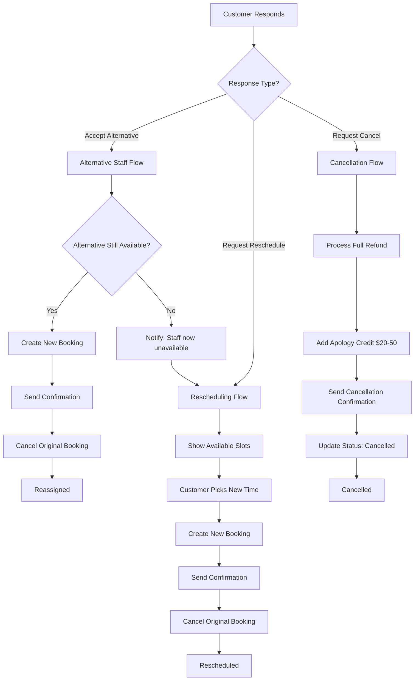
```mermaid
flowchart TD
    Response[Customer Responds] --> Type{Response Type?}

    Type -->|Accept Alternative| Alt[Alternative Staff Flow]
    Type -->|Request Reschedule| Resc[Rescheduling Flow]
    Type -->|Request Cancel| Canc[Cancellation Flow]

    Alt --> CheckAlt{Alternative Still Available?}
    CheckAlt -->|Yes| BookAlt[Create New Booking]
    CheckAlt -->|No| AltGone[Notify: Staff now unavailable]
    AltGone --> Resc

    BookAlt --> ConfirmAlt[Send Confirmation]
    ConfirmAlt --> UpdateOld[Cancel Original Booking]
    UpdateOld --> DoneAlt[Reassigned]

    Resc --> ShowSlots[Show Available Slots]
    ShowSlots --> CustomerPick[Customer Picks New Time]
    CustomerPick --> BookNew[Create New Booking]
    BookNew --> ConfirmResc[Send Confirmation]
    ConfirmResc --> CancelOld[Cancel Original Booking]
    CancelOld --> DoneResc[Rescheduled]

    Canc --> ProcessRefund[Process Full Refund]
    ProcessRefund --> AddCredit[Add Apology Credit $20-50]
    AddCredit --> SendConfirm[Send Cancellation Confirmation]
    SendConfirm --> UpdateStatus[Update Status: Cancelled]
    UpdateStatus --> DoneCanc[Cancelled]
```

**Alternative Staff Acceptance Logic:**

```typescript
async function processAlternativeStaffAcceptance(affected_booking, customer_choice) {
  // Re-verify alternative staff still available (prevent race conditions)
  const alternative_staff = await getStaffEmployment(customer_choice.alternative_staff_id);
  const original_booking = await getBooking(affected_booking.booking_id);

  const isStillAvailable = await checkAvailability({
    staff_employment_id: alternative_staff.id,
    date: original_booking.booking_date,
    start_time: original_booking.start_time,
    duration: original_booking.duration,
  });

  if (!isStillAvailable) {
    await notifyCustomer({
      type: 'alternative_unavailable',
      message: 'Sorry, this team member is no longer available. Please choose another option.',
      new_alternatives: await findAlternativeStaff(original_booking),
    });
    return { success: false, reason: 'alternative_unavailable' };
  }

  const new_booking = await createBooking({
    ...original_booking,
    primary_staff_employment_id: alternative_staff.id,
    booking_source: 'staff_unavailable_reassignment',
    original_booking_id: original_booking.id,
    reassignment_reason: 'staff_time_off',
  });

  await cancelBooking(original_booking.id, {
    reason: 'staff_unavailable',
    refund_amount: 0,
    replacement_booking_id: new_booking.id,
  });

  await updateAffectedBooking(affected_booking.id, {
    resolution_status: 'customer_reassigned',
    reassigned_to_employment_id: alternative_staff.id,
    resolved_at: now(),
    resolution_method: 'alternative_staff_accepted',
  });

  await sendConfirmation(customer, new_booking);
  return { success: true, new_booking_id: new_booking.id };
}
```

### Phase 5: Auto-Cancellation (No Response)

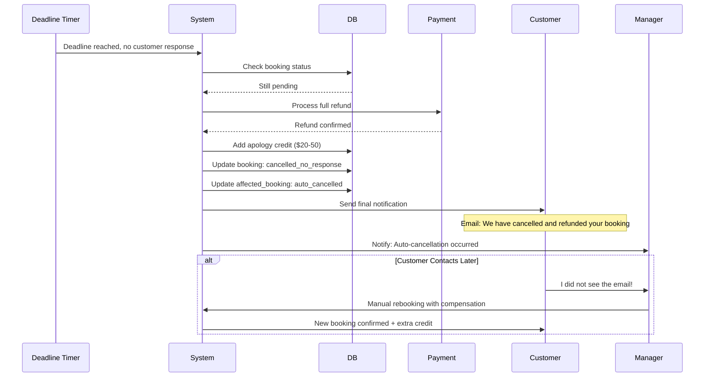
```mermaid
sequenceDiagram
    participant Timer as Deadline Timer
    participant System
    participant DB
    participant Payment
    participant Customer
    participant Manager

    Timer->>System: Deadline reached, no customer response
    System->>DB: Check booking status
    DB-->>System: Still pending

    System->>Payment: Process full refund
    Payment-->>System: Refund confirmed

    System->>DB: Add apology credit ($20-50)
    System->>DB: Update booking: cancelled_no_response
    System->>DB: Update affected_booking: auto_cancelled

    System->>Customer: Send final notification
    Note over Customer: Email: We have cancelled and refunded your booking

    System->>Manager: Notify: Auto-cancellation occurred

    alt Customer Contacts Later
        Customer->>Manager: I did not see the email!
        Manager->>System: Manual rebooking with compensation
        System->>Customer: New booking confirmed + extra credit
    end
```

**Auto-Cancellation Logic:**

```typescript
async function autoCancelBooking(affected_booking) {
  const booking = await getBooking(affected_booking.booking_id);

  // 1. Process full refund
  if (booking.payment_status === 'paid') {
    await processRefund({
      booking_id: booking.id,
      amount: booking.total_amount,
      reason: 'staff_unavailable_no_customer_response',
      refund_type: 'full',
    });
  }

  // 2. Add apology credit (scaled to booking value)
  const credit_amount = calculateApologyCredit(booking);
  await addCustomerCredit({
    customer_id: booking.customer_id,
    amount: credit_amount,
    reason: 'apology_staff_unavailable',
    expires_at: addMonths(now(), 6),
  });

  // 3. Cancel booking
  await cancelBooking(booking.id, {
    reason: 'staff_unavailable_no_customer_response',
    cancelled_by: 'system',
    refund_amount: booking.total_amount,
    status: 'cancelled_no_response',
  });

  // 4. Update affected_booking
  await updateAffectedBooking(affected_booking.id, {
    resolution_status: 'auto_cancelled',
    resolved_at: now(),
    resolution_method: 'auto_cancel_deadline_exceeded',
  });

  // 5. Send final notification + 6. Manager notification
  await sendNotification({
    customer_id: booking.customer_id,
    type: 'auto_cancellation_complete',
    channels: ['email', 'sms'],
    data: { booking, refund_amount: booking.total_amount, credit_amount },
  });

  await notifyManager({
    type: 'auto_cancellation',
    affected_booking,
    booking,
    reason: 'Customer did not respond by deadline',
  });
}

function calculateApologyCredit(booking) {
  if (booking.total_amount >= 200) return 50;
  if (booking.total_amount >= 100) return 30;
  return 20;
}
```

### Integration with Availability System

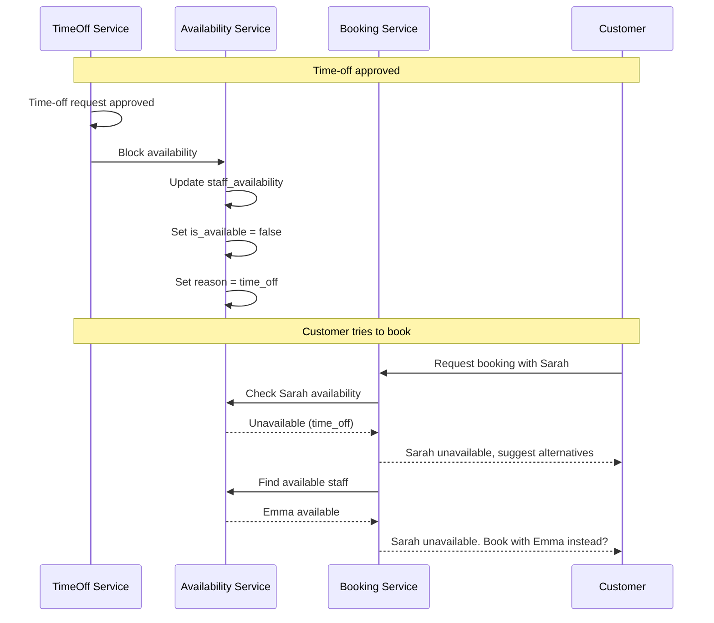
```mermaid
sequenceDiagram
    participant TimeOff as TimeOff Service
    participant Avail as Availability Service
    participant Booking as Booking Service
    participant Customer

    Note over TimeOff,Customer: Time-off approved

    TimeOff->>TimeOff: Time-off request approved
    TimeOff->>Avail: Block availability

    Avail->>Avail: Update staff_availability
    Avail->>Avail: Set is_available = false
    Avail->>Avail: Set reason = time_off

    Note over TimeOff,Customer: Customer tries to book

    Customer->>Booking: Request booking with Sarah
    Booking->>Avail: Check Sarah availability
    Avail-->>Booking: Unavailable (time_off)
    Booking-->>Customer: Sarah unavailable, suggest alternatives

    Booking->>Avail: Find available staff
    Avail-->>Booking: Emma available
    Booking-->>Customer: Sarah unavailable. Book with Emma instead?
```

---

## Edge Cases and Handling

### Edge Case 1: Customer Does Not See Email/SMS

**Problem:** Customer legitimately did not notice the notification.

**Prevention Strategy:**

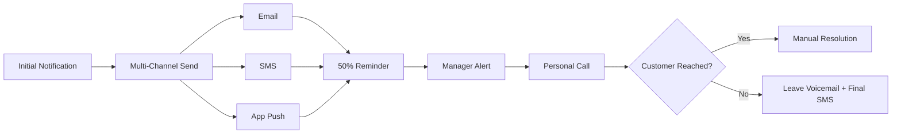
```mermaid
flowchart LR
    A[Initial Notification] --> B[Multi-Channel Send]
    B --> C[Email]
    B --> D[SMS]
    B --> E[App Push]

    C --> F[50% Reminder]
    D --> F
    E --> F

    F --> G[Manager Alert]
    G --> H[Personal Call]
    H --> I{Customer Reached?}
    I -->|Yes| J[Manual Resolution]
    I -->|No| K[Leave Voicemail + Final SMS]
```

**Solution:**

1. Send to ALL channels simultaneously (email + SMS + app)
2. Reminder at 50% deadline
3. Manager escalation at 75% (personal call attempt)
4. Final SMS 2 hours before deadline
5. If auto-cancelled, allow easy rebooking with extra compensation if customer contacts within 48h

**Post-Auto-Cancel Customer Contact:**

```typescript
async function handleLateCustomerContact(booking_id, contact_time) {
  const booking = await getBooking(booking_id);
  const hours_since_cancel = hoursBetween(booking.cancelled_at, contact_time);

  if (hours_since_cancel <= 48) {
    return {
      allow_rebooking: true,
      compensation: {
        refund_kept: true,
        additional_credit: 30,
        priority_rebooking: true,
      },
      message: "We're sorry you missed our messages! Your refund stands, and we've added extra credit.",
    };
  } else {
    return {
      allow_rebooking: true,
      compensation: { refund_kept: true, additional_credit: 0, priority_rebooking: false },
    };
  }
}
```

### Edge Case 2: No Alternative Staff Available

**Problem:** All qualified staff are booked or unavailable.

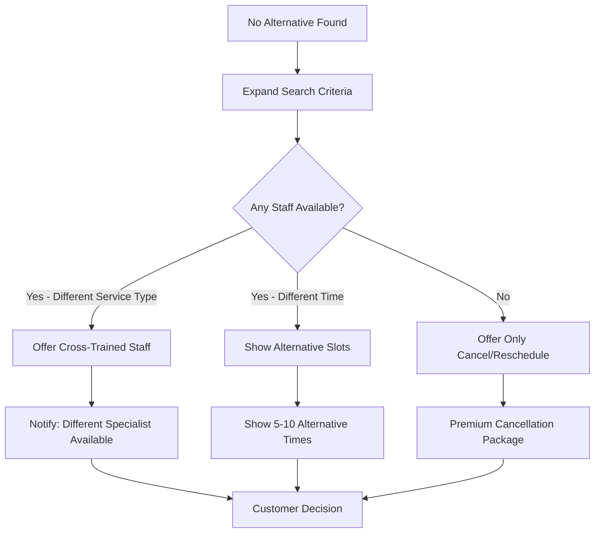
```mermaid
flowchart TD
    A[No Alternative Found] --> B[Expand Search Criteria]
    B --> C{Any Staff Available?}

    C -->|Yes - Different Service Type| D[Offer Cross-Trained Staff]
    C -->|Yes - Different Time| E[Show Alternative Slots]
    C -->|No| F[Offer Only Cancel/Reschedule]

    D --> G[Notify: Different Specialist Available]
    E --> H[Show 5-10 Alternative Times]
    F --> I[Premium Cancellation Package]

    G --> J[Customer Decision]
    H --> J
    I --> J
```

**Search escalation logic:**

```typescript
async function findAlternativeOptions(booking) {
  // 1. Exact match: same service, same time
  let alternatives = await findStaffWithExactMatch(booking);
  if (alternatives.length > 0) return alternatives;

  // 2. Same service, +/-2 hours
  alternatives = await findStaffWithFlexibleTime(booking, 2);
  if (alternatives.length > 0) return alternatives;

  // 3. Cross-trained staff
  alternatives = await findCrossTrainedStaff(booking);
  if (alternatives.length > 0) return alternatives;

  // 4. Different day, same time (within 1 week)
  alternatives = await findStaffDifferentDay(booking, 7);
  if (alternatives.length > 0) return alternatives;

  // 5. Last resort: any qualified staff
  alternatives = await findAnyQualifiedStaff(booking);

  return alternatives.length > 0
    ? alternatives
    : { no_alternatives: true, offer_reschedule_only: true };
}
```

### Edge Case 3: VIP/High-Value Customer Affected

**Problem:** Important customers deserve special treatment.

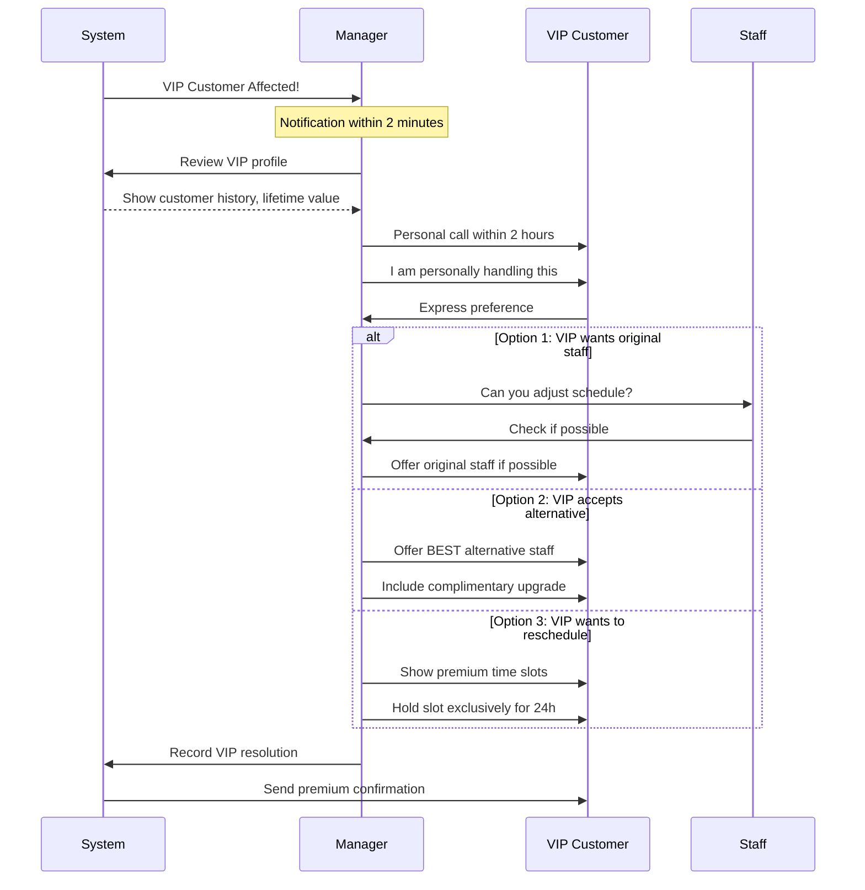
```mermaid
sequenceDiagram
    participant System
    participant Manager
    participant VIP as VIP Customer
    participant Staff

    System->>Manager: VIP Customer Affected!
    Note over Manager: Notification within 2 minutes

    Manager->>System: Review VIP profile
    System-->>Manager: Show customer history, lifetime value

    Manager->>VIP: Personal call within 2 hours
    Manager->>VIP: I am personally handling this

    VIP->>Manager: Express preference

    alt Option 1: VIP wants original staff
        Manager->>Staff: Can you adjust schedule?
        Staff->>Manager: Check if possible
        Manager->>VIP: Offer original staff if possible
    else Option 2: VIP accepts alternative
        Manager->>VIP: Offer BEST alternative staff
        Manager->>VIP: Include complimentary upgrade
    else Option 3: VIP wants to reschedule
        Manager->>VIP: Show premium time slots
        Manager->>VIP: Hold slot exclusively for 24h
    end

    Manager->>System: Record VIP resolution
    System->>VIP: Send premium confirmation
```

**VIP Compensation Package:**

```typescript
const VIP_COMPENSATION = {
  immediate_manager_call: true,
  response_time_requirement: '2 hours',
  compensation_tier: 'premium',
  options: {
    reschedule: {
      priority_slots: true,
      exclusive_hold: '24 hours',
      complimentary_upgrade: true,
    },
    alternative_staff: {
      only_senior_staff: true,
      complimentary_add_on: true,
    },
    cancellation: {
      full_refund: true,
      credit_amount: 100,
      future_discount: '20% off next 3 visits',
    },
  },
};
```

### Edge Case 4: Last-Minute Time-Off (Emergency)

**Problem:** Staff calls in sick same day or next day.

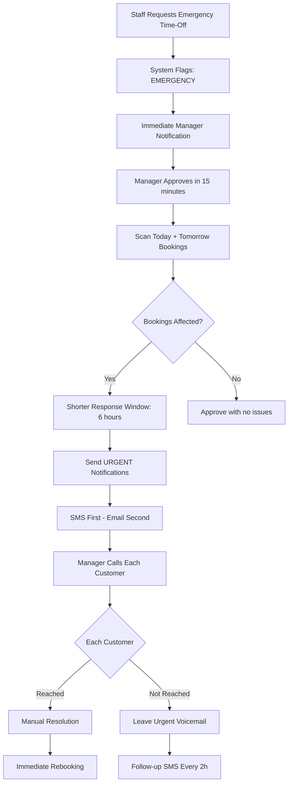
```mermaid
flowchart TD
    A[Staff Requests Emergency Time-Off] --> B[System Flags: EMERGENCY]
    B --> C[Immediate Manager Notification]
    C --> D[Manager Approves in 15 minutes]

    D --> E[Scan Today + Tomorrow Bookings]
    E --> F{Bookings Affected?}

    F -->|Yes| G[Shorter Response Window: 6 hours]
    F -->|No| H[Approve with no issues]

    G --> I[Send URGENT Notifications]
    I --> J[SMS First - Email Second]
    J --> K[Manager Calls Each Customer]

    K --> L{Each Customer}
    L -->|Reached| M[Manual Resolution]
    L -->|Not Reached| N[Leave Urgent Voicemail]

    M --> O[Immediate Rebooking]
    N --> P[Follow-up SMS Every 2h]
```

**Emergency Response Windows:**

```typescript
function calculateEmergencyDeadline(booking_date) {
  const hoursUntilBooking = hoursBetween(now(), booking_date);

  if (hoursUntilBooking <= 4)  return addHours(now(), 1);   // CRITICAL: 1-hour window
  if (hoursUntilBooking <= 12) return addHours(now(), 3);   // URGENT: 3-hour window
  if (hoursUntilBooking <= 24) return addHours(now(), 6);   // HIGH: 6-hour window
  return addHours(now(), 12);                                // Standard: 12-hour window
}
```

### Edge Case 5: Multiple Staff Out (Holiday Season)

**Problem:** Many staff members request time-off simultaneously.

```typescript
async function validateTimeOffRequest(request) {
  const existing_time_off = await getApprovedTimeOff({
    tenant_id: request.tenant_id,
    date_range: [request.start_date, request.end_date],
  });

  const total_staff = await getTotalStaff(request.tenant_id);
  const staff_out_percentage = (existing_time_off.length / total_staff) * 100;

  if (staff_out_percentage >= 50) {
    return {
      allowed: false,
      reason: 'concurrent_time_off_limit_reached',
      message: 'Too many staff members are already scheduled off. Please choose different dates.',
      alternatives: await suggestAlternativeDates(request),
    };
  }

  const is_peak_season = await isPeakSeason(request.start_date);
  if (is_peak_season && staff_out_percentage >= 30) {
    return {
      allowed: false,
      reason: 'peak_season_restriction',
      message: 'High-demand period. Maximum 30% of staff can be off.',
      alternatives: await suggestAlternativeDates(request),
    };
  }

  return { allowed: true };
}
```

### Edge Case 6: Race Condition - Alternative Staff Becomes Unavailable

**Problem:** Staff becomes unavailable between offer and customer acceptance.

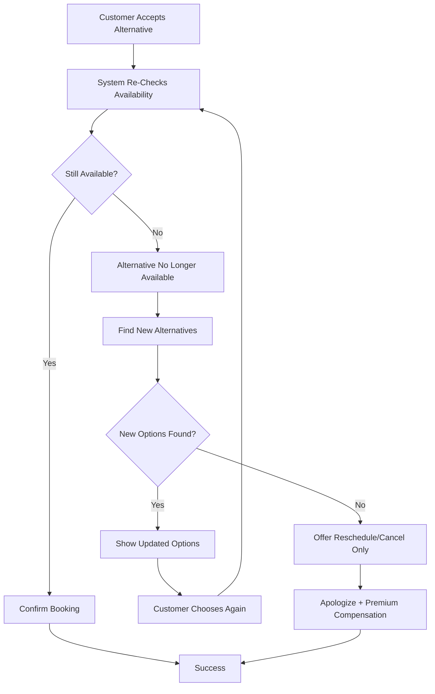
```mermaid
flowchart TD
    A[Customer Accepts Alternative] --> B[System Re-Checks Availability]
    B --> C{Still Available?}

    C -->|Yes| D[Confirm Booking]
    C -->|No| E[Alternative No Longer Available]

    E --> F[Find New Alternatives]
    F --> G{New Options Found?}

    G -->|Yes| H[Show Updated Options]
    G -->|No| I[Offer Reschedule/Cancel Only]

    H --> J[Customer Chooses Again]
    I --> K[Apologize + Premium Compensation]

    D --> L[Success]
    J --> B
    K --> L
```

**Implementation:** Always re-verify availability immediately before confirming a reassignment. If the alternative is no longer available, present updated options and add extra credit ($20) for the inconvenience.

### Edge Case 7: Partial Time-Off Overlap

**Problem:** Booking is 2 hours, time-off overlaps only 1 hour.

**Solution:** Treat as fully affected. Any overlap means the entire service is affected - partial services are not feasible.

```typescript
function isBookingAffected(booking, time_off_request) {
  const booking_start = parseDateTime(booking.booking_date, booking.start_time);
  const booking_end = addMinutes(booking_start, booking.duration_minutes);

  const time_off_start = time_off_request.start_datetime;
  const time_off_end = time_off_request.end_datetime;

  return (
    (booking_start >= time_off_start && booking_start < time_off_end) ||
    (booking_end > time_off_start && booking_end <= time_off_end) ||
    (booking_start <= time_off_start && booking_end >= time_off_end)
  );
}
```

---

## Customer Communication Templates

### Initial Customer Notification

**Email Subject:** Important: Your upcoming appointment needs your attention

```html
<div style="font-family: Arial, sans-serif; max-width: 600px; margin: 0 auto;">
  <h2>Hi {{customer_name}},</h2>

  <p>We are reaching out about your upcoming appointment:</p>

  <div style="background: #f5f5f5; padding: 20px; border-radius: 8px; margin: 20px 0;">
    <strong>{{service_name}}</strong><br>
    with {{staff_name}}<br>
    {{booking_date}} at {{booking_time}}<br>
    Value: ${{booking_amount}}
  </div>

  <p style="color: #d32f2f;">
    <strong>Your stylist has an unexpected scheduling conflict and will not be
    available for this appointment.</strong>
  </p>

  <p>We sincerely apologize and want to make this right. Here are your options:</p>

  <div style="margin: 30px 0;">
    <div style="background: #e8f5e9; padding: 15px; border-radius: 6px; margin: 10px 0;">
      <strong>Option 1: Accept Alternative Stylist</strong><br>
      {{alternative_staff_name}} is available at the same time<br>
      {{alternative_staff_specialties}} - {{alternative_staff_rating}} stars<br>
      <a href="{{accept_alternative_link}}"
         style="display: inline-block; background: #4caf50; color: white; padding: 10px 20px;
                text-decoration: none; border-radius: 4px; margin-top: 10px;">
        Accept This Option
      </a>
    </div>

    <div style="background: #e3f2fd; padding: 15px; border-radius: 6px; margin: 10px 0;">
      <strong>Option 2: Choose Different Time</strong><br>
      See all available times with your preferred stylist or others<br>
      <a href="{{reschedule_link}}"
         style="display: inline-block; background: #2196f3; color: white; padding: 10px 20px;
                text-decoration: none; border-radius: 4px; margin-top: 10px;">
        View Availability
      </a>
    </div>

    <div style="background: #fce4ec; padding: 15px; border-radius: 6px; margin: 10px 0;">
      <strong>Option 3: Cancel with Full Refund</strong><br>
      Immediate refund of ${{booking_amount}}<br>
      <a href="{{cancel_link}}"
         style="display: inline-block; background: #e91e63; color: white; padding: 10px 20px;
                text-decoration: none; border-radius: 4px; margin-top: 10px;">
        Cancel and Refund
      </a>
    </div>
  </div>

  <div style="background: #fff3e0; padding: 15px; border-radius: 6px;
              border-left: 4px solid #ff9800;">
    <strong>Please respond by: {{deadline_datetime}}</strong><br>
    Time remaining: {{time_remaining}}
  </div>

  <p style="color: #666; font-size: 14px; margin-top: 20px;">
    <em>If we do not hear from you by the deadline, we will automatically cancel and
    refund your booking to ensure you are not charged.</em>
  </p>

  <p>Questions? Call us: {{salon_phone}}</p>
  <p>Best regards,<br>{{salon_name}} Team</p>
</div>
```

### SMS Templates

**Initial Alert:**

```
URGENT: Your {{date}} appointment at {{organization/business}} needs rescheduling.
Your stylist is unavailable. Check email for options or call {{phone}}.
Must respond by {{deadline}}. - {{salon_name}}
```

**50% Reminder:**

```
REMINDER: Your {{date}} appointment at {{organization/business}} needs your response by {{deadline}}.
Check your email for options or call {{phone}}. - {{salon_name}}
```

**Final Warning (2 hours before deadline):**

```
FINAL NOTICE: Your {{date}} appointment will auto-cancel in 2 hours if we
don't hear from you. Respond now: {{link}} - {{organization/business}}
```

### Auto-Cancellation Confirmation Email

```
Hi {{customer_name}},

We haven't heard back about your appointment, so we've automatically
cancelled and fully refunded your booking as promised.

REFUND DETAILS:
- Amount refunded: ${{refund_amount}}
- Processing time: 3-5 business days
- Bonus credit added: ${{credit_amount}}

Your credit can be used on any future booking within the next 6 months.

WANT TO REBOOK?
We'd love to see you! Click here to book a new appointment: {{rebooking_link}}

Sorry for the inconvenience, and we hope to see you soon!

Best regards,
{{salon_name}} Team
```

---

## Manager Escalation Workflow

### Escalation Flow

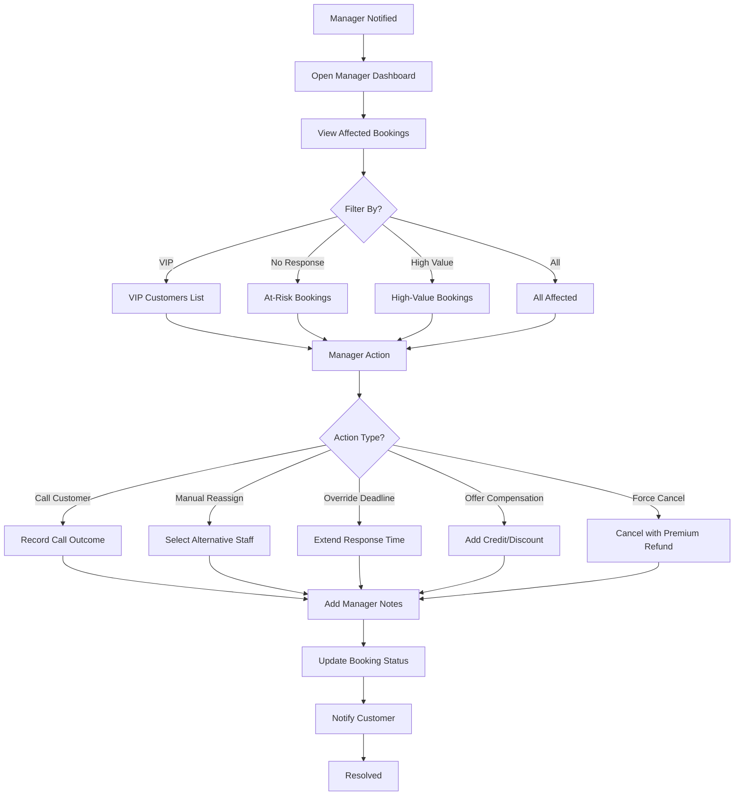
```mermaid
flowchart TD
    Start[Manager Notified] --> Dashboard[Open Manager Dashboard]
    Dashboard --> View[View Affected Bookings]

    View --> Filter{Filter By?}
    Filter -->|VIP| VIP[VIP Customers List]
    Filter -->|No Response| NoResp[At-Risk Bookings]
    Filter -->|High Value| HighVal[High-Value Bookings]
    Filter -->|All| All[All Affected]

    VIP --> Action
    NoResp --> Action
    HighVal --> Action
    All --> Action

    Action[Manager Action] --> Choice{Action Type?}
    Choice -->|Call Customer| Call[Record Call Outcome]
    Choice -->|Manual Reassign| Reassign[Select Alternative Staff]
    Choice -->|Override Deadline| Extend[Extend Response Time]
    Choice -->|Offer Compensation| Comp[Add Credit/Discount]
    Choice -->|Force Cancel| ForceCancel[Cancel with Premium Refund]

    Call --> Notes[Add Manager Notes]
    Reassign --> Notes
    Extend --> Notes
    Comp --> Notes
    ForceCancel --> Notes

    Notes --> Update[Update Booking Status]
    Update --> Notify[Notify Customer]
    Notify --> Done[Resolved]
```

### Manager Dashboard Widgets

**At-Risk Bookings Widget:**

```
NEEDS ATTENTION (3)

VIP Customer - No Response (18h elapsed)
  Sarah Johnson - $250 Color Service - Deadline in 6h
  [CALL NOW] [EXTEND DEADLINE] [MANUAL RESOLVE]

High-Value Booking - No Response (14h elapsed)
  Maria Garcia - $200 Treatment - Deadline in 10h
  [CALL NOW] [VIEW OPTIONS]

Urgent Booking - Pending Customer Choice
  Alex Chen - $80 Haircut - Responded, waiting for reschedule
  [VIEW DETAILS]
```

**Bulk Actions:**

- Select multiple bookings
- Extend deadlines in bulk
- Mass reassignment if alternative staff found
- Batch compensation offers

### Manager Decision Matrix

| Scenario                   | Recommended Action               | Priority |
| -------------------------- | -------------------------------- | -------- |
| VIP customer affected      | **Personal call within 2 hours** | Critical |
| High-value booking ($200+) | **Review + personal touch**      | High     |
| Booking within 24h         | **Immediate SMS + call**         | High     |
| No response at 50%         | **Personal call attempt**        | Medium   |
| 5+ bookings same staff     | **Review before sending**        | Medium   |
| Standard booking           | **Automated handling**           | Low      |

### Manager Call Script

```
"Hi [Customer], this is [Manager] from [organization/business].

I'm personally calling about your upcoming appointment on [Date]. Your
stylist [Staff Name] has an unexpected conflict, and I wanted to make
sure we take care of you.

I have a few great options:
1. [Alternative Staff] is available at the same time - excellent reviews
2. We can reschedule you with your original stylist
3. If none of these work, we'll fully refund and add a $25 credit

What works best for you?"
```

### Daily Manager Checklist

**Morning Review (9:00 AM):**
- Check new time-off requests (pending approval)
- Review affected bookings dashboard
- Identify at-risk bookings (VIP, no response, urgent)
- Call VIP customers personally

**Midday Check (1:00 PM):**
- Review customer responses from morning
- Follow up on 50% deadline reminders
- Check staff availability for reassignments
- Process any manual resolutions

**Evening Wrap-Up (5:00 PM):**
- Review approaching deadlines (next 12 hours)
- Call customers who have not responded (if urgent)
- Prepare for next-day affected bookings
- Review auto-cancellation schedule

---

## Implementation Status Dashboard

### Foundation Status (Complete)

```
Database Schema          ████████████████████  100%
Repositories (6)         ████████████████████  100%
DTOs (9)                 ████████████████████  100%
Controllers (5)          ████████████████████  100%
Core Services (6)        ████████████████████  100%
Swagger Documentation    ████████████████████  100%
Service Integration      ████████████████████  100%
```

### Phase Implementation Status

```
Phase 1: Time-Off Approval     ████████████████████  100%  COMPLETE
Phase 2: Customer Notification  ████████░░░░░░░░░░░   40%  PARTIAL
Phase 3: Customer Response      ██░░░░░░░░░░░░░░░░░   10%  STUB
Phase 4: Manager Escalation     █░░░░░░░░░░░░░░░░░░    5%  STUB
Phase 5: Auto-Cancellation      ██████░░░░░░░░░░░░░   30%  PARTIAL
```

### Critical Blockers

| # | Blocker                       | Impact                                              | Fix Time |
|---|-------------------------------|------------------------------------------------------|----------|
| 1 | Repository join queries       | Blocks alternative staff finder, reschedule slots    | 3 hours  |
| 2 | Customer response processing  | Entire workflow blocked after Phase 2                | 8 hours  |
| 3 | Alternative staff finder      | Returns empty array instead of real alternatives     | 5 hours  |
| 4 | Auto-cancellation refunds     | Booking cancelled but customer not refunded          | 4 hours  |

### Service Implementation Matrix

| Service Method                      | Required For | Status   | Sprint   |
| ----------------------------------- | ------------ | -------- | -------- |
| `detectAndCreateAffectedBookings()` | Phase 1      | Complete | Done     |
| `getAlternativeStaffOptions()`      | Phase 2      | Stub     | Sprint 1 |
| `getAvailableRescheduleSlots()`     | Phase 2      | Stub     | Sprint 1 |
| `processCustomerResponse()`         | Phase 3      | Stub     | Sprint 1 |
| `autoCancelBooking()`               | Phase 5      | Partial  | Sprint 2 |
| `checkCustomerVIPStatus()`          | All          | Missing  | Sprint 3 |
| `manualReassign()`                  | Phase 4      | Missing  | Sprint 3 |
| `extendDeadline()`                  | Phase 4      | Missing  | Sprint 3 |
| `offerCompensation()`               | Phase 4      | Missing  | Sprint 3 |

### Testing Coverage

```
Unit Tests:
  Critical Services        ████░░░░░░░░░░░░░░░░  20%
  Customer Flow Services   ░░░░░░░░░░░░░░░░░░░░   0%
  Manager Action Services  ░░░░░░░░░░░░░░░░░░░░   0%
  Repository Methods       ████████████░░░░░░░░  60%

Integration Tests:
  Time-Off Approval Flow   ████████████████████ 100%
  Customer Response Flow   ░░░░░░░░░░░░░░░░░░░░   0%
  Auto-Cancel Flow         ██████░░░░░░░░░░░░░░  30%
  Manager Actions          ░░░░░░░░░░░░░░░░░░░░   0%
```

### Performance Metrics

```
Detect affected bookings:     150ms  (Target: <500ms)   OK
Create affected records:      200ms  (Target: <300ms)   OK
Cron job batch (100):          5s    (Target: <30s)     OK
Alternative staff finder:      N/A   (Not implemented)
Customer response:             N/A   (Not implemented)
```

### Security Review

```
Authentication Guards:     Applied on all controllers   OK
Tenant Isolation:          All queries include tenant_id OK
Input Validation:          DTOs have validation decorators OK
Payment Security:          Not reviewed (Sprint 2)       PENDING
Rate Limiting:             Not implemented               MISSING
Audit Logging:             Partial (needs manager actions) PARTIAL
```

---

## Implementation Roadmap

### Sprint Plan

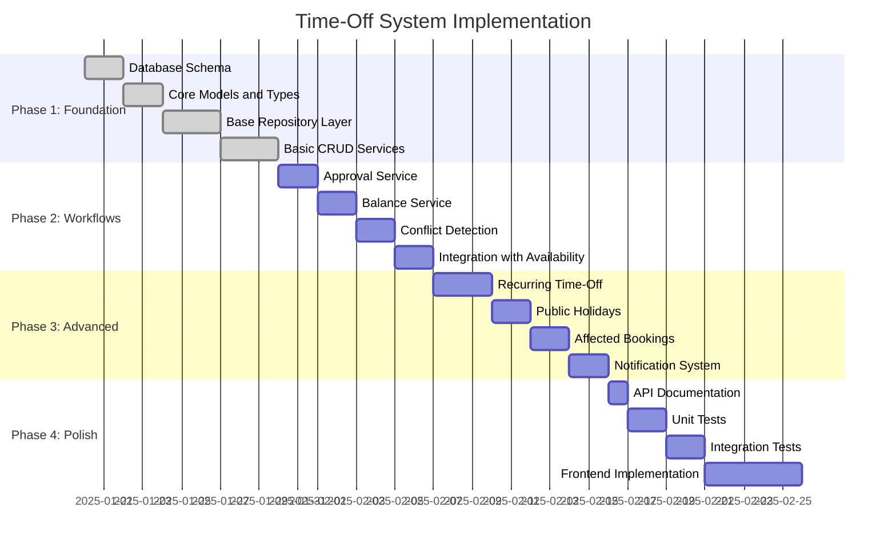
```mermaid
gantt
    title Time-Off System Implementation
    dateFormat YYYY-MM-DD
    section Phase 1: Foundation
    Database Schema           :done, schema, 2025-01-20, 2d
    Core Models and Types     :done, models, after schema, 2d
    Base Repository Layer     :done, repos, after models, 3d
    Basic CRUD Services       :done, services, after repos, 3d

    section Phase 2: Workflows
    Approval Service          :approval, after services, 2d
    Balance Service           :balance, after approval, 2d
    Conflict Detection        :conflict, after balance, 2d
    Integration with Availability :integration, after conflict, 2d

    section Phase 3: Advanced
    Recurring Time-Off        :recurring, after integration, 3d
    Public Holidays           :holidays, after recurring, 2d
    Affected Bookings         :bookings, after holidays, 2d
    Notification System       :notif, after bookings, 2d

    section Phase 4: Polish
    API Documentation         :docs, after notif, 1d
    Unit Tests                :tests, after docs, 2d
    Integration Tests         :int-tests, after tests, 2d
    Frontend Implementation   :frontend, after int-tests, 5d
```

### Sprint Breakdown

**Sprint 1: Critical Customer Flow (16-20 hours) - MUST COMPLETE**

- Repository join queries (3h)
- Alternative staff finder (5h)
- Reschedule slot finder (4h)
- Customer response processing (8h)
- Deliverable: Customers can respond to affected bookings

**Sprint 2: Auto-Cancellation (8-10 hours) - MUST COMPLETE**

- Payment refund integration (3h)
- Apology credit system (2h)
- Complete cron job (3h)
- Deliverable: Auto-cancel with refund + credit works

**Sprint 3: Manager Tools (10-12 hours) - OPTIONAL for v1.0**

- VIP detection (3h)
- Manager actions (8h)
- Deliverable: Managers can manually intervene

**Sprint 4: Notifications (8-10 hours) - OPTIONAL for v1.0**

- Email integration (2h)
- SMS integration (3h)
- Push notifications (3h)
- Deliverable: Multi-channel notifications working

**Go-Live Requirements:**

```
Sprint 1 + Sprint 2 = 24-30 hours (Minimum for Production)
Sprint 3 + Sprint 4 = 18-22 hours (Post-MVP enhancements)
```

### User Story Reference Flows

**Story: Sarah Requests Vacation**

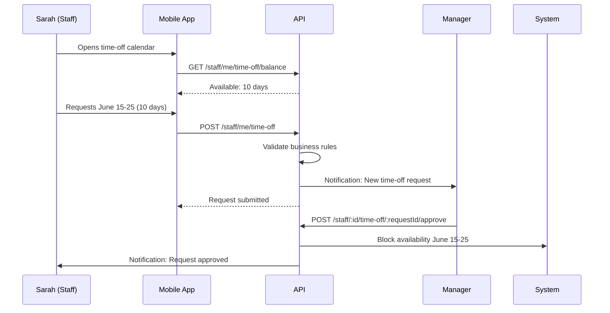
```mermaid
sequenceDiagram
    participant S as Sarah (Staff)
    participant App as Mobile App
    participant API
    participant M as Manager
    participant Sys as System

    S->>App: Opens time-off calendar
    App->>API: GET /staff/me/time-off/balance
    API-->>App: Available: 10 days

    S->>App: Requests June 15-25 (10 days)
    App->>API: POST /staff/me/time-off
    API->>API: Validate business rules
    API->>M: Notification: New time-off request
    API-->>App: Request submitted

    M->>API: POST /staff/:id/time-off/:requestId/approve
    API->>Sys: Block availability June 15-25
    API->>S: Notification: Request approved
```

**Story: Emergency Sick Leave**

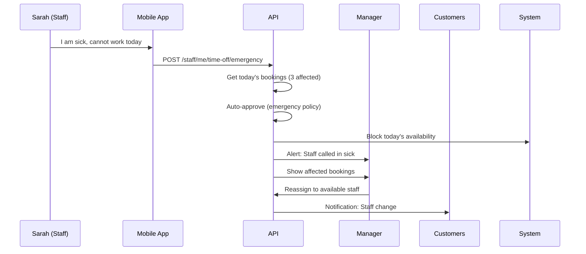
```mermaid
sequenceDiagram
    participant S as Sarah (Staff)
    participant App as Mobile App
    participant API
    participant M as Manager
    participant C as Customers
    participant Sys as System

    S->>App: I am sick, cannot work today
    App->>API: POST /staff/me/time-off/emergency

    API->>API: Get today's bookings (3 affected)
    API->>API: Auto-approve (emergency policy)
    API->>Sys: Block today's availability

    API->>M: Alert: Staff called in sick
    API->>M: Show affected bookings

    M->>API: Reassign to available staff
    API->>C: Notification: Staff change
```

**Story: Recurring Day Off**

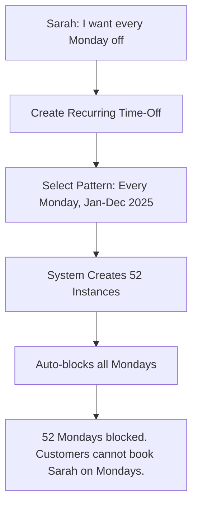
```mermaid
graph TD
    A[Sarah: I want every Monday off] --> B[Create Recurring Time-Off]
    B --> C[Select Pattern: Every Monday, Jan-Dec 2025]
    C --> D[System Creates 52 Instances]
    D --> E[Auto-blocks all Mondays]
    E --> F[52 Mondays blocked. Customers cannot book Sarah on Mondays.]
```

**Recurring Patterns Supported:**

- Every [day of week]
- First/Last [day] of month
- Every [N] weeks
- Specific date range with pattern

**Story: Public Holiday (organization/business Closed)**

```mermaid
sequenceDiagram
    participant O as Owner
    participant API
    participant Staff as All Staff
    participant Cust as Customers
    participant Sys as System

    O->>API: POST /admin/public-holidays (Dec 25, Christmas, organization/business closed)
    API->>Sys: Block all staff availability

    loop For each team member
        API->>Staff: Create time-off entry (type: public_holiday, auto-approved)
    end

    API->>API: Check existing bookings
    API->>Cust: Notification: organization/business closed, please reschedule
```

---

## KPIs and Success Metrics

```typescript
const TIME_OFF_KPIs = {
  // Customer Experience
  customer_response_rate: {
    target: 85,    // 85% respond before deadline
    calculation: 'responded / total_notified * 100',
  },
  customer_satisfaction: {
    target: 4.5,   // 4.5/5 stars post-resolution
    calculation: 'average(post_resolution_surveys)',
  },

  // Operational Efficiency
  resolution_time_avg: {
    target: 18,    // 18 hours average
    calculation: 'average(resolved_at - customer_notified_at)',
  },
  auto_cancellation_rate: {
    target: 10,    // Less than 10% auto-cancelled
    calculation: 'auto_cancelled / total_affected * 100',
  },
  alternative_acceptance_rate: {
    target: 60,    // 60% accept alternative staff
    calculation: 'accepted_alternative / total_resolved * 100',
  },

  // Business Impact
  revenue_retention: {
    target: 85,    // Retain 85% of affected booking revenue
    calculation: '(rescheduled + reassigned) / total_affected * 100',
  },
  manager_escalation_rate: {
    target: 15,    // 15% require manual intervention
    calculation: 'manager_contacted / total_affected * 100',
  },
};
```

**Technical Metrics:**

- API response time < 200ms
- 90%+ test coverage target
- Zero data inconsistencies
- Proper transaction handling

**Business Metrics:**

- 100% conflict detection accuracy
- < 5 minute approval workflow
- Automatic availability blocking
- Customer satisfaction > 4.5 stars

---

## Codebase Discrepancies

The following discrepancies exist between this documentation and the actual code in `packages/db/src/schema/time-off/`:

### Tables in Code but not Originally Documented

| Table | File | Purpose |
|-------|------|---------|
| `compensation_offers` | `compensation-offers.ts` | Tracks compensation offered to customers for affected bookings (type, value, expiry, redemption status) |
| `manager_call_logs` | `manager-call-logs.ts` | Logs manager calls to customers including duration, outcome, preference, and follow-up tracking |

These tables are now included in the ER diagram above.

### Resolution Status Enum Differences

Some flow code examples in this document use simplified resolution statuses. The actual enum in `enums.ts` has more granular values:

| Actual Code Value          | Simplified Reference |
|---------------------------|----------------------|
| `customer_rescheduled`     | rescheduled          |
| `customer_reassigned`      | reassigned           |
| `customer_cancelled`       | cancelled            |
| `manager_calling_customer` | (manager action)     |
| `manager_reassigned`       | (manager action)     |
| `manager_cancelled`        | (manager action)     |
| `auto_reassigned`          | (system action)      |
| `auto_cancelled`           | auto_cancelled       |

### Tenant ID Enforcement

The actual code correctly includes `tenant_id` on all tables including `time_off_approvals` and `affected_bookings`. The SQL DDL examples in this document have been updated to reflect the correct schema.

### Unique Constraints

- `staff_time_off_balances`: Uses `UNIQUE(tenant_id, staff_employment_id, current_year)` (3-column composite).
- `public_holidays`: Uses `UNIQUE(tenant_id, holiday_date)`.

### Code Locations

- **Schema:** `packages/db/src/schema/time-off/` (verified, 11 files)
- **Services:** `apps/api/src/time-off/services/` (referenced but directory not found in current codebase)
- **Controllers:** `apps/api/src/time-off/controllers/` (referenced but directory not found)
- **DTOs:** `apps/api/src/time-off/dtos/` (referenced but directory not found)
- **Repositories:** `apps/api/src/time-off/repositories/` (referenced but directory not found)

> Note: The time-off module directory under `apps/api/src/` was not found during verification. The foundation status claiming 100% completion for controllers, services, DTOs, and repositories may be out of date or the module may have been restructured. The database schema files in `packages/db/src/schema/time-off/` exist and are verified.

---

**Last Updated:** February 2026
